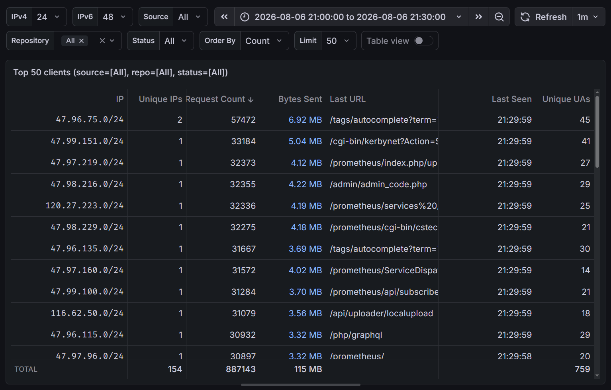

# ClickHouse

!!! note "主要作者"

    [@iBug][iBug]、[@Palvef][Palvef]

!!! warning "本文编写中"

[ClickHouse](https://clickhouse.com/)（也称作 CH、CK、<s>:material-cursor-default-click::material-home:点击房子</s>）是一个开源的列式数据库，主要用于 OLAP 查询，支持大规模数据集和实时分析。

## 安装 {#install}

### Docker 部署 {#install-docker}

Docker Hub 上有两个 ClickHouse 仓库：

- [`clickhouse`](https://hub.docker.com/_/clickhouse)（a.k.a. `library/clickhouse`）：由 Docker 维护的 Docker 官方镜像
- [`clickhouse/clickhouse-server`](https://hub.docker.com/r/clickhouse/clickhouse-server)：由 ClickHouse 维护的镜像

两份镜像在功能和管理方式上没有区别，但 ClickHouse 维护的镜像能够更快地跟进新的 ClickHoue 软件版本，也是更加热门的选项。
本文后续将默认采用 `clickhouse/clickhouse-server` 仓库。
截至本文编写时，ClickHouse 最新的 LTS 版本为 `26.3`，使用 Docker Compose 部署 ClickHouse 的示例配置如下：

```yaml title="docker-compose.yaml"
name: clickhouse

services:
  clickhouse:
    image: clickhouse/clickhouse-server:26.3
    container_name: clickhouse
    restart: unless-stopped
    ports:
      - "8123:8123"  # HTTP 端口
      - "9000:9000"  # TCP 端口
      # "9009:9009"  # 集群内的 TCP 通信端口
    ulimits:
      nofile: # (1)
        soft: 262144
        hard: 262144
    environment:
      CLICKHOUSE_DB: ${CLICKHOUSE_DB}
      CLICKHOUSE_USER: ${CLICKHOUSE_USER}
      CLICKHOUSE_PASSWORD: ${CLICKHOUSE_PASSWORD}
    volumes:
      - /srv/clickhouse/data:/var/lib/clickhouse
      - /srv/clickhouse/logs:/var/log/clickhouse-server
      # ./init:/docker-entrypoint-initdb.d:ro
      # ./config/users.xml:/etc/clickhouse-server/users.d/users.xml:ro
```

1. ClickHouse 在运行过程中会打开大量文件，默认的 `nofile` 限制通常是不够的，因此需要在 Docker Compose 配置中增加 `ulimits` 配置。

在同级目录下创建 `.env` 文件，根据 Docker Compose 配置指定合适的环境变量，运行 `docker compose up -d` 即可启动 ClickHouse 服务，并进行初始化（见下）。

### 初始化 {#initialization}

如果 `/srv/clickhouse/data` 目录为空的话，ClickHouse 会在首次启动时根据提供的环境变量和挂载的文件自动创建默认数据库和用户。其中：

- `CLICKHOUSE_DB` 用于在初始化时创建对应名称的数据库。
- `CLICKHOUSE_USER` 和 `CLICKHOUSE_PASSWORD` 这两个环境变量用于合成 ClickHouse 的 XML 配置文件中的 `<users>` 部分。
    - 这意味着如果你在数据库正常运行后修改了这两个环境变量并重建 ClickHouse 容器，ClickHouse 会使用新的值覆盖原有的用户配置。
    - 通过环境变量创建的用户具有读写数据库的权限，但没有管理权限（创建数据库和用户等）。
- 执行 `/docker-entrypoint-initdb.d` 目录下挂载的所有 `.sql` 文件。你可以通过 `docker-compose.yaml` 在此目录中挂载 SQL 脚本进行额外的初始化操作，例如创建其他数据库、表或用户。

在初始化完成后，你也可以在容器中使用 `clickhouse-client` 命令行工具执行 SQL 语句。

### 配置 {#configuration}

ClickHouse 的配置文件位于 `/etc/clickhouse-server` 目录，采用 XML 格式。其中 ClickHouse 会自动读取 `/etc/clickhouse-server/config.d/*.xml` 和 `/etc/clickhouse-server/users.d/*.xml`，你可以通过向这两个目录中挂载自定义的 XML 文件覆盖默认配置，ClickHouse 会在启动时自动加载并合并这些配置文件，因此每个 XML 文件都具有完整的 XML 结构。

常用的几种配置项包括：

```xml title="为 Grafana 和 Vector 创建只读和读写用户"
<clickhouse>
  <users>
    <grafana>
      <password>grafana_password</password>
      <networks>
        <ip>10.0.0.1</ip>
      </networks>
      <profile>grafana_readonly</profile>
      <quota>default</quota>
      <readonly>1</readonly>
    </grafana>

    <mirrors>
      <password>mirrors_password</password>
      <networks>
        <ip>10.0.0.0/24</ip>
      </networks>
      <profile>default</profile>
      <quota>default</quota>
      <grants>
        <query>GRANT SELECT ON mirrors.*</query>
        <query>GRANT INSERT ON mirrors.*</query>
      </grants>
    </mirrors>
  </users>
</clickhouse>
```

Grafana ClickHouse Plugin 会根据查询上下文修改 `limit`、`max_execution_time` 和 `additional_table_filters` 等设置。只配置 `<readonly>1</readonly>` 时，这些自动生成的 `SET` 语句会被 ClickHouse 拒绝。可以在只读 Profile 中只放行需要的设置，并继续使用 `max_result_rows` 限制实际返回行数：

```xml title="允许 Grafana 修改受控的查询设置"
<clickhouse>
  <profiles>
    <grafana_readonly>
      <readonly>1</readonly>
      <max_execution_time>300</max_execution_time>
      <max_result_rows>100000</max_result_rows>
      <result_overflow_mode>throw</result_overflow_mode>
      <constraints>
        <limit>
          <min>0</min>
          <max>10000000</max>
          <changeable_in_readonly/>
        </limit>
        <max_execution_time>
          <changeable_in_readonly/>
        </max_execution_time>
        <additional_table_filters>
          <changeable_in_readonly/>
        </additional_table_filters>
        <use_query_cache>
          <min>0</min>
          <max>1</max>
          <changeable_in_readonly/>
        </use_query_cache>
        <query_cache_ttl>
          <min>1</min>
          <max>300</max>
          <changeable_in_readonly/>
        </query_cache_ttl>
      </constraints>
    </grafana_readonly>
  </profiles>
</clickhouse>
```

这里的 `changeable_in_readonly` 只允许修改对应查询设置，不会赋予用户执行 DDL 或写入数据的权限。

```xml title="设置全局压缩算法"
<clickhouse>
  <compression>
    <case>
      <min_part_size>0</min_part_size>
      <min_part_size_ratio>0</min_part_size_ratio>
      <method>zstd</method>
      <level>3</level>
    </case>
  </compression>
</clickhouse>
```

### 线程池 {#thread-pools}

ClickHouse 会使用多个线程池分别处理查询、后台合并和周期任务。服务器配置中的 [`max_thread_pool_size`][clickhouse-max-thread] 是全局线程池能够创建的线程数上限，而用户 Profile 中的 `max_threads` 才是单条查询可以使用的最大线程数。两者用途不同，不应通过增大 `max_thread_pool_size` 代替查询并发限制。

常用的线程池设置如下：

| 设置 | 作用 | 调整时主要观察的指标 |
|---|---|---|
| `max_threads` | 限制单条查询的处理线程数 | CPU 使用率、查询耗时、并发查询数 |
| `max_thread_pool_size` | 限制全局线程池中的线程总数 | `GlobalThread`、`GlobalThreadActive`、`GlobalThreadScheduled` |
| `max_thread_pool_free_size` | 空闲线程超过此值后释放其中一部分线程占用的资源 | `GlobalThread` 与 `GlobalThreadActive` 的差值 |
| [`thread_pool_queue_size`][clickhouse-thread-pool-queue] | 限制全局线程池可以排队的 Job 数量 | `GlobalThreadScheduled`、查询等待时间、服务器内存 |
| `background_pool_size` | 设置 MergeTree 后台 merge 和 mutation 的工作线程数 | `BackgroundMergesAndMutationsPoolTask`、merge 队列和磁盘 I/O |
| `background_merges_mutations_concurrency_ratio` | 设置后台线程数与可并发 merge、mutation 任务数的比例 | Part 数量、merge 延迟、CPU 和磁盘负载 |
| `background_schedule_pool_size` | 限制副本维护、DNS 缓存更新等轻量周期任务的线程数 | `BackgroundSchedulePoolTask`、`BackgroundSchedulePoolSize` |
| `background_move_pool_size` | 限制 MergeTree Part 在磁盘或 Volume 之间移动时使用的线程数 | `BackgroundMovePoolTask`、`BackgroundMovePoolSize` |

`max_thread_pool_size` 是全局线程池的线程上限，线程会在没有空闲线程时按需创建；`max_thread_pool_free_size` 控制保留多少空闲线程。`thread_pool_queue_size` 限制尚未执行的 Job 数量，官方文档建议让它与 `max_thread_pool_size` 保持一致，因为过大的排队队列也会占用内存。

例如，一台以日志写入和 Grafana 查询为主的 16 核服务器可以从下面的配置开始，再根据监控结果调整。这里的数值是本文案例的起点，不是 ClickHouse 针对所有服务器给出的默认值：

```xml title="config.d/thread-pools.xml"
<clickhouse>
  <max_thread_pool_size>4096</max_thread_pool_size>
  <max_thread_pool_free_size>512</max_thread_pool_free_size>
  <thread_pool_queue_size>4096</thread_pool_queue_size>
  <background_pool_size>16</background_pool_size>
  <background_merges_mutations_concurrency_ratio>2</background_merges_mutations_concurrency_ratio>
  <background_schedule_pool_size>64</background_schedule_pool_size>
  <background_move_pool_size>8</background_move_pool_size>
</clickhouse>
```

```xml title="users.d/default-profile.xml"
<clickhouse>
  <profiles>
    <default>
      <max_threads>16</max_threads>
      <max_insert_threads>8</max_insert_threads>
    </default>
  </profiles>
</clickhouse>
```

`background_pool_size` 和 `background_merges_mutations_concurrency_ratio` 可以在运行时增大，但减小时需要重启服务器。线程数也不是越多越好：后台 merge 会同时消耗 CPU、内存和磁盘带宽，配置后应结合后文的资源监控观察任务数和队列，而不是只按 CPU 核心数一次性放大。

服务器启动后可以从 `system.server_settings` 检查合并后的实际配置，避免某个 `config.d/*.xml` 文件覆盖了预期值：

```sql
SELECT name, value, default, changed, description
FROM system.server_settings
WHERE name IN
(
  'max_thread_pool_size',
  'max_thread_pool_free_size',
  'thread_pool_queue_size',
  'background_pool_size',
  'background_merges_mutations_concurrency_ratio',
  'background_schedule_pool_size',
  'background_move_pool_size'
)
ORDER BY name;
```

### 并发与内存限制 {#concurrency-and-memory}

线程池决定服务器能够创建和调度多少线程，但不直接限制同时进入服务器的查询数量，也不限制每条查询可以使用的内存。生产环境通常需要同时配置以下三层限制：

| 范围 | 设置 | 作用 |
|---|---|---|
| 全服务器查询数量 | [`max_concurrent_queries`][clickhouse-max-concurrent]、`max_concurrent_select_queries`、`max_concurrent_insert_queries` | 限制全服务器同时执行的查询、SELECT 和 INSERT 数量；`0` 表示不限制 |
| 全服务器查询线程 | [`concurrent_threads_soft_limit_num`][clickhouse-concurrent-threads]、`concurrent_threads_soft_limit_ratio_to_cores` | 限制所有启用并发控制的查询可以竞争的 CPU Slot；这是软限制，每条查询至少仍能获得一个执行线程 |
| 单条查询 | `max_threads`、`max_insert_threads`、[`max_memory_usage`][clickhouse-query-memory] | 限制单条查询或 INSERT 的并行度和内存 |
| 单个用户 | `max_memory_usage_for_user`、`max_concurrent_queries_for_user` | 防止一个 Grafana 或导入用户耗尽全部资源 |
| 全服务器内存 | [`max_server_memory_usage`][clickhouse-server-memory]、`max_server_memory_usage_to_ram_ratio` | 限制 ClickHouse 服务器的总内存；显式字节数和内存比例会共同生效 |

ClickHouse 26.3 中，三个 `max_concurrent_*` 服务器设置的默认值均为 `0`，即不限制查询数量，并且可以在运行时修改；修改只影响之后进入的查询。`max_server_memory_usage_to_ram_ratio` 默认是 `0.9`，在 Linux 容器具有有限 cgroup 内存时会以 cgroup 可用内存为依据，而不是直接使用宿主机全部内存。

下面仍以 16 核、64 GiB，并且还要运行 Vector 和 Grafana 的单机日志服务器为例。为 ClickHouse 留出宿主机余量后，可以先设置服务器级限制：

```xml title="config.d/resource-limits.xml"
<clickhouse>
  <max_concurrent_queries>64</max_concurrent_queries>
  <max_concurrent_select_queries>48</max_concurrent_select_queries>
  <max_concurrent_insert_queries>16</max_concurrent_insert_queries>
  <concurrent_threads_soft_limit_ratio_to_cores>2</concurrent_threads_soft_limit_ratio_to_cores>
  <concurrent_threads_scheduler>fair_round_robin</concurrent_threads_scheduler>
  <max_server_memory_usage_to_ram_ratio>0.80</max_server_memory_usage_to_ram_ratio>
</clickhouse>
```

查询 Profile 再限制单条查询和同一用户的累计内存。下面的字节数分别为 8 GiB 和 24 GiB：

```xml title="users.d/query-limits.xml"
<clickhouse>
  <profiles>
    <grafana_readonly>
      <max_threads>8</max_threads>
      <max_memory_usage>8589934592</max_memory_usage>
      <max_memory_usage_for_user>25769803776</max_memory_usage_for_user>
      <max_execution_time>300</max_execution_time>
    </grafana_readonly>
  </profiles>
</clickhouse>
```

`max_memory_usage` 是单台服务器上单条查询的限制，`max_memory_usage_for_user` 是同一用户所有查询的累计限制。部分聚合函数状态的内存不能被完全跟踪，因此这些设置不能替代容器内存限制和服务器级内存余量。配置值应按实际并发、查询峰值内存和同机其他进程调整，不应直接照搬示例。

  [clickhouse-max-thread]: https://clickhouse.com/docs/reference/settings/server-settings/settings/max-thread#max_thread_pool_size
  [clickhouse-thread-pool-queue]: https://clickhouse.com/docs/reference/settings/server-settings/settings/other#thread_pool_queue_size
  [clickhouse-background-pool]: https://clickhouse.com/docs/reference/settings/server-settings/settings/background#background_pool_size
  [clickhouse-background-merges]: https://clickhouse.com/docs/reference/settings/server-settings/settings/background-merges#background_merges_mutations_concurrency_ratio
  [clickhouse-background-schedule]: https://clickhouse.com/docs/reference/settings/server-settings/settings/background-schedule#background_schedule_pool_size
  [clickhouse-max-concurrent]: https://clickhouse.com/docs/reference/settings/server-settings/settings/max-concurrent
  [clickhouse-concurrent-threads]: https://clickhouse.com/docs/reference/settings/server-settings/settings/concurrent-threads
  [clickhouse-server-memory]: https://clickhouse.com/docs/reference/settings/server-settings/settings/max-server-memory-usage
  [clickhouse-query-memory]: https://clickhouse.com/docs/reference/settings/session-settings/max-memory-usage

## 创建表 {#create-table}

USTC Mirrors 的 Nginx 访问日志格式为自定义的单行 JSON 格式（命名为 `ngx_json`），配置方式可以在 [Nginx](../ops/network-service/nginx.md#logging) 一页中找到，示例如下：

??? example "访问日志示例（经过格式化）"

    ```json
    {
      "timestamp": 1777114514.777,
      "clientip": "1.14.5.14",
      "serverip": "202.38.95.110",
      "method": "GET",
      "scheme": "https",
      "url": "/debian/dists/stable/InRelease",
      "status": 200,
      "size": 114514,
      "resp_time": 0.001,
      "http_host": "mirrors.ustc.edu.cn",
      "referer": "",
      "user_agent": "Debian APT-HTTP/1.3 (2.6.1)",
      "request_id": "0123456789abcdef0123456789abcdef",
      "proto": "HTTP/1.1",
      "proxied": "0"
    }
    ```

根据我们的 JSON 格式创建用于结构化存储日志的 ClickHouse 表的 SQL 语句如下：

```sql title="01-mirrors.sql"
CREATE TABLE mirrors.access_log (
    `timestamp` Float64 CODEC(DoubleDelta, Default),
    `event_time` DateTime64(3, 'UTC') MATERIALIZED fromUnixTimestamp64Milli(toInt64(timestamp * 1000)) CODEC(DoubleDelta, Default),
    `serverip` LowCardinality(String),
    `method` LowCardinality(String),
    `scheme` LowCardinality(String),
    `url` String CODEC(ZSTD(3)),
    `status` UInt16,
    `size` UInt64,
    `resp_time` Float32,
    `http_host` LowCardinality(String),
    `referer` String CODEC(ZSTD(3)),
    `user_agent` String CODEC(ZSTD(3)),
    `request_id` String DEFAULT hex(cityHash64(tuple(event_time, clientip))) CODEC(ZSTD(3)),
    `proto` LowCardinality(String),
    `proxied` LowCardinality(String),
    `alpn` LowCardinality(String),
    `clientip` IPv6 CODEC(ZSTD(1)),
    `source` LowCardinality(String) DEFAULT '',
    `repo` LowCardinality(String) MATERIALIZED extract_repo("url"),
    `ip` IPv6 ALIAS clientip
)
ENGINE = ReplacingMergeTree
PARTITION BY toDate(event_time)
PRIMARY KEY event_time
ORDER BY (event_time, request_id)
SETTINGS index_granularity = 8192;
```

这个表定义有以下几个特点：

- 对于 `url`、`referer` 和 `request_id` 等长字符串列，指定 [`CODEC(ZSTD(3))`][clickhouse-codec] 压缩算法和等级节省存储空间。
    - ClickHouse 的默认值是 LZ4，速度较快但压缩率低，所以我们换用压缩率更高的 Zstandard 算法。
- 根据 ClickHouse 的 convention，存储时间序列数据时，将主要的时间戳列命名为 `event_time`，并使用 `DateTime64(3)` 类型存储毫秒级时间戳（或者如果只需要秒级精度时，可以使用 `DateTime`）。原始的浮点数时间戳列 `timestamp` 仍然保留，方便通过 JSON 方式导入数据。
    - 这两列的 `CODEC` 设置为 `DoubleDelta`，可以通过记录相邻两行的二阶差值来节省存储空间。
- `clientip` 列使用 [`IPv6` 类型][clickhouse-ipv6]存储 IP 地址，其中 IPv4 地址会被转换为 IPv4-mapped IPv6 地址（例如 `::ffff:127.0.0.1`）。
    - 这一列利用了 ClickHouse 接受非常灵活的插入格式的特点，合法的 IPv4/IPv6 字符串在 `INSERT` 时会被自动转换。这在我们后面导入日志时非常方便，因为我们的日志是以 JSON 字符串形式存储的 IP 地址。
- 对于 `serverip` 等取值有限的列，使用 `LowCardinality(String)` 类型节省存储空间和提高查询性能。`LowCardinality` 类型会在内部创建一个哈希字典，从而减少重复存储的字符串数据。
    - 由于哈希字典本身存在一定的开销，因此一般不用于字符串以外的类型，或者取值范围非常大（数千到一万以上）的列。例如，尽管 `status` 列只有十几个可能的取值（HTTP 状态码），由于 UInt16 已经是非常紧凑的存储类型，且具有良好的查询性能，因此不使用 `LowCardinality`。
- 较旧的日志没有记录 `request_id`，因此该列使用 `DEFAULT` 生成一个哈希作为替代。
- 使用 ReplacingMergeTree 引擎，允许在导入重复日志时进行去重。
    - 重复行的判断依据是 `ORDER BY` 语句指定的列组合（即 `event_time`+`request_id`），因此在 ClickHouse 中，**「主键」通常指 `ORDER BY` 的定义**，而非望文生义的 `PRIMARY KEY`。
    - `PRIMARY KEY` 指定主键的一个**前缀**，作为 ClickHouse 在内存中维护稀疏索引（sparse index）的依据，通过排除不常用或不必要的列来减少内存占用。
- `PARTITION BY` 指定分区键，ClickHouse 会根据该列的值将数据划分为不同的分区，从而提高查询性能和管理效率。对于时间序列数据，通常根据数据量和查询模式选择合适的时间粒度进行分区。本文示例中使用 `toDate(event_time)` 按天分区。

  [clickhouse-compression]: https://clickhouse.com/docs/guides/clickhouse/data-modelling/compression/compression-in-clickhouse
  [clickhouse-codec]: https://clickhouse.com/docs/reference/statements/create/table/codec
  [clickhouse-ipv6]: https://clickhouse.com/docs/reference/data-types/ipv6

### 自定义函数 {#user-defined-functions}

ClickHouse 支持自定义函数（User Defined Functions，简称 UDF），可以将常用的表达式封装成函数，减少编写 SQL 时的重复工作。

例如，为了方便从 URL 中提取镜像仓库名称，我们定义了一个 `extract_repo` 函数：

```sql
-- 提取 URL path 中的第一段目录
CREATE FUNCTION extract_repo_dir AS (path) ->
if(
  match(path, '^/*[^/?]+/'),
  extract(path, '^/*([^/?]+)/'),
  '/'
);

CREATE FUNCTION extract_repo AS (path) ->
multiIf(
  has([
    'adoptium', 'alpine', 'anaconda', -- 一大串仓库名
    'zerotier',
    '/'
  ], extract_repo_dir(path)), extract_repo_dir(path),
  has(['assets', 'static', 'status', '.well-known'], extract_repo_dir(path)), '/',
  has(['misc'], extract_repo_dir(path)), 'ustclug',
  '<invalid>'
);
```

结合下面介绍的 MATERIALIZED 列，`extract_repo` 函数可以在数据插入时自动计算出 `repo` 列的值，方便后续按仓库归类查询和统计。

仓库数量较多或经常变化时，不建议继续手工扩充 SQL 中的数组。更容易维护的方式是让部署脚本读取镜像站的仓库目录文件，生成确定的 `CREATE OR REPLACE FUNCTION` SQL，再将生成结果与初始化脚本一起版本化。不要让 UDF 在每次查询时访问网络，否则外部服务延迟会直接进入查询链路。

另外，我们还有一个 `ip_prefix` 函数，用于将 IPv4 或 IPv6 地址转换为指定前缀长度的网络地址（例如 `/24` 或 `/48`），方便按网段统计访问量。

```sql
CREATE FUNCTION ip_prefix AS (ip, ipv4_length, ipv6_length) ->
if(
  isIPAddressInRange(ip, '::ffff:0.0.0.0/96'),
  if(ipv4_length = 32,
    replaceOne(toString(tupleElement(IPv6CIDRToRange(ip, toUInt8(96 + ipv4_length)), 1)), '::ffff:', ''),
    concat(replaceOne(toString(tupleElement(IPv6CIDRToRange(ip, toUInt8(96 + ipv4_length)), 1)), '::ffff:', ''), '/', toString(ipv4_length))
  ),
  if(ipv6_length = 128,
    toString(tupleElement(IPv6CIDRToRange(ip, ipv6_length), 1)),
    concat(toString(tupleElement(IPv6CIDRToRange(ip, ipv6_length), 1)), '/', toString(ipv6_length))
  )
);
```

### 物化列 {#materialized-columns}

ClickHouse 的物化列（`MATERIALIZED` columns）是指在表中定义的列，其值由其他列的表达式计算得出，并在数据插入时自动计算和存储，是一种以空间换时间的思想。

在以上示例中，开头的 `event_time` 和最后两列 `ip` 和 `repo` 都是 MATERIALIZED 列：

- `event_time` 列通过将原始的浮点数时间戳 `timestamp` 转换为毫秒级时间戳并使用 `fromUnixTimestamp64Milli` 函数生成 `DateTime64(3)` 类型的时间列。
- `ip` 列将 `clientip` 列存储的字符串转换为 IPv6 地址，其中合法的 IPv4 地址也会被转换成 IPv4-mapped IPv6 地址（例如 `::ffff:127.0.0.1`）。
- `repo` 列使用一个自定义函数从 `url` 中提取镜像仓库名称。

默认情况下，MATERIALIZED 列不允许被插入数据，如果尝试插入的数据包含了 MATERIALIZED 的列，ClickHouse 会返回错误。
开启设置 `insert_allow_materialized_columns` 可以让 ClickHouse 忽略尝试插入到 MATERIALIZED 列的数据（采用计算结果），继续插入其他列的数据。

## 数据采集 {#data-collection}

将访问日志导入 ClickHouse 的方式有很多种，本节简单介绍主流的 [Vector.dev](https://vector.dev/) 采集器。

根据使用场景，Fluent Bit 和 Filebeat 也可以作为日志采集器。

### Vector

Vector 是 Datadog 开源的日志采集器，以 Rust 语言编写（因此非常轻量），支持多种数据源（sources）、转换（transforms）和输出（sinks），可以将日志数据从源头采集、转换后发送到 ClickHouse。Vector 可以[通过多种方式安装](https://vector.dev/docs/setup/installation/)，且支持通过 SIGHUP 信号重新加载配置文件。

Vector 的 [`file` 数据源](https://vector.dev/docs/reference/configuration/sources/file/)能够以类似 `tail -F` 的方式读取文件内容，并将每一行作为一个事件传递给下游处理器。File 数据源读取的每一行日志都包含一个 `message` 字段，存储了原始的文本内容，因此我们需要使用 `remap` 将其解析为 JSON 对象，并根据文件路径注入 `source` 字段，标记日志来源。

```yaml title="USTC Mirrors 使用的 Vector 配置参考"
sources:
  mirror_logs:
    type: file
    include:
      - /var/log/nginx/mirrors/access_json.log
      - /var/log/nginx/403/access_json.log
      - /var/log/nginx/cacheproxy/*_json.log
    read_from: end
    fingerprint:
      strategy: device_and_inode

transforms:
  parsed_logs:
    type: remap
    inputs:
      - mirror_logs
    source: |
      filename = .file
      . = parse_json!(string!(.message))
      .source = ""
      if contains!(filename, "/mirrors/") {
        .source = "mirrors"
      } else if contains!(filename, "/403/") {
        .source = "403"
      } else if contains!(filename, "/cacheproxy/") {
        .source = "cacheproxy"
      }

sinks:
  mirrorlog:
    type: clickhouse
    inputs:
      - parsed_logs
    endpoint: http://localhost:8123/
    auth:
      strategy: basic
      user: n-buna
      password: "umiyuri kaiteitan"
    database: mirrors
    table: access_log
    format: json_each_row
    buffer:
      type: disk
      max_size: 1073741824
```

如果 Nginx 使用 `access_log syslog:server=...` 发送访问日志，Vector 的 `syslog` source 可以在同一端口分别监听 UDP 和 TCP：

```yaml title="使用 Vector 接收 Nginx syslog"
sources:
  nginx_syslog_udp:
    type: syslog
    address: 0.0.0.0:5514
    mode: udp
  nginx_syslog_tcp:
    type: syslog
    address: 0.0.0.0:5514
    mode: tcp

transforms:
  parsed_syslog:
    type: remap
    inputs:
      - nginx_syslog_udp
      - nginx_syslog_tcp
    source: |
      syslog_host = to_string(.hostname) ?? ""
      . = parse_json!(string!(.message))
      .source = syslog_host
```

UDP 没有连接和重传开销，但在接收端繁忙或网络拥塞时可能丢包；需要完整审计链路时应优先使用 TCP。无论使用 file 还是 syslog source，都应避免让两个 source 同时采集同一份日志，否则 ClickHouse 会收到重复事件。

为 sink 配置磁盘缓冲区可以在 ClickHouse 服务暂时不可用时缓存日志数据，并在 ClickHouse 恢复可用后继续发送。缓冲区的大小决定了 Vector 在开始丢失日志前能够容忍的 ClickHouse 最大停机时间（当然你也可以手动导入缺失部分的日志）。

### 数据导入 {#manual-insert}

对于历史数据，ClickHouse 提供了多种导入方式，例如：

- 使用 `clickhouse-client` 命令行工具执行 `INSERT` 语句，从标准输入读取数据传输给 ClickHouse。例如：

    ```shell
    clickhouse-client --query 'INSERT INTO "mirrors"."access_log" FORMAT JSONEachRow' < access_json.log
    ```

- 使用 `INSERT INTO ... FORMAT JSONEachRow` 语句从 JSON 文件中导入数据。例如：

    ```sql
    INSERT INTO "mirrors"."access_log" FROM INFILE 'access_json.log' FORMAT JSONEachRow
    ```

两种方式的区别在于，前者是客户端读取文件并发送给 ClickHouse 服务端，而后者是让服务端自己读取文件。

你也可以自己编写程序，以你喜欢的方式将日志数据导入 ClickHouse。

作为参考，USTC Mirrors 导入历史日志的命令如下：

```shell
for i in mirrors/access_json.log-*.xz; do
  echo "$i" >&2
  xzcat "$i" |
    pv -s $(xz --robot -l "$i" | awk 'NR==2{print $5}') |
    jq '.source = "mirrors"' |
    clickhouse-client --query 'INSERT INTO "mirrors"."access_log" FORMAT JSONEachRow'
done
```

## 数据查询 {#query}

[ClickHouse 的查询语言](https://clickhouse.com/docs/reference/statements/select)是 SQL 的一个方言，较为接近 PostgreSQL，但有许多 QoL（Quality of Life）特性和高级扩展功能。
ClickHouse 的 SQL 方言，例如：

- 双引号和反引号都可以用作标识符的引用符号，单引号用于字符串字面量。
- `WHERE`、`GROUP BY` 和 `HAVING` 子句中可以使用 SELECT 列表中的别名。
- 大量的辅助函数。

例如，要实现与 [ayano](https://github.com/taoky/ayano) 类似的输出，可以使用以下 SQL 查询：

```sql
SELECT
  ip_prefix("ip", 24, 48) AS "IP",
  COUNT(DISTINCT "ip") AS "Unique IPs",
  count() AS "Request Count",
  sum("size") AS "Bytes Sent",
  argMax("url", "event_time") AS "Last URL",
  max("event_time") AS "Last Seen",
  count(DISTINCT "user_agent") AS "Unique UAs"
FROM "mirrors"."access_log"
WHERE $__timeFilter("event_time")
  AND "source" = 'mirrors'
GROUP BY "IP"
ORDER BY "Bytes Sent" DESC, "IP" ASC
LIMIT 50;
```

在 Grafana 中使用 ClickHouse 数据源时，Grafana ClickHouse Plugin 会[提供一些额外的函数](https://grafana.com/docs/plugins/grafana-clickhouse-datasource/latest/template-variables/)，例如 `$__timeFilter("event_time")` 会被替换为与 Grafana 界面上的时间选择器匹配的、采用 `event_time` 列的时间范围过滤条件。Grafana 以表格展示的查询结果类似这样：



??? example "Grafana ClickHouse SQL 示例"

    恰当地配置 [Grafana 的模板变量](https://grafana.com/docs/grafana/latest/visualizations/dashboards/variables/)，可以让用户（或者你自己）更方便地选择过滤条件，例如：

    ```sql
    SELECT
      ip_prefix(ip, ${ipv4_prefix}, ${ipv6_prefix}) AS IP,
      COUNT(DISTINCT ip) AS "Unique IPs",
      count() AS "Request Count",
      sum(size) AS "Bytes Sent",
      argMax(url, event_time) AS "Last URL",
      max(event_time) + INTERVAL 1 DAY AS "Last Seen",
      count(DISTINCT user_agent) AS "Unique UAs"
    FROM $database_table
    WHERE $__timeFilter(event_time)
      AND $__conditionalAll("source" IN (${source:singlequote}), $source)
      AND $__conditionalAll("repo" IN (${repo:singlequote}), $repo)
      AND $__conditionalAll(intDivOrZero("status", 100) = ${status}, $status)
    GROUP BY IP
    ORDER BY "${order_by}" DESC, "IP" ASC
    LIMIT ${limit};
    ```

    上面的示例图使用的即是此 SQL 查询语句。

    另外，Grafana 的 [Filter and Group by 功能](https://grafana.com/docs/grafana/latest/visualizations/dashboards/build-dashboards/filter-group-by/)可以让用户在 Grafana 界面上自行设置过滤条件，而无需在 SQL 中预先配置变量。

### `WITH` 语句 {#with-clause}

ClickHouse 的 [`WITH` 语句][clickhouse-with]允许在查询中定义临时的子查询，减少重复编写相同的嵌套查询。

  [clickhouse-with]: https://clickhouse.com/docs/reference/statements/select/with

例如，要在 Grafana 上查询指定时间段内输出流量最大的前 20 个仓库，并将其他仓库归类为 `[Others]`，可以使用以下 SQL 查询：

```sql
WITH
  repo_size AS MATERIALIZED (
    SELECT
      repo,
      sum("size") AS "sum_size"
    FROM "mirrors"."access_log"
    WHERE $__timeFilter(event_time)
    GROUP BY "repo"
  ),
  top_repos AS MATERIALIZED (
    SELECT "repo", "sum_size"
    FROM "repo_size"
    ORDER BY "sum_size" DESC
    LIMIT 20
  )
SELECT
  if("repo" IN (SELECT "repo" FROM "top_repos"), "repo", '[Others]') AS "Repository",
  sum("sum_size") AS "Bytes Sent"
FROM "repo_size"
GROUP BY "Repository"
ORDER BY "Repository" = '[Others]' ASC, "Bytes Sent" DESC;
```

`MATERIALIZED` 关键字表示 `WITH` 子查询的结果会被物化（即在内存中缓存），避免在每次被引用时重复计算。

### 投影 {#projection}

ClickHouse 的投影（`PROJECTION`）是表的一种附加索引结构，可以提高特定查询模式的性能。PROJECTION 是表的一部分，并且在数据插入时自动更新，也由 ClickHouse 根据查询模式自动选择使用（或不使用）。

由于作者经过多次尝试后仍然无法构建出能够加速前文的典型查询模式的 PROJECTION，因此需要读者参考 [ClickHouse 对 PROJECTION 的介绍](https://clickhouse.com/docs/concepts/features/projections/projections) 自行摸索。

### 物化视图 {#materialized-view}

ClickHouse 支持普通视图、增量物化视图和可刷新物化视图。三者的主要区别如下：

| 类型 | 是否保存结果 | 更新方式 | 适合的场景 |
|---|---|---|---|
| `VIEW` | 否 | 查询时展开原 SQL | 封装常用查询 |
| Incremental Materialized View | 是，结果写入目标表 | 源表每次 INSERT 时只处理新写入的数据块 | 实时过滤、转换和预聚合 |
| Refreshable Materialized View | 是 | 按计划重新执行完整查询并替换或追加结果 | 复杂 JOIN、周期快照和允许延迟的报表 |

[ClickHouse 的增量物化视图](https://clickhouse.com/docs/materialized-view/incremental-materialized-view)更接近一个插入触发器：每次有新数据写入源表时，物化视图只处理这批新数据，并把结果写入目标表。它不会定期扫描源表，也不会因为源表发生 mutation、分区删除或后台 merge 而自动重算历史数据。

对于 Grafana 经常执行的 PV、UV、流量和平均响应时间查询，可以提前按较小的时间桶和常用低基数维度保存聚合状态。以下示例使用 30 秒时间桶：

```sql title="02-access-log-30s.sql"
CREATE TABLE mirrors.access_log_30s
(
    event_time DateTime('UTC') CODEC(DoubleDelta, Default),
    source LowCardinality(String),
    http_host LowCardinality(String),
    repo LowCardinality(String),
    status UInt16,
    method LowCardinality(String),
    pv AggregateFunction(count),
    uv AggregateFunction(uniqCombined64, IPv6),
    bytes AggregateFunction(sum, UInt64),
    resp_time_avg AggregateFunction(avg, Float32)
)
ENGINE = AggregatingMergeTree
PARTITION BY toDate(event_time)
ORDER BY
(
    event_time,
    source,
    http_host,
    repo,
    status,
    method
)
SETTINGS
    index_granularity = 8192,
    default_compression_codec = 'ZSTD(3)';

CREATE MATERIALIZED VIEW mirrors.access_log_30s_mv
TO mirrors.access_log_30s
AS
SELECT
    toDateTime(
      toStartOfInterval(event_time, INTERVAL 30 SECOND),
      'UTC'
    ) AS event_time,
    source,
    http_host,
    repo,
    status,
    method,
    countState() AS pv,
    uniqCombined64State(clientip) AS uv,
    sumState(size) AS bytes,
    avgState(resp_time) AS resp_time_avg
FROM mirrors.access_log
GROUP BY
    event_time,
    source,
    http_host,
    repo,
    status,
    method;
```

上面的两个对象分别承担以下工作：

| 对象 | 类型 | 是否保存数据 | 用途 |
|---|---|---:|---|
| `access_log_30s_mv` | 增量物化视图 | 否 | 接收 `access_log` 新写入的数据块并执行聚合 |
| `access_log_30s` | `AggregatingMergeTree` 表 | 是 | 保存聚合状态，供 Grafana 查询和 TTL 管理 |

删除 `access_log_30s_mv` 会让目标表停止更新，但已经写入 `access_log_30s` 的数据仍然存在。查询 `AggregatingMergeTree` 时，需要使用与写入时 `-State` 函数对应的 `-Merge` 函数。例如，将 30 秒状态继续合并为 Grafana 的 10 分钟时间序列：

```sql
SELECT
  toStartOfInterval(event_time, INTERVAL 10 MINUTE) AS time,
  countMerge(pv) AS pv,
  uniqCombined64Merge(uv) AS uv,
  sumMerge(bytes) AS bytes,
  avgMerge(resp_time_avg) AS avg_resp_time
FROM mirrors.access_log_30s
WHERE $__timeFilter(event_time)
  AND source IN (${source:singlequote})
GROUP BY time
ORDER BY time;
```

物化视图中保存的维度决定了它能够正确回答哪些查询：

| 数据 | 建议读取的表 | 原因 |
|---|---|---|
| PV、UV、流量、平均响应时间 | `access_log_30s` | 可以继续合并 30 秒聚合状态 |
| 来源、域名、仓库、状态码、请求方法 | `access_log_30s` | 这些低基数维度已经保留在聚合键中 |
| URL、完整 IP、User-Agent、Referer | `access_log` | 高基数维度放入聚合键后容易使目标表接近原始表大小 |
| 最近请求、扫描器和刷量识别 | `access_log` | 需要原始事件或 URL/IP 明细 |

#### 历史回填与校验 {#materialized-view-backfill}

增量物化视图只处理创建后的 INSERT，因此已有数据需要使用 `INSERT INTO ... SELECT` 回填。在线创建时应先让物化视图接收新数据，再以一个对齐到 30 秒的时间点作为历史回填上界：

```sql
INSERT INTO mirrors.access_log_30s
SELECT
  toDateTime(
    toStartOfInterval(event_time, INTERVAL 30 SECOND),
    'UTC'
  ) AS event_time,
  source,
  http_host,
  repo,
  status,
  method,
  countState(),
  uniqCombined64State(clientip),
  sumState(size),
  avgState(resp_time)
FROM mirrors.access_log
WHERE event_time < toDateTime64('2026-08-09 09:31:00', 3, 'UTC')
GROUP BY
  event_time,
  source,
  http_host,
  repo,
  status,
  method;
```

如果物化视图在一个 30 秒桶的中间创建，该边界桶只包含创建后的部分数据。应等待该桶结束，删除目标表中的该桶并从原始表重新插入。存在迟到日志时，还应设置数分钟的 watermark，避免刚结束的桶继续变化。最简单但会短暂停止采集的做法，则是暂停 Vector、回填、创建物化视图后再恢复采集。

删除旧聚合表前，应在同一个已经结束的时间窗口比较两条路径。持续写入时直接查询 `now()` 附近的数据可能读到不同快照，因此下面的示例将截止点后退 5 分钟：

```sql
WITH
  toStartOfInterval(now('UTC'), INTERVAL 30 SECOND)
    - INTERVAL 5 MINUTE AS stop,
  stop - INTERVAL 24 HOUR AS start
SELECT
  'raw' AS source_table,
  count() AS pv,
  uniqCombined64(clientip) AS uv,
  sum(size) AS bytes,
  avg(resp_time) AS avg_resp_time
FROM mirrors.access_log
WHERE event_time >= start AND event_time < stop
UNION ALL
SELECT
  '30s' AS source_table,
  countMerge(pv),
  uniqCombined64Merge(uv),
  sumMerge(bytes),
  avgMerge(resp_time_avg)
FROM mirrors.access_log_30s
WHERE event_time >= start AND event_time < stop;
```

其中 PV 和流量应精确相同；UV 使用的是同一种近似去重算法，两条路径也应得到相同结果。校验失败时应保留原始表和旧聚合表，先检查边界桶、重复回填和迟到日志，而不是继续删除数据。

### 查询缓存 {#query-cache}

[ClickHouse 的查询缓存](https://clickhouse.com/docs/operations/query-cache)默认不替所有 SELECT 自动启用。对于变量和时间边界固定、允许短时间陈旧的 Grafana 汇总查询，可以在语句末尾按需启用：

```sql
SELECT
  repo,
  sumMerge(bytes) AS bytes
FROM mirrors.access_log_30s
WHERE event_time >= {start:DateTime}
  AND event_time < {stop:DateTime}
GROUP BY repo
ORDER BY bytes DESC
LIMIT 20
SETTINGS
  use_query_cache = 1,
  query_cache_ttl = 30;
```

缓存键与完整查询及其设置有关。使用 `now()`、`rand()` 等非确定函数的查询通常不适合缓存；最近请求、实时 QPS 和资源监控也不应为了提高命中率而返回过期结果。缓存内容可以通过 `system.query_cache` 观察：

```sql
SELECT
  count() AS entries,
  formatReadableSize(sum(result_size)) AS result_size
FROM system.query_cache;
```

## 资源监控 {#monitoring}

ClickHouse 将服务器状态记录在多张 `system` 表中。`system.metrics` 保存可以即时计算或表示当前值的指标，`system.asynchronous_metrics` 保存后台周期采集的指标；这两张表只反映查询时刻的状态。需要在 Grafana 中绘制趋势时，应读取对应的历史表：

| 系统表 | 数据类型 | 典型用途 |
|---|---|---|
| [`system.metrics`][clickhouse-system-metrics] | 当前值 | 正在执行的查询、merge、线程和当前内存 |
| [`system.asynchronous_metrics`][clickhouse-system-async-metrics] | 周期计算的当前值 | RSS、系统负载、文件系统和内存分配器指标 |
| [`system.metric_log`][clickhouse-system-metric-log] | `system.metrics` 和 `system.events` 的历史记录 | ClickHouse CPU、QPS、查询数、merge 和线程池趋势 |
| [`system.asynchronous_metric_log`][clickhouse-system-async-metric-log] | `system.asynchronous_metrics` 的历史记录 | RSS、Load Average 和操作系统 CPU 趋势 |
| `system.query_log` | 已执行查询的元数据和统计 | 查询耗时、读取行数、异常和慢查询分析 |
| [`system.background_schedule_pool`][clickhouse-background-schedule-pool] | 当前周期任务 | 查看调度池中的任务类型、表、执行状态和耗时 |
| [`system.background_schedule_pool_log`][clickhouse-background-schedule-log] | 周期任务历史 | 查看调度任务耗时、错误码和异常信息，需要显式启用 |
| `system.parts`、`system.merges`、`system.mutations` | MergeTree 当前状态 | Part 数量、压缩率、后台合并和 mutation 进度 |

根据 ClickHouse 官方文档，`system.metric_log` 默认不启用。可以创建以下服务器配置，每秒采集一次并保留 30 天：

```xml title="config.d/metric-log.xml"
<clickhouse>
  <metric_log>
    <database>system</database>
    <table>metric_log</table>
    <flush_interval_milliseconds>7500</flush_interval_milliseconds>
    <collect_interval_milliseconds>1000</collect_interval_milliseconds>
    <max_size_rows>1048576</max_size_rows>
    <reserved_size_rows>8192</reserved_size_rows>
    <buffer_size_rows_flush_threshold>524288</buffer_size_rows_flush_threshold>
    <ttl>event_date + INTERVAL 30 DAY DELETE</ttl>
    <flush_on_crash>false</flush_on_crash>
  </metric_log>
</clickhouse>
```

如需定位调度池中的慢任务或异常任务，还可以启用 `system.background_schedule_pool_log`。`duration_threshold_milliseconds` 可以过滤过短的任务，设为 `0` 表示记录全部任务：

```xml title="config.d/background-schedule-pool-log.xml"
<clickhouse>
  <background_schedule_pool_log>
    <database>system</database>
    <table>background_schedule_pool_log</table>
    <partition_by>toYYYYMM(event_date)</partition_by>
    <flush_interval_milliseconds>7500</flush_interval_milliseconds>
    <max_size_rows>1048576</max_size_rows>
    <reserved_size_rows>8192</reserved_size_rows>
    <buffer_size_rows_flush_threshold>524288</buffer_size_rows_flush_threshold>
    <duration_threshold_milliseconds>100</duration_threshold_milliseconds>
    <flush_on_crash>false</flush_on_crash>
  </background_schedule_pool_log>
</clickhouse>
```

ClickHouse 自带的 [`system.dashboards`][clickhouse-system-dashboards] 表保存了 Overview 和 Memory 等内置监控面板的参考查询，可以先查看当前版本提供的内容，再把查询中的时间参数替换为 Grafana 宏：

```sql
SELECT dashboard, title, query
FROM system.dashboards
WHERE dashboard IN ('Overview', 'Memory (host)')
ORDER BY dashboard, title;
```

### Grafana 面板 {#monitoring-grafana}

一个基础的 ClickHouse 资源监控仪表盘可以包含以下面板。趋势图应使用时间桶内的 `avg`，而不是 Grafana 的 Total calculation；字节数由 Grafana 负责换算为 MiB、GiB 等单位。

| 面板 | 数据来源 | 主要字段或指标 | Grafana 单位 |
|---|---|---|---|
| ClickHouse CPU 使用 | `system.metric_log` | `ProfileEvent_OSCPUVirtualTimeMicroseconds / 1000000` | cores |
| ClickHouse 跟踪内存 | `system.metric_log` | `CurrentMetric_MemoryTracking` | bytes (IEC) |
| 进程 RSS | `system.asynchronous_metric_log` | `MemoryResident` | bytes (IEC) |
| QPS | `system.metric_log` | `ProfileEvent_Query` | queries/s |
| 运行中查询 | `system.metric_log` | `CurrentMetric_Query` | short |
| 后台 merge | `system.metric_log` | `CurrentMetric_Merge` | short |
| 全局线程池 | `system.metric_log` | `CurrentMetric_GlobalThread*` | short |
| merge/mutation 线程池 | `system.metric_log` | `CurrentMetric_BackgroundMergesAndMutationsPool*` | short |
| 周期任务明细 | `system.background_schedule_pool` | `pool`、`scheduled`、`executing`、`elapsed_ms` | short、milliseconds |
| 磁盘读写 | `system.metric_log` | `ProfileEvent_OSReadBytes`、`ProfileEvent_OSWriteBytes` | bytes/s (IEC) |
| Part 与压缩率 | `system.parts` | `count()`、`data_compressed_bytes`、`data_uncompressed_bytes` | short、bytes、percent |

CPU 使用量的查询可以直接改写自 ClickHouse 内置 Overview dashboard：

```sql title="ClickHouse CPU 使用（核）"
SELECT
  $__timeInterval(event_time) AS time,
  avg(ProfileEvent_OSCPUVirtualTimeMicroseconds) / 1000000 AS cores
FROM system.metric_log
WHERE $__timeFilter(event_time)
GROUP BY time
ORDER BY time WITH FILL;
```

如果只需要查看当前值，不必等待 `system.metric_log` 落盘，可以直接查询 `system.metrics`：

```sql title="ClickHouse 当前线程池状态"
SELECT metric, value, description
FROM system.metrics
WHERE metric IN
(
  'GlobalThread',
  'GlobalThreadActive',
  'GlobalThreadScheduled',
  'BackgroundMergesAndMutationsPoolTask',
  'BackgroundMergesAndMutationsPoolSize',
  'BackgroundMovePoolTask',
  'BackgroundMovePoolSize',
  'BackgroundSchedulePoolTask',
  'BackgroundSchedulePoolSize'
)
ORDER BY metric;
```

周期任务的当前状态可以按线程池汇总。`scheduled` 表示任务已经安排执行，`executing` 表示任务此刻正在运行：

```sql title="ClickHouse 周期任务状态"
SELECT
  pool,
  count() AS tasks,
  countIf(scheduled) AS scheduled,
  countIf(delayed) AS delayed,
  countIf(executing) AS executing,
  max(elapsed_ms) AS max_elapsed_ms
FROM system.background_schedule_pool
GROUP BY pool
ORDER BY pool;
```

ClickHouse 自己记录的已分配内存和操作系统观察到的 RSS 含义不同，建议在同一面板中同时展示。两条曲线长期偏离时，可以继续检查 jemalloc、查询缓存和 page cache，而不是把其中一条当作另一条的替代：

```sql title="ClickHouse 内存趋势"
SELECT time, value, metric
FROM
(
  SELECT
    $__timeInterval(event_time) AS time,
    avg(CurrentMetric_MemoryTracking) AS value,
    'Tracked' AS metric
  FROM system.metric_log
  WHERE $__timeFilter(event_time)
  GROUP BY time
  UNION ALL
  SELECT
    $__timeInterval(event_time) AS time,
    avg(value) AS value,
    'RSS' AS metric
  FROM system.asynchronous_metric_log
  WHERE $__timeFilter(event_time)
    AND metric = 'MemoryResident'
  GROUP BY time
)
ORDER BY time, metric;
```

线程池面板至少应同时展示已创建、活跃和排队任务数。如果 `GlobalThreadScheduled` 持续高于活跃线程数，才说明全局线程池可能出现排队；单独观察已创建线程数不能判断线程池是否耗尽。

```sql title="ClickHouse 全局线程池"
SELECT
  $__timeInterval(event_time) AS time,
  avg(CurrentMetric_GlobalThread) AS Created,
  avg(CurrentMetric_GlobalThreadActive) AS Active,
  avg(CurrentMetric_GlobalThreadScheduled) AS Scheduled
FROM system.metric_log
WHERE $__timeFilter(event_time)
GROUP BY time
ORDER BY time WITH FILL;
```

后台 merge 和 mutation 线程池可以使用任务数除以线程池限制得到利用率。Grafana 中将 `utilization` 的单位设置为 Percent (0-100)，并为接近 100% 且持续增长的区间设置阈值：

```sql title="ClickHouse merge/mutation 线程池"
SELECT
  $__timeInterval(event_time) AS time,
  avg(CurrentMetric_BackgroundMergesAndMutationsPoolTask) AS Active,
  avg(CurrentMetric_BackgroundMergesAndMutationsPoolSize) AS Size,
  100 * Active / nullIf(Size, 0) AS utilization
FROM system.metric_log
WHERE $__timeFilter(event_time)
GROUP BY time
ORDER BY time WITH FILL;
```

`system.metric_log` 的 `ProfileEvent_*` 列表示采样周期内的事件数或耗时，`CurrentMetric_*` 列表示采样时的当前值。因此，上面几条趋势查询沿用 ClickHouse 内置 dashboard 的做法，对时间桶使用 `avg`。`system.parts` 等当前状态表不包含历史快照，Grafana 查询它们只能得到当前值；需要趋势时应另行采集，不能用 `now()` 为当前结果补一个时间戳后当作历史数据。

  [clickhouse-system-metrics]: https://clickhouse.com/docs/operations/system-tables/metrics
  [clickhouse-system-async-metrics]: https://clickhouse.com/docs/operations/system-tables/asynchronous_metrics
  [clickhouse-system-metric-log]: https://clickhouse.com/docs/operations/system-tables/metric_log
  [clickhouse-system-async-metric-log]: https://clickhouse.com/docs/operations/system-tables/asynchronous_metric_log
  [clickhouse-system-dashboards]: https://clickhouse.com/docs/operations/system-tables/dashboards
  [clickhouse-background-schedule-pool]: https://clickhouse.com/docs/operations/system-tables/background_schedule_pool
  [clickhouse-background-schedule-log]: https://clickhouse.com/docs/operations/system-tables/background_schedule_pool_log

## 存储分层与留存 {#storage-tiering}

[自管理 ClickHouse 的 storage policy](https://clickhouse.com/docs/operations/storing-data)可以给 MergeTree 表配置多个 Volume。下面的例子把热、温、冷目录分开；实际部署时可以将它们挂载到不同性能和成本的存储设备：

```xml title="config.d/storage.xml"
<clickhouse>
  <storage_configuration>
    <disks>
      <mirrors_warm>
        <path>/var/lib/clickhouse-warm/</path>
      </mirrors_warm>
      <mirrors_cold>
        <path>/var/lib/clickhouse-cold/</path>
      </mirrors_cold>
    </disks>
    <policies>
      <mirrors_tiered>
        <volumes>
          <default>
            <disk>default</disk>
          </default>
          <warm>
            <disk>mirrors_warm</disk>
          </warm>
          <cold>
            <disk>mirrors_cold</disk>
          </cold>
        </volumes>
        <move_factor>0.10</move_factor>
      </mirrors_tiered>
    </policies>
  </storage_configuration>
</clickhouse>
```

[表的 TTL](https://clickhouse.com/docs/guides/developer/ttl)可以同时负责移动和删除 Part。例如保留 180 天时，各层的职责如下：

| 数据时间 | Volume | 典型存储 | TTL 动作 |
|---|---|---|---|
| 0–30 天 | `default` | 高性能本地盘 | 新数据默认写入 |
| 30–90 天 | `warm` | 容量型磁盘 | `TO VOLUME 'warm'` |
| 90–180 天 | `cold` | 低成本磁盘 | `TO VOLUME 'cold'` |
| 超过 180 天 | — | — | `DELETE` |

```sql
ALTER TABLE mirrors.access_log
MODIFY SETTING storage_policy = 'mirrors_tiered';

ALTER TABLE mirrors.access_log
MODIFY TTL
  event_time + INTERVAL 30 DAY TO VOLUME 'warm',
  event_time + INTERVAL 90 DAY TO VOLUME 'cold',
  event_time + INTERVAL 180 DAY DELETE;
```

storage policy 只决定 Part 放在哪个 Volume，并不会因为数据从热层移动到温层就自动把 ZSTD(3) 改成 ZSTD(6)。如果各层需要不同压缩等级，应在移动后按分区重写数据，并在替换分区前校验行数。`OPTIMIZE TABLE ... FINAL` 会强制合并并重写 Part，消耗大量 CPU、I/O 和临时空间，不应当作定时任务无条件运行。

如果三个目录仍位于同一个文件系统，分层策略只能提供逻辑隔离和未来迁移入口，不会凭空获得不同介质的性能特征。

## 镜像站日志实验 {#mirror-log-experiment}

本节数据来自 NYIST Mirrors 和 HERNET Mirrors 的 Nginx 访问日志。这里只列出聚合后的性能与容量数据，不包含客户端 IP、域名明细或原始日志内容。实验结果会受到 ClickHouse 版本、CPU、存储设备、列定义和数据分布影响，重点是展示比较方法，而不是提供适用于所有机器的固定参数。

### 压缩算法对照 {#compression-experiment}

第一组实验从生产数据中抽取 2,000,000 条完整日志，分别写入同结构的临时 MergeTree，并将每个日分区合并为单 Part。写入时间包含编码和落盘时间；压缩率是压缩后字节数除以解压后字节数，因此越低越好：

| 候选方案 | 写入 | 压缩后 | 解压后 | 压缩率 | 压缩倍数 |
|---|---:|---:|---:|---:|---:|
| 全列 LZ4 | 4.672 s | 178.01 MiB | 663.41 MiB | 26.833% | 3.727x |
| 热层混合 ZSTD(3/6) | 15.901 s | 84.44 MiB | 663.13 MiB | 12.733% | 7.854x |
| 全列 ZSTD(3) | 6.885 s | 93.74 MiB | 663.43 MiB | 14.130% | 7.077x |
| 全列 ZSTD(6) | 16.134 s | 83.67 MiB | 663.53 MiB | 12.610% | 7.930x |
| 全列 ZSTD(9) | 26.775 s | 81.02 MiB | 663.45 MiB | 12.212% | 8.189x |

相同数据上，每类查询执行 10 次、单并发、16 查询线程的耗时中位数如下：

| 候选方案 | PV/UV/流量/均值 | URL TOP | 多维 GROUP BY |
|---|---:|---:|---:|
| 全列 LZ4 | 0.061 s | 0.198 s | 0.113 s |
| 热层混合 ZSTD(3/6) | 0.077 s | 0.197 s | 0.113 s |
| 全列 ZSTD(3) | 0.075 s | 0.202 s | 0.122 s |
| 全列 ZSTD(6) | 0.079 s | 0.220 s | 0.116 s |
| 全列 ZSTD(9) | 0.078 s | 0.203 s | 0.115 s |

LZ4 的写入最快，但占用空间约为混合 ZSTD 的两倍；ZSTD(6) 和 ZSTD(9) 相对 ZSTD(3) 的空间收益已经有限，编码成本却明显增加。三层存储可以分别实验不同压缩等级，但 storage policy 不会在移动 Part 时自动更换 codec。本案例最终选择全局 ZSTD(3)，列级 `CODEC` 只按需增加 `DoubleDelta` 等类型编码。

第二组同源实验专门检查「列定义不写 `CODEC`」的含义：如果表级和全局也没有指定 ZSTD，自管理版会回落到默认 LZ4；如果设置 `default_compression_codec='ZSTD(3)'`，没有列级 `CODEC` 的列会继承该设置。

| 方案 | 写入时间 | 压缩率 | 相对结果 |
|---|---:|---:|---|
| 表级 ZSTD(3)，列定义不写 `CODEC` | 8.727 s | 14.626% | 写入较快，配置简单 |
| 列级混合 ZSTD(3/6) | 15.827 s | 13.290% | 少占 10.1% 空间 |

表级 ZSTD(3) 的写入用时减少 44.9%，三类查询的中位数差异不超过 9 ms。因此，更容易维护的做法是为表或服务器设置统一的 ZSTD(3)，只在数据证明有收益时给时间列增加 `DoubleDelta` 等类型编码。可以先用 `estimateCompressionRatio` 比较候选 codec：

```sql
SELECT
  estimateCompressionRatio('ZSTD(3)')(event_time) AS zstd3,
  estimateCompressionRatio(
    'DoubleDelta, ZSTD(3)'
  )(event_time) AS doubledelta_zstd3
FROM mirrors.access_log_30s;
```

也可以从 `system.parts` 计算生产表当前的整体压缩率：

```sql
SELECT
  table,
  formatReadableSize(sum(data_compressed_bytes)) AS compressed,
  formatReadableSize(sum(data_uncompressed_bytes)) AS uncompressed,
  round(
    sum(data_compressed_bytes) / sum(data_uncompressed_bytes) * 100,
    4
  ) AS compression_percent,
  round(
    sum(data_uncompressed_bytes) / sum(data_compressed_bytes),
    3
  ) AS compression_ratio
FROM system.parts
WHERE active
  AND database = 'mirrors'
GROUP BY table
ORDER BY table;
```

### 30 秒预聚合结果 {#rollup-experiment}

在线回填覆盖 231,287,092 条原始日志。回填完成后，避开实时写入窗口抽取完整 24 小时进行校验：

| 指标 | 原始表 | 30 秒聚合表 | 结果 |
|---|---:|---:|---|
| PV | 18,118,318 | 18,118,318 | 一致 |
| UV | 2,000,851 | 2,000,851 | 一致 |
| 出站流量 | 7,565,681,603,600 bytes | 7,565,681,603,600 bytes | 一致 |
| 平均响应时间 | 0.374069 s | 0.374069 s | 一致 |

#### 查询耗时对照 {#rollup-query-performance}

为了比较预聚合前后的查询速度，本文直接采用 Grafana 日志仪表盘中的面板 SQL，把 `count`、`sum`、`avg` 和 `uniqCombined64` 分别替换为聚合表对应的 `-Merge` 函数。测试运行于同一台 ClickHouse 26.3.17.110 服务器，选择 Grafana 的 `All` 域名、默认的 `status != 403` Filter，其他模板变量保持 `All`；每条查询使用 16 个查询线程、关闭 Query Cache、执行 7 次并取耗时中位数。测试没有清理操作系统 Page Cache，因此更接近仪表盘正常刷新时的查询状态。

例如，「今日访问 PV（每 10 分钟）」面板原本查询原始表：

```sql title="Grafana 原始表查询"
SELECT
  toStartOfInterval(event_time, INTERVAL 10 MINUTE) AS time,
  count() AS PV
FROM ${clickhouse_adhoc_query:raw}
WHERE $__timeFilter(event_time)
  AND http_host IN (${domain:singlequote})
  AND $__conditionalAll(extract_repo(url) IN (${repo:singlequote}), $repo)
  AND $__conditionalAll(status IN (${status:csv}), $status)
  AND $__conditionalAll(request_method IN (${method:singlequote}), $method)
  AND $__conditionalAll(client_country IN (${country:singlequote}), $country)
  AND $__conditionalAll(client_asn IN (${asn:csv}), $asn)
GROUP BY time
ORDER BY time;
```

对应的固定汇总面板可以改为查询物化视图的目标表。目标表已经保存 `repo`，所以不需要再次执行 `extract_repo`：

```sql title="Grafana 30 秒聚合表查询"
SELECT
  toStartOfInterval(event_time, INTERVAL 10 MINUTE) AS time,
  countMerge(pv) AS PV
FROM mirrorlog.access_log_30s
WHERE $__timeFilter(event_time)
  AND http_host IN (${domain:singlequote})
  AND $__conditionalAll(repo IN (${repo:singlequote}), $repo)
  AND $__conditionalAll(status IN (${status:csv}), $status)
  AND $__conditionalAll(request_method IN (${method:singlequote}), $method)
  AND $__conditionalAll(client_country IN (${country:singlequote}), $country)
  AND $__conditionalAll(client_asn IN (${asn:csv}), $asn)
GROUP BY time
ORDER BY time;
```

在同一个 Grafana 筛选范围内，原始表和聚合表包含的行数如下。这里的「缩减倍数」为原始表行数除以聚合表行数；聚合表仍然保留域名、仓库、状态码、请求方法、国家和 ASN 等维度，因此不会简单缩小为每 30 秒一行：

| 数据范围 | 原始表行数 | 30 秒聚合表行数 | 聚合表占比 | 缩减倍数 |
|---|---:|---:|---:|---:|
| 1 小时（2026-08-08 12:00–13:00 UTC） | 869,807 | 85,775 | 9.86% | 10.14x |
| 24 小时（2026-08-08 UTC） | 20,287,081 | 2,164,849 | 10.67% | 9.37x |
| 7 天（2026-08-02 至 2026-08-09 UTC） | 110,020,105 | 14,589,524 | 13.26% | 7.54x |
| 当时全表，无 Grafana 筛选 | 247,390,348 | 31,782,370 | 12.85% | 7.78x |

实测结果如下，其中「加速倍数」为原始面板 SQL 耗时除以聚合表 SQL 耗时，大于 1 表示聚合表更快：

| Grafana 面板 | 时间窗 | 原始表 SQL | 聚合表 SQL | 加速倍数 |
|---|---|---:|---:|---:|
| 基本概况（相对） | 24 小时 | 0.382 s | 0.370 s | 1.03x |
| 今日访问 PV（每 10 分钟） | 24 小时 | 0.166 s | 0.044 s | 3.77x |
| 今日访问 UV（每 10 分钟） | 24 小时 | 0.301 s | 0.303 s | 0.99x |
| 出站流量趋势（10 分钟间隔） | 24 小时 | 0.200 s | 0.056 s | 3.57x |
| 7 天访问 PV（每 10 分钟） | 7 天 | 0.662 s | 0.116 s | 5.71x |

24 小时窗口共得到 144 个 10 分钟桶，逐桶比较 PV、UV 和出站流量时差异桶数为 0。PV 和流量只需合并较小的 `countState` 和 `sumState`，时间窗越大，预聚合减少扫描行数的收益越明显；UV 需要合并大量 `uniqCombined64State`，24 小时窗口下的耗时与直接扫描原始 IP 基本相同。「基本概况」同时按域名合并 PV、UV、流量和两项平均值，因此提升也不明显。

这里所说的「查询物化视图」实际是查询物化视图写入的 `access_log_30s` 目标表，而不是读取 `access_log_30s_mv` 触发器。只有域名、仓库、状态码、请求方法、国家和 ASN 等已经保留的筛选条件才能直接改写到聚合表；需要 URL、完整 IP、城市、User-Agent、Referer、p95/p99 或任意 ad hoc Filter 的 Grafana 面板仍然必须查询原始表。

#### 复杂高基数查询 {#high-cardinality-query-performance}

「刷子识别」「扫描器：高 URL 离散度」和「流量异常 IP」都需要先按完整 IP 或 CIDR 聚合，再计算 URL 去重、Top URL、最近 URL、城市和最后访问时间。`access_log_30s` 没有保存完整 IP、URL 和城市，因此无法生成与这些 Grafana 面板等价的查询。下面的「聚合表」不能填写耗时，不代表查询失败，而是表结构没有足够的信息回答问题：

| Grafana 面板 | 必需的高基数字段 | 30 秒聚合表 |
|---|---|---|
| 刷子识别：反复请求相同文件 | IP、URL、城市、事件时间 | 不适用 |
| 扫描器：高 URL 离散度 | IP、URL、城市、事件时间 | 不适用 |
| 流量异常 IP | IP、URL、城市、事件时间 | 不适用 |

这些面板仍然查询原始表。本文案例在 2026-08-09 使用 Grafana 数据源进行端到端复测，当前 SQL 先筛选候选 IP/Prefix，再为候选计算高开销 URL 状态；耗时如下：

| Grafana 面板 | 1 小时（优化前 → 当前） | 24 小时（优化前 → 当前） | 7 天（当前） |
|---|---:|---:|---:|
| 刷子识别：反复请求相同文件 | 4.36 s → 2.40 s | 65.88 s → 4.67 s | 11.49 s |
| 扫描器：高 URL 离散度 | 2.04 s → 0.46 s | 38.81 s → 1.72 s | 7.60 s |
| 流量异常 IP | 2.86 s → 0.53 s | 39.62 s → 1.82 s | 8.49 s |

为这些面板建立包含 IP 和 URL 状态的物化视图也未必节省空间。生产 24 小时样本包含 18,981,586 条原始日志，按分钟、IP 和全部筛选维度分组后仍有 15,235,444 组，相当于原始行数的 80.26%，只缩减 1.25x；如果继续保存 Top URL 或去重状态，还会产生额外空间和 merge 开销。因此，本文案例保留低基数的 `access_log_30s` 服务 PV、流量和固定趋势，将复杂 IP/URL 面板留在经过候选集优化的原始表查询上。

聚合表调整前后的存储结果如下：

| 项目 | 调整前 | 调整后 | 变化 |
|---|---:|---:|---:|
| `event_time` 估算压缩倍数 | 159.61x | 276.45x | +73.2% |
| 聚合表压缩后大小 | 1.39 GiB | 1.33 GiB | -4.3% |
| 聚合表压缩率 | 57.9278% | 55.1795% | -2.7483 pp |

调整后的原始表与聚合表合计压缩后大小为 12.05 GiB，解压后大小为 76.98 GiB，整体压缩率为 15.6490%，即 6.390x。聚合表自身的压缩率看起来较低，是因为 `uniqCombined64State` 等聚合状态熵较高，不能直接与普通字符串和数值列比较。评估方案时应同时观察聚合表增加的空间、原始表查询减少的读取量以及持续 INSERT 的开销。
