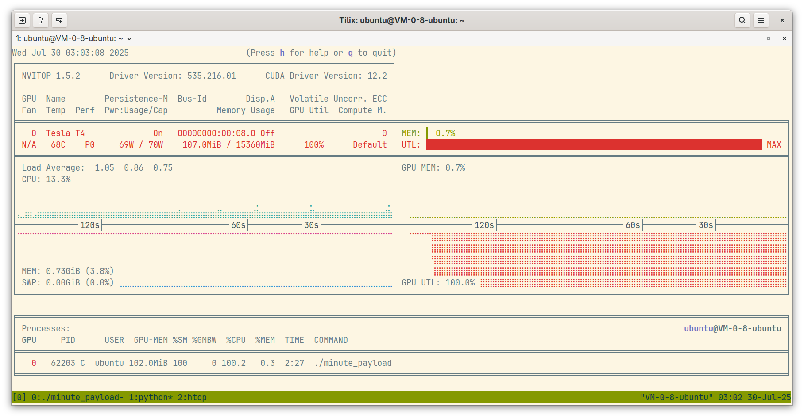

# CUDA 环境简介

!!! note "主要作者"

    [@sscscc][sscscc]、[@taoky][taoky]、[@relic-yuexi][relic-yuexi]、[@Jerry-Kwan][Jerry-Kwan]

!!! warning "本文已完成，等待校对"

CUDA（Compute Unified Device Architecture）是由 NVIDIA 公司推出的开发套件，它允许软件开发人员使用 NVIDIA 的 GPU（图形处理单元）进行通用计算，利用 GPU 强大的并行处理能力来加速计算密集型任务，常用于科学计算、工程模拟、机器学习等领域。

包含的组件包括：

- CUDA 驱动和运行时：CUDA 驱动与内核层驱动共同工作，与 GPU 交互；运行时提供了更高级别的 API，使开发者能够更方便地使用 GPU。

- CUDA 编译器（nvcc）：将 CUDA 代码转换成可以在 NVIDIA GPU 上运行的二进制代码的编译器。

- CUDA 库：优化过的数学与科学计算库，比如线性代数运算（cuBLAS）、傅里叶变换（cuFFT）等。

- CUDA 工具：比如性能分析器（NVIDIA Nsight 和 Visual Profiler）和调试工具，它们帮助开发者优化和调试 CUDA 应用程序。

## 你需要配置 CUDA 吗？ {#what-is-cuda}

当我们说到「配置 CUDA 环境」的时候，实际上指的是**两件事情**：

1. 安装 NVIDIA 的**内核态**驱动以及部分用户态组件（驱动），使得操作系统能够正确识别显卡并与之通信。
2. 安装 CUDA 运行时和开发工具（**用户态**），使得我们能够在程序中使用 CUDA API。

如果你只是想要运行 CUDA 程序，有些程序可能自带了 CUDA 运行时。这时只需要确保有 NVIDIA 驱动。如果已经安装过，那么你不需要任何配置。

如果你想要运行依赖操作系统中现有的 CUDA 的程序，或者你想要使用 CUDA 的库开发自己的 CUDA 应用，你需要确保安装 NVIDIA 驱动并根据自己的需求安装 CUDA 组件。

## 配置 CUDA 环境 {#configure-cuda}

### 版本准备 {#cuda-version}

在开始之前，你需要确认显卡是否支持 CUDA。在这里可以查看支持的列表：<https://developer.nvidia.com/CUDA-gpus>。

表中的 `Compute Capability` 代表计算能力，同时也表明了 GPU 支持的 CUDA 特性和指令集版本。架构越新的显卡，对应的计算能力数字越高。使用的 CUDA 版本需要能够支持对应的计算能力，可以查看此表：<https://docs.nvidia.com/datacenter/tesla/drivers/index.html#cuda-arch-matrix>。同时，CUDA 也对系统编译器版本有要求，可以查看此表：<https://docs.nvidia.com/cuda/cuda-installation-guide-linux/index.html#system-requirements>。

### 安装 NVIDIA 驱动 {#nvidia-driver}


!!! note "NVIDIA 内核驱动"

     默认情况下，Linux 内核自带开源的 Nouveau 驱动。Nouveau 驱动大部分时候能够点亮屏幕，进行基础的图形渲染，对于没有计算和重度渲染需求（例如大型游戏）的用户来讲是可以尝试的选择[^nouveau-performance]。但是很遗憾，Nouveau 不支持运行包括 CUDA 在内的计算任务[^nouveau-matrix]。

     很长一段时间内，特别是对桌面用户来说，NVIDIA 的驱动安装一直是一个头疼（甚至让人想[骂人](https://www.youtube.com/watch?v=UeU1WUb1q10)）的问题。尽管 NVIDIA 提供了闭源驱动，但是恰当地安装与配置也不是很容易的事情。不过近年来，NVIDIA 推出的新显卡上添加了 GSP 芯片，能够承载 NVIDIA 不愿意公开的功能实现，因此 NVIDIA 也提供了自己的[「开源驱动」](https://github.com/NVIDIA/open-gpu-kernel-modules)。尽管这个驱动实现有可能永远都不会出现在 Linux 内核的主线代码里，但是可以期望其至少能够减少不少麻烦，并且为 NVIDIA GPU 运行在诸如 RISC-V 等新架构的机器上提供支持。当然，NVIDIA 的用户态驱动仍然是不开源的。

     [^nouveau-performance]: 根据 2024 年 1 月[该视频](https://www.youtube.com/watch?v=E-1vukqRKf4)的数据，对于视频中的 benchmark，基于 Nouveau + NVK + Zink 的性能评分达到了 NVIDIA 官方驱动的 66% 左右。

     [^nouveau-matrix]: <https://nouveau.freedesktop.org/FeatureMatrix.html> 中 "Compute" 一行均为 WIP（Work In Progress）状态，即尚未支持。

!!! tip "确认是否已经安装过 NVIDIA 驱动"

    使用 `cat /proc/driver/nvidia/version` 命令来确认是否安装了 NVIDIA 驱动。如果已安装则显示版本号。

总的来说，在 Linux 下，NVIDIA 驱动与 CUDA 的安装方式大致分为：

1. 使用操作系统本身的仓库和包管理系统进行安装（推荐），例如：

     - [Debian Wiki](https://wiki.debian.org/NvidiaGraphicsDrivers)
     - [Ubuntu Server Guide](https://ubuntu.com/server/docs/nvidia-drivers-installation)
     - [Arch Wiki](https://wiki.archlinux.org/title/NVIDIA)

     对于部分不被 NVIDIA 官方支持的发行版（例如 Arch Linux），使用发行版自行打包的版本是唯一推荐的方法。

2. 使用 [NVIDIA 提供的软件源](https://developer.nvidia.com/CUDA-downloads)，并用包管理系统进行安装。

3. 使用官方 runfile 一键安装（不推荐使用此方法安装驱动）

     - 使用官方 runfile 一键安装的方式较为方便，但是在安装过程中会覆盖系统中的某些文件，**可能会破坏系统**。另外 runfile 安装管理麻烦，不能像包管理器在安装软件时会自动处理依赖关系，需要用户手动处理依赖问题。

对于后两种方式，可以在官网下载页面 <https://developer.nvidia.com/CUDA-downloads> 选择合适的操作系统，网页将给出对应操作系统的安装指令。其中 "Install Type" 中 local 代表安装包包含了完整的 CUDA 运行时和相关驱动，包管理器在需要时从本地获取；而 network 单纯只包含了源配置，由包管理器在需要时联网获取。"runfile (local)" 则是上面所说的第三种不推荐的安装方式。另外，旧的 CUDA 版本需要在 [CUDA Toolkit Archive](https://developer.nvidia.com/cuda-toolkit-archive) 中查找。

在安装时，可能会需要选择 NVIDIA 驱动的版本。如果没有特殊需求，选择最新的版本即可，因为旧的驱动可能不支持新版本的 CUDA 与显卡。详情见[版本关系说明](https://docs.nvidia.com/cuda/cuda-toolkit-release-notes/index.html)

!!! tip "Linux 头文件，与 DKMS"

     NVIDIA 驱动尽管是闭源的，但是其仍然包含一部分开源的代码，用于在内核和闭源驱动之间交互（这一部分代码也被戏称为 "GPL condom"）。由于不同版本的内核的 ABI 不兼容，因此更换内核后就需要重新编译驱动。DKMS（Dynamic Kernel Module Support）会帮助在内核更新后自动重新编译驱动，不过编译驱动还需要内核头文件，否则 DKMS 会跳过编译。

     对 Ubuntu 来说，默认安装的内核为 "generic"，对应的内核包为 `linux-image-generic`，头文件则为 `linux-headers-generic`。如果你使用的是其他内核（例如在虚拟化环境中，可能会使用 `linux-image-virtual`），则需要安装对应的头文件包。而默认的 Debian 则分别是 `linux-image-amd64` 和 `linux-headers-amd64`。某些时候头文件不会被自动安装，因此需要注意。

对于第一种安装方式，Ubuntu 和 Debian 都提供了 NVIDIA 驱动的元包（metapackage），包含了所有需要的内容。

Ubuntu 用户可以使用 `apt list` 查找当前仓库中提供的驱动版本：

```console
$ apt list 'nvidia-driver-*'
Listing... Done
nvidia-driver-460-server/noble 470.239.06-0ubuntu2 amd64
nvidia-driver-460/noble 470.239.06-0ubuntu2 amd64
nvidia-driver-465/noble 470.239.06-0ubuntu2 amd64
nvidia-driver-470-server/noble 470.239.06-0ubuntu2 amd64
nvidia-driver-470/noble 470.239.06-0ubuntu2 amd64
nvidia-driver-510/noble 525.147.05-0ubuntu2 amd64
nvidia-driver-515-open/noble 525.147.05-0ubuntu2 amd64
nvidia-driver-515-server/noble 525.147.05-0ubuntu2 amd64
nvidia-driver-515/noble 525.147.05-0ubuntu2 amd64
nvidia-driver-520-open/noble 525.147.05-0ubuntu2 amd64
nvidia-driver-520/noble 525.147.05-0ubuntu2 amd64
nvidia-driver-525-open/noble 525.147.05-0ubuntu2 amd64
nvidia-driver-525-server/noble 525.147.05-0ubuntu2 amd64
nvidia-driver-525/noble 525.147.05-0ubuntu2 amd64
nvidia-driver-530-open/noble 535.171.04-0ubuntu2 amd64
nvidia-driver-530/noble 535.171.04-0ubuntu2 amd64
nvidia-driver-535-open/noble 535.171.04-0ubuntu2 amd64
nvidia-driver-535-server-open/noble 535.161.08-0ubuntu2 amd64
nvidia-driver-535-server/noble 535.161.08-0ubuntu2 amd64
nvidia-driver-535/noble 535.171.04-0ubuntu2 amd64
nvidia-driver-550-open/noble 550.67-0ubuntu3 amd64
nvidia-driver-550-server-open/noble 550.54.15-0ubuntu2 amd64
nvidia-driver-550-server/noble 550.54.15-0ubuntu2 amd64
nvidia-driver-550/noble 550.67-0ubuntu3 amd64
```

Debian 则只包含了 `nvidia-driver` 包，对应发行版发布时最新的驱动版本，同时对于 stable 发行版，还可以从 backports 仓库中获取更新的驱动版本，详情请参考上文提供的 Debian Wiki。

#### 查看显卡状态 {#check-gpu-status}

##### `nvidia-smi`

`nvidia-smi` 由 NVIDIA 驱动提供，可以查看系统中 NVIDIA GPU 的信息，包括驱动版本与支持的 CUDA 版本、GPU 的温度、功耗、内存使用、利用率、是否出现错误等，以及正在使用 GPU 的进程信息。

```shell
$ nvidia-smi
Wed Jul 30 02:25:00 2025
+---------------------------------------------------------------------------------------+
| NVIDIA-SMI 535.216.01             Driver Version: 535.216.01   CUDA Version: 12.2     |
|-----------------------------------------+----------------------+----------------------+
| GPU  Name                 Persistence-M | Bus-Id        Disp.A | Volatile Uncorr. ECC |
| Fan  Temp   Perf          Pwr:Usage/Cap |         Memory-Usage | GPU-Util  Compute M. |
|                                         |                      |               MIG M. |
|=========================================+======================+======================|
|   0  Tesla T4                       On  | 00000000:00:08.0 Off |                    0 |
| N/A   52C    P0              68W /  70W |    107MiB / 15360MiB |    100%      Default |
|                                         |                      |                  N/A |
+-----------------------------------------+----------------------+----------------------+

+---------------------------------------------------------------------------------------+
| Processes:                                                                            |
|  GPU   GI   CI        PID   Type   Process name                            GPU Memory |
|        ID   ID                                                             Usage      |
|=======================================================================================|
|    0   N/A  N/A     48645      C   ./minute_payload                            102MiB |
+---------------------------------------------------------------------------------------+
```

如果能够查看到你的显卡，那么恭喜你，显卡已经可以使用了。

!!! tip "CUDA Version"

    `nvidia-smi` 界面右上角显示的 CUDA 版本是指当前系统上安装的 NVIDIA 驱动支持的最高 CUDA 版本，并不是已安装的 CUDA 版本——比显示版本低的 CUDA 也是能够正常使用的。

如果需要观察一段时间内的 GPU 情况，可以使用 `--loop` 参数：

```shell
# 每隔 2s 输出一次
nvidia-smi --loop=2
```

!!! warning "nvidia-smi 的额外开销"

    频繁获取统计信息是有额外开销的，可能会对 GPU 的性能产生影响。因此建议间隔时间不要设置得太小——默认的 5s 就是一个比较合适的值。

可以通过 `--query` 相关参数以及 `--format` 参数查询指定的信息，并且输出为 CSV。例如以下命令会输出当前正在使用 GPU 的进程情况为 CSV：

```console
$ nvidia-smi --query-compute-apps=pid,process_name,used_memory --format=csv
pid, process_name, used_gpu_memory [MiB]
56263, ./minute_payload, 102 MiB
```

##### `nvitop`

[`nvitop`](https://github.com/XuehaiPan/nvitop) 是第三方工具，能够以美观的 TUI 界面显示 NVIDIA GPU 的状态信息。



使用 `pipx` 安装即可：

```shell
pipx install nvitop
```

##### `nvtop`

[`nvtop`](https://github.com/Syllo/nvtop) 是另一个第三方工具。虽然名字里有 `nv`，但是它实际上是 "Neat Videocard TOP"，适用于包括 NVIDIA 在内的多种显卡。它的界面则和 `htop` 类似。

`nvtop` 在大部分发行版的仓库中都可以找到。


##### `gpustat`

[`gpustat`](https://github.com/wookayin/gpustat) 能够显示极简的 GPU 状态信息。同样使用 `pipx` 安装即可：

```shell
pipx install gpustat
```

```console
$ gpustat --color
VM-0-8-ubuntu  Wed Jul 30 03:16:21 2025  535.216.01
[0] Tesla T4 | 60°C, 100 % |   107 / 15360 MB | ubuntu(102M)
$ gpustat --json
{
    "hostname": "VM-0-8-ubuntu",
    "driver_version": "535.216.01",
    "query_time": "2025-07-30T03:16:30.082082",
    "gpus": [
        {
            "index": 0,
（以下省略）
```

### 安装与使用 CUDA {#install-cuda}

可以从包管理器安装 CUDA。如果使用第一种方式，那么在 Ubuntu 与 Debian 中则对应 `nvidia-cuda-dev nvidia-cuda-toolkit nvidia-visual-profiler` 这几个包，不过发行版一般不会提供多个版本的 CUDA。当前使用的 NVIDIA 源中也可能没有需要的版本（可以检查名字以 `cuda` 开头的包），此时一种解决方式是安装旧版本 CUDA 对应的软件源包后，使用软件包管理器安装；或者使用 runfile，并在运行时添加选项只安装 toolkit。

<!-- 问题：Anaconda 是如何解决 CUDA 依赖的？ -->

#### 环境变量设置 {#cuda-env}

如果你想要方便地在 Shell 中使用 CUDA 指令，需要将可执行文件目录加到 `PATH` 环境变量中，以便执行 nvcc 等程序。如果你使用的是发行版打包的 CUDA，那么一般不需要任何设置；如果使用的是 NVIDIA 打包的 CUDA，那么一般会安装在 `/usr/local/cuda` 目录下：

```shell
export PATH=/usr/local/cuda/bin${PATH:+:${PATH}}
```

如果编译项目时找不到 CUDA 库，则需要更新动态链接库路径，对应需要设置 `LD_LIBRARY_PATH` 环境变量：

```shell
export LD_LIBRARY_PATH=/usr/local/cuda/lib64${LD_LIBRARY_PATH:+:${LD_LIBRARY_PATH}}
```

#### 编译、运行 CUDA 程序 {#compile-run-cuda}

CUDA 程序的编译需要使用 `nvcc` 编译器。以下是一个非常简单的 CUDA 程序：

```cpp title="hello.cu"
#include <cstdio>
#include <cuda_runtime.h>

// CUDA 的函数由 __global__、__device__ 或 __host__ 修饰符修饰
__global__ void helloFromGPU()
{
    printf("Hello, World from GPU thread %d!\n", threadIdx.x);
}

int main()
{
    printf("Hello, World from CPU!\n");

    // 以 1 个块、5 个线程的方式调用 GPU 函数
    helloFromGPU<<<1, 5>>>();

    // GPU 函数的执行是异步的，因此需要等待 GPU 完成任务
    cudaDeviceSynchronize();

    return 0;
}
```

使用 `nvcc` 编译运行即可：

```console
$ nvcc hello.cu -o hello
$ ./hello
Hello, World from CPU!
Hello, World from GPU thread 0!
Hello, World from GPU thread 1!
Hello, World from GPU thread 2!
Hello, World from GPU thread 3!
Hello, World from GPU thread 4!
```

!!! note "没有输出？"

    可以添加 `cudaGetLastError()` 函数来检查是否有错误发生：

    ```cpp
    helloFromGPU<<<1, 5>>>();

    // check launch errors
    cudaError_t err = cudaGetLastError();
    if (err != cudaSuccess)
    {
        fprintf(stderr, "CUDA error: %s\n", cudaGetErrorString(err));
        return 1;
    }
    ```

    一个例子是输出 "Kernel launch failed: the provided PTX was compiled with an unsupported toolchain." 错误，表示系统 NVIDIA 驱动版本不支持 CUDA 程序编译时的 CUDA 版本，一般是因为驱动版本过低。

#### 限制使用的 GPU {#limit-gpu}

多 GPU 环境不少时候会有多人共享，此时限制具体使用的 GPU 是很重要的，否则你的程序可能会占用所有 GPU 资源，导致其他人无法使用，或者是和其他人抢同一块 GPU，导致你的或者其他人的程序出错或性能下降。

`CUDA_VISIBLE_DEVICES` 环境变量可以被 CUDA 识别，限制使用的 GPU，例如：

```shell
# 只使用 GPU 2
CUDA_VISIBLE_DEVICES=2 ./hello
# 只使用 GPU 0 和 1
CUDA_VISIBLE_DEVICES=0,1 ./hello
```

由于这个变量在 CUDA 加载时被识别，因此需要在运行 CUDA 程序前设置好。一个例子是，有些时候为了省事，可能会在 Python 脚本或者 Jupyter Notebook 中使用 `os.environ` 来设置这个变量。此时需要保证在导入任何 CUDA 相关的库（例如 PyTorch、TensorFlow 等）之前设置好这个变量。

```python
import os
os.environ["CUDA_VISIBLE_DEVICES"] = "0,1"

import torch
# ...
```

### 在 Docker 环境使用 CUDA {#cuda-docker}

在很多情况下建议使用 docker 环境运行 CUDA 应用。Docker 是一种容器化技术，可以确保 CUDA 应用程序在不同系统上运行时有相同的依赖和配置，降低“环境不同导致运行问题”的风险，让别人更方便地运行你的代码。很多情况下你需要为不同的项目配置不同的环境，Docker 提供了较好的隔离性，减少了对宿主系统的影响，并且可以通过镜像版本管理来提高软件环境的可追溯性和安全性。另外，Nvidia 的 CUDA 镜像通常进行了很多优化。在这些容器里运行 CUDA 应用往往能取得比在宿主机运行更好的性能。

这个教程中假设你已经安装了 Docker。

#### 安装 Nvidia Container Toolkit {#nvidia-container-toolkit}

Nvidia Container Toolkit 是一个用于在 Docker 容器中运行 NVIDIA GPU 计算的工具。你必须安装它才能在 Docker 环境使用 CUDA。

- [官方文档](https://docs.nvidia.com/datacenter/cloud-native/container-toolkit/latest/install-guide.html)
- [USTC Mirror](https://mirrors.ustc.edu.cn/help/libnvidia-container.html)

安装后需修改：

```json title="/etc/docker/daemon.json"
{
    "runtimes": {
        "nvidia": {
            "args": [],
            "path": "nvidia-container-runtime"
        }
    },
}
```

或使用 `nvidia-ctk`:

```shell
sudo nvidia-ctk runtime configure --runtime=docker
```

#### 挑选镜像 {#cuda-docker-image}

通常从 [Dockerhub](https://hub.docker.com/r/nvidia/cuda/tags) 和 [Nvidia NGC](https://catalog.ngc.nvidia.com/containers) 挑选镜像。或者基于这些镜像打包自己的镜像。

比较常用的包括：

- **`nvidia/cuda:12.4.1-devel-ubuntu22.04`**：一个含了 CUDA 套件的基础镜像，适合用于开发环境。
- **`nvcr.io/nvidia/pytorch:24.12-py3`**：Nvidia 针对 PyTorch 深度学习框架优化的镜像，它预装了优化的 PyTorch 版本，适合用于训练和部署深度学习模型。

#### 创建容器 {#cuda-docker-run}

```shell
CONTAINER_NAME=cuda_container
IMAGE=nvidia/cuda:12.4.1-devel-ubuntu22.04
docker run -d --name ${CONTAINER_NAME} --gpus all --ipc=host -it -v $(pwd):/workspace ${IMAGE}
docker attach ${CONTAINER_NAME}
```

这段命令创建了一个名为 `cuda_container` 的后台运行（`-d`）容器，并配置其使用主机的所有 GPU 资源（`--gpus all`）。使用 `--ipc=host` 参数来共享 IPC 资源，同时将当前目录挂载到容器内的 `/workspace` 目录。`docker attach` 命令用于连接到该容器进行交互。

你也可以使用 `--gpus device=0,1` 来指定只使用索引为 0 和 1 的显卡。
