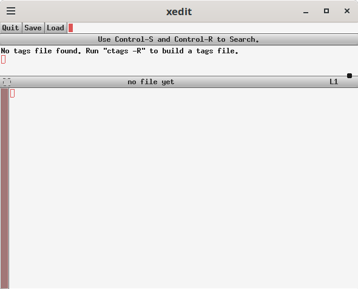
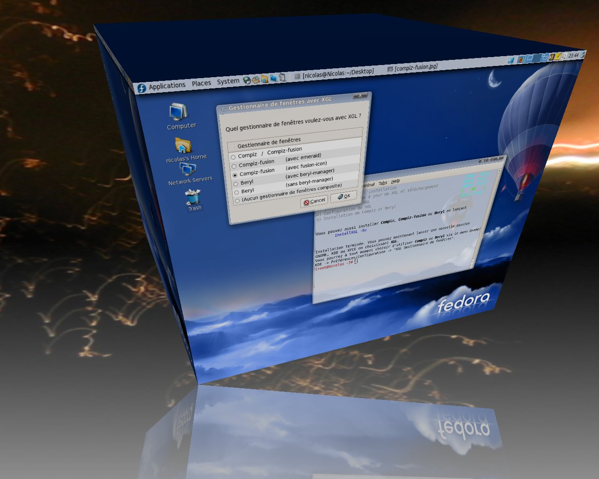

# Linux 桌面与窗口系统

!!! note "主要作者"

    [@taoky][taoky]

!!! warning "本文编写中"

!!! note "参考"

    本章参考了以下内容：
    
    - [@libreliu][libreliu] 在 [2024 年 4 月 21 日 USTCLUG 的小聚「Linux 图形堆栈初探」](https://ftp.lug.ustc.edu.cn/weekly_party/2024.04.21_Linux_Graphics_Journey/)。
    - [farseerfc](https://github.com/farseerfc) 有关[桌面系统混成器](https://farseerfc.me/zhs/brief-history-of-compositors-in-desktop-os.html)的介绍。
    - [@iBug][iBug] 的 [VNC 相关配置](https://wiki.ibugone.com/external/vserver/)。

相比于久负盛名的 Windows 与 macOS，Linux 的桌面以及其生态是独特的。本文将简单介绍 Linux 桌面与窗口系统中一些重要的概念。

## X

以下未特殊标明的情况下，X11 协议均使用 Xorg 这个目前最主流的 X 实现。

!!! tip "部分内容在主章节中有介绍"

    如果你想知道怎么进行 SSH X Forwarding，以及如何在容器中运行 X 程序，可以参考[容器章节中的相关内容](../ops/virtualization/container.md#docker-gui)。

!!! note "本部分不是 X 的开发介绍"

    如果对 X 的实现细节有兴趣，可以参考这个交互式的教程：[xplain](https://magcius.github.io/xplain/article/index.html)。

### 客户端、服务端与窗口 {#client-server-window}

X 窗口系统起源于 1984 年。在那个时代，桌面环境没有酷炫的效果，相比之下，性能与资源占用重要得多。并且当时个人计算机还是一个新兴的概念，用户更多的时候需要使用终端机连接到服务器上运行任务。因此，X 的设计上包含了当时那个年代设计的局限性，并且有着独特的「网络透明性」的设计：需要显示窗口的程序（客户端）和可以给用户显示窗口的程序（服务端）是可以分离的，通过网络去连接。对于单机场景，这里的「网络」大部分时候是 UNIX socket，而在诸如 SSH X Forwarding 这种通过网络连接的场合则是 TCP socket。

默认情况下，如果你正在使用 Linux 桌面，那么默认连接到的 socket 则为 `/tmp/.X11-unix/X0`（对应环境变量 `DISPLAY=:0`）。

!!! warning "X 的抽象套接字支持"

    Linux 支持「抽象套接字」（abstract socket），即允许 Unix socket 绑定到一个不在文件系统中的地址（正常的 Unix socket 需要将地址设置为一个文件路径）。在编写代码时，将 `bind()` 路径（`sun_path`）的开头设置为 `NULL` 就表示抽象套接字。可以查看 `/proc/net/unix` 文件，其中以 `@` 开头的条目则是抽象套接字。

    可以注意到，默认情况下，X 服务端会同时监听 `/tmp/.X11-unix/X0` 和 `@/tmp/.X11-unix/X0`：

    ```console
    $ cat /proc/net/unix | grep X11-unix/X0
    000000002c61e829: 00000003 00000000 00000000 0001 03 379918 @/tmp/.X11-unix/X0
    （省略）
    0000000055982f40: 00000002 00000000 00010000 0001 01 20744 /tmp/.X11-unix/X0
    （省略）
    ```

    X 在 2008 年引入这个特性时的[相关说明](https://cgit.freedesktop.org/xorg/lib/libxtrans/commit/Xtranssock.c?id=2afe206ec9569e0d62caa6d91c3fb057b0efa23d)如下：

    ```
    Unlike normal unix sockets, the abstract namespace is not bound to the
    filesystem.  This has some notable advantages; /tmp need not exist, the
    socket directory need not have magic permissions, etc.  xtrans servers
    will listen on both the normal and abstract socket endpoints; clients
    will attempt to connect to the abstract socket before connecting to the
    corresponding filesystem socket.
    ```

    所以事实上，上文的描述是有一些偏差的——目前 X 客户端仍然会会优先连接 `@/tmp/.X11-unix/X0`。

    抽象套接字在如今带来了一些安全性的挑战，因为和文件系统上的 `/tmp/.X11-unix/X0` 可以依靠文件级别的权限控制不同，抽象套接字只能通过网络命名空间实现隔离。但是如果直接关闭 X server 的抽象套接字，攻击者可以创建虚假的名为 `@/tmp/.X11-unix/X0` 的套接字，欺骗 X 客户端连接。不过连接到 X server 还需要经过一层认证机制（XAuthority），因此如果不去 `xhost +` 的话，攻击者必须要能够获取 XAuthority 信息，才能够连接到对应的 X server。

!!! tip "启动一个新的 X Server"

    存在这样一种场景：你需要启动一个独立的 X server 来测试，而不希望对应的程序使用当前的 X server。其中一个便利的工具是 `xvfb-run`：Xvfb 是一个无头（无显示）的 X server，对自动化测试场景来说很方便。安装 `xvfb` 包后，即可使用：

    ```shell
    xvfb-run -f xvfb-auth -n 99 xeyes
    ```

    这里我们设置 `XAUTHORITY` 文件为 `xvfb-auth`，并且 `DISPLAY` 为 `:99`。关于 `XAUTHORITY`，请参考[容器部分的介绍](../ops/virtualization/container.md#docker-gui)。然后可以通过以下命令确认：

    ```console
    $ DISPLAY=:99 XAUTHORITY=./xvfb-auth xlsclients 
    examplehost  xeyes
    ```

    如果希望创建一个 X server 并且能够以子窗口的形式显示出来，那么可以考虑使用 Xephyr 或者 Xwayland 来创建。以 Xephyr 为例，以下命令可以创建一个 800x600 的 X server，并且以窗口的形式显示：

    ```shell
    Xephyr :123 -ac -screen 800x600
    ```

    其他应用可以直接用 `DISPLAY=:123` 环境变量连接到这个 server。在 Wayland 环境下，也可以使用 `xwayland-run`，以 Xwayland 的 "rootful" 模式运行一个新的 X server。

可以运行 `xlsclients` 获取连接到当前 X 服务器的客户端列表：

```console
$ xlsclients
examplehost gsd-xsettings
examplehost steamwebhelper
examplehost code
examplehost mutter-x11-frames
examplehost steam
```

客户端可以创建一个或多个窗口，可以使用 `xwininfo` 获取窗口信息：

```console
$ xwininfo -root -tree

xwininfo: Window id: 0x503 (the root window) (has no name)

  Root window id: 0x503 (the root window) (has no name)
  Parent window id: 0x0 (none)
     57 children:
     0x1a00004 "desktop.md - Linux201-docs - Visual Studio Code": ("code" "Code")  1920x1200+306+1440  +306+1440
        1 child:
        0x2200007 (has no name): ()  1920x1200+0+0  +306+1440
（以下省略）
```

反直觉的是，这里「窗口」的概念可能比你想象的要广得多——在传统的 X11 应用程序中，很多小控件（例如按钮、输入框）也都是窗口。可以尝试打开一个比较复杂的传统 X 程序（例如 `xedit`），然后 `xwininfo` 看一下：



xedit 的界面
{: .caption }

```console
$ xwininfo -name xedit -tree

xwininfo: Window id: 0x4200072 "xedit"

  Root window id: 0x9cf (the root window) (has no name)
  Parent window id: 0x3800096 (has no name)
     1 child:
     0x4200073 (has no name): ()  590x440+0+0  +959+143
        6 children:
        0x4200099 (has no name): ()  8x8+572+436  +1531+579
        0x420007b (has no name): ()  8x8+572+84  +1531+227
        0x420007c (has no name): ()  590x351+0+89  +959+232
           4 children:
           0x420008a (has no name): ()  8x8+586+333  +1545+565
           0x420008c (has no name): ()  1x1+0+0  +959+232
              6 children:
              0x4200096 (has no name): ()  179x21+0+0  +960+233
                 2 children:
                 0x4200098 (has no name): ()  85x17+2+2  +963+236
                 0x4200097 (has no name): ()  64x17+87+2  +1048+236
              0x4200094 (has no name): ()  100x18+0+0  +960+233
                 1 child:
                 0x4200095 (has no name): ()  14x4+-1+-1  +960+233
              0x4200093 (has no name): ()  8x8+0+0  +960+233
              0x4200092 (has no name): ()  64x17+0+0  +960+233
              0x420008e (has no name): ()  1x1+0+0  +960+233
                 2 children:
                 0x4200091 (has no name): ()  14x1+-1+-1  +960+233
                 0x420008f (has no name): ()  1x1+15+0  +976+234
                    1 child:
                    0x4200090 (has no name): ()  1x19+0+0  +976+234
              0x420008d (has no name): ()  8x8+0+0  +960+233
           0x420008b (has no name): ()  8x8+0+0  +959+232
           0x420007d (has no name): ()  590x351+0+0  +959+232
              6 children:
              0x4200083 (has no name): ()  8x8+572+347  +1531+579
              0x4200087 (has no name): ()  179x21+0+0  +959+232
                 2 children:
                 0x4200089 (has no name): ()  85x17+2+2  +962+235
                 0x4200088 (has no name): ()  64x17+87+2  +1047+235
              0x4200085 (has no name): ()  100x18+0+0  +959+232
                 1 child:
                 0x4200086 (has no name): ()  14x4+-1+-1  +959+232
              0x4200084 (has no name): ()  8x8+0+0  +959+232
              0x4200081 (has no name): ()  590x332+0+19  +959+251
                 1 child:
                 0x4200082 (has no name): ()  14x332+-1+-1  +958+250
              0x420007e (has no name): ()  590x18+0+0  +959+232
                 2 children:
                 0x4200080 (has no name): ()  496x15+2+1  +961+233
                 0x420007f (has no name): ()  90x15+498+1  +1457+233
        0x420007a (has no name): ()  590x50+0+38  +959+181
        0x4200079 (has no name): ()  590x18+0+19  +959+162
        0x4200074 (has no name): ()  590x18+0+0  +959+143
           4 children:
           0x4200078 (has no name): ()  479x18+111+0  +1070+143
           0x4200077 (has no name): ()  36x18+74+0  +1033+143
           0x4200076 (has no name): ()  36x18+37+0  +996+143
           0x4200075 (has no name): ()  36x18+0+0  +959+143
```

这和 Windows 的传统桌面 API 的设计是[非常类似](https://learn.microsoft.com/en-us/windows/win32/learnwin32/what-is-a-window-)的。不过创建大量的小窗口需要消耗不少的系统资源，因此目前常见的现代 UI 框架，不管是在 Linux 还是在 Windows 上，都基本上抛弃了这种「万物皆窗口」的理念。

### 窗口管理器 {#window-manager}

另一点有趣的是，尽管 X 中存储了各个窗口的状态（以及它们在 Z 轴的栈式关系），但是 X 本身不会去管理这些窗口要怎么被用户移动、缩放、最大最小化等，也不会去尝试装饰窗口，它只会按照自己记录的状态把这些窗口显示出来。对于具体的窗口管理工作，X 就当起了甩手掌柜，把事情都交给了**窗口管理器**。窗口管理器是一个特殊的 X 客户端，所有我们常用的窗口功能都是由窗口管理器负责的，包括但不限于管理窗口的显示布局、窗口装饰、焦点控制、虚拟桌面等等。X 服务端允许窗口管理器捕获创建窗口的事件，并且允许窗口管理器将对应的窗口 "reparent" 到窗口管理器创建的框架窗口中，以此实现让程序窗口被窗口管理器控制、装饰的效果。

窗口管理器与 X 服务器之间的交互有一些标准规范，例如 ICCCM 与 EWMH，以减小不同的窗口管理器实现之间的混乱与不一致问题。

窗口管理器本身也是一个独立的进程，如果窗口管理器退出，那么其他的 X 客户端不会停止运行，但是你可能无法再控制它们了（例如，可能它们被别的窗口挡住了，而没有窗口管理器的装饰的话，你可能没有办法移动它们）。这种分离的设计也帮助孕育了很多独特的窗口管理器设计，例如平铺式窗口管理器（例如 i3wm），相比于传统的浮动式窗口管理器，可以自动以不重叠的方式显示当前的所有窗口，用户不需要再用鼠标手动调整每个窗口的大小等等。

### 输入 {#x-input}

#### 输入设备 {#x-input-devices}

Linux 的输入子系统暴露的设备在 `/dev/input` 中，用户空间可以打开设备文件以读取输入设备的信息。可以通过 `evtest` 工具来查看输入设备的事件：

```console
$ sudo evtest
No device specified, trying to scan all of /dev/input/event*
Available devices:
（省略）
Select the device event number [0-17]: 7
（选择鼠标设备，省略）
Testing ... (interrupt to exit)
Event: time 1760901205.303790, type 2 (EV_REL), code 0 (REL_X), value -1
Event: time 1760901205.303790, -------------- SYN_REPORT ------------
Event: time 1760901205.343787, type 2 (EV_REL), code 0 (REL_X), value 1
Event: time 1760901205.343787, -------------- SYN_REPORT ------------
Event: time 1760901205.363788, type 2 (EV_REL), code 0 (REL_X), value 1
Event: time 1760901205.363788, -------------- SYN_REPORT ------------
（省略接下来鼠标移动的事件）
```

在较早的 Xorg 实现中，X server 会使用 evdev 驱动（xf86-input-evdev）直接读取 `/dev/input` 中的设备文件以获取输入事件，但是目前绝大部分情况下，evdev 驱动已经不再使用，X server 通过 libinput（xf86-input-libinput）来处理输入设备。libinput 是一个通用的输入处理库，由它解析输入事件后再传递给 X server。

libinput 则可以通过 `libinput list-devices` 来查看；`libinput` 程序还支持类似 `evtest` 的实时事件查看功能，可以使用 `libinput debug-events` 来查看输入事件：

```console
$ sudo libinput list-devices
Device:                  Power Button
Kernel:                  /dev/input/event1
Id:                      host:0000:0001
Group:                   1
Seat:                    seat0, default
Capabilities:            keyboard 
（以下省略）
$ sudo libinput debug-events /dev/input/event7
-event7   DEVICE_ADDED                 Logitech G304                     seat0 default group1  cap:kp left scroll-nat scroll-button
 event7   POINTER_MOTION               +0.000s	  0.30/  0.00 ( +1.00/ +0.00)
 event7   POINTER_MOTION            2  +0.003s	  1.81/  0.00 ( +2.00/ +0.00)
 event7   POINTER_MOTION            3  +0.007s	  2.22/  0.00 ( +2.00/ +0.00)
```

而如果要确认 X server 识别到了哪些输入设备，可以使用 `xinput` 工具。由于 `xinput` 是和 X server（而不是和设备文件）交互，因此不需要特权。以下是在 Xwayland 下执行的结果：

```console
$ xinput list
WARNING: running xinput against an Xwayland server. See the xinput man page for details.
⎡ Virtual core pointer                    	id=2	[master pointer  (3)]
⎜   ↳ Virtual core XTEST pointer              	id=4	[slave  pointer  (2)]
⎜   ↳ xwayland-pointer:16                     	id=6	[slave  pointer  (2)]
⎜   ↳ xwayland-relative-pointer:16            	id=7	[slave  pointer  (2)]
⎜   ↳ xwayland-pointer-gestures:16            	id=8	[slave  pointer  (2)]
⎣ Virtual core keyboard                   	id=3	[master keyboard (2)]
    ↳ Virtual core XTEST keyboard             	id=5	[slave  keyboard (3)]
    ↳ xwayland-keyboard:16                    	id=9	[slave  keyboard (3)]
```

#### 输入法 {#x-input-method}

最早期的 X 设计上完全没有考虑输入法的问题。然而在东亚语言（中文、日文、韩文，CJK）场景下，输入法是正常使用桌面的必需组件。因此 X 在 1994 年尝试设计了被称为 [XIM（X Input Method）](https://www.x.org/releases/X11R7.6/doc/libX11/specs/XIM/xim.html)的输入法框架，但是这一套框架逐渐无法满足现代 UI 框架与输入法的需求。因此目前在 X 上，主流的 [IBus](https://github.com/ibus/ibus) 与 [Fcitx](https://fcitx-im.org/)（包括 Fcitx 4 与 Fcitx 5）均使用另一种方案：在 GTK 或 Qt 这样的图形库中直接集成输入法支持，而不再使用 XIM。GTK 或 Qt 会直接调用输入法模块，模块内会通过 DBus 与输入法进程通信，实现功能。

这也是在做输入法配置时经常提到需要修改环境变量的原因。以 Fcitx 5 为例，通常需要设置以下环境变量：

```shell
XMODIFIERS="@im=fcitx"
GTK_IM_MODULE="fcitx"
QT_IM_MODULE="fcitx"
```

如果应用程序不使用 GTK 或 Qt，那么一般来讲考虑到输入法需求的应用会基于 XIM 方案实现支持，即 `XMODIFIERS` 环境变量指定的输入法。

### 输出 {#x-output}

#### 显示支持与显卡 {#x-gpu}

在早期，显卡只做一件事情：把帧缓冲区（framebuffer）的内容输出到显示器上。此时，显存就是一段内存空间，修改内容，显示器上对应的像素就会变化。帧缓冲区在 Linux 上暴露为 `/dev/fb0` 这样的设备文件，用户空间程序可以直接打开并且修改它的内容以读取分辨率等信息，并改变显示器上的内容。此时，X server 使用 `fbdev`（xf86-video-fbdev）驱动来操作帧缓冲区。

!!! lab "尝试直接与 `/dev/fb0` 交互，在 TTY 中输出图片"

    尝试搜索资料，写一个程序，打开 `/dev/fb0`，并使用 `ioctl` 读取必要的信息，然后 `mmap` 映射帧缓冲区后，将你想显示的图片数据写入对应的内存区域。

但是之后，显示加速的需求越来越大，显卡厂商之间设计的差异也越来越大，`fbdev` 已经不够用了。之后出现的一种解决方案是：编写 X 的输出驱动，直接操作 `/dev/mem`，通过物理地址访问显存，从而实现对显卡的控制。但是这种设计有很多问题：X 需要用 root 权限运行；如果 X 崩溃了，那么显卡的状态很可能也会坏掉；X 与 OpenGL 之间的协作也有不少问题。

因此内核提供了 DRM（Direct Rendering Manager）子系统来统一管理显卡资源，并且因此 GPU 驱动被分为了两部分：一部分在内核空间的 DRM 中（Kernel Mode Driver，KMD），另一部分在用户空间实现（User Mode Driver，UMD），很大程度缓解了所有显卡的东西都挤在 X 里面的混乱局面。你可以在 `/dev/dri` 中看到你的显卡的设备文件，一般分为主设备（`card0`）和渲染设备（`renderD128`），后者只能做渲染操作，防止将不必要的显卡配置的权限暴露给低权限图形应用。

此外，你可能还会经常看到 KMS（Kernel Mode Setting）这个词。KMS 是 DRM 的子模块，负责设置显示模式，这也将 X 从设置显示模式的负担上解放出来，并且帮助实现更平滑的显示切换（例如从 TTY 切换到 X）。

最后回到显示加速上。目前开源驱动一般的做法是：KMS 来设置显示模式，由开源的 Mesa UMD 来具体实现 OpenGL、Vulkan 等图形 API 的功能。X server 就使用 modesetting（xf86-video-modesetting）驱动，不再需要关心显卡的具体实现细节了。但是如果你是 NVIDIA 官方驱动（或者其他小众显卡厂商的闭源驱动）的用户，那么很不幸，你还是需要使用对应厂商提供的专有 X 驱动（也称为 Device Dependent X，DDX）来获得显示加速。

#### HiDPI {#x-hidpi}

随着高分屏的推广，如果在使用高分屏时仍然采用和非高分屏一样的策略，那么桌面元素就会变得非常小，因此需要对桌面进行缩放。在介绍下面的内容之前，首先需要了解 DPI（Dots Per Inch，点每英寸）的概念。显示器型号中的「英寸」一般指显示器对角线的长度，因此要计算 DPI，首先可以先从最佳分辨率的长和宽计算出对角线的像素数，然后用对角线的像素数除以对角线的英寸数，就可以得到 DPI 了。例如对一个 27 英寸的 2K（2560x1440）显示器来说：

1. 计算对角线的像素数：sqrt(2560^2 + 1440^2) ≈ 2937.2 像素
2. 计算 DPI：2937.2 / 27 ≈ 109 DPI

一般来讲，在 Apple 以外的生态中，默认（1 倍）的 DPI 是 96。因此对上面的显示器，可能需要稍微放大一些，才能获得比较合适的显示效果。如果 DPI 是 144（1.5 倍）或者 192（2 倍）的话，默认缩放的不适感就会更明显。这些显示器也被称为 HiDPI 显示器。

X server 早期会尝试获取显示器的 EDID（Extended Display Identification Data）信息，获取显示器的物理尺寸，计算出当前 screen 的 DPI，客户端可以获取到相关信息。但很不幸的是，很多时候显示器提供的 EDID 信息是错误的。如果直接拿来用，那么就可能计算出非常奇怪的 DPI，因此 Xorg 固定使用 96 DPI 作为默认值。并且目前绝大多数情况下，X server 只会有一个 "screen"（即使连接了多个显示器），具体的显示器设置由 RandR 扩展管理，因此 X server 也无法为每个显示器提供不同的 DPI 信息。

因为 X server 提供的 DPI 的不可靠性，有一些应用就转而参考 X resources 中的 `Xft.dpi` 设置来获取 DPI 信息。X resources 是 X server 提供的一个简单的键值存储系统，记录了字体、颜色等信息，可以使用 `xrdb` 工具来查看和修改：

```console
$ xrdb -query
Xft.dpi:	96
Xft.antialias:	1
Xft.hinting:	1
Xft.hintstyle:	hintslight
Xft.rgba:	none
Xcursor.size:	24
Xcursor.theme:	Adwaita
$ # 从约定俗成的配置文件位置读取并与当前 X resources 合并
$ xrdb -merge ~/.Xresources
```

但是在语义上，这么做是存在问题的，因为 Xft 是字体相关的设置，因此它的 DPI 照理来说只是字体渲染时使用的 DPI，而不应该影响包括图片等在内的其他内容（尽管很多时候这个值就被拿来做整体 UI 的缩放了）；并且这种机制完全无法处理不同显示器不同 DPI 的情况。因此，各类 UI 库又引入了自己的 DPI 设置方式，例如 GTK 使用 `GDK_SCALE` 和 `GDK_DPI_SCALE` 环境变量，Qt 则使用 `QT_SCALE_FACTOR` 和 `QT_AUTO_SCREEN_SCALE_FACTOR` 等环境变量让用户调整 DPI。

此外，由于 X resources 的修改无法通知到客户端，因此出现了 [Xsettings](https://www.freedesktop.org/wiki/Specifications/xsettings-spec/) 的机制。Xsettings 会在 X server 中创建一个不可见的特殊窗口，其中存储了包括 `Xft.dpi` 在内的桌面配置。客户端可以监听这个窗口的变化，从而在运行时动态调整自己的设置。

另一条不同的思路是使用 `xrandr` 的 DPI（`--dpi`，修改 X server 中整个 screen 的 DPI）和每个显示器的缩放（`--scale`）参数来整体缩放显示内容，不少桌面环境的显示器设置的缩放都是这么做的。但是在复杂情况下，完全做对而不模糊仍然非常困难，很多时候需要手动调整多个参数才能获得比较合适的显示效果。

从上面的描述，我们可以发现，其实 X 对 HiDPI 的支持是混乱的——不同应用有不同的标准，有很多「设置 DPI」的方式，并且都不完美。如果要考虑到多显示器支持，以及分数缩放的话，现有的机制就更不够用了。

!!! comment "@taoky：吐槽"

    我不止一次看到过在笔记本上用 Linux X 桌面的人在需要做报告的时候，HDMI 线接上，然后发现大屏幕上只能显示一部分被截断的内容，或者内容太大/太小，而且还要花大半天才能调好。如果你经常需要拿着笔记本接投影做展示，Wayland 会是好得多的选择。

!!! note "平行世界：假如只有一种设置方法，X 的 HiDPI 支持会更好吗？"

    让我们假设一下：假如说我们只有一种设置 DPI 的方式，让 X server 直接管理 DPI，客户端可以获取到每个屏幕的 DPI，并且在 DPI 变化时收到通知。那么这种情况下，X 的 HiDPI 支持会更好吗？

    如果我们只考虑一台显示器，那么确实，这个更简洁的模型是更好的。但是，如果我们考虑多显示器的场景，那么有些麻烦的地方就来了：由于 X 维护的是一块由多个显示器拼起来的大 screen（root window），应用需要自行从自己的坐标位置判断当前窗口在哪个显示器上，从而决定使用哪个 DPI 来渲染自己，这就存在两个问题：

    1. 当窗口拖动的时候，应用需要不停向 X server 轮询自己的位置，从而决定使用哪个 DPI 来渲染自己，带来额外的性能开销。
    2. 如果一个窗口跨多个显示器，那么应用需要决定使用哪个显示器的 DPI 来渲染自己，带来了复杂性与不确定性。

    虽然有这些问题，但是即使是以上这个模型，在我们这个世界中也已经难以在不破坏兼容性的情况下实现——几乎所有的 UI 框架都需要修改代码才能支持。

!!! tip "Kali Linux 的 HiDPI 设置脚本"

    作为一个例子，Kali 为它们自定义的 Xfce 桌面环境提供了一个 [HiDPI 设置脚本](https://gitlab.com/kalilinux/packages/kali-hidpi-mode/-/blob/kali/master/kali-hidpi-mode?ref_type=heads)，可以作为以上描述的这种混乱的一个参考。

    我们为 Linux 101 自动化构建编写的 101strap 项目提供了修改的版本，参见 [toggle-hidpi](https://github.com/ustclug/101strap/blob/master/assets/toggle-hidpi)。

### 混成器 {#x-compositor}

进入二十一世纪之后，桌面环境开始追求更炫酷的视觉效果，例如圆角的窗口、半透明的窗口、有阴影的窗口、不规则形状的窗口、动画效果等等。但是 X 传统仍然假设：窗口是个不透明矩形，X 服务器需要直接把这样的窗口画到屏幕上，并且跳过被挡住的部分——而且这个过程没有缓冲，动画只能靠窗口不停重绘自己来实现，非常不流畅。而混成器做的事情就是：接管图形显示的流程，让窗口不再直接画在屏幕上，而是画在一个缓冲区中，然后由混成器统一将这些缓冲区合成（composite）到屏幕上。这样一来，要显示什么酷炫的效果就由混成器说了算了。在 X 下，混成器需要调用 [X Composite 扩展](https://freedesktop.org/wiki/Software/CompositeExt/)来实现。

!!! tip "我的 X 服务器开启了哪些扩展？"

    可以使用 `xdpyinfo` 来查看当前 X 服务器开启了哪些扩展：

    ```console
    $ xdpyinfo
    （省略）
    number of extensions:    25
        BIG-REQUESTS
        Composite
        DAMAGE
        DOUBLE-BUFFER
    （省略）
    ```

最著名的例子是 compiz，它实现了很多诸如 3D 立方体桌面切换等等的效果，是 2010 年前后 Linux 桌面炫酷效果的代名词，在当时也吸引了很多用户来使用 Linux 桌面。各个桌面环境的窗口管理器，例如 GNOME 的 mutter、KDE 的 kwin 也都集成了混成器的功能。



2007 年的 Compiz 的立方体效果。[By Nicofo，CC BY-SA 3.0](https://commons.wikimedia.org/wiki/Compiz#/media/File:Compiz-fusion_effects_Cube.jpg)。
{: .caption }

### 显示管理器 {#x-display-manager}

在 X 下，显示管理器（Display Manager，DM）负责在 X 服务器上显示登录界面，在用户登录后启动对应的桌面环境或者窗口管理器。常见的 DM 有 [GDM](https://gitlab.gnome.org/GNOME/gdm/)（GNOME Display Manager）、[SDDM](https://github.com/sddm/sddm)（Simple Desktop Display Manager，KDE 默认使用）、[LightDM](https://github.com/canonical/lightdm) 等。DM 一般作为 systemd 的服务运行，在系统启动时自动启动 X 服务器，并且显示登录界面。

之所以叫 Display Manager 而不是 Login Manager，是因为 DM 还管理着 X（即 "Display"）——比如说，如果 X 崩溃了，DM 会重新启动 X 并且重新显示登录界面。

### 剪贴板与拖放支持 {#x-clipboard-dnd}

在 X 下，剪贴板和拖放（Drag and Drop，DND）功能都是由 X 的 Selection 机制实现的。Selection 机制用来表示一个程序拥有某个数据，并且允许其他的程序请求获取这个数据。

X 的剪贴板相比其他的操作系统桌面环境特殊的地方在于：它有两种不同的 Selection（PRIMARY 和 CLIPBOARD），并且 X 不存储剪贴板内容。CLIPBOARD 就是我们非常熟悉的剪贴板了，而 PRIMARY 则代表鼠标刚刚选择的内容，用户可以按下鼠标中键（或者大部分触摸板上三指点击）来粘贴 PRIMARY 中的内容，不需要用户显式点击复制或者按下 Ctrl+C。

在复制时，程序会向 X server 注册自己拥有对应的 Selection；在粘贴时，程序会向 X server 请求拥有对应 Selection 的程序提供指定类型的数据（例如纯文本、HTML、图片等等），然后由拥有 Selection 的程序将数据传递给请求的程序。由于 X server 并不存储剪贴板内容，因此如果拥有 Selection 的程序退出了，那么对应的 Selection 也就不存在了。如果需要保留数据，则需要使用剪贴板管理器程序来保存。

而拖放也是类似的，应用之间使用 [XDND](https://www.freedesktop.org/wiki/Specifications/XDND/) 协议，通过 Selection 机制传递数据。具体流程可参考协议给出的示例。

### 远程桌面访问 {#x-remote-desktop}

X 的网络透明性设计似乎使得远程桌面访问变得非常简单——只需要 `ssh -X` 或者 `ssh -Y` 就可以了。但是由于 X 协议本身的设计问题，这么做的性能并不好，主要原因包括：

1. X 协议很「啰嗦」，大量的操作都需要往返通信，这导致网络延迟会被协议放大数倍，甚至十几倍。
2. 旧的 X 程序一般会调用 X 协议的接口来画线段、字体等（例如[客户端、服务端与窗口](#client-server-window)中展示的 xedit），但是绝大多数现代 UI 框架（例如 GTK、Qt）早已经不这么做了，而是直接画图给服务器。在远程环境下意味着传输大量未压缩的图像数据，网络带宽消耗大。

因此 X 的网络透明性几乎只适合在极低延迟的网络环境下使用（基于同样的理由，我们也不介绍为远程使用 DM 设计的古早协议 XDMCP）。对于更常见的场景，根据需求不同，可以使用传统的 VNC/RDP 方案，本身作为 X server，支持多种网络与图形协议的 [Xpra](https://github.com/Xpra-org/xpra)，针对游戏场景优化的 [Sunshine](https://github.com/LizardByte/Sunshine)，或者为远程协助设计的 [RustDesk](https://rustdesk.com/) 等等。类似的远程桌面方案还有很多，可以按需选择。

!!! example "SSH + VNC 的远程桌面访问方案"

    以下介绍一种常见的远程桌面访问需求的解决方案：通过 SSH 隧道访问远程主机上的 VNC 服务器。只要能够建立 SSH 连接，就可以通过这种方法获取到基本的 X 桌面环境，并且用户之间互相隔离，且不需要配置防火墙，远程桌面图像也不会经手第三方。

    [TigerVNC](https://github.com/TigerVNC/tigervnc) 实现了 Xvnc，安装 `tigervnc-standalone-server` 包即可。Xvnc 是一个集成了 VNC 服务器功能的 X server，可以像启动 X 一样启动 Xvnc。这里为了安全起见，我们将启动的 Xvnc 绑定到家目录下的一个 Unix socket 上，由 Unix 的文件权限管理来保证用户之间的隔离（因此不需要设置额外的 VNC 密码），并且避免将 VNC 端口暴露到网络上。启动的脚本如下（使用 [tigervncserver(1)][tigervncserver.1]）：

    ```shell title="/usr/local/bin/startvnc"
    #!/bin/sh

    # vncserver -> tigervncserver
    exec /usr/bin/vncserver \
      -rfbport -1 \
      -rfbunixpath "$HOME/.vncsock" \
      -SecurityTypes None \
      "$@"
    ```

    之后我们需要指定 VNC 服务器使用的 session。Debian 下，tigervncserver 会查看 `/etc/tigervnc/vncserver-config-defaults` 中 `$session` 变量的值，如果没有定义，就会启动 `/usr/bin/x-session-manager`。作为例子，我们安装 LXQt。LXQt 是一个非常轻量级的桌面环境：

    ```shell
    sudo apt install --no-install-recommends lxqt
    ```

    !!! tip "使用其他桌面环境"

        也可以安装其他的桌面环境，例如 GNOME、KDE。在安装完成后，可以使用 [Alternatives](../ops/package.md#alternatives) 来设置默认的 `x-session-manager`：

        ```shell
        sudo update-alternatives --config x-session-manager
        ```

        注意，一些桌面环境可能需要完整的 systemd 支持才能正常工作，例如 GNOME。如果你的环境是没有 systemd 的容器，那么可能需要选择其他桌面环境。
    
    !!! tip "错误调试"

        Session 的错误输出位于 `~/.xsession-errors` 文件中，可以查看该文件来调试 session 启动失败的问题。

    之后 SSH 连接时，可以[使用 `-L` 参数将本地的 5900（默认 VNC 端口）转发到远程主机的 Unix socket 上](../dev/ssh.md#local-port-forwarding-local-port-forwarding)：

    ```shell
    ssh user@host -L 5900:/home/user/.vncsock
    ```

    或者直接修改 SSH 配置文件，添加以下内容：

    ```shell title="~/.ssh/config"
    Host myvncserver
        HostName host
        User user
        LocalForward 5900 /home/user/.vncsock
    ```

    SSH 登录，并且运行我们编写的 `startvnc` 脚本启动 VNC 服务器后，本地即可通过 VNC 客户端连接到 `localhost:5900` 来访问远程的 X 桌面环境。TigerVNC 也提供了 `vncviewer` 命令行客户端：

    ```shell
    vncviewer localhost:5900
    ```

    如果需要重启 VNC 服务器，直接杀死对应的进程，再重新执行 `startvnc` 即可。

!!! example "VNC 与 LightDM 集成"

    以下介绍 USTC Vlab 项目在客户容器中[集成 VNC 服务器与 LightDM 的方案](https://github.com/USTC-vlab/deb/tree/master/vlab-vnc)。集成的好处是：用户在连接到 VNC 后，就能看到熟悉的 LightDM 的登录界面，可以在界面中输入密码、选择桌面环境等，而不需要预先配置好 VNC session。

    在 [lightdm.conf](https://github.com/canonical/lightdm/blob/5f14752419fc7f0fd763013c8195dcb0099c940a/data/lightdm.conf) 中，我们可以设置让 LightDM 使用的 X 服务器，以及 LightDM 启动 greeter（实际给用户展示的图形界面）之前要运行的程序：

    ```ini title="/etc/lightdm/lightdm.conf"
    [Seat:*]
    xserver-command=/usr/local/bin/vncserver-lightdm
    greeter-hide-users=false
    greeter-setup-script=/usr/local/bin/vncserver-greeter-setup.sh
    ```

    ```shell title="/usr/local/bin/vncserver-lightdm"
    #!/bin/bash
    # Need Bash for $PPID

    DISPLAY=":0"
    LIGHTDM_PID=$PPID
    XVNC_PID=0

    kill_vnc() {
      kill -s SIGTERM $XVNC_PID
      wait
    }

    if [ $# -gt 0 ]; then
      DISPLAY="$1"
    fi

    AUTHORITY="/var/run/lightdm/root/$DISPLAY"

    Xvnc "$DISPLAY" -rfbport 5900 -seat seat0 -SecurityTypes None -auth "$AUTHORITY" -SendPrimary=0 &

    XVNC_PID=$!
    trap kill_vnc SIGTERM

    sleep 2
    kill -s SIGUSR1 $LIGHTDM_PID

    wait
    exit 0
    ```

    !!! danger "安全性注意事项"

        在这里，VNC 服务没有安全性校验。在 Vlab 中，所有用户对 VNC 的访问都必须经过我们自己编写的 VNC 网关，并且用户之间的 VNC 端口由防火墙阻止互相访问，因此这种设计是安全的。如果你在其他场景使用，请务必注意安全性问题，**特别是需要暴露端口到公网的情况**。互联网中存在大量自动化扫描空密码、弱密码的 bot。如果你不注意安全，那么之后你就可能会看到自己的 VNC 的桌面被其他人分享在某些社交媒体上，然后发现自己的桌面被陌生人入侵操控。

        VNC 传统的密码模式 `VncAuth` 是不安全的——它的密码明文传输，并且密码长度最多只有 8 个字节，因此不建议使用。建议至少使用 `TLSVnc`，或者使用 SSH 隧道等方式保护 VNC 连接。
    
    !!! note "为什么要给 LightDM 发送 SIGUSR1？"

        这一点在 [xserver(1)][xserver.1] 手册页中有说明：当 X 服务器发现自己从父进程继承的 SIGUSR1 信号的 handler 是 `SIG_IGN`（忽略信号）时，就会在启动完成之后向它的父进程发送 SIGUSR1 信号。DM 可以利用这个机制来等待 X 服务器启动完成。

        这里的 shell 脚本用了相对粗糙的 `sleep 2` 来等待 X 服务器启动完成，然后以 X 服务器的这一套信号协议来通知 LightDM。

    ```shell title="/usr/local/bin/vncserver-greeter-setup.sh"
    #!/bin/sh
    vncconfig -nowin &
    ```

    !!! note "vncconfig 的作用"

        [vncconfig(1)][vncconfig.1] 是 TigerVNC 提供的一个小工具，负责处理剪贴板同步等功能。如果不运行它，那么 VNC 客户端与服务器之间的剪贴板将无法同步。
    
    之后 LightDM 在启动时，就会启动 Xvnc，在 5900 端口上监听 VNC 连接。

## Wayland

从 1984 年开始到现在，X 陪伴 Unix（与类 Unix）桌面走过了四十多年的时间。在这个过程中，随着计算技术的不断发展，80 年代的设计暴露出了越来越多的问题，包括但不限于：

- 安全性问题：连接到 X server 的任何客户端都可以随便看其他窗口，随便截取用户输入，带来了严重的安全隐患。
- 混成器的性能：现代桌面下混成器已经是必需品。但是在 X 的 Composite 扩展框架下，窗口信息需要经过 X server，再经过混成器，混成器画好之后再传给 X server，最后才能显示出来。X server 成为了一个导致性能瓶颈的中间人。
- 网络透明性的实用性：X 的网络透明性已经不再实用，VNC、RDP 等远程桌面协议已经成为主流选择。
- 画面同步：X server 的无撕裂（TearFree）需要显卡驱动各自实现。
- HiDPI 支持的一片混乱：[上文](#x-hidpi)已有说明。

在[对 X12 的设想](https://www.x.org/wiki/Development/X12)中也提到了一些 X11 已经无法忽视的问题，并且其中不少问题已经无法在 X11 协议上渐进式地解决了。因此，新的显示协议 Wayland 于 2008 年开始开发，到如今 GNOME、KDE 已经有了完整可用的支持，其他的桌面环境也在逐步跟进，并且越来越多的应用程序开始支持 Wayland。以下部分介绍 Wayland 以及相关的一些基本概念。

!!! note "参考阅读"

    Xorg 与 Wayland 开发者 Daniel Stone 在 2013 年的 linux.conf.au 会议上做了 [the real story behind Wayland and X](https://people.freedesktop.org/~daniels/lca2013-wayland-x11.pdf) 的报告，其中详细介绍了 X 的设计问题以及 Wayland 的设计思路，推荐阅读。

!!! note "本部分也不是 Wayland 的开发介绍"

    如果对 Wayland 开发感兴趣，可以参考：

    - [The Wayland Protocol](https://wayland.freedesktop.org/docs/html/)：官方文档
    - [Wayland Book](https://wayland-book.com/)：社区编写的 Wayland 开发入门书籍
    - [Wayland Explorer](https://wayland.app/)：所有常见 Wayland 协议的文档聚合

### 基础架构 {#wayland-infrastructure}

在 Wayland 架构中，原先的 X server 与混成器合二为一，仍然称为混成器。混成器需要与客户端使用 Wayland 协议通信，与内核使用 KMS、evdev 等接口通信处理输入输出。

## Fontconfig

## 音频服务器

## DBus
