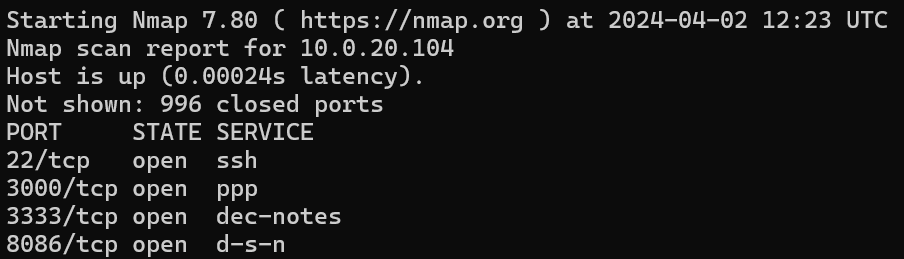

# Nmap: 网络探测和安全检查工具

!!! warning "本文初稿已完成，但可能仍需大幅度修改"

Nmap（Network Mapper）是一个开源的网络探测和安全检查工具。它由 Gordon Lyon（也被称为 Fyodor Vaskovich）创造，并首次发布于 1997 年。主要功能包括，主机发现，端口扫描，服务版本探测，操作系统检测，脚本扫描等。由于其强大的功能和灵活性，Nmap 已经成为世界上最受欢迎的网络扫描工具之一，并被广泛应用于安全社区和 IT 行业。

这是一份 Nmap 使用手册，你可以参考本文快速上手使用。

## 安装 Nmap

在大多数 Linux 发行版中，可以直接使用包管理器安装 Nmap：

### Debian/Ubuntu

```shell
sudo apt-get install nmap
```

### CentOS/Fedora

```shell
sudo yum install nmap
```

### Arch Linux

```shell
sudo pacman -S nmap
```

## Nmap 基本用法举例

!!! question

    你的室友有一台服务器，在上面运行了很多服务。有些是只给自己仅限他自己本机使用的，有些也许不小心对外开放了。你非常热心，想帮它检查一下意外暴露的服务，要怎么做呢？

### 基本扫描

扫描网络中的主机，开放的端口和对应的运行的服务。



!!! tip

    在扫描中按下任意键可以显示进度

#### 指定地址

扫描单个主机：

```shell
nmap [target]
```

扫描多个主机：

```shell
nmap [target1] [target2] [target3]
```

扫描整个子网：

```shell
nmap [subnet]/24
```

!!! tip

    如果你想扫描整个网络，但需要跳过某些主机，可以使用 --exclude 选项。

!!! question

    你的服务器在大机房里，你记得你在上面开了一个运行在25565端口上的服务。但是……你忘记它的ip了。怎么快速找到它呢

#### 指定端口

扫描特定端口：

```shell
nmap -p [port] [target]
```

扫描多个端口：

```shell
nmap -p [port1],[port2],[port3] [target]
```

扫描一个范围内的端口：

```shell
nmap -p [start_port]-[end_port] [target]
```

#### 指定网络协议

执行 SYN 扫描：

（可能需要 root 权限，否则无法发送原始报文）

```shell
sudo nmap -sS [target]
```

执行 UDP 扫描（可能需要较长时间）：

```shell
sudo nmap -sU [target]
```

### 服务和版本检测

检测服务的版本信息：

```shell
nmap -sV [target]
```

!!! question

    实验室跑了 20 年的古董服务器是什么操作系统呢？🤔

### 操作系统检测

检测某个主机的操作系统：

```shell
nmap -O [target]
```

!!! tip

    使用 -T 选项可以设置 Nmap 的扫描速度，-T4 和 -T5 选项可以加快扫描速度，但也更容易被入侵检测系统（IDS）发现。如果想要更隐蔽地扫描，可以选择 -T2 或 -T3。

## 输出格式

Nmap 支持的输出格式包括：

- 标准输出到控制台。
- -oN 输出到普通文件。
- -oX 输出为 XML 格式。
- -oG 输出为 grep 友好格式。
- -oA 输出所有上述格式。

例如想要输出到文件，可以这样做：

```shell
nmap -oN output.txt [target]
```

!!! tip

    如果你不喜欢命令行，可以使用 Nmap 的图形用户界面版本 Zenmap，它提供了用户友好的界面来运行扫描和分析结果。
