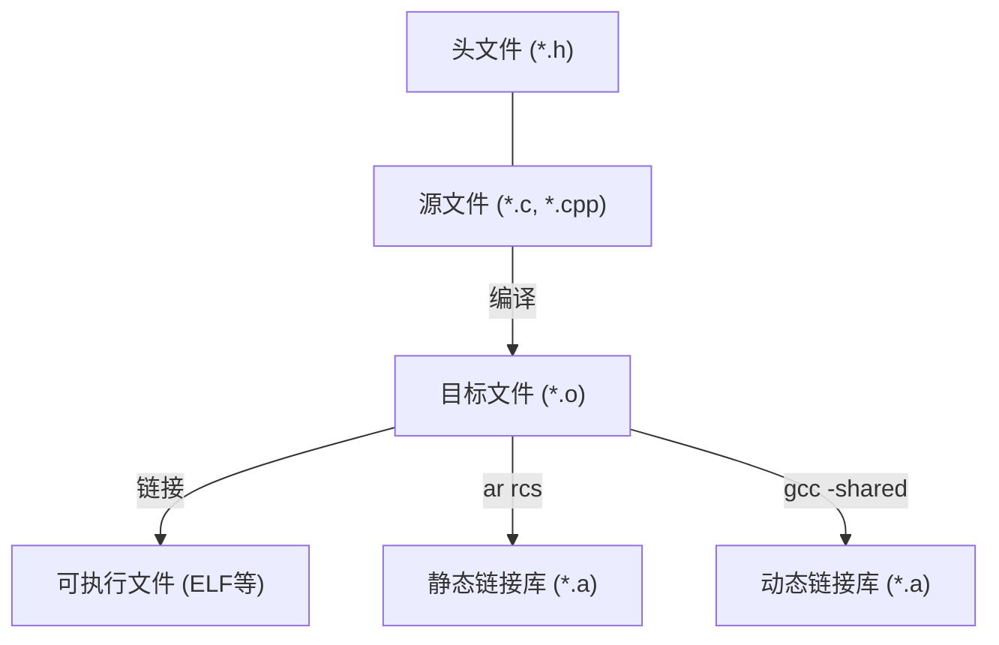
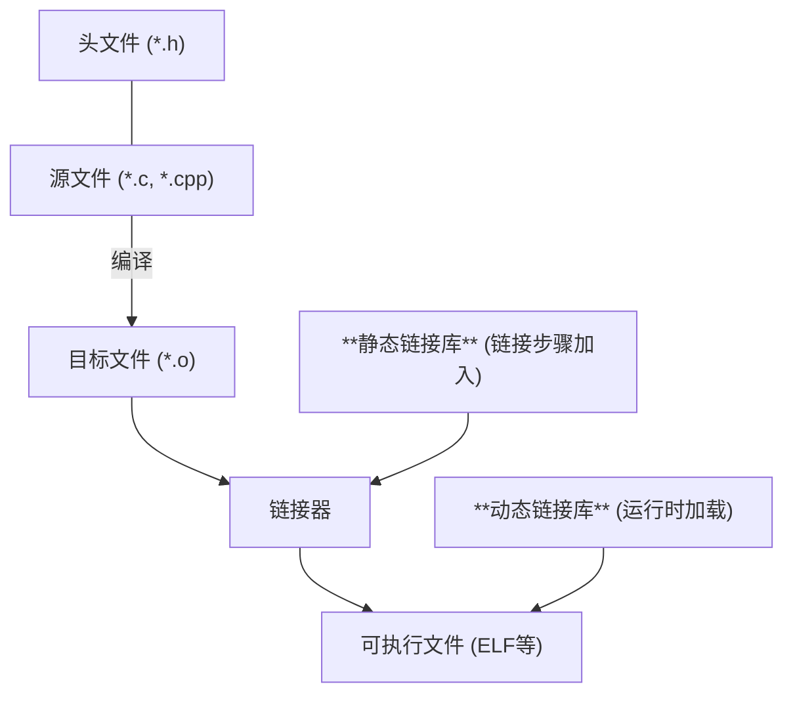

# 链接库

!!! note "主要作者"

    [@luojh][luojh]

!!! warning "本文编写中"

!!! comment "适用范围"

    本文介绍 Linux 上的**静态链接库** (一般为 `.a` 文件) 和**动态链接库** (一般为 `.so` 文件)。注意：这里的链接库是指包含了可执行二进制代码的库，并不是头文件 (Header file)、Python 库等。

## 总览

库 (Library)，是包含**可重用代码和数据**的模块。

### 构建链接库

下图给出了一般的可执行文件 (executable)、静态链接库 (static library)、动态链接库 (dynamic library) 的构建过程。



### 使用链接库

下图给出了**使用链接库**的方式。



## 源代码

对于 C 程序而言，链接库的源代码就是普通函数、变量之类，并无太多特殊要求。例如，创建并进入目录 `lib`，在 `square.c` 源文件中写一个函数 `square`

```c
int square(int x)
{
    return x * x;
}
```

对应的，需要在头文件 `square.h` 中加入这个函数的原型 (prototype)

```c
int square(int x);
```

以便其他使用链接库的程序**知道如何使用这个函数** (即使这些程序不知道函数内部的实现)。

因为链接库不是完整的、可以独立运行的程序，因此不需要入口点 (比如 `main` 函数)。

## 静态链接库

静态链接库是在**链接步骤就加入**的链接库类型。

### 构建

首先按照正常方法编译得到 `.o` 文件：

```shell
gcc square.c -c -o square.o
```

然后使用 `ar` 程序创建静态链接库 `libsquare.a`：

```shell
ar rcs libsquare.a square.o
```

注意这里的 `libsquare.a` 是命名惯例：一般静态链接库的文件名需要为 `lib<名称>.a`。

到这里就完成了静态链接库的创建。

### 使用

另一个 C 程序 `main.c` 中使用了 `square` 函数，那么首先需要包含 `square.h` 头文件，这样才能知道这个函数的原形，然后就可以正常调用了。

```c
#include <main.c>
#include "lib/square.h"

int main(void)
{
    int a;
    scanf("%d", &a);

    printf("%d^2 = %d\n", a, square(a));
    return 0;
}
```

下面的命令可以将这个程序直接编译 - 链接到可执行文件 `main` (也可以分开成单独的编译步骤、链接步骤)。

```shell
gcc main.c -L./lib -lsquare -o main
```

这里，`-L./lib` 表示要求链接器在 `./lib` 中寻找链接库，`-lsquare` 表示需要链接 `libsquare.a` 这个头文件。

编译好之后，就可以正常使用了。由于静态链接库中的代码会被直接合并到链接产生的可执行文件 `main` 中，因此运行时不需要文件 `libsquare.a`。
