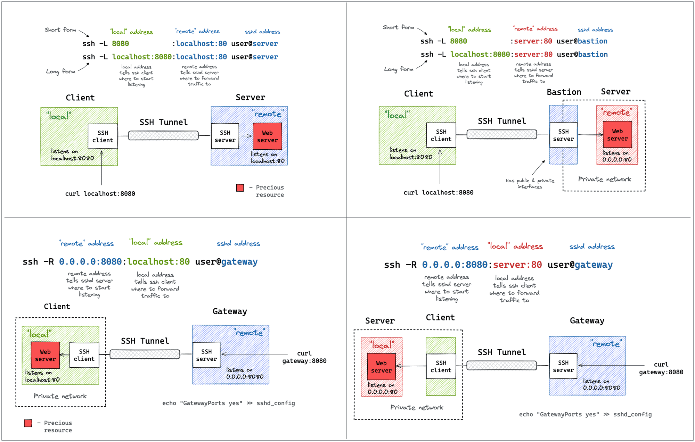

# SSH 使用技巧

!!! note "主要作者"

    [@iBug][iBug]、[@taoky][taoky]

!!! warning "本文编写中"

尽管 SSH 是一种开放协议，它的主流实现 OpenSSH 具有最丰富的功能，因此本教程只介绍 OpenSSH 的使用。

## 客户端配置 {#ssh-config}

SSH 客户端会按顺序处理以下配置，先出现的配置优先级更高：

- 命令行参数
- `~/.ssh/config`
- `/etc/ssh/ssh_config`

OpenSSH 的所有配置项都可以在 [ssh_config(5)][ssh_config.5] 中找到，这里介绍一些常用的配置。

对于经常登录的主机，可以在 `~/.ssh/config` 中配置主机别名、用户名、端口等信息，以简化登录命令。

```shell
Host example
  Hostname example.com
  User sshuser
  Port 22
```

注意 SSH config 没有提供密码配置，因为将密码存储在明文文件中是不安全的做法，请使用密钥登录。

### 公钥认证 {#public-key-authentication}

默认情况下，SSH 会寻找 `~/.ssh/id_*` 作为私钥，其中 `*` 部分可以是 `rsa`、`ecdsa`、`ed25519` 等，也可以通过 `-i` 参数指定私钥文件。私钥的文件名加上 `.pub` 后缀就是公钥文件，暂时没有方法指定公钥文件的路径。如果要在配置文件中指定一个或多个私钥，可以使用 `IdentityFile` 选项，例如：

```shell
Host example
  IdentityFile ~/.ssh/id_rsa
  #CertificateFile ~/.ssh/id_rsa-cert.pub
```

一般来说，除非为了兼容一些非常古老（如 10 年前的）或非常简单的（如嵌入式）系统而不得不使用较短的 RSA 密钥对的时候，我们推荐使用 Ed25519 密钥对，或者 ECDSA 密钥对。这两种基于椭圆曲线的密码学算法比 RSA 更安全，而且性能也更好。如果不得不使用 RSA 的话，请尽可能使用 3072 位或更长的密钥长度。密钥长度可以在使用 `ssh-keygen` 生成密钥对时指定（`-b`），其中不同算法支持与推荐的长度也是不同的：

|       算法        |    支持长度     |    推荐长度     | 说明                                                                               |
| :---------------: | :-------------: | :-------------: | ---------------------------------------------------------------------------------- |
|        RSA        |    1024-4096    |   3072 或以上   | 曾经的推荐长度是 2048 位，但 2020 年以后认为这个长度已不够安全                     |
|       ECDSA       | 256 / 384 / 521 | 256 / 384 / 521 | 由于椭圆曲线参数选择的特殊性，只有这三种长度可选。注意最后一个选项是 521，不是 512 |
|      Ed25519      |        -        |        -        | Ed25519 是基于 Edwards 曲线的算法，没有“长度”这种参数                              |

另外，较早版本的 SSH 还有 DSA 算法（公钥以 `ssh-dss` 开头），它仅有 1024 位一种长度，安全性比 RSA 还差。因此 OpenSSH 7.0 开始默认不再生成或使用 DSA 密钥，OpenSSH 9.8 开始在编译期禁用 DSA 算法，并将很快从代码库中完全移除 DSA 相关代码。

### 端口转发 {#port-forwarding}

SSH 配置 TCP 端口转发的格式为 `[bind_address:]port:host:hostport`，SSH 支持三种端口转发：

本地端口转发（**L**ocal port forwarding）

:   在本地上监听一个端口，将收到的数据转发到远程主机的指定端口。即**将远程主机上某个服务的端口转发到本地**，使本地的其他程序可以通过 SSH 访问到远程的服务。例如将远程主机的 80 端口转发到本地的 8080：

    ```shell
    ssh -L 8080:localhost:80 example
    ```

    也可以将远程主机所在网络的机器通过这种方法转发，假设需要访问的远程主机网络内部的机器名叫 `internalserver`：

    ```shell
    ssh -L 8080:internalserver:80 example
    ```

    本地端口转发默认监听在 localhost。如果要监听其他地址，可以指定需要监听的地址，例如：

    ```shell
    ssh -L 0.0.0.0:8080:localhost:80 example
    ```

    虽然 SSH 客户端也有一个 `GatewayPorts` 选项，但它只影响没有指定监听地址的语法模式（即三段式 `localport:remotehost:remoteport`）。指定四段式语法后，`GatewayPorts` 选项不再起作用。

远程端口转发（**R**emote port forwarding）

:   在远程主机上监听一个端口，将收到的数据转发到本地的指定端口。即**将本地某个服务的端口转发到远程主机上**，使远程的其他程序可以通过 SSH 访问到本地的服务。例如将本地主机的 80 端口转发到远程主机的 8080 端口：

    ```shell
    ssh -R 8080:localhost:80 example
    ```

    上面命令表示在远程主机 example 上监听 8080 端口，将收到的数据转发到本地的 80 端口。

    同样的，也可以将本地网络中的机器做转发，假设对应机器名为 `myinternalserver`：

    ```shell
    ssh -R 8080:myinternalserver:80 example
    ```

    注意远程端口转发默认只能监听 localhost。如果要监听其他地址，需要在远程主机的 `sshd_config` 中设置 `GatewayPorts yes`。与另外两种端口转发不同，客户端无法覆盖服务端的 `GatewayPorts` 设定。

    在 OpenSSH 7.6 版本之后的客户端，`-R` 也可以用来让远程主机利用本地作为 SOCKS5 代理（相当于下面的 `-D` 参数反过来），对应手册中的 `-R [bind_address:]port` 部分：

    ```shell
    ssh -R 1080 example
    # 指定远程主机上的监听地址
    ssh -R 127.0.0.1:1080 example
    ```

动态端口转发（**D**ynamic port forwarding）

:   在本地监听一个端口用作 SOCKS5 代理，将收到的数据转发到远程主机，相当于**利用了远程主机作为代理**。例如：

    ```shell
    ssh -D 1080 example
    ```

    由于 SOCKS 代理是一个通用的代理协议，因此可以用于任何 TCP 连接，不仅仅是 HTTP。

    与 LocalForward 类似，DynamicForward 也可以指定监听地址：

    ```shell
    ssh -D 0.0.0.0:1080 example
    ```

    同样地，`GatewayPorts` 只影响没有指定监听地址的语法模式（即只给出了一个端口）。指定监听地址后，`GatewayPorts` 选项不再起作用。

以上三种端口转发都可以在配置文件中指定，例如：

```shell
Host example
  LocalForward 8080 localhost:80
  LocalForward 8081 localhost:8081
  RemoteForward 8080 localhost:80
  RemoteForward 8081 localhost:8081
  DynamicForward 1080
  DynamicForward 1081
```

`-L`、`-R`、`-D` 和配置文件中对应的选项都可以多次出现，指定多条转发规则，它们互相独立、不会覆盖，因此如果重复指定了同一个端口，就会出现冲突。

本地端口转发和远程端口转发的工作模式可以结合由 Ivan Velichko 绘制的图片来理解：

[](https://iximiuz.com/ssh-tunnels/ssh-tunnels.png)

!!! tip "代理与环境变量"

    由于各种各样的原因，目前各种应用程序对代理相关的环境变量（`http_proxy`、`https_proxy`、`all_proxy`、`no_proxy`）的支持程度差异很大：

    - `http_proxy` 和 `https_proxy` 分别用于连接到 HTTP 和 HTTPS 服务器时的代理设置。**注意这和代理本身的协议无关**，一部分原因是 HTTP 是明文协议，一些代理服务器可以修改 HTTP 请求的内容，或者做缓存操作，但是 HTTPS 就不行了。
    - 环境变量是**大小写敏感**的，因此对应用程序来说，设置 `HTTP_PROXY` 和 `http_proxy` 是不一样的。几乎所有的程序都支持小写的代理环境变量，但是大写的代理环境变量支持情况就不一定了，因此推荐只设置小写的代理环境变量。
    - 不是所有程序都支持设置 SOCKS5 代理。[curl 支持](https://curl.se/libcurl/c/CURLOPT_PROXY.html) SOCKS5 代理（`socks5://` 和 `socks5h://`），其中带 `h` 的后者代表由代理（而不是本机）解析主机名。

    更多信息可参考：[We need to talk: Can we standardize NO_PROXY?](https://about.gitlab.com/blog/2021/01/27/we-need-to-talk-no-proxy/)。

### 使用代理 {#proxy}

SSH 支持自定义代理命令，从而可以通过代理服务器连接目标主机。
一个常见的用法是通过 SOCKS5 代理连接目标主机，可以借助 `nc` 命令实现[^netcat-openbsd]：

```shell
Host example
  ProxyCommand nc -X 5 -x proxy.example.com:1080 %h %p
```

  [^netcat-openbsd]: 需要使用 OpenBSD 版本的 `nc` 命令，如 `apt install netcat-openbsd`。

!!! question "让服务器的 `git` 使用本机作为代理"

    在访问 SSH remote 时，`git` 可以读取 `GIT_SSH_COMMAND` 环境变量指定的 SSH 命令，例如 `GIT_SSH_COMMAND="ssh -i .git/id_rsa" git ...` 就可以让 `git` 使用指定的路径的密钥。

    而在访问 HTTP(S) remote 时，`git` 会使用 libcurl，因此会读取 `http_proxy`、`https_proxy` 和 `all_proxy` 环境变量指定的代理。也可以使用 `http.proxy` 这个 `git config` 选项来指定。

    结合[端口转发](#port-forwarding)和[代理](#proxy)部分给出的命令，如果希望让 SSH 连接到的远程服务器上的 `git` 临时利用本机作为代理连接 SSH 和 HTTP(S) remote，那么应该如何操作？

### 跳板 {#jump-host}

SSH 支持通过跳板机连接目标主机，即先 SSH 登录 jump-host，再从 jump-host 登录目标主机。一些受限的网络环境常常采用这种方案，例如一个集群内只有跳板机暴露在公网上，而其他主机都在被隔离的内网中，只能通过跳板机访问。

`ssh` 命令的 `-J` 选项可以指定跳板机，例如：

```shell
ssh -J user@jumphost.example.com user@realhost.example.com
```

对应的配置文件语句是 `ProxyJump user@jumphost.example.com`。

如果要给跳板机设置更多参数，如端口等，则必须使用配置文件：

```shell
Host jumphost
  HostName jumphost.example.com
  User jumphostuser
  Port 2333

Host realhost
  HostName realhost.example.com
  User realhostuser
  ProxyJump jumphost
```

!!! note "跳板机需要支持 TCP 端口转发"

    SSH 跳板机和前文所述的“**本地**端口转发”采用相同的技术，因此跳板机需要允许 TCP 端口转发（默认开启）。

### 高级功能：连接复用 {#connection-reuse}

SSH 协议允许在一条连接内运行多个 channel，其中每个 channel 可以是一个 shell session、端口转发、scp 命令等。OpenSSH 支持连接复用，即一个 SSH 进程在后台保持连接，其他客户端在连接同一个主机时可以复用这个连接，而不需要重新握手认证等，可以显著减少连接时间。这在频繁连接同一个主机时非常有用，尤其是当主机的延迟较大、常用操作所需的 RTT 较多时（例如从 GitHub 拉取仓库，或者前文所述的跳板机使用方式）。

启用连接复用需要在配置文件中同时指定 `ControlMaster`、`ControlPath` 和 `ControlPersist` 三个选项（它们的默认值都是禁用或者很不友好的值）：

```shell
Host *
  ControlMaster auto
  ControlPath /tmp/sshcontrol-%C
  ControlPersist yes
```

其中 `%C` 是 `%l%h%p%r` 的 hash，因此连接不同主机的 control socket 不会冲突。
**但是**如果你尝试用相同的用户名和不同的公钥连接同一个目标（例如 `git@github.com`），由于没有新建连接的过程，你指定的公钥并不会生效。
解决此问题的方法是再单独指定另一个 `ControlPath`，或者设置 `ControlPath=none` 暂时禁用连接复用功能。

## 文件传输 {#file-transfer}

SFTP（Secure File Transfer Protocol）和 SCP（Secure Copy Protocol）都是基于 SSH 的另一种文件传输工具，它用于在本地和远程系统之间安全地复制文件。SCP 功能相对简单，主要提供文件的复制功能。SFTP 是一个独立的协议，建立在 SSH 之上，提供了一个交互式文件传输会话和更丰富的文件操作功能，包括对文件的浏览、编辑和管理。

!!! tip "Rsync"

    SCP 和 SFTP 能够提供的文件传输功能较为基础。如果你需要更多的功能，例如增量传输、断点续传、文件校验等，可以考虑使用 Rsync。Rsync 可以使用 SSH 作为传输层，因此可以替代 `scp` 命令。

    详情可以参考[本教程关于 Rsync 的章节](../ops/storage/backup.md#rsync)。

### SCP

SCP 是基于 SSH (Secure Shell) 协议的文件传输工具，它允许用户在本地和远程主机之间安全地复制文件。SCP 使用 SSH 进行数据传输，提供同 SSH 相同级别的安全性，包括数据加密和用户认证。

SCP 命令的基本语法如下：

```shell
scp [选项] [源文件] [目标文件]
```

其中，源文件或目标文件的格式可以是本地路径，或者远程路径，如 `用户名@主机名:文件路径`。

#### 文件复制 {#scp-files}

从本地复制到远程服务器

```shell
scp /path/to/local/file username@remotehost:/path/to/remote/directory
```

或从远程服务器复制到本地

```shell
scp username@remotehost:/path/to/remote/file /path/to/local/directory
```

这个命令会提示您输入远程主机上用户的密码，除非您已经设置了 SSH 密钥认证。

!!! tip

    你可以一次性传输多个文件或目录，将它们作为源路径的参数。例如：

    ```shell
    scp file1.txt file2.txt username@remotehost:/path/to/remote/directory
    ```

或者经过本地流量中转，在两个远程主机之间复制文件

```shell
scp username1@remotehost1:/path/to/remote/file username2@remotehost2:/path/to/remote/directory
```

#### 常用参数 {#scp-parameters}

复制目录

:   如果需要复制整个目录，需要使用 `-r` 选项，这表示递归复制：

    ```shell
    scp -r /path/to/local/directory username@remotehost:/path/to/remote/directory
    ```

使用非标准端口

:   如果远程主机的 SSH 服务运行在非标准端口（22），则可以使用 `-P` 选项指定端口：

    ```shell
    scp -P 2222 /path/to/local/file username@remotehost:/path/to/remote/directory
    ```

    !!! tip

        你也可以在 SSH 客户端配置文件中为 `Host remotehost` 指定 `Port 2222`，这样就不需要每次在命令行中指定端口了。

限制带宽

:   使用 `-l` 选项可以限制 SCP 使用的带宽，单位是 `Kbit/s`：

    ```shell
    scp -l 1024 /path/to/local/file username@remotehost:/path/to/remote/directory
    ```

保留文件属性

:   `-p` 选项可以保留原文件的修改时间和访问权限：

    ```shell
    scp -p /path/to/local/file username@remotehost:/path/to/remote/directory
    ```

开启压缩

:   使用 `-C` 选项开启压缩，可以减少传输数据量并提升传输速度，特别对于文本文件效果显著。

    ```shell
    scp -C /path/to/local/file username@remotehost:/path/to/remote/directory
    ```

    !!! tip

        此选项等价于 `ssh` 的 `-C` 选项，即在 SSH 层面开启压缩，并非 SCP 协议层面的压缩。

        你也可以在 SSH 客户端配置文件中为 `Host remotehost` 指定 `Compression yes`，这样就不需要每次在命令行中启用压缩了。

!!! tip "现代的 `scp` 命令已经默认使用 SFTP 协议"

    从 OpenSSH 9.0 开始，`scp` 命令已经默认使用 SFTP 协议进行文件传输，而不再使用旧的 SCP 协议。对于一些不支持 SFTP 的远程主机（如使用 dropbear 的嵌入式设备或上古版本的 SSH 服务端等），这可能会导致问题，例如：

    ```text
    /usr/libexec/sftp-server: No such file or directory
    ```

    如果你需要使用旧的 SCP 协议，可以使用 `-O` 选项：

    ```shell
    scp -O /path/to/local/file username@remotehost:/path/to/remote/directory
    ```

### SFTP

SFTP 是一种安全的文件传输协议，它在 SSH 的基础上提供了一个扩展的功能集合，用于文件访问、文件传输和文件管理。与 SCP 相比，SFTP 提供了更丰富的操作文件和目录的功能，例如列出目录内容、删除文件、创建和删除目录等。由于 SFTP 在传输过程中使用 SSH 提供的加密通道，因此它能够保证数据的安全性和隐私性。

#### 启动 SFTP 会话 {#start-sftp}

要连接到远程服务器，可以使用以下命令：

```shell
sftp username@remotehost
```

如果远程服务器的 SSH 服务使用的不是默认端口（22），可以使用 `-P` 选项指定端口：

```shell
sftp -P 2233 username@remotehost
```

#### 文件和目录操作 {#sftp-operations}

- `ls`：列出远程目录的内容。
- `get remote-file [local-file]`：下载文件。
- `put local-file [remote-file]`：上传文件。
- `mkdir directory-name`：创建远程目录。
- `rmdir directory-name`：删除远程目录。
- `rm file-name`：删除远程文件。
- `chmod mode file-name`：改变远程文件的权限。
- `pwd`：显示当前远程目录。
- `lpwd`：显示当前本地目录。
- `cd directory-name`：改变远程工作目录。
- `lcd directory-name`：改变本地工作目录。

#### 退出 SFTP 会话 {#exit-sftp}

输入 `exit` 或 `bye` 来终止 SFTP 会话。

!!! 使用脚本进行自动化操作

    通过创建一个包含 SFTP 命令的批处理文件，你可以 让SFTP 会话自动执行这些命令。例如，你可以创建一个文件 `upload.txt`，其中包含以下内容：

    ```shell
    put file1.txt
    put file2.jpg
    put file3.pdf
    quit
    ```
    然后使用命令 `sftp -b upload.txt username@remotehost` 来自动上传文件。

## 服务端配置 {#sshd-config}

服务端的配置与客户端有一些不同点：

- sshd 服务端程序只有很少量的命令行参数，各种配置都在配置文件中完成。特别注意，sshd 的配置文件不是可选的：如果配置文件不存在或者包含错误，sshd 会拒绝启动。
- sshd 仅有一个配置文件 `/etc/ssh/sshd_config`，它的配置项可以在 [sshd_config(5)][sshd_config.5] 中找到。

sshd 接受 SIGHUP 信号作为重新载入配置文件的方式。`sshd -t` 命令可以检查配置文件的语法是否正确，这也是大多数发行版提供的 `ssh.service` 中指定的 `ExecStartPre=` 命令和第一条 `ExecReload=` 命令，即在尝试启动和重新加载服务前先检查配置文件的语法。

### authorized_keys 文件 {#authorized-keys}

`~/.ssh/authorized_keys` 文件是 SSH 服务端用于验证客户端公钥的文件，每行一个公钥，空行或者以 `#` 开头的行会被当作注释忽略。

`authorized_keys` 文件还允许为每个公钥指定一些选项，例如：

`from="192.0.2.0/24,2001:db8::/32"`

:   限制此公钥只能从指定的 IP 地址连接。

`expiry-time="197001010800Z"`

:   限制此公钥的有效时间，格式为 `YYYYMMDDhhmm`（服务器的本地时间），或者在其后添加一个大写字母 Z 表示 UTC 时间。适合用于添加临时用途的公钥，确保即使事后忘记删除了，它也不会超期生效。

`command="/path/to/command"`

:   限制此公钥只能用于执行指定的命令，且不能登录 shell。如果使用此公钥登录时提供了额外的命令（例如 `ssh user@host some/other/command`），提供的命令将会在 `SSH_ORIGINAL_COMMAND` 环境变量中传递给指定的命令。

    指定命令的一个常用场景是为备份服务提供有限的访问，例如 `command="/usr/bin/rrsync /path/to/backup"`，这样备份服务就只能使用 rsync 命令访问指定的目录。

    如果你需要使用 `command=` 的话，你很可能也需要 `restrict`（见下）。

`no-port-forwarding`, `no-X11-forwarding`, `no-agent-forwarding`, `no-pty`, `no-user-rc`

:   禁止对应的功能。这些选项可以用于限制公钥的功能，例如禁止各种转发和使用终端等。

    特别地，禁止 TCP 端口转发之后，该公钥也不能用于将本机作为跳板机登录其他机器（即 `-J` 参数或 `ProxyJump` 配置项）。

`restrict`

:   禁止所有可选功能，相当于同时使用上一条列出的（和没列出的，详情见 man page）所有选项。

    通常与 `command=` 搭配使用，确保指定公钥只能做指定的事情。

    如果需要在 `restrict` 的基础上单独开放某些功能，可以使用 `port-forwarding` 等（也就是去掉前面的 `no-`）。

完整的选项列表可以在 [sshd(8)][sshd.8] 的 `AUTHORIZED_KEYS FILE FORMAT` 部分找到。

??? example "例：用于备份 LUG FTP 的公钥配置"

    ```shell
    restrict,from="192.0.2.2",command="/usr/bin/rrsync -ro /mnt/lugftp" ssh-rsa ...
    ```

## SSH 证书 {#certificates}

OpenSSH 支持使用证书作为客户端和服务端的身份验证方式，即在正确配置了证书的情况下，客户端无需预先记录服务器的公钥（即加入 `known_hosts` 文件）即可信任 SSH 服务端，而服务端也无需预先记录客户端的公钥（即写入对应用户的 `authorized_keys` 文件）即可确认登录者的身份。使用证书进行 SSH 身份验证有以下好处：

- 对于服务器和客户端（或用户）数量较多的场景，通过签署证书的方式可以大大降低配置复杂度，且容易管理登录授权的分配情况。
    - 如果客户端被允许自行修改 `authorized_keys` 文件，则其仍然能够添加其他公钥用于登录已授权的服务端，绕过采用证书认证的管理目的。请根据实际情况决定是否需要禁止客户端自行修改 `authorized_keys` 文件。

        提示：SSH 服务端具有 `AuthorizedKeysFile` 设置项，其默认值为 `.ssh/authorized_keys`。

- 默认情况下，SSH 服务端会在日志中记录登录时所用的证书的“主体”与编号，即签发证书时 `-I` 与 `-z` 参数的值，这使得管理员能够更方便地追踪客户端密钥对的使用情况。
- 相比于 `authorized_keys` 文件，签发证书时能够更方便地指定一些与公钥相关的参数，如有效期（`-V` 参数）等。
- 相比于使用私钥登录的场景，签发证书的过程可以离线进行，提升 CA 私钥的安全性。

使用证书认证方案时的注意事项：

- SSH 证书没有 X.509 证书的链式结构，即 SSH 证书没有“中间 CA”的概念，CA 的身份由**公钥**唯一确定，因此所有的 CA 都是根 CA。一旦 CA 的私钥发生泄露，需要立刻在所有机器上删除对应的 CA 公钥配置。这对 SSH CA 的密钥管理提出了更高的要求。
- SSH 证书没有自动更新 CRL 的机制，证书的撤销依赖于管理员自行维护“公钥吊销列表”（Key Revocation List，KRL）文件，因此如果已获得签发证书的对应私钥发生泄露，也需要维护 KRL 直到对应证书过期。

    特别地，如果发生泄露的证书未设置有效期，则其是无限期有效的，对应的已泄露的私钥也需要无限期地记录在所有信任此证书的服务器的 KRL 中，这可能会带来一定的管理负担。因此我们推荐为所有的客户端证书指定有效期，**从不**签发无限期有效的客户端证书。

总的来说，对于中小规模的社团和实验室服务器管理场景，（对管理员）使用 SSH 证书认证是个较为方便易用的方式。

与 X.509 证书类似，客户端通过证书信任服务端和服务端通过证书认证客户端是两件独立的事，在实际应用中也可以根据需求使用同一个 CA 或分别使用不同的 CA。

### 创建 SSH CA {#ssh-ca}

前文提到，SSH CA 的身份由**公钥**唯一确定，因此一对普通的 SSH 密钥对就是一个 SSH CA 所需的全部内容，不像 X.509 需要再进一步为根 CA 产生一个自签名证书。此处引用创建 SSH 密钥对的命令：

```shell
ssh-keygen -f my_ca [-t ed25519] [-C 'My CA'] [-N 'my-ca-p@ssw0rd']
```

注意到尽管 `-t`、`-C` 和 `-N` 参数都是可选的[^filename-is-optional]，为了便于辨认 CA 和提高安全性，我们强烈建议采用先进的密码学算法（Ed25519）、指定可读的备注文字和为私钥设置密码。

  [^filename-is-optional]: 事实上 `-f` 参数也是可选的，但为了避免 `ssh-keygen` 将其放置在 `~/.ssh` 目录下，从而更容易与个人用于登录服务器的私钥混淆，此处显式指定了输出文件名。

生成密钥对后，请保管好 `my_ca` 私钥文件，然后即可将 `my_ca.pub` 公钥文件复制或公开传播了。

### 服务端证书 {#server-certificates}

首先，客户端需要信任 CA 签发的证书，方法是在 `known_hosts` 文件中加入 CA 的公钥，并在公钥前添加选项 `@cert-authority *`，例如；

```text title="~/.ssh/known_hosts"
@cert-authority * ssh-ed25519 AAAAC3N... My CA
```

对于实验室等公用机器的场景，也可以将 CA 条目配置在 `/etc/ssh/ssh_known_hosts` 文件中，其会对所有用户生效，而无需再为每个用户单独配置。

### 客户端证书 {#client-certificates}

首先为服务端配置 CA 信任，需要在服务端建立一个“信任 CA 列表”文件。其采用通常的 `authorized_keys` 格式，即每行一个公钥。我们建议使用一个约定俗成、易于辨认的路径 `/etc/ssh/ssh_user_ca`：

```text title="/etc/ssh/ssh_user_ca"
ssh-ed25519 AAAAC3N... My org CA
```

## 杂项 {#misc}

### 拆分配置文件 {#include}

从 OpenSSH 7.3p1 开始，ssh_config 和 sshd_config 都支持 `Include` 选项，可以在主配置文件中 include 其他文件。与 C 的 `#include` 或 Nginx 的 `include` 不同，SSH config 里的 `Include` **不**等价于文本插入替换，并且 `Include` 可以出现在 `Host` 和 `Match` 块中，出现在这两个块中的 `Include` 会被视作条件包含。因此一个（不太常见的）坑是：

??? failure "错误写法"

    ```shell
    Host example
      HostName example.com
      User user

    Include ~/.ssh/global.conf
    ```

因为 SSH 读取配置文件时是不会看缩进的，因此上面示例中的 Include 仅对 `Host example` 生效。正确的写法是将其放在一个 `Match all` 块（或者 `Host *`）中：

??? success "正确写法"

    ```shell
    Host example
      HostName example.com
      User user

    Match all
      Include ~/.ssh/global.conf
    ```

更加推荐的写法是将 `Include` 放在配置文件开头：

!!! success "推荐写法"

    ```shell
    Include ~/.ssh/global.conf

    Host example
      HostName example.com
      User user
    ```

### 一些坑点 {#traps}

在 OpenSSH 内部，同一个“代号”可能指代多种（有关联但）不同的细节。例如 `ssh-rsa` 至少有以下三种不同的含义：

- RSA 密钥对或 RSA 公钥算法（`id_rsa` 和 `id_rsa.pub` 文件）
- 基于 RSA / SHA-1 的 SSH 证书的签名算法（`CASignatureAlgorithms`）

  这种算法已经在 OpenSSH 8.2 中被淘汰，而 OpenSSH 7.2 起就已经支持替代算法 `rsa-sha2-256` 和 `rsa-sha2-512`（采用 SHA-256 和 SHA-512 哈希算法），虽然直到 OpenSSH 8.2，使用 RSA CA 私钥签出来的证书才**默认**采用 `rsa-sha2-512` 算法。

  如果你正在使用一个 RSA CA，那么你需要将已有的证书使用 OpenSSH 8.2 以上的版本重新签名。

  如果需要临时兼容 &le; 7.1 版本的 OpenSSH，可以在 `~/.ssh/config` 或 `sshd_config` 中指定 `CASignatureAlgorithms +ssh-rsa`，这样就可以使用旧版本的证书签名算法了。

- 基于 RSA / SHA-1 的公钥签名算法套件（`ssh-rsa`）。与前面的证书不同，这种签名算法是用于用户登录时的公钥验证，不会保存在文件里，而是在 SSH 协议内部使用。

  与前一个采用 SHA-1 作为哈希算法的算法套件类似，OpenSSH 8.8 起也不再默认启用，且替代算法也分别叫做 `rsa-sha2-256` 和 `rsa-sha2-512`。好消息是，你不需要重新签发任何证书，只要确保客户端和服务端的 OpenSSH 版本都不低于 7.2 就可以了。

  如果需要临时兼容 &le; 7.1 版本的 OpenSSH，可以通过配置选项 `HostkeyAlgorithms` 和 `PubkeyAcceptedAlgorithms` 启用。这两个选项分别控制服务端和客户端的公钥签名算法套件，并且在两端都可以指定。
