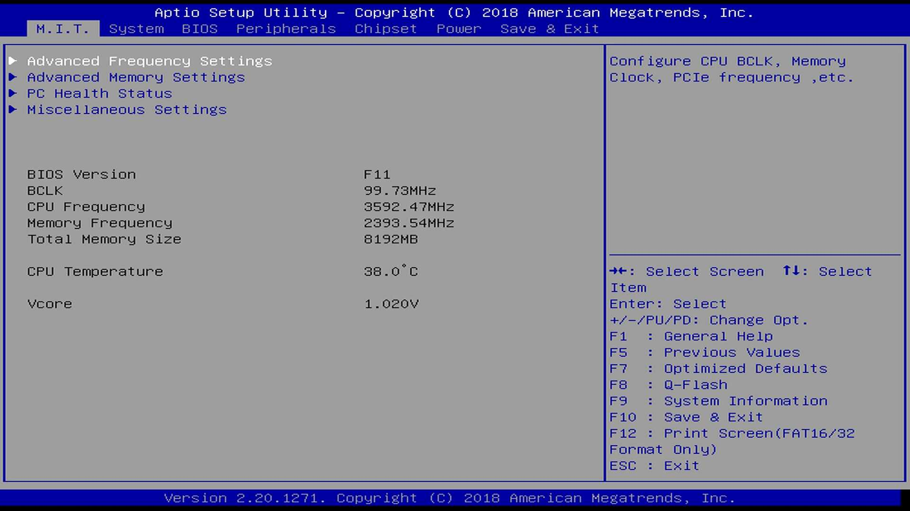
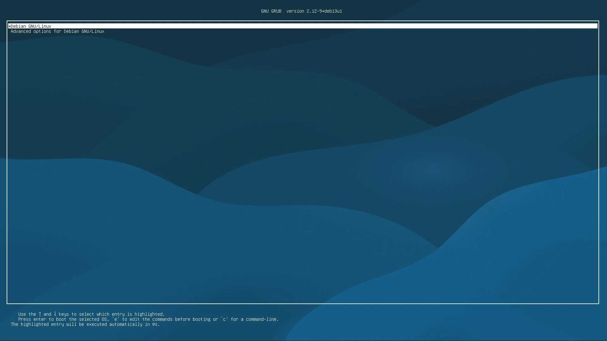
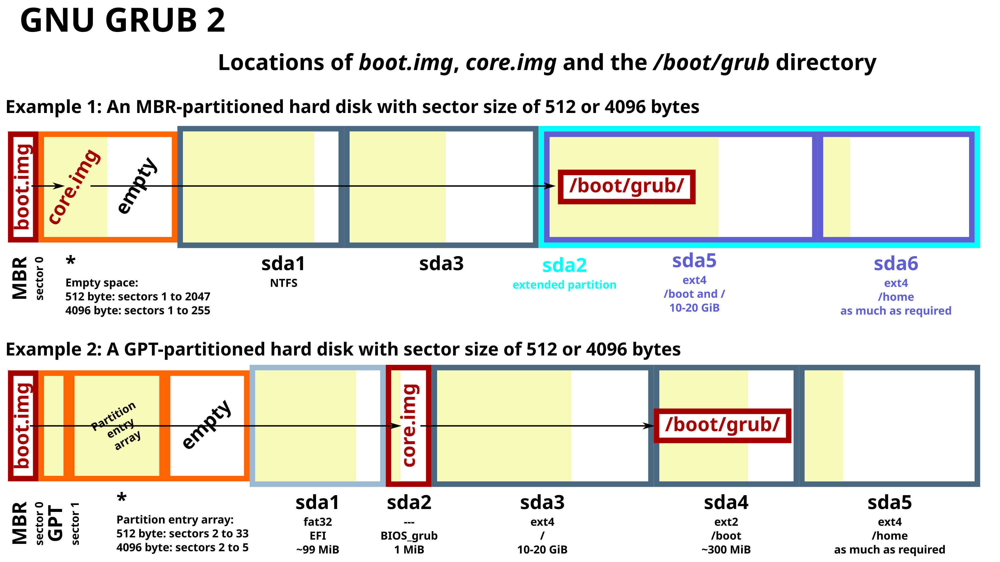
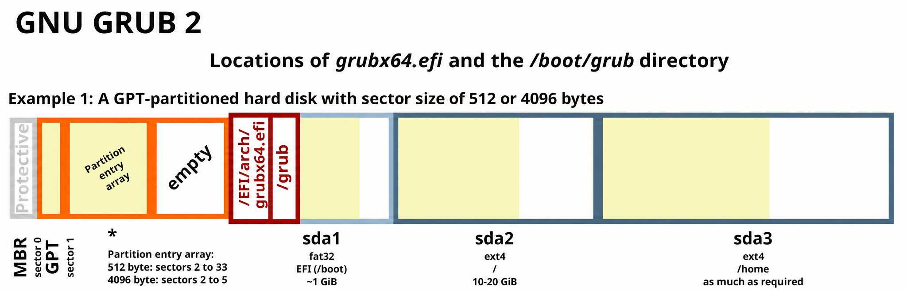

# 启动程序

!!! note "主要作者"

    [@Vertsineu][Vertsineu]、[@iBug][iBug]

!!! warning "本文编写中"

## 一般启动过程 {#general-booting-process}

常见的 x86 平台下 Linux 系统的启动过程一般可以划分为以下几个阶段：

- Firmware（固件）：计算机上电后最先执行的程序，负责硬件自检和初始化，并将控制权移交给 Bootloader。
- Bootloader（引导加载程序）：负责加载操作系统内核到内存，并将控制权移交给 Kernel。
- Kernel（内核）：负责内核空间（Kernel Space）的初始化，比如初始化中断例程、加载驱动、挂载根文件系统等，并最终启动 `init` 进程。
- Init（初始程序）：负责用户空间（User Space）的初始化，启动各种系统服务，比如 getty（tty 终端服务）、sshd（SSH 服务）乃至图形界面等。

其中，Kernel 和 Init 阶段都属于 OS（操作系统）的启动过程，而 Firmware 和 Bootloader 阶段则独立于 OS 之外，属于计算机平台的启动过程。

其他平台（如 ARM、RISC-V）或其他系统（如 BSD、Windows）虽然在细节上有所不同，但整体的启动流程大体类似。

## Firmware {#firmware}

固件（Firmware）是计算机上电后最先执行的程序，存储在主板上的只读存储器（ROM / Flash / EEPROM 等）中，负责硬件自检和硬件初始化，并最终将控制权移交给 Bootloader。常见的 PC 和服务器上的固件主要有两种实现：传统的 BIOS 和现代的 UEFI。

### BIOS {#bios}

BIOS（Basic Input/Output System，基本输入/输出系统）最初是 IBM PC 的专有固件，但是由一些公司（如 Compag、Phoenix、AMI 等）进行逆向工程，创建了兼容 BIOS 的 IBM PC 兼容机。此后，BIOS 接口成为 PC 兼容机的事实标准，被广泛采用并沿用至今。

!!! tip "BIOS is not BIOS"

    需要注意的是，我们日常口头上说的 BIOS 其实大部分情况下指的是广义上的 BIOS，不仅包括传统的 IBM PC 兼容机上的 BIOS 实现，还包括基于 UEFI 规范实现的 UEFI BIOS 。真正意义上的传统 BIOS 已经逐渐被淘汰，现代计算机上更多使用的是基于 UEFI 规范的 BIOS 实现。

    本文中所指的 BIOS 均指传统的 IBM PC 兼容机上的 BIOS 实现。

BIOS 固件会根据设置，加载启动盘上的 MBR（Master Boot Record，即磁盘的第一个扇区），并执行存储在 MBR 中的启动代码。
通常来说，MBR 中存储的 446（或低至 434）字节代码会扫描盘上的分区，找到唯一一个被标记为「活动」（active）的分区，并执行该分区中存储的启动代码（Partition Boot Record，PBR）。
在 BIOS 启动模式下，MBR 和 PBR 即是下一节所述的 Bootloader。
因此，BIOS 启动模式也经常被称作「MBR 启动模式」。

#### Setup Utility {#bios-setup-utility}

原始的 IBM PC 的 BIOS 固件没有交互式用户界面，BIOS 设置选项是通过主板上的开关和跳线设置的。
而从 1990 年代中期开始，BIOS 固件通常会包含一个 BIOS 设置实用程序（BIOS Setup Utility），通过系统启动时按下特定的按键（如 F2、Del 等）进入。
用户可以在其中通过键盘设置系统配置选项，比如启动优先级，CPU 频率，内存时序等。

以下是一个典型的 BIOS 设置实用程序的界面截图：


BIOS 设置实用程序
{: .caption }

### UEFI {#uefi}

UEFI（Unified Extensible Firmware Interface，统一可扩展固件接口）严格来说并不是一个固件实现，而是一套**固件接口规范**，由 UEFI Forum 负责维护（前身是 Intel 于 1998 年发布的 EFI 规范）。

UEFI 规范定义了固件与上层程序（Bootloader、OS 等）之间的标准接口，使得 Bootloader 和操作系统无需关心底层的具体硬件架构，从而实现跨平台的可移植性。

UEFI 规范下的计算机启动过程分为以下几个阶段：

- SEC (Security Phase)：主要功能有充当系统软件信任根（Root of Trust）、利用 CPU 缓存初始化临时内存等
- Pre-EFI Initialization (PEI)：主要功能有初始化永久内存（DRAM）、提供最小硬件初始化等
- Driver Execution Environment (DXE)：主要功能有初始化剩余硬件、实现完整的 UEFI Services 等
- Boot Device Selection (BDS)：主要功能有选择启动设备、选择是否进入 Setup Utility 等
- Transient System Load (TSL)：对应于 Bootloader 阶段，提供 Boot Services 和 Runtime Services 两类服务
- Runtime (RT)：对应于 OS 运行阶段，Boot Services 被销毁，只保留 Runtime Services 供操作系统调用（比如 NVRAM 的访问和设置等）

其中，前四个阶段，即 SEC、PEI、DXE 和 BDS 阶段被统称为 Platform Initialization（PI），即平台初始化，由 UEFI Platform Initialization 规范文件[^uefi-pi]定义；而 UEFI 为 TSL 和 RT 阶段提供的 Service 和 Protocol 等接口标准则在 UEFI 规范文件[^uefi-spec]中定义。

[^uefi-pi]: <https://uefi.org/sites/default/files/resources/UEFI_PI_Spec_Final_Draft_1.9.pdf>
[^uefi-spec]: <https://uefi.org/sites/default/files/resources/UEFI_Spec_Final_2.11.pdf>

与 BIOS 通过 MBR 和 PBR 来加载 Bootloader 的方式不同，UEFI 固件会在 BDS 阶段运行一个 Boot Manager 程序，用于加载和执行 UEFI Image、UEFI Application、UEFI OS Loader（Bootloader）、UEFI Drivers 等 UEFI 规定的可加载文件类型。

Boot Manager 通过读取 NVRAM（Non-Volatile Random Access Memory）中的 Boot Option（启动项）来确定要加载哪个文件（通常以 .efi 结尾）作为 Bootloader。

对于已经以 UEFI 方式启动的 Linux 系统，使用 `efibootmgr` 命令可以查看 NVRAM 中所有的 Boot Option 的信息：

```console
$ sudo efibootmgr
BootCurrent: 0000
Timeout: 1 seconds
BootOrder: 0000,0002
Boot0000* debian	HD(1,GPT,7c003990-9d67-48fb-b6c9-f44a4577cd5f,0x800,0x100000)/File(\EFI\DEBIAN\GRUBX64.EFI)
Boot0002  UEFI: Built-in EFI Shell	VenMedia(0784776a-4a9c-48cb-872c-8bde289ba9e8)0000424f
```

在以上示例中，UEFI 固件会从分区 GUID 为 `7c003990-9d67-48fb-b6c9-f44a4577cd5f` 的分区中加载 `\EFI\DEBIAN\GRUBX64.EFI` 文件作为 Bootloader。你可以观察 `blkid` 命令的输出，寻找 `PARTUUID=` 匹配的分区。

#### Setup Utility {#uefi-setup-utility}

UEFI 固件通常也包含设置实用程序（Setup Utility），用户可以在其中设置系统配置选项，比如启动优先级，CPU 频率，内存时序等。UEFI 设置实用程序的界面通常比 BIOS 设置实用程序更加现代化和友好，支持鼠标操作和图形界面。

UEFI 设置实用程序通常是在 DXE 阶段被加载，而在 BDS 阶段通过判断用户是否按下特定的按键（如 F2、Del 等）来决定是否进入设置实用程序。

以下是一个看上去有点老旧的 UEFI 设置实用程序的界面截图：



UEFI 设置实用程序
{: .caption }

## Bootloader {#bootloader}

Bootloader（引导加载程序）通常存储在可引导设备（如硬盘、U 盘、光盘等）的特定位置（如 MBR、GPT 分区表中的 EFI System Partition 等）中，负责加载操作系统内核到内存，并将控制权移交给 Kernel。

通常，对于 Linux 系统来说，Bootloader 还需要将 initrd / initramfs（初始内存盘）加载到内存，并将相关信息（如内核命令行参数、initramfs 的位置等）传递给 Kernel，里面包含了内核启动所需的各种驱动和工具，帮助内核完成系统的初始化过程。

!!! question "为什么需要 Bootloader？"

    一个很自然的问题是，为什么需要 Bootloader？为什么不直接让 Firmware 加载 Kernel 呢？

    这是因为，Firmware 的设计目标只是去初始化硬件并提供一个基本的运行环境，它需要尽可能不去关心上层运行的程序是什么样的，不论是一个 Linux 系统，还是一个 Windows 系统，又或者只是一个运行在裸机上的打印 Hello World 到屏幕上的简单程序。

    而 Bootloader 的设计目标则是去负责初始化操作系统所需要的**初始状态**，比如对于 Linux 系统来说，Kernel 和 initramfs 需要被加载进内存，需要在指定位置填写好内核参数从而指定某些内核功能的启用等等。这些都需要一个单独的程序来完成，靠 Firmware 是无法胜任的。

### GRUB

GRUB（GRand Unified Bootloader）是目前应用最广泛的 Linux bootloader，同时支持 BIOS 启动模式和 UEFI 启动模式，并且以 BIOS 模式启动时 GRUB 可以被安装在 GPT 分区表中。

GRUB 以「模块」的方式支持丰富多样的启动方式，包括各种分区及 RAID 配置形式，或者通过 TFTP 或 HTTP 从网络中加载文件，甚至还能提供图形化的启动界面（例如 [Minecraft 风格的自定义 GRUB 主题](https://github.com/Lxtharia/minegrub-theme)）。这些模块通常存储在 `/usr/lib/grub` 下，并会在安装 GRUB 时被复制到 `/boot` 下。

以下是一个 GRUB 启动界面的示例：



一个装有 Debian GNU/Linux 系统的 GRUB 启动界面示例
{: .caption }

!!! bug "GRUB 的模块是独立的实现"

    需要注意的是，GRUB 的模块一般不依赖上游软件，也没有采用上游软件的实现方式，而是将各种功能重新独立地实现了一遍。
    这在上游软件的复杂度提升时尤其容易产生问题，一个典型的例子是 [GRUB 不支持 ZFS `dnodesize=auto`](https://www.reddit.com/r/zfs/comments/g9mtll/linux_zfs_root_issue_grub2_hates_dnodesizeauto/)。
    因此许多 ZFS 用户为了保证系统能够正常启动，会为 `/boot` 划分一个独立的分区，采用 ext4 文件系统。

    另一个例子是 USTC 镜像站在初次配置 LVMcache 之后就<s>倒闭了</s>无法启动了，原因是 LVM 在启用了 cache 或 raid 等高级功能后出现了更加复杂的 metadata 数据结构，而 GRUB 解析 LVM metadata 的实现并没有考虑到这种情况。
    我们最终[自己 patch 了 GRUB][taoky-patch]，并沿用此版本的 GRUB 直到多年后[再次迁移回 ZFS](https://lug.ustc.edu.cn/planet/2024/12/ustc-mirrors-zfs-rebuild/)。

  [taoky-patch]: https://github.com/taoky/grub/commit/85b260baec91aa4f7db85d7592f6be92d549a0ae

在 BIOS 启动模式下，磁盘的第一个分区通常从 1 MiB 的位置开始，此时磁盘开头的前 1 MiB 空间就可以用于写入 GRUB 的启动代码。
这部分代码通常包含了 FAT 和 ext4 分区格式的支持，因此 GRUB 可以继续从这些格式的分区中读取配置文件、Linux 内核或更多的 GRUB 模块。

如下图 Example 1 所示，在 sda1 前预留的 1 MiB 空间存放着 GRUB 的 `boot.img` 和 `core.img` 两个文件，其中 `boot.img` 存放在 MBR 中，`core.img` 存放在 MBR 后的 512 字节到 1 MiB 的空间中。

Debian 官方构建的 cdimage 情况相似，只不过从 1 MiB 的位置开始的分区是一个类型为 BIOS boot 的分区，大小为 3 MiB。
该分区的作用与「在第一个分区前留出 1 MiB 的空间」相同，即用于存储 GRUB 代码。
由于「预留 1 MiB 空间」是一项现代的约定俗成的做法，显式的 BIOS boot 分区的一个优势就是避免这部分预留空间被不遵守这一项约定俗成的软件给误操作破坏掉，导致系统无法启动。
例如，许多较旧的分区软件会将第一个分区的开始位置设置为 LBA 32（16 KiB），甚至 LBA 1（紧跟 MBR 后）。

如下图 Example 2 所示，因为 GPT 分区表占据了 MBR 后的空间，约定俗成的「预留 1 MiB 空间」的规定被打破了，因此 GRUB 的 `core.img` 就被存放在一个单独的名为 BIOS_grub 的 1 MiB 的分区中。



GRUB 在 BIOS 启动模式下的分区布局示例[^grub-bios-partition-layout]
{: .caption }

[^grub-bios-partition-layout]: <https://en.wikipedia.org/wiki/File:GNU_GRUB_components.svg>

在 UEFI 启动模式下，GRUB 通常位于 EFI 系统分区的 `\EFI\debian\grubx64.efi` 位置。其他发行版也可能为中间一层目录使用其他名称，例如 `\EFI\ubuntu\grubx64.efi`。

如下图的 Example 1 所示，GRUB 不再使用 `boot.img` 和 `core.img` 分阶段加载的方式，而是直接通过 `/EFI/arch/grubx64.efi` 这个单一的文件被 UEFI 加载执行。



GRUB 在 UEFI 启动模式下的分区布局示例
{: .caption }

### systemd-boot

## initramfs

### initramfs-tools

### dracut

### UKI

## init 进程

`init` 进程是 Linux 启动时运行的第一个进程，负责启动系统的各种服务并最终启动 shell。传统的 init 程序位于 `/sbin/init`，而现代发行版中它一般是指向 `/lib/systemd/systemd` 的软链接，即由 systemd 作为 PID 1 运行。

PID 1 在 Linux 中有一些特殊的地位：

- 不受 `SIGKILL` 或 `SIGSTOP` 信号影响，不能被杀死或暂停。类似地，即使收到了其他未注册的信号，默认行为也是忽略，而不是结束进程或挂起。
- 当其他进程退出时，这些进程的子进程会由 PID 1 接管，因此 PID 1 需要负责回收（`wait(2)`）这些僵尸进程。

### systemd

### 其他 init 系统
