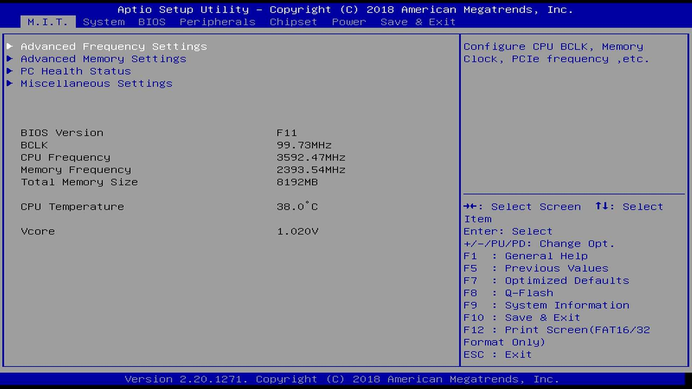
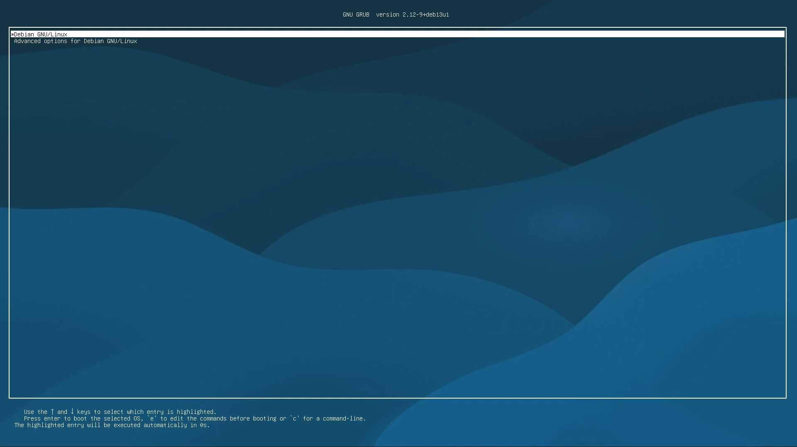
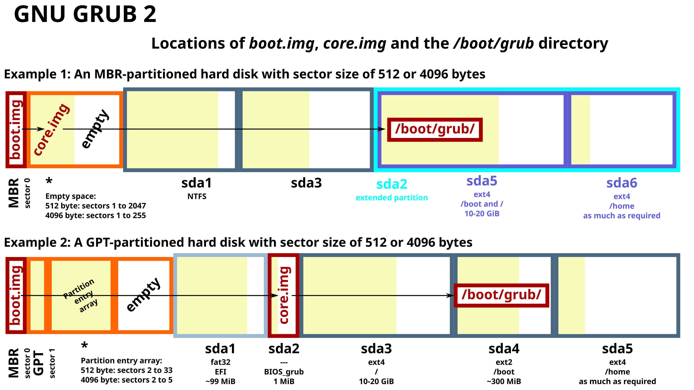
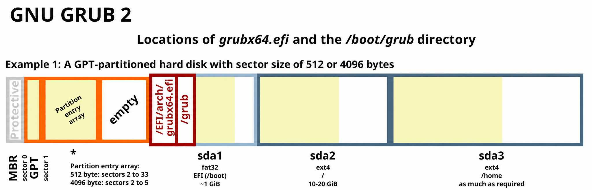

# 启动程序

!!! note "主要作者"

    [@Vertsineu][Vertsineu]、[@iBug][iBug]

!!! warning "本文编写中"

## 一般启动过程 {#general-booting-process}

常见的 x86 平台下 Linux 系统的启动过程一般可以划分为以下几个阶段：

- Firmware（固件）：计算机上电后最先执行的程序，负责硬件自检和初始化，并将控制权移交给 Bootloader。
- Bootloader（引导加载程序）：负责加载操作系统内核到内存，并将控制权移交给 Kernel。
- Kernel（内核）：负责内核空间（Kernel Space）的初始化，比如初始化中断例程、加载驱动、挂载根文件系统等，并最终启动 `init` 进程。
- Init（初始程序）：负责用户空间（User Space）的初始化，启动各种系统服务，比如 getty（tty 终端服务）、sshd（SSH 服务）乃至图形界面等。

其中，Kernel 和 Init 阶段都属于 OS（操作系统）的启动过程，而 Firmware 和 Bootloader 阶段则独立于 OS 之外，属于计算机平台的启动过程。

其他平台（如 ARM、RISC-V）或其他系统（如 BSD、Windows）虽然在细节上有所不同，但整体的启动流程大体类似。

## Firmware {#firmware}

固件（Firmware）是计算机上电后最先执行的程序，存储在主板上的只读存储器（ROM / Flash / EEPROM 等）中，负责硬件自检和硬件初始化，并最终将控制权移交给 Bootloader。常见的 PC 和服务器上的固件主要有两种实现：传统的 BIOS 和现代的 UEFI。

### BIOS {#bios}

BIOS（Basic Input/Output System，基本输入/输出系统）最初是 IBM PC 的专有固件，但是由一些公司（如 Compag、Phoenix、AMI 等）进行逆向工程，创建了兼容 BIOS 的 IBM PC 兼容机。此后，BIOS 接口成为 PC 兼容机的事实标准，被广泛采用并沿用至今。

!!! tip "BIOS is not BIOS"

    需要注意的是，我们日常口头上说的 BIOS 其实大部分情况下指的是广义上的 BIOS，不仅包括传统的 IBM PC 兼容机上的 BIOS 实现，还包括基于 UEFI 规范实现的 UEFI BIOS 。真正意义上的传统 BIOS 已经逐渐被淘汰，现代计算机上更多使用的是基于 UEFI 规范的 BIOS 实现。

    本文中所指的 BIOS 均指传统的 IBM PC 兼容机上的 BIOS 实现。

BIOS 固件会根据设置，加载启动盘上的 MBR（Master Boot Record，即磁盘的第一个扇区），并执行存储在 MBR 中的启动代码。
通常来说，MBR 中存储的 446（或低至 434）字节代码会扫描盘上的分区，找到唯一一个被标记为「活动」（active）的分区，并执行该分区中存储的启动代码（Partition Boot Record，PBR）。
在 BIOS 启动模式下，MBR 和 PBR 即是下一节所述的 Bootloader。
因此，BIOS 启动模式也经常被称作「MBR 启动模式」。

#### Setup Utility {#bios-setup-utility}

原始的 IBM PC 的 BIOS 固件没有交互式用户界面，BIOS 设置选项是通过主板上的开关和跳线设置的。
而从 1990 年代中期开始，BIOS 固件通常会包含一个 BIOS 设置实用程序（BIOS Setup Utility），通过系统启动时按下特定的按键（如 F2、Del 等）进入。
用户可以在其中通过键盘设置系统配置选项，比如启动优先级，CPU 频率，内存时序等。

以下是一个典型的 BIOS 设置实用程序的界面截图：


BIOS 设置实用程序
{: .caption }

### UEFI {#uefi}

UEFI（Unified Extensible Firmware Interface，统一可扩展固件接口）严格来说并不是一个固件实现，而是一套**固件接口规范**，由 UEFI Forum 负责维护（前身是 Intel 于 1998 年发布的 EFI 规范）。

UEFI 规范定义了固件与上层程序（Bootloader、OS 等）之间的标准接口，使得 Bootloader 和操作系统无需关心底层的具体硬件架构，从而实现跨平台的可移植性。

UEFI 规范下的计算机启动过程分为以下几个阶段：

- Security Phase (SEC)：主要功能有充当系统软件信任根（Root of Trust）、利用 CPU 缓存初始化临时内存等
- Pre-EFI Initialization (PEI)：主要功能有初始化永久内存（DRAM）、提供最小硬件初始化等
- Driver Execution Environment (DXE)：主要功能有初始化剩余硬件、实现完整的 UEFI Services 等
- Boot Device Selection (BDS)：主要功能有选择启动设备、选择是否进入 Setup Utility 等
- Transient System Load (TSL)：对应于 Bootloader 阶段，提供 Boot Services 和 Runtime Services 两类服务
- Runtime (RT)：对应于 OS 运行阶段，Boot Services 被销毁，只保留 Runtime Services 供操作系统调用（比如 NVRAM 的访问和设置等）

其中，前四个阶段，即 SEC、PEI、DXE 和 BDS 阶段被统称为 Platform Initialization（PI），即平台初始化，由 UEFI Platform Initialization 规范文件[^uefi-pi]定义；而 UEFI 为 TSL 和 RT 阶段提供的 Service 和 Protocol 等接口标准则在 UEFI 规范文件[^uefi-spec]中定义。

[^uefi-pi]: <https://uefi.org/sites/default/files/resources/UEFI_PI_Spec_Final_Draft_1.9.pdf>
[^uefi-spec]: <https://uefi.org/sites/default/files/resources/UEFI_Spec_Final_2.11.pdf>

与 BIOS 通过 MBR 和 PBR 来加载 Bootloader 的方式不同，UEFI 固件会在 BDS 阶段运行一个 Boot Manager 程序，用于加载和执行 UEFI Image、UEFI Application、UEFI OS Loader（Bootloader）、UEFI Drivers 等 UEFI 规定的可加载文件类型。

Boot Manager 通过读取 NVRAM（Non-Volatile Random Access Memory）中的 Boot Option（启动项）来确定要加载哪个文件（通常以 .efi 结尾）作为 Bootloader。

对于已经以 UEFI 方式启动的 Linux 系统，使用 `efibootmgr` 命令可以查看 NVRAM 中所有的 Boot Option 的信息：

```console
$ sudo efibootmgr
BootCurrent: 0000
Timeout: 1 seconds
BootOrder: 0000,0002
Boot0000* debian	HD(1,GPT,7c003990-9d67-48fb-b6c9-f44a4577cd5f,0x800,0x100000)/File(\EFI\DEBIAN\GRUBX64.EFI)
Boot0002  UEFI: Built-in EFI Shell	VenMedia(0784776a-4a9c-48cb-872c-8bde289ba9e8)0000424f
```

在以上示例中，UEFI 固件会从分区 GUID 为 `7c003990-9d67-48fb-b6c9-f44a4577cd5f` 的分区中加载 `\EFI\DEBIAN\GRUBX64.EFI` 文件作为 Bootloader。你可以观察 `blkid` 命令的输出，寻找 `PARTUUID=` 匹配的分区。

#### Setup Utility {#uefi-setup-utility}

UEFI 固件通常也包含设置实用程序（Setup Utility），用户可以在其中设置系统配置选项，比如启动优先级，CPU 频率，内存时序等。UEFI 设置实用程序的界面通常比 BIOS 设置实用程序更加现代化和友好，支持鼠标操作和图形界面。

UEFI 设置实用程序通常是在 DXE 阶段被加载，而在 BDS 阶段通过判断用户是否按下特定的按键（如 F2、Del 等）来决定是否进入设置实用程序。

以下是一个看上去有点老旧的 UEFI 设置实用程序的界面截图：



UEFI 设置实用程序
{: .caption }

#### Security {#uefi-security}

在计算机发展早期，传统 x86 平台下的 PC 启动体系缺少统一的密码学验证机制，计算机无条件信任 Firmware 和 Bootloader 阶段的所有代码，这就导致恶意代码可以通过恶意篡改 Firmware 和 Bootloader 非常隐蔽地攻击受害者的机器。

1999 年 10 月 11 日，由康柏、惠普、IBM、英特尔和微软等多家科技公司组成的可信计算平台联盟（Trusted Computing Platform Alliance，TCPA）成立，旨在促进个人计算平台的信任和安全。2003 年，TCPA 被 TCG（Trusted Computing Group）取代。

TCG 最广为流传的贡献就是颁布了 TPM 的硬件规范，提出了 PCR 和 Measured Boot 等概念，把计算平台可信变成可测量（measure）、可记录、可证明的标准。但是 TPM 并不能阻止未经授权的代码执行，这需要额外的机制来实现。

2011 年 4 月，UEFI 2.3.1 规范发布，规范定义了 Secure Boot 机制，使得 UEFI 固件下的计算平台，可以保证在 DXE 和 BDS 阶段加载安全可信的驱动和 Bootloader，从而阻止未经授权的驱动和 Bootloader 执行。但是 Secure Boot 并不能保证在 UEFI 的早期阶段，比如 SEC 和 PEI 阶段执行的固件是可信的。

随着 2013 年 Intel 4th Gen Core 支持 Intel Boot Guard 和 2017 年 AMD EPYC 7001 支持 AMD Platform Secure Boot，x86 平台下的固件以 Intel/AMD silicon Root of Trust 为根，对 OEM（Original Equipment Manufacturer，原始设备制造商）授权的 Firmware 建立硬件根植的认证链，其中通常包含了 UEFI 的 SEC 和 PEI 阶段，补齐了 Secure Boot 的不足。

至此，现代 x86 平台可以由 Intel/AMD 提供的 silicon hardware Root of Trust 验证 OEM 授权的早期平台固件，再由平台固件通过 UEFI Secure Boot 将信任链延伸至 OS Bootloader。与此同时，TPM Measured Boot 可以对启动过程进行测量、记录和证明，从而形成硬件根植的 Verified Boot + Measured Boot 的分层启动安全体系。

##### BG & PSB {#uefi-bg-psb}

BG (Boot Guard) 和 PSB (Platform Secure Boot) 分别是 Intel 和 AMD 处理器在固件执行前对固件进行签名验证的具体实现，并不局限于 UEFI 固件（比如 coreboot），但是实践上通常覆盖 UEFI 的 SEC 和 PEI 阶段。

在实现上，Intel Boot Guard 运行在 CPU 执行复位向量所在固件代码之前，由 x86 主核心执行：

- 首先，主核心会执行 CPU 微码读取并执行来自主板 ROM 的 ACM（Authenticated Code Module），该微码使用刻蚀在芯片中的 Intel 的公钥 hash 来验证读取的 ACM 的签名是否可信任
- 然后，ACM 会从主板 ROM 中读取 Key Manifest，获得到来自 OEM 的公钥和签名，并使用主板 FPF（Field Programmable Fuses，一种一次性写存储介质，一旦写入无法更改）中存放的 OEM 的公钥 hash 来验证该 OEM 的公钥是否被篡改
- 接着，ACM 又会从主板 ROM 中读取 BPM（Boot Policy Manifest），并使用 OEM 的公钥验证 BPM 是否被篡改，而 BPM 中存放着 IBB（Initial Boot Block，也就是固件本身，比如 UEFI 的 SEC 和 PEI 阶段的代码）的 hash，用于验证固件是否被篡改
- 最后，对于固件的验证过程结束，PC 跳至复位向量开始执行固件

不同于 Intel 使用 x86 主核心验证，AMD PSB 则使用芯片内的一颗独立的 ARM 协处理器（PSP，Platform Security Processor）在 x86 主核心执行前运行验证流程：

- 首先，PSP 直接执行芯片内的 Boot ROM，从主板 ROM 中读取 ARK（AMD Root Key），并使用 PSP 中的 OTP fuse（一次性写存储介质，一旦写入无法更改）里的 ARK 的 hash 验证 ARK 是否被篡改
- 然后，PSP 会从主板 ROM 中读取 PSP Bootloader，并使用 ARK 验证签名是否可信任，如果可信任，则执行 PSP Bootloader
- 接着，PSP 又会从主板 ROM 中读取 OEM 的 BIOS Signing Key，并使用 ARK 验证签名，确保不被篡改，而 BIOS Signing Key 则用于验证固件的签名，确保不被篡改
- 最后，对于固件的验证过程结束，PSP 允许 x86 主核心从复位向量开始执行

!!! note "开启 Boot Guard 和 PSB 导致硬件绑定"

    Intel Boot Guard 将 OEM 的公钥 hash 存放在**主板**（具体来说是 PCH 芯片）的 OTP fuse 中，而 AMD PSB 则将 ARK（本质上也是 OEM 的公钥）存放在 **CPU** 里的 PSP 中的 OTP fuse 中。
    
    但是 OTP fuse 只能写一次，因此这种设计上的选择就导致开启了 Intel Boot Guard 的主板的 PCH 芯片可能无法更换到其他开启 Intel Boot Guard 的主板上使用，而开启了 AMD PSB 的主板的 CPU 可能无法更换到其他开启 AMD PSB 的主板上使用，都是因为不同 OEM 给不同主板刷入的 OEM 公钥 hash 可能不一样。

    特别的，Intel Boot Guard 可以由 OEM 设置不去验证 OEM 的公钥 hash 是否正确，仅在 Boot Guard 执行阶段做测量，在这种情况下，即使开启 Intel Boot Guard 也可能正常启动，但在实践上，大部分 OEM 都会开启验证，而不是关闭验证。

##### Secure Boot {#uefi-secure-boot}

Secure Boot（安全启动）是 UEFI 固件特有的功能，在 DXE 和 BDS 阶段加载和执行，它通过阻止加载未经可接受的数字签名签名的 UEFI 驱动程序或 Bootloader 来保护启动过程。

Secure Boot 的技术基础是一套由 UEFI 2.3.1 规范定义的四层证书/哈希数据库体系：

- PK（Platform Key）：平台密钥，实际上是一个 X.509 证书，通常由 OEM 颁发，也可以自己签发
- KEK（Key Exchange Key）：密钥交换密钥，实际上是多个 X.509 证书，通常由 OEM 和 Microsoft 颁发，也可以自己签发
- db：签名数据库，存放被信任的证书或具体二进制文件的 hash 值，凡是被 db 中证书签名过、或哈希值直接列在 db 中的程序，才允许在 DXE 或 BDS 阶段被加载
- dbx：禁止签名数据库，黑名单，存放被撤销或已知存在漏洞的证书或 hash 值，优先级高于 db

和 Boot Option 类似，这些数据也是存放在主板的 NVRAM 中，但是相比于 Boot Option 可以随意更改，这些字段都必须经过签名认证才能进行修改。

对于已经以 UEFI 方式启动的 Linux 系统，可以使用 `efitools` 包里的 `efi-readvar` 命令查看，以下将以一台联想 Thinkpad E480 笔记本为例，展示 Secure Boot 是如何构建起 Secure Boot 的多级信任链的：

```bash
$ sudo efi-readvar -v PK
Variable PK, length 1087
PK: List 0, type X509
    Signature 0, size 1059, owner 3cc24e96-22c7-41d8-8863-8e39dcdcc2cf
        Subject:
            C=CN, ST=Beijing, L=Beijing, O=Lenovo(Beijing) Ltd., OU=IDC-CDC, CN=IDC-CDC -KEK, emailAddress=swqagent@lenovo.com
        Issuer:
            C=CN, ST=Beijing, L=Beijing, O=Lenovo(Beijing) Ltd., OU=IDC-CDC, CN=IDC-CDC -KEK, emailAddress=swqagent@lenovo.com
```

首先可以看到，PK 是一个是由联想（Lenovo）官方，即 OEM 颁发的证书，这是 Secure Boot 的信任根（Root of Trust），如果想要修改这个证书，需要在 Setup Utility 中开启 Setup mode，才能在系统中写入，而且一旦写入就会自动回到 User mode 无法修改。

```bash
$ sudo efi-readvar -v KEK
Variable KEK, length 2650
KEK: List 0, type X509
    Signature 0, size 1062, owner 7facc7b6-127f-4e9c-9c5d-080f98994345
        Subject:
            C=CN, ST=Beijing, L=Beijing, O=Lenovo(Beijing) Ltd., OU=IDC-CDC, CN=ICD-CDC -KEK, emailAddress=swqagent@lenovo.com
        Issuer:
            C=CN, ST=Beijing, L=Beijing, O=Lenovo(Beijing) Ltd., OU=IDC-CDC, CN=IDC-CDC -KEK, emailAddress=swqagent@lenovo.com
KEK: List 1, type X509
    Signature 0, size 1532, owner 77fa9abd-0359-4d32-bd60-28f4e78f784b
        Subject:
            C=US, ST=Washington, L=Redmond, O=Microsoft Corporation, CN=Microsoft Corporation KEK CA 2011
        Issuer:
            C=US, ST=Washington, L=Redmond, O=Microsoft Corporation, CN=Microsoft Corporation Third Party Marketplace Root
```

接着可以看到，KEK 里同时包含了来自 OEM 和 Microsoft 颁发的证书，如果需要写入新证书，需要对使用 PK 的私钥对其签名，才能被固件允许添加。

KEK 的作用是为 KEK 证书的颁发者提供修改 db 和 dbx 的能力，比如 Windows 系统需要远程推送有关驱动或者 Bootloader 相关的更新，涉及到了新证书的颁发或者过时的、存在漏洞的旧证书的撤销，就可以通过由 KEK 的私钥签名的更新包安全地修改 db 和 dbx 来实现。

??? question "两张来自 Microsoft 的 KEK 证书？"

    示例中展示了一张来自 Microsoft 于 2011 年颁发的名为 Microsoft Corporation KEK CA 2011 的证书，但是实际上，这张证书已经于 2026 年 6 月 24 日正式过期了，因此，对于不久之前的新设备，你可能还能看到另一张 Microsoft 于 2023 年颁发的名为 Microsoft Corporation KEK 2K CA 2023 的新证书，如下所示：

    ```bash
    $ sudo efi-readvar -v KEK
    ...
    KEK: List 2, type X509
    Signature 0, size 1478, owner 77fa9abd-0359-4d32-bd60-28f4e78f784b
        Subject:
            C=US, O=Microsoft Corporation, CN=Microsoft Corporation KEK 2K CA 2023
        Issuer:
            C=US, O=Microsoft Corporation, CN=Microsoft RSA Devices Root CA 2021
    ```

```bash
$ sudo efi-readvar -v db
Variable db, length 6169
db: List 0, type X509
    Signature 0, size 962, owner 7facc7b6-127f-4e9c-9c5d-080f98994345
        Subject:
            C=JP, ST=Kanagawa, L=Yokohama, O=Lenovo Ltd., CN=ThinkPad Product CA 2012
        Issuer:
            C=JP, ST=Kanagawa, L=Yokohama, O=Lenovo Ltd., CN=Lenovo Ltd. Root CA 2012
db: List 1, type X509
    Signature 0, size 1061, owner 7facc7b6-127f-4e9c-9c5d-080f98994345
        Subject:
            C=CN, ST=Beijing, L=Beijing, O=Lenovo(Beijing) Ltd., OU=IDC-CDC, CN=ICD-CDC -DB, emailAddress=swqagent@lenovo.com
        Issuer:
            C=CN, ST=Beijing, L=Beijing, O=Lenovo(Beijing) Ltd., OU=IDC-CDC, CN=IDC-CDC -KEK, emailAddress=swqagent@lenovo.com
db: List 2, type X509
    Signature 0, size 919, owner 7facc7b6-127f-4e9c-9c5d-080f98994345
        Subject:
            C=US, ST=North Carolina, O=Lenovo, CN=Lenovo UEFI CA 2014
        Issuer:
            C=US, ST=North Carolina, O=Lenovo, CN=Lenovo UEFI CA 2014
db: List 3, type X509
    Signature 0, size 1572, owner 77fa9abd-0359-4d32-bd60-28f4e78f784b
        Subject:
            C=US, ST=Washington, L=Redmond, O=Microsoft Corporation, CN=Microsoft Corporation UEFI CA 2011
        Issuer:
            C=US, ST=Washington, L=Redmond, O=Microsoft Corporation, CN=Microsoft Corporation Third Party Marketplace Root
db: List 4, type X509
    Signature 0, size 1515, owner 77fa9abd-0359-4d32-bd60-28f4e78f784b
        Subject:
            C=US, ST=Washington, L=Redmond, O=Microsoft Corporation, CN=Microsoft Windows Production PCA 2011
        Issuer:
            C=US, ST=Washington, L=Redmond, O=Microsoft Corporation, CN=Microsoft Root Certificate Authority 2010
```

最后就是 db 和 dbx，这部分的证书就是真正用来验证被加载的程序是否被允许的数字签名签名，比如其中的 Microsoft Windows Production PCA 2011 就是用于允许 Windows 系统的 Bootloader 程序 `bootmgfw.efi` 被加载的证书，又比如 Lenovo UEFI CA 2014 可能就是用于允许 OEM 签名的各种驱动、Option ROM 等程序被加载的证书。

!!! tip "Linux 中使用 Secure Boot 的常见方案"

    不同于 Microsoft 的 Windows，可以向 OEM 授权预装自己的 KEK 证书和 db 证书进主板，从而默认允许 Windows 的 Bootloader 能够通过 Secure Boot 的认证，属于开源社区并且种类众多的各大 Linux 发行版并没有一个统一的机构能够提供一个统一的 KEK 证书或 db 证书预装进主板。因此，开源社区逐渐形成了以下两种在 Linux 中使用 Secure Boot 的方案：

    - 使用一个已经被 Microsoft 签名过的 [shim 程序](https://github.com/rhboot/shim)作为跳板先行通过 BDS 阶段对于 Bootloader 的 Secure Boot 认证，而 shim 程序在编译时已经嵌入了发行版厂商自签名的证书，因此发行版厂商可以自己签署自己发行的 Bootloader 和内核，并被 shim 程序认证执行。除此之外，如果安装了第三方签名的模块，也支持通过导入 MOK（Machine Owner Key）信任第三方自签名的证书。
        - 常见于 Ubuntu、Fedora、Debian、openSUSE 等主流发行版，通常 shim 程序位于 `/boot/efi/EFI/<release>/shimx64.efi`
        - 优点：安装即用，可导入自定义证书，不会破坏机器内原始的 PK、KEK、db 和 dbx 里的证书
        - 缺点：依赖 Microsoft 的审核与背书（部分社区认为这与软件自由理念存在张力）
    - 重新设置本机 Secure Boot 认证体系，将 PK 设置为自签名证书，在 KEK、db 里添加自签名证书，然后在每次安装新 Bootloader 和内核的时候，使用自签名证书的私钥给 Bootloader 和内核签名即可
        - 常见于 Arch Linux、Gentoo 等发行版，通常搭配 sbctl 软件使用，详情可参见 [Arch Wiki](https://wiki.archlinux.org/title/Unified_Extensible_Firmware_Interface/Secure_Boot#Assisted_process_with_sbctl)
        - 优点：可控性好（如果密钥泄露了，直接 enroll 新的密钥就行），自由度高（可以很方便地给任何程序签名，不需要走 MOK，而且不需要 Microsoft 的签名）
        - 缺点：安装麻烦，概率变砖（需要手动重置本机内 Secure Boot 相关的所有密钥，所以操作前记得备份），需要自己负责签名（需要配置每次更新 Bootloader 和内核的时候自动签名）

##### TPM {#uefi-tpm}

TPM（Trusted Platform Module）是 TCG 发布的一种安全芯片的规范标准[^tpm-spec]，不同于 BG & PSB 和 Secure Boot 在计算机启动过程中主要用于验证（verify）固件、驱动和 Bootloader 是否安全可信，TPM 在计算机启动过程中的主要作用是测量（measure）启动过程，即记录并证明系统启动过程中每一阶段都实际执行的逻辑。

TPM 芯片内置多个 PCR（Platform Configuration Register）寄存器，按照 PC Client Platform TPM Profile (PTP) 规范[^tpm-pc-client-ptp-spec]要求至少为 24 个。按照每个 PCR 所能记录的 hash 类型，各个 PCR 又会被划分到一个或多个 bank 中，并根据 hash 的位宽决定 PCR 在该 bank 中的位宽，同一编号的 PCR 在不同 bank 里存放独立副本。

[^tpm-spec]: <https://trustedcomputinggroup.org/resource/tpm-library-specification/>
[^tpm-pc-client-ptp-spec]: <https://trustedcomputinggroup.org/resource/pc-client-platform-tpm-profile-ptp-specification/>

在 Linux 中，可以使用 `tpm2-tools` 包里的 `tpm2_getcap` 命令查看所有 PCR 能记录的 hash 类型和所在的 bank，比如，一个常见的情况是，所有 PCR 都只能记录 sha256 类型的 hash：

```bash
$ sudo tpm2_getcap pcrs
selected-pcrs:
  - sha1: [ ]
  - sha256: [ 0, 1, 2, 3, 4, 5, 6, 7, 8, 9, 10, 11, 12, 13, 14, 15, 16, 17, 18, 19, 20, 21, 22, 23 ]
  - sha384: [ ]
  - sm3_256: [ ]
```

使用 `tpm2_pcrread` 命令查看所有 PCR 在所有 bank 下的 hash，比如：

```bash
$ sudo tpm2_pcrread    
  sha1:
  sha256:
    0 : 0x6EF0C2C29B70A4B1B24DC1FA74B5AC7D7D8CB36CD9D642B96317BAD364A069C7
    1 : 0x39296297D67B7F16E53A6D512CA12795730A6BF8ED1AE26143A8A2962F2D4B90
    2 : 0x2DE29845CCDA143E9F51897392CDE84B887E1C53081E58A90A317C8E8EFE6A93
    3 : 0x3D458CFE55CC03EA1F443F1562BEEC8DF51C75E14A9FCF9A7234A13F198E7969
    4 : 0x2C3AF9A67BFAD61BD5A8AA32C9DD8BFE3BD1E601C8BBA4A08C9C577ED0E9FA44
    5 : 0x40F2E33152C3E114DD91ED099EDBC0A6AC6F1B2003BDF1E74E88A5B116BFC39E
    6 : 0x3D458CFE55CC03EA1F443F1562BEEC8DF51C75E14A9FCF9A7234A13F198E7969
    7 : 0xE981F56BA5EBC25D0DD51B6C60F2F08EA5A68CBACBB310DC028718CC4FF1122B
    8 : 0xEF01770DBBCC7D64F11A6E9EC115F4B506087787D34988EEEE592B576CB50002
    9 : 0x1DBB88C4B66FEAEB5A3D6227C803540D1FADE64893E3BE83BBDF61A551164F84
    10: 0x0000000000000000000000000000000000000000000000000000000000000000
    11: 0x0000000000000000000000000000000000000000000000000000000000000000
    12: 0x0000000000000000000000000000000000000000000000000000000000000000
    13: 0x0000000000000000000000000000000000000000000000000000000000000000
    14: 0x0000000000000000000000000000000000000000000000000000000000000000
    15: 0x0000000000000000000000000000000000000000000000000000000000000000
    16: 0x0000000000000000000000000000000000000000000000000000000000000000
    17: 0xFFFFFFFFFFFFFFFFFFFFFFFFFFFFFFFFFFFFFFFFFFFFFFFFFFFFFFFFFFFFFFFF
    18: 0xFFFFFFFFFFFFFFFFFFFFFFFFFFFFFFFFFFFFFFFFFFFFFFFFFFFFFFFFFFFFFFFF
    19: 0xFFFFFFFFFFFFFFFFFFFFFFFFFFFFFFFFFFFFFFFFFFFFFFFFFFFFFFFFFFFFFFFF
    20: 0xFFFFFFFFFFFFFFFFFFFFFFFFFFFFFFFFFFFFFFFFFFFFFFFFFFFFFFFFFFFFFFFF
    21: 0xFFFFFFFFFFFFFFFFFFFFFFFFFFFFFFFFFFFFFFFFFFFFFFFFFFFFFFFFFFFFFFFF
    22: 0xFFFFFFFFFFFFFFFFFFFFFFFFFFFFFFFFFFFFFFFFFFFFFFFFFFFFFFFFFFFFFFFF
    23: 0x0000000000000000000000000000000000000000000000000000000000000000
  sha384:
  sm3_256:
```

这些 PCR 的作用就是按阶段证明计算机启动过程。

除了上电重置和少数专用于动态测量或调试的 PCR 以外，在计算机运行的任何时刻，计算机对于其他每个 PCR 都只能通过一个 Extend 操作来更新值，等价于以下逻辑：

```python
def Extend(i, data):
    PCR[i] = hash(PCR[i] || data)
```

即每次 Extend 操作只能将输入和 PCR 里的旧值拼在一起重新做一次 hash 作为新值更新 PCR。

这样做就会带来一个很好的性质：在经过若干次 Extend 操作后，PCR 最终的值一定能够标识整个 Extend 操作过程，在使用的哈希函数具备抗碰撞性的前提下，计算上无法伪造一个不同的 Extend 操作过程得到同样的最终 PCR 值。

而在计算机启动过程中，Firmware、Bootloader 和 Kernel 阶段都会在每次执行其内部一个阶段前就调用 Extend，输入和这个阶段相关的信息（比如整个阶段的代码的 hash、相关配置文件的 hash 等等），更新一下 PCR，这样 PCR 的上述性质就保证了 PCR 最终的值一定能够代表从 Firmware 到 Kernel 阶段的整个启动过程 —— 如果在启动过程中某个阶段的代码或配置文件等信息发生变更，就会导致 Extend 输入的相关信息变化，最终导致 PCR 最终的值变化。

实际上，如果只需要标识整个启动过程是否执行了和之前不一样的逻辑，那么其实只需要一个 PCR 就能实现，但是在某些特殊应用场景下，比如使用了 LUKS 和 BitLocker 全盘加密并配有自动解密的情况下，我们只需要验证到某个阶段时，计算机是否执行了和之前完全相同的逻辑，此时我们就需要多个 PCR 来存放用于标识从上电到某个阶段的启动过程的值。除此之外，多个 PCR 也有助于系统启动后排查具体哪个阶段的启动过程出现变化。

因此，PC Client Specific Platform Firmware Profile (PFP) 规范[^tpm-pc-client-pfp-spec]具体定义了这些 PCR 应当记录的内容：

[^tpm-pc-client-pfp-spec]: <https://trustedcomputinggroup.org/resource/pc-client-specific-platform-firmware-profile-specification/>

- PCR0: SRTM, BIOS, Host Platform Extensions, Embedded Option ROMs and PI Drivers
- PCR1: Host Platform Configuration
- ...
- PCR7: Secure Boot Policy
- PCR8-15: Defined for use by the Static OS

其中 PCR0 对应于前文所讨论的 BG & PSB 阶段，而 PCR7 对应于前文所讨论的 Secure Boot 阶段。

通常，在计算机启动过程中，Firmware、Bootloader 和 Kernel 在更新 PCR 的同时，还会维护一个 Event Log，用于记录每次 Extend 操作时输入的数据到底是如何得到的（这个阶段被测量了什么？）。Event Log 同样是由 PC Client Specific Platform Firmware Profile (PFP) 规范定义的，需要注意的是，Event Log 是明文存储的，不放在 TPM 芯片内，因此有篡改风险。

在 Linux 中，可以使用 `tpm2_eventlog` 读取存放在 `/sys/kernel/security/tpm0/binary_bios_measurements` 中的 Event Log：

```bash
$ sudo tpm2_eventlog /sys/kernel/security/tpm0/binary_bios_measurements
---
version: 1
events:
- EventNum: 0
  PCRIndex: 0
  EventType: EV_NO_ACTION
  Digest: "0000000000000000000000000000000000000000"
  EventSize: 33
  SpecID:
  - Signature: Spec ID Event03
    platformClass: 0
    specVersionMinor: 0
    specVersionMajor: 2
    specErrata: 0
    uintnSize: 2
    numberOfAlgorithms: 1
    Algorithms:
    - Algorithm[0]:
      algorithmId: sha256
      digestSize: 32
    vendorInfoSize: 0
- ...
- EventNum: 139
  PCRIndex: 5
  EventType: EV_EFI_ACTION
  DigestCount: 1
  Digests:
  - AlgorithmId: sha256
    Digest: "b54f7542cbd872a81a9d9dea839b2b8d747c7ebd5ea6615c40f42f44a6dbeba0"
  EventSize: 40
  Event: |-
    Exit Boot Services Returned with Success
```

Event Log 的主要作用是为每一个 Extend 操作提供对应的明文解释，从而让原本不可读的 PCR 数值变得可以被解释和逐项核对。它的核心用途是配合 TPM 签名的 PCR Quote 做重放校验，支撑远程认证（判断启动过程中具体哪个阶段发生了变化）。此外，它也可以直接被本机管理员用于事后审计和故障排查。

## Bootloader {#bootloader}

Bootloader（引导加载程序）通常存储在可引导设备（如硬盘、U 盘、光盘等）的特定位置（如 MBR、GPT 分区表中的 EFI System Partition 等）中，负责加载操作系统内核到内存，并将控制权移交给 Kernel。

通常，对于 Linux 系统来说，Bootloader 还需要将 initrd / initramfs（初始内存盘）加载到内存，并将相关信息（如内核命令行参数、initramfs 的位置等）传递给 Kernel，里面包含了内核启动所需的各种驱动和工具，帮助内核完成系统的初始化过程。

!!! question "为什么需要 Bootloader？"

    一个很自然的问题是，为什么需要 Bootloader？为什么不直接让 Firmware 加载 Kernel 呢？

    这是因为，Firmware 的设计目标只是去初始化硬件并提供一个基本的运行环境，它需要尽可能不去关心上层运行的程序是什么样的，不论是一个 Linux 系统，还是一个 Windows 系统，又或者只是一个运行在裸机上的打印 Hello World 到屏幕上的简单程序。

    而 Bootloader 的设计目标则是去负责初始化操作系统所需要的**初始状态**，比如对于 Linux 系统来说，Kernel 和 initramfs 需要被加载进内存，需要在指定位置填写好内核参数从而指定某些内核功能的启用等等。这些都需要一个单独的程序来完成，靠 Firmware 是无法胜任的。

!!! note "常见内核命令行参数"

    内核命令行参数（Kernel Command-line Parameters）是 Bootloader 和 Kernel 之间通信的重要手段，通常用于控制内核的行为和系统启动过程，比如启用某些内核模块；也有少量特殊参数用于控制 Bootloader 的行为，比如控制内核的内存的结束位置，进而影响 initrd 被放置的位置[^special-command-line-options]。

    对于内核不认识的内核参数，比如 Systemd 的 `systemd.unit=...` 和 LILO/GRUB 传递的 `BOOT_IMAGE=...` 等自定义参数，内核会按照以下规则进行处理：

    - 如果参数起始字符为 `BOOT_IMAGE=` 或 `kexec`：认为是 Bootloader 传过来的参数，忽略
    - 如果参数里带有 `.`：认为是暂未被使用的内核模块参数，忽略
    - 如果参数里不带有 `.` 且带有 `=`：作为环境变量传给 init 进程
    - 如果参数里不带有 `.` 且不带有 `=`：作为命令行参数传给 init 进程

    具体执行的代码逻辑位于 `init/main.c` 的 [`unknown_bootoption`](https://elixir.bootlin.com/linux/v6.19/source/init/main.c#L544) 函数。

    除此之外，`--` 之后的所有命令行参数都会作为命令行参数传给 init 进程。

    不论内核如何处理命令行参数，在进入系统后，所有程序都可以通过查看 `/proc/cmdline` 文件来获取当前内核的所有命令行参数，例如：

    ```bash
    $ cat /proc/cmdline 
    BOOT_IMAGE=/vmlinuz-linux-cachyos root=UUID=eea8de7e-b37f-4b3b-b530-1003eeab9746 rw rootflags=subvol=@ loglevel=5 nowatchdog intel_iommu=on iommu=pt
    ```

    一些常见的内核命令行参数如下所示：
    
    - `<显卡模块名>.modeset=0`：不允许对应的显卡驱动设置 [KMS 显示模式](../advanced/desktop.md#x-gpu)，例如 `nouveau.modeset=0`、`amdgpu.modeset=0` 等。
    - `nomodeset`：完全关闭 KMS 显示模式设置。对一部分显卡配置来说，在进入 LiveCD 安装系统时会需要添加相关参数，完全禁用 GPU 相关驱动以避免出现黑屏等显示异常的情况。
    - `initcall_blacklist=<模块初始化函数>`：不允许某个被编译到内核中（built-in）的模块在开机时加载。例如在 `algif_aead` 模块**内置**在内核中时，缓解 [Copy Fail 漏洞（CVE-2026-31431）](https://copy.fail)的内核启动参数 `initcall_blacklist=algif_aead_init`，即会禁用 [`algif_aead_init`](https://elixir.bootlin.com/linux/v6.19/source/crypto/af_alg.c#L1300) 函数运行。
    - `module_blacklist=<模块名>`：不允许加载指定的外部模块。
    
    更多内核命令行参数见 [Linux 内核文档](https://docs.kernel.org/admin-guide/kernel-parameters.html)。

[^special-command-line-options]: <https://docs.kernel.org/arch/x86/boot.html#special-command-line-options>

### GRUB

GRUB（GRand Unified Bootloader）是目前应用最广泛的 Linux bootloader，同时支持 BIOS 启动模式和 UEFI 启动模式，并且以 BIOS 模式启动时 GRUB 可以被安装在 GPT 分区表中。

GRUB 以「模块」的方式支持丰富多样的启动方式，包括各种分区及 RAID 配置形式，或者通过 TFTP 或 HTTP 从网络中加载文件，甚至还能提供图形化的启动界面（例如 [Minecraft 风格的自定义 GRUB 主题](https://github.com/Lxtharia/minegrub-theme)）。这些模块通常存储在 `/usr/lib/grub` 下，并会在安装 GRUB 时被复制到 `/boot` 下。

以下是一个 GRUB 启动界面的示例：



一个装有 Debian GNU/Linux 系统的 GRUB 启动界面示例
{: .caption }

!!! bug "GRUB 的模块是独立的实现"

    需要注意的是，GRUB 的模块一般不依赖上游软件，也没有采用上游软件的实现方式，而是将各种功能重新独立地实现了一遍。
    这在上游软件的复杂度提升时尤其容易产生问题，一个典型的例子是 [GRUB 不支持 ZFS `dnodesize=auto`](https://www.reddit.com/r/zfs/comments/g9mtll/linux_zfs_root_issue_grub2_hates_dnodesizeauto/)。
    因此许多 ZFS 用户为了保证系统能够正常启动，会为 `/boot` 划分一个独立的分区，采用 ext4 文件系统。

    另一个例子是 USTC 镜像站在初次配置 LVMcache 之后就<s>倒闭了</s>无法启动了，原因是 LVM 在启用了 cache 或 raid 等高级功能后出现了更加复杂的 metadata 数据结构，而 GRUB 解析 LVM metadata 的实现并没有考虑到这种情况。
    我们最终[自己 patch 了 GRUB][taoky-patch]，并沿用此版本的 GRUB 直到多年后[再次迁移回 ZFS](https://lug.ustc.edu.cn/planet/2024/12/ustc-mirrors-zfs-rebuild/)。

  [taoky-patch]: https://github.com/taoky/grub/commit/85b260baec91aa4f7db85d7592f6be92d549a0ae

在 BIOS 启动模式下，磁盘的第一个分区通常从 1 MiB 的位置开始，此时磁盘开头的前 1 MiB 空间就可以用于写入 GRUB 的启动代码。
这部分代码通常包含了 FAT 和 ext4 分区格式的支持，因此 GRUB 可以继续从这些格式的分区中读取配置文件、Linux 内核或更多的 GRUB 模块。

如下图 Example 1 所示，在 sda1 前预留的 1 MiB 空间存放着 GRUB 的 `boot.img` 和 `core.img` 两个文件，其中 `boot.img` 存放在 MBR 中，`core.img` 存放在 MBR 后的 512 字节到 1 MiB 的空间中。

Debian 官方构建的 cdimage 情况相似，只不过从 1 MiB 的位置开始的分区是一个类型为 BIOS boot 的分区，大小为 3 MiB。
该分区的作用与「在第一个分区前留出 1 MiB 的空间」相同，即用于存储 GRUB 代码。
由于「预留 1 MiB 空间」是一项现代的约定俗成的做法，显式的 BIOS boot 分区的一个优势就是避免这部分预留空间被不遵守这一项约定俗成的软件给误操作破坏掉，导致系统无法启动。
例如，许多较旧的分区软件会将第一个分区的开始位置设置为 LBA 32（16 KiB），甚至 LBA 1（紧跟 MBR 后）。

如下图 Example 2 所示，因为 GPT 分区表占据了 MBR 后的空间，约定俗成的「预留 1 MiB 空间」的规定被打破了，因此 GRUB 的 `core.img` 就被存放在一个单独的名为 BIOS_grub 的 1 MiB 的分区中。



GRUB 在 BIOS 启动模式下的分区布局示例[^grub-bios-partition-layout]
{: .caption }

[^grub-bios-partition-layout]: <https://en.wikipedia.org/wiki/File:GNU_GRUB_components.svg>

在 UEFI 启动模式下，GRUB 通常位于 EFI 系统分区的 `\EFI\debian\grubx64.efi` 位置。其他发行版也可能为中间一层目录使用其他名称，例如 `\EFI\ubuntu\grubx64.efi`。

如下图的 Example 1 所示，GRUB 不再使用 `boot.img` 和 `core.img` 分阶段加载的方式，而是直接通过 `/EFI/arch/grubx64.efi` 这个单一的文件被 UEFI 加载执行。



GRUB 在 UEFI 启动模式下的分区布局示例
{: .caption }

!!! tip "使用 GRUB Console 启动"

    通常，GRUB 会通过 `/boot/grub/grub.cfg` 中配置好的 menuentry 生成一个可供用户选择的启动菜单，用户可以通过键盘上下方向键选择要启动的 menuentry，并按下回车键来启动。

    但是，`grub.cfg` 文件通常是在系统安装过程中由 `grub-mkconfig` 生成的，而不是 GRUB 启动时动态生成的。因此，如果 `grub.cfg` 出现损坏，或者在修改了分区布局或者添加了新的内核版本后忘记/无法重新执行 `grub-mkconfig`，就可能因为错误/过时的 `grub.cfg` 文件而无法正常启动。这时候，你就需要在 GRUB Console 中手动输入命令来启动系统了。

    GRUB Console 是 GRUB 提供的交互式命令行界面，类似于 Linux 中的 Shell，提供了一些基本的命令用于手动加载和引导内核。需要注意的是，GRUB Console 本身并不是严格意义上的 Unix Shell，一些常见的功能，比如管道（`|`）和重定向（`>`）等是无法使用的。
    
    进入 GRUB Console 的方法是在 GRUB 启动界面按下 `c` 键，或者在 GRUB 启动界面按下 `c` 键进入编辑模式后按下 `Ctrl + C` 键。

    进入 GRUB Console 后，你可以使用 `ls` 命令来查看 GRUB 可以访问的设备和分区：

    ```bash
    grub> ls 
    (proc) (hd0) (hd0,gpt1) (hd0,gpt2) (hd0,gpt3) (hd1) (hd1,gpt1) (hd1,gpt2) (hd1,gpt3)
    ```

    而使用 `ls -l` 或者 `ls` 某一项来详细查看每个磁盘和分区的具体信息：

    ```bash
    grub> ls -l
    Device proc: Filesystem type procfs - Sector size 512B - Total size 0KiB
    Device hd0: No known filesystem detected - Sector size 512B - Total size 488386584KiB
        Partition hd0,gpt3: No known filesystem detected - Partition start at 470631811.5KiB - Total size 17754739.5KiB
        Partition hd0,gpt2: Filesystem type ext* - Label 'root' - Last modification time 2026-03-21 12:46:39 Saturday, UUID 093a7ce2-f355-409c-b8a9-00301Bdc75ce - Partition start at 1058624KiB - Total size 469581187.5KiB
        Partition hd0,gpt1: Filesystem type fat, UUID 2703-3208 - Partition start at 2048KiB - Total size 1048576KiB
    Device hd1: No known filesystem detected - Sector size 512B - Total size 976762584KiB
        Partition hd1,gpt3: Filesystem type ext* - Last modification time 2026-05-11 12:06:19 Monday, UUID bfa1b11e-bcbb-4864-8752-b3718fc5b6e5 - Partition start at 9430200KiB - Total size 967323640KiB
        Partition hd1,gpt2: No known filesystem detected - Partition start at 1049600KiB - Total size 8388608KiB
        Partition hd1,gpt1: Filesystem type fat, UUID FB74-5D11 - Partition start at 1024KiB - Total size 1048576KiB
    ```

    ```bash
    grub> ls (hd1,gpt3)
        Partition hd1,gpt3: Filesystem type ext* - Last modification time 2026-05-11 12:06:19 Monday, UUID bfa1b11e-bcbb-4864-8752-b3718fc5b6e5 - Partition start at 9430200KiB - Total size 967323640KiB
    ```

    从输出可以看出，这台机器上有两块磁盘（hd0 和 hd1），每块磁盘上都有一个 EFI 系统分区（hd0,gpt1 和 hd1,gpt1），一个 swap 分区（hd0,gpt3 和 hd1,gpt2，因为没有文件系统所以是未知文件系统），以及一个 ext4 分区（hd0,gpt2 和 hd1,gpt3，作为各自的根分区）。

    你还可以通过 `ls` 查看每个分区内的文件，比如：

    ```bash
    grub> ls (hd1,gpt1)/
    intel-ucode.img vmlinuz-linux-cachyos grub/ efi/ initramfs-linux-cachyos.img
    ```

    ```bash
    grub> ls (hd1,gpt1)/efi
    arch/
    ```

    ```bash
    grub> ls (hd1,gpt3)/
    lost+found/ boot/ var/ dev/ run/ etc/ tmp/ sys/ proc/ usr/ bin home/ lib lib64 mnt/ opt/ root/ sbin srv/
    ```

    就像在 Linux 中一样，这样可以方便你找到内核文件和根分区所在的位置，从而方便接下来的手动引导。

    为了引导内核，首先你需要找到你要启动的内核文件和 initramfs 文件所在的分区，比如，在上面的示例中，我想要加载 `vmlinuz-linux-cachyos` 这个内核文件和 `initramfs-linux-cachyos.img` 这个 initramfs 文件，那么它们所在的分区就是 `(hd1,gpt1)`。

    此时，你需要设置 `root` 环境变量为该分区：

    ```bash
    grub> set root=(hd1,gpt1)
    ```

    这样，文件路径的默认分区就会变成 `(hd1,gpt1)`，比如：

    ```bash
    grub> ls /
    intel-ucode.img vmlinuz-linux-cachyos grub/ efi/ initramfs-linux-cachyos.img
    ```

    之后指定内核文件的时候也不需要加上指定分区的前缀。

    接着，你需要加载内核文件，并提供内核参数：

    ```bash
    grub> linux /vmlinuz-linux-cachyos root=UUID=bfa1b11e-bcbb-4864-8752-b3718fc5b6e5 rw
    ```

    其中：

    - `/vmlinuz-linux-cachyos` 是内核文件在 `(hd1,gpt1)` 中的路径
    - `root=UUID=bfa1b11e-bcbb-4864-8752-b3718fc5b6e5` 参数指定了根文件系统所在的分区，这个 UUID 不是 GPT 分区的 UUID，而是文件系统自己的 UUID，因此无论是 MBR 还是 GPT 分区表，一般都可以通过 UUID 来指定根分区的位置。在上面的示例中，我们想要挂载的根分区是 `(hd1,gpt3)`，因此我们从 `ls -l` 的输出中找到了它的 UUID，并将它作为 `root` 参数的值传递给内核。
    - `rw` 参数则指定了根文件系统以读写模式挂载（如果系统是因为崩溃而退出的，并可能造成了文件系统的损坏，则可以修改为 `ro` 以只读模式挂载根文件系统，从而避免对文件系统造成进一步的损坏）。

    你也可以加上 `loglevel=5 nowatchdog` 等常见参数，就像在 `/etc/default/grub` 中的 `GRUB_CMDLINE_LINUX_DEFAULT` 变量中所设置的那样。

    然后，你需要加载 initramfs 文件：

    ```bash
    grub> initrd /initramfs-linux-cachyos.img
    ```

    其中，`/initramfs-linux-cachyos.img` 是 initramfs 文件在 `(hd1,gpt1)` 中的路径。

    最后，你就可以通过 `boot` 命令来启动内核了：

    ```bash
    grub> boot
    ```

    做个总结，完整的通过 GRUB Console 启动内核的命令如下所示：

    ```bash
    grub> set root=(hd1,gpt1)
    grub> linux /vmlinuz-linux-cachyos root=UUID=bfa1b11e-bcbb-4864-8752-b3718fc5b6e5 rw
    grub> initrd /initramfs-linux-cachyos.img
    grub> boot
    ```

    而为了能够填写正确的信息，则需要善用 `ls` 命令来进行查询。

    除此之外，GRUB Console 还提供了其他许多实用命令，比如，`search` 命令可以用来搜索指定文件或者分区，`insmod` 命令可以用来加载 GRUB 模块，`configfile` 命令可以用来加载一个新的 `grub.cfg` 文件等等。更多命令的使用方法可以参考 [GRUB Manual](https://www.gnu.org/software/grub/manual/grub/grub.html)。

### systemd-boot

systemd-boot 是 systemd 项目的一部分，是一个目前正在逐渐流行的轻量化 Linux bootloader。

如果说，GRUB 是一个高度模块化，功能强大，兼容性不错的大而全的 Bootloader 实现，可以在几乎任何平台上正确运行，那么 systemd-boot 则是位于 GRUB 的反面：

- 不支持 BIOS 固件，只支持 UEFI 固件
- 不自己实现文件系统驱动，只能读取同一块磁盘下的 ESP 分区和 XBOOTLDR 分区中的文件
- 原生不支持网络启动和从另一块磁盘启动，必须通过链式加载其他 efi 文件来实现

不同于 GRUB 通过自己编写模块来实现各种功能，systemd-boot 则是充分利用了 UEFI 固件已有功能来实现，比如从 UEFI 固件继承对文件系统的支持、内核加载依赖于内核的 EFI stub 等等，从而保证了 systemd-boot 足够轻量。

## initramfs

### initramfs-tools

### dracut

### UKI

## init 进程

`init` 进程是 Linux 启动时运行的第一个进程，负责启动系统的各种服务并最终启动 shell。传统的 init 程序位于 `/sbin/init`，而现代发行版中它一般是指向 `/lib/systemd/systemd` 的软链接，即由 systemd 作为 PID 1 运行。

PID 1 在 Linux 中有一些特殊的地位：

- 不受 `SIGKILL` 或 `SIGSTOP` 信号影响，不能被杀死或暂停。类似地，即使收到了其他未注册的信号，默认行为也是忽略，而不是结束进程或挂起。
- 当其他进程退出时，这些进程的子进程会由 PID 1 接管，因此 PID 1 需要负责回收（`wait(2)`）这些僵尸进程。

### systemd

### 其他 init 系统
