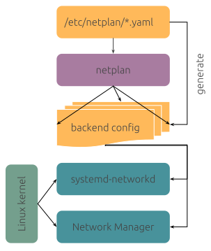

# 网络配置管理

!!! note "主要作者"

    [@Pd12][Pd12]

!!! warning "本文编写中"

## ifupdown

### ifupdown2

## systemd-networkd

## Netplan

Netplan 是 Canonical（Ubuntu 母公司）开发的一个网络配置抽象渲染器，常见于 Ubuntu 系统中。该程序可以将复杂的网络配置集中于一个或若干个 YAML 格式的文件（通常位于 /etc/netplan/ ）中，在系统启动时生成不同网络配置后端配置（目前有 NetworkManager 与 Systemd-networkd），起到简化网络配置的用途。其工作原理如下图所示：



这边只介绍该工具的常用命令与常见网络环境下的单文件配置，详细的文件可以参见 [Netplan 文档](https://netplan.io/)。

??? note "与 NetworkManager 和 Systemd-networkd 比较"

    编者同时使用过 NetworkManager，Systemd-networkd，Netplan 三者，根据个人经验给出一些比较。

    简单网络环境下（例如只是配置个固定 IP），使用哪种都差不多，一般系统默认安装哪个就用哪个。
    
    在易用性上，NetworkManager 完胜，该软件带有的 `nmtui` 工具可以使用图形界面配置网络，无需编写配置文件。如果需要使用 Systemd-networkd 提供的更多功能（例如在接口上启用 DHCP 服务器这种），请直接编写 Systemd-networkd 配置，缺点是需要编写大量配置文件（一般一个网络接口需要提供 .network .netdev 两个文件）。而 Netplan 则对配置文件进行了简化处理，一般只需要一个配置文件即可。
    

由于后续会涉及到配置样例，这边先做如下约定：

1. `/etc/netplan/` 中只有单个配置文件（需要以 `.yaml` 为后缀）。
2. 假定计算机中存在 2 个有线接口，其名称为 `eth0` 与 `eth1`，存在一个无线接口，其名称为 `wlan0` 。应用到实际的配置中，需要修改为实际存在的接口（可以使用 `ip link` 命令查看）。
3. 连接的网络为 `192.168.0.0/24` 网关为 `192.168.0.1`。

### 常用命令 {#netplan-command}

Netplan 的常用命令不多，只有 2 个：

```shell
netplan try # 应用配置并等待用户确认，用户未确认则回滚
netplan apply # 应用配置
```

大多数情况下（尤其是使用 ssh 远程修改网络配置时）建议使用 `netplan try` ，避免因为错误的网络配置导致 ssh 断开后失去远程访问。

### 改用 NetworkManager 管理网络 {#netplan-using-networkmanager}

如果希望 Netplan 将网络配置交由 NetworkManager 管理，只需要修改配置如下，应用配置即可：

```yaml
network:
  version: 2
  renderer: NetworkManager
```

### 有线网络使用 DHCP {#netplan-dhcp}

在 eth0 接口使用 DHCP，使用如下配置：

```yaml
network:
  version: 2 # 配置文件的版本 目前默认为 2
  renderer: networkd # 使用的后端，推荐使用 networkd
  ethernets:
    eth0:
      dhcp4: true
```

### 有线网络使用固定 IP 并配置 DNS 与默认路由 {#netplan-static-ip}

在 eth0 接口使用固定 IP 并配置 DNS 与默认路由，使用如下配置：

```yaml
network:
  version: 2
  renderer: networkd
  ethernets:
    eth0:
      dhcp4: false # 不使用 DHCP
      addresses:
      - 192.168.0.100/24 # 主机的 IP 此处要带上子网前缀长度
      routes: # 配置默认路由
      - to: default # 此处可以改为 0.0.0.0/0
        via: 192.168.0.1
      # 可以追加更多的路由条目
      nameservers:
        addresses: # 可以配置多个 DNS 服务器
        - 192.168.0.1 # 大多数路由器都会提供 DNS 服务
        - 119.29.29.29 # 这边使用腾讯 DNSPod 提供的 更多常用 DNS 服务可以参见 https://dns.icoa.cn/
```

### 连接到无线网络 {#netplan-wlan}

使用 wlan0 接口连接到开放的无线网络 `MyWifi`，使用 DHCP 配置地址，配置样例如下：

```yaml
network:
  version: 2
  renderer: networkd
  wifis:
    wlan0:
      dhcp4: true
      access-points:
        "MyWifi": {} # 只需要定义网络名称
```

如果网络有密码保护，配置样例如下：

```yaml
network:
  version: 2
  renderer: networkd
  wifis:
    wlan0:
      dhcp4: true
      access-points:
        "MyWifi": 
          password: "mypassword" # 这边替换为网络密码
```

如果网络为双频网络（即 2.4GHz 和 5GHz 共用一个 SSID），你希望连接到 5GHz 的网络，可以使用如下配置：

```yaml
network:
  version: 2
  renderer: networkd
  wifis:
    wlan0:
      dhcp4: true
      access-points:
        "MyWifi": 
          band: 5GHz # 指定使用 5GHz
```

使用静态地址的配置和有线网络接口类似，这边不再举例。

### 配置 IPv6 {#netplan-ipv6}

#### 内核参数检查 {#netplan-ipv6-check}

默认情况下，操作系统都默认启用了 IPv6 支持，可以通过 `sysctl -a | grep disable_ipv6` 命令查看当前系统内核参数，如果出现例如 `net.ipv6.conf.all.disable_ipv6 = 0` 或者 `net.ipv6.conf.eth0.disable_ipv6 = 0` （这里 eth0 是网络接口名称）则已经启用。如果值为 1，则需要编辑文件 `/etc/sysctl.conf` 或在目录 `/etc/sysctl.d/` 中修改或追加上述参数为 0，随后重启系统应用参数。

#### 使用 SLAAC（无状态地址自动配置）自动配置地址 {#netplan-ipv6-slaac}

该方式常见于家庭网络、企业网络和部分校园网络中，由路由器提供网络前缀（通常为前 64 位），主机使用不同的方式（例如随机值或是网络设备的 MAC 地址）生成接口标识（后 64 位）组合成 IPv6 地址。

大多数情况下，该模式默认为启用状态无需配置，当然也可以手动启用，下面给出在 eth0 接口使用静态 IPv4 地址和通过 SLAAC 模式获取 IPv6 地址的样例，该配置组合常见于家庭网络中。

```yaml
network:
  version: 2
  renderer: networkd
  ethernets:
    eth0:
      dhcp4: false # 不使用 DHCP
      dhcp6: false # 不使用 DHCP 获取 IPv6
      accept-ra: true # 通过 Router Advertisement 报文获取 IPv6 地址
      addresses:
      - 192.168.0.100/24 # 主机的 IP 此处要带上子网前缀长度
      routes: # 配置默认路由
      - to: default
        via: 192.168.0.1
      # 注 IPv6 的默认路由会通过 Router Advertisement 报文发送，无需额外配置
      nameservers:
        addresses: # 可以配置多个 DNS 服务器
        - 192.168.0.1 # 大多数路由器都会提供 DNS 服务
        - 119.29.29.29 # 这边使用腾讯 DNSPod 提供的 更多常用 DNS 服务可以参见 https://dns.icoa.cn/
        - 2402:4e00:: # 可以配置一个 IPv6 的 DNS 服务器 这边使用腾讯 DNSPod 提供的
```

#### 使用 DHCPv6 获取 IPv6 地址 {#netplan-ipv6-dhcpv6}

该方式常见于校园网络中，Router Advertisement 报文提供默认路由，地址通过 DHCPv6 分配。配置样例如下：

```yaml
network:
  version: 2
  renderer: networkd
  ethernets:
    eth0:
      dhcp4: false # 不使用 DHCP
      dhcp6: true # 这边改成 true
      accept-ra: true # 接受 Router Advertisement 报文
      addresses:
      - 192.168.0.100/24 # 主机的 IP 此处要带上子网前缀长度
      routes: # 配置默认路由
      - to: default
        via: 192.168.0.1
      # 注 IPv6 的默认路由会通过 Router Advertisement 报文发送，无需额外配置
      nameservers:
        addresses: # 可以配置多个 DNS 服务器
        - 192.168.0.1 # 大多数路由器都会提供 DNS 服务
        - 119.29.29.29 # 这边使用腾讯 DNSPod 提供的 更多常用 DNS 服务可以参见 https://dns.icoa.cn/
        - 2402:4e00:: # 可以配置一个 IPv6 的 DNS 服务器 这边使用腾讯 DNSPod 提供的
```

如果不清楚自己的网络是使用何种方式分发的 IPv6 地址，建议先按照 SLAAC 模式配置，无法获取再尝试使用 DHCPv6 获取。

#### 使用固定 IPv6 地址 {#netplan-ipv6-static}

IPv6 配置固定地址与 IPv4 类似，样例如下：

```yaml
network:
  version: 2
  renderer: networkd
  ethernets:
    eth0:
      dhcp4: false # 不使用 DHCP
      dhcp6: false # 不使用 DHCP
      accept-ra: false # 不接受 Router Advertisement 报文
      addresses:
      - 192.168.0.100/24 # 主机的 IP 此处要带上子网前缀长度
      - fda5:ebe7:7078:ad26::2/64 # 这边使用了私有 IPv6 范围的地址，可以访问 https://simpledns.plus/private-ipv6 获得
      routes: # 配置默认路由
      - to: default
        via: 192.168.0.1
      - to: default
        via: fe80::1daa:eaff:fe73:b2d2 # IPv6 的默认路由通常使用路由器的链路本地地址 当然也可以像 IPv4 一样使用同网段的 fda5:ebe7:7078:ad26::1
      nameservers:
        addresses: # 可以配置多个 DNS 服务器
        - 192.168.0.1 # 大多数路由器都会提供 DNS 服务
        - 119.29.29.29 # 这边使用腾讯 DNSPod 提供的 更多常用 DNS 服务可以参见 https://dns.icoa.cn/
        - 2402:4e00:: # 可以配置一个 IPv6 的 DNS 服务器 这边使用腾讯 DNSPod 提供的
```

??? note "何时使用静态 IPv6 地址"

    大多数情况下 IPv6 都使用动态方式分配地址，很少使用静态 IPv6 地址。编者唯一使用过的情况是校园网中使用路由器架设宿舍网络，由于学校的网络需要登陆使用，只能使用一个 IPv6 地址，故不得不采取 NAT 的形式在宿舍网络中使用 IPv6 网络。

### 创建网桥 {#netplan-bridge}

假设需要创建网桥 br0 用于桥接接口 eth0 与 eth1，样例配置如下：

```yaml
network:
  version: 2
  renderer: networkd
  ethernets:
    eth0: # 作为网桥的端口使用时，不需要获取地址
      dhcp4: false
      dhcp6: false
      accept-ra: false
    eth1:
      dhcp4: false
      dhcp6: false
      accept-ra: false
  bridges:
    br0:
      interfaces: # 此处声明网桥的接口
      - eth0
      - eth1
      dhcp4: false
      # 不需要 IPv6 的，可以设置 dhcp6 accept-ra 为 false
      dhcp6: false
      accept-ra: true
      addresses:
      - 192.168.0.100/24 # 主机的 IP 此处要带上子网前缀长度
      routes: # 配置默认路由
      - to: default
        via: 192.168.0.1
      nameservers:
        addresses: # 可以配置多个 DNS 服务器
        - 192.168.0.1 # 大多数路由器都会提供 DNS 服务
        - 119.29.29.29 # 这边使用腾讯 DNSPod 提供的 更多常用 DNS 服务可以参见 https://dns.icoa.cn/
        - 2402:4e00:: # 可以配置一个 IPv6 的 DNS 服务器 这边使用腾讯 DNSPod 提供的
```

??? note "无线网络与网桥"

    注意，大多数情况下 wlan 接口作为客户端运行时无法作为网桥的子接口（AP 模式可以）。如果的确需要多设备接入无线网络，建议使用 网桥+NAT 实现。

### 接入 VLAN {#netplan-vlan}

假设接口 eth0 作为 Trunk 接口使用，需要接入 VLAN 2-3，配置样例如下：

```yaml
network:
  version: 2
  renderer: networkd
  ethernets:
    eth0: # 此处配置未带 VLAN 标签的网络参数
      dhcp4: false # 不使用 DHCP
      addresses:
      - 192.168.0.100/24 # 主机的 IP 此处要带上子网前缀长度
      routes: # 配置默认路由
      - to: default
        via: 192.168.0.1
      nameservers:
        addresses: # 可以配置多个 DNS 服务器
        - 192.168.0.1 # 大多数路由器都会提供 DNS 服务
        - 119.29.29.29 # 这边使用腾讯 DNSPod 提供的 更多常用 DNS 服务可以参见 https://dns.icoa.cn/
  vlans:
    eth0.2: # 此处的名称可以自定义，这边使用惯例 [母接口名称].[VLAN ID] 的命名方式
      id: 2 # 声明该接口的 VLAN ID
      link: eth0 # 该接口的母接口
      # 后续的配置和 eth0 一样，此处简化为使用 dhcp
      dhcp4: true
    eth0.3: # 再创建一个 VLAN ID 为 3 的接口
      id: 3 # 声明该接口的 VLAN ID
      link: eth0 # 该接口的母接口
      # 后续的配置和 eth0 一样，此处简化为使用 dhcp
      dhcp4: true
```

### VLAN 接入网桥 {#netplan-vlan-bridge}

假设接口 eth0 作为 Trunk 接口使用，需要接入 VLAN 2-3 并接入各自的网桥，配置样例如下：

```yaml
network:
  version: 2
  renderer: networkd
  ethernets:
    eth0: # 作为网桥的端口使用时，不需要获取地址
      dhcp4: false
      dhcp6: false
      accept-ra: false
  vlans: # 先声明 VLAN 后，再将 VLAN 接口接入网桥
    eth0.2: # 此处的名称可以自定义，这边使用惯例 [母接口名称].[VLAN ID] 的命名方式
      id: 2 # 声明该接口的 VLAN ID
      link: eth0 # 该接口的母接口
      dhcp4: false
      dhcp6: false
      accept-ra: false
    eth0.3: # 再创建一个 VLAN ID 为 3 的接口
      id: 3 # 声明该接口的 VLAN ID
      link: eth0 # 该接口的母接口
      dhcp4: false
      dhcp6: false
      accept-ra: false
  bridges:
    br0:
      interfaces: # 此处声明网桥的接口
      - eth0
      dhcp4: false
      # 不需要 IPv6 的，可以设置 dhcp6 accept-ra 为 false
      dhcp6: false
      accept-ra: true
      addresses:
      - 192.168.0.100/24 # 主机的 IP 此处要带上子网前缀长度
      routes: # 配置默认路由
      - to: default
        via: 192.168.0.1
      nameservers:
        addresses: # 可以配置多个 DNS 服务器
        - 192.168.0.1 # 大多数路由器都会提供 DNS 服务
        - 119.29.29.29 # 这边使用腾讯 DNSPod 提供的 更多常用 DNS 服务可以参见 https://dns.icoa.cn/
        - 2402:4e00:: # 可以配置一个 IPv6 的 DNS 服务器 这边使用腾讯 DNSPod 提供的
    br2:
      interfaces: # 此处声明网桥的接口
      - eth0.2
      # 后续的配置简化为使用 dhcp
      dhcp4: true
    br3:
      interfaces: # 此处声明网桥的接口
      - eth0.3
      # 后续的配置简化为使用 dhcp
      dhcp4: true
```
