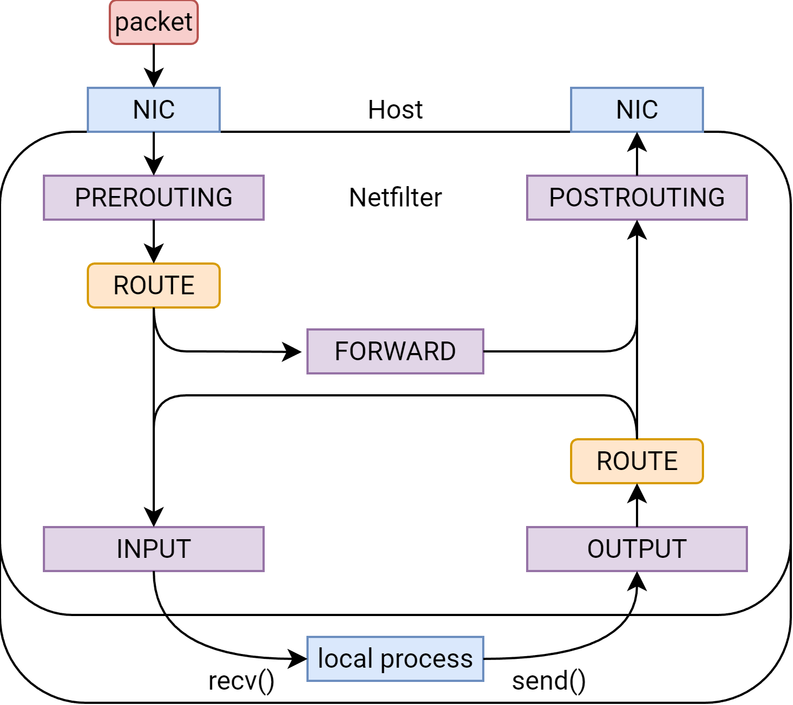

# 防火墙

!!! warning "本文编写中"

Linux 内核网络栈中的防火墙模块称为 Netfilter，负责对进出主机的数据包进行过滤和修改。Netfilter 提供了一套强大的工具，用于实现各种防火墙功能，如包过滤、网络地址转换（NAT）和连接跟踪等。

## Netfilter 阶段 {#netfilter-chains}

Netfilter 将数据包的处理过程划分为 5 个阶段，并在每个阶段提供 hook 点，允许用户定义规则来控制数据包的流动。
这些阶段包括：

PREROUTING / `NF_INET_PRE_ROUTING`

:   数据包由网络接口（网卡）接收后，首先进入 PREROUTING 阶段。这个阶段通常用于更改目的地址（DNAT）。

INPUT / `NF_INET_LOCAL_IN`

:   数据包在经过路由决策后，如果目标是本地主机，则进入 INPUT 阶段。这个阶段通常用于过滤，管控对本地服务的访问，以及（如有必要）更改源地址（SNAT）。

FORWARD / `NF_INET_FORWARD`

:   如果由外部网络进入的数据包的目标不是本地主机，而是需要由本机转发到其他主机，则进入 FORWARD 阶段。这个阶段通常用于过滤。

OUTPUT / `NF_INET_LOCAL_OUT`

:   由本地主机发出的数据包首先进入 OUTPUT 阶段。这个阶段通常用于过滤，管控本地应用程序对外的网络访问，以及（如有必要）更改目的地址（DNAT）。

POSTROUTING / `NF_INET_POST_ROUTING`

:   数据包在离开主机由网卡发出之前，进入 POSTROUTING 阶段。这个阶段通常用于更改源地址（SNAT）。

从主机的视角来看，数据包经过 Netfilter 的各个阶段的路径如下图所示：

/// caption
从主机视角看 Netfilter 的各个阶段
///

在上图中，ROUTE 指[路由决策](routing.md)。

## iptables 表 {#iptables-tables}

iptables 是 Netfilter 的用户空间工具，用于管理防火墙规则。
iptables 将规则组织成不同的表，每个表包含多个链（chain），每个链对应一个 Netfilter 阶段。
iptables 的主要表类型有以下几种：

filter

:   默认表，用于包过滤，其中 DROP 和 REJECT 目标通常只用在此表中。

nat

:   用于网络地址转换（NAT），如源地址转换（SNAT）和目的地址转换（DNAT）。其中「伪装」（MASQUERADE）是一种特殊的 SNAT 方式，让内核根据网卡上配置的地址自动决定替换后的源地址，通常用于动态 IP 地址的场景。

    需要注意的是，nat 表的 PREROUTING 和 OUTPUT 链只能使用 DNAT 目标，而 INPUT 和 POSTROUTING 链只能使用 SNAT（或 MASQUERADE）目标。

    特别的是，仅有建立新连接的数据包会经过 nat 表，而已经建立连接的数据包不会经过 nat 表，而是由 conntrack 模块处理。
    对于用户而言，可以理解为「nat 表自带 `--ctstate NEW` 约束，之后的数据包都使用已经转换后的地址进行通信」。

mangle

:   用于修改原始数据包，如更改 TOS（服务类型）或 TTL（生存时间），也包括打上防火墙标记（`-j MARK`）。这个表通常用于高级的包处理。

raw

:   用于处理原始数据包，将包标记为不经过连接跟踪（如 `-j CT --notrack`），或引入其他连接跟踪帮助模块（如 `-j CT --helper`）。

另有 security 表用于 SELinux 等安全模块的集成，但在大多数系统中不常用。Security 表与 filter 表适用于相同的阶段（Netfilter hook 点），且运行在 filter 表之后，即能够进入 security 表中的数据包都已由 filter 表标记为接受（ACCEPT）了。

各个表在各个阶段的可用性如下表所示：

| 阶段        | filter / security                        | nat                                      | mangle                                   | raw                                      |
| ----------- | ---------------------------------------- | ---------------------------------------- | ---------------------------------------- | ---------------------------------------- |
| PREROUTING  | :fontawesome-solid-xmark:{: .orangered } | DNAT only | :fontawesome-solid-check:{: .limegreen } | :fontawesome-solid-check:{: .limegreen } |
| INPUT       | :fontawesome-solid-check:{: .limegreen } | SNAT only | :fontawesome-solid-check:{: .limegreen } | :fontawesome-solid-xmark:{: .orangered } |
| FORWARD     | :fontawesome-solid-xmark:{: .orangered } | :fontawesome-solid-check:{: .limegreen } | :fontawesome-solid-xmark:{: .orangered } | :fontawesome-solid-check:{: .limegreen } |
| OUTPUT      | :fontawesome-solid-check:{: .limegreen } | DNAT only | :fontawesome-solid-check:{: .limegreen } | :fontawesome-solid-check:{: .limegreen } |
| POSTROUTING | :fontawesome-solid-xmark:{: .orangered } | SNAT only | :fontawesome-solid-check:{: .limegreen } | :fontawesome-solid-xmark:{: .orangered } |

在同一个阶段中，不同表的处理顺序为 raw → mangle → nat (DNAT) → filter → security → nat (SNAT)。

若从 Netfilter 自己的视角，将网卡和本地进程（数据包的来源和接收者）都看作外部元素的话，各个阶段及其可用的表和处理顺序如下图所示：

/// caption
从 Netfilter 自己的视角看各个阶段，以及每个阶段可用的表
///
