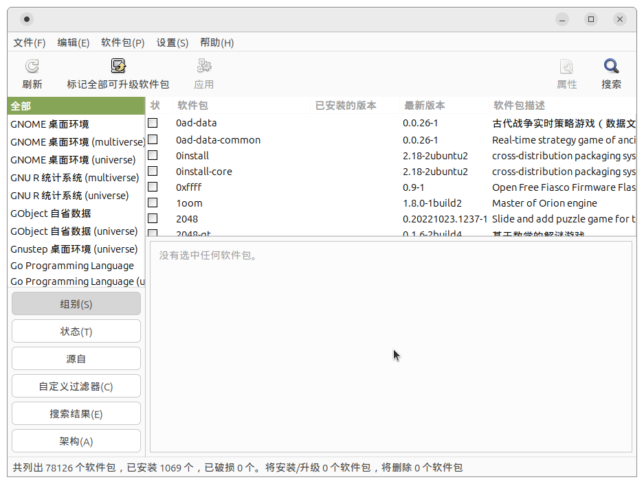

# 包管理系统

!!! note "主要作者"

    [@taoky][taoky]、[@2403772980ygy][2403772980ygy]

!!! success "本文已完成"

包管理系统是现代 Linux 发行版的重要组成部分。以下介绍与 Debian 的包管理系统相关工具，例如 APT（Advanced Package Tool）。其他发行版的包管理系统会有所不同，可参考 [Arch Linux Wiki 的 pacman/Rosetta 页面](https://wiki.archlinux.org/title/Pacman/Rosetta)。

本文假设读者了解最基础的 `apt` 使用方法，如 `apt install`, `apt remove`, `apt update`, `apt upgrade`。

## APT 常用操作 {#apt-common-operations}

Debian 有多个与软件包管理相关的工具。

其中的底层工具为 dpkg。dpkg 不负责管理软件依赖关系，只管理具体某一个包的安装、卸载等操作。因此**除非需要排查疑难问题，否则不应该直接使用 dpkg 修改系统状态**。

!!! warning "避免在安装 deb 文件时使用 dpkg"

    网络上许多教程，甚至是一些官方文档，都会建议使用 `dpkg -i` 安装 deb 文件。当 deb 存在依赖，并且系统未安装满足要求的依赖时，直接使用 `dpkg` 会导致系统依赖管理出现问题，需要额外花费精力修复。

    建议始终使用 `apt install ./path/to/package.deb` 的方式安装 deb 文件。

从用户视角来看，最常使用的工具是 apt（以及其他以 `apt-` 开头的命令）。

### 标记软件包为自动/手动安装 {#auto-manual}

绝大多数软件包都不是孤立的：它们也有自己的依赖。那么，如果安装了一个带有其他依赖的软件，然后再删除这个软件，其引入的依赖不会被自动删除，不过：

```console
# apt install x11-apps
Reading package lists... Done
Building dependency tree... Done
Reading state information... Done
The following additional packages will be installed:
  bsdextrautils bsdutils fontconfig-config fonts-dejavu-core groff-base libblkid1 libbrotli1 libbsd0 libexpat1 libfontconfig1 libfreetype6 libgdbm6 libice6 libmount1
  libpipeline1 libpng16-16 libsm6 libsmartcols1 libuchardet0 libuuid1 libx11-6 libx11-data libx11-xcb1 libxau6 libxaw7 libxcb-damage0 libxcb-present0 libxcb-xfixes0 libxcb1
  libxcursor1 libxdmcp6 libxext6 libxfixes3 libxft2 libxi6 libxkbfile1 libxmu6 libxmuu1 libxpm4 libxrender1 libxt6 man-db mount util-linux util-linux-extra x11-common
  xbitmaps
Suggested packages:
  groff gdbm-l10n cryptsetup-bin apparmor less www-browser nfs-common dosfstools kbd util-linux-locales mesa-utils
Recommended packages:
  uuid-runtime sensible-utils
The following NEW packages will be installed:
  bsdextrautils fontconfig-config fonts-dejavu-core groff-base libbrotli1 libbsd0 libexpat1 libfontconfig1 libfreetype6 libgdbm6 libice6 libpipeline1 libpng16-16 libsm6
  libuchardet0 libx11-6 libx11-data libx11-xcb1 libxau6 libxaw7 libxcb-damage0 libxcb-present0 libxcb-xfixes0 libxcb1 libxcursor1 libxdmcp6 libxext6 libxfixes3 libxft2
  libxi6 libxkbfile1 libxmu6 libxmuu1 libxpm4 libxrender1 libxt6 man-db x11-apps x11-common xbitmaps
The following packages will be upgraded:
  bsdutils libblkid1 libmount1 libsmartcols1 libuuid1 mount util-linux util-linux-extra
8 upgraded, 40 newly installed, 0 to remove and 4 not upgraded.
（以下省略）
# apt remove x11-apps
Reading package lists... Done
Building dependency tree... Done
Reading state information... Done
The following packages were automatically installed and are no longer required:
  fontconfig-config fonts-dejavu-core groff-base libbrotli1 libbsd0 libexpat1 libfontconfig1 libfreetype6 libgdbm6 libice6 libpipeline1 libpng16-16 libsm6 libuchardet0
  libx11-6 libx11-data libx11-xcb1 libxau6 libxaw7 libxcb-damage0 libxcb-present0 libxcb-xfixes0 libxcb1 libxcursor1 libxdmcp6 libxext6 libxfixes3 libxft2 libxi6
  libxkbfile1 libxmu6 libxmuu1 libxpm4 libxrender1 libxt6 man-db x11-common xbitmaps
Use 'apt autoremove' to remove them.
The following packages will be REMOVED:
  x11-apps
0 upgraded, 0 newly installed, 1 to remove and 4 not upgraded.
```

可以发现，虽然 `x11-apps` 在该环境中引入的依赖没有被自动删除，但是 APT 知道哪些依赖是不再被需要的了。这有赖于 APT 的软件包标记功能：用户直接安装的包会被标记为手动安装（manual），而被这样引入的依赖会被标记为自动安装（automatic）。于是，没有被任何手动安装的包直接以及间接依赖的自动安装的包就可以被 `apt autoremove` 移除。

`apt-mark` 命令可以显示、修改标记：

- `apt-mark showauto` 与 `apt-mark showmanual` 可以显示系统中被标记为自动安装与手动安装的包。
- `apt-mark auto <package>` 与 `apt-mark manual <package>` 可以修改包的标记。

### 推荐与建议 {#recommends-suggests}

安装软件包时，APT 在默认配置下会安装推荐（Recommended）的包。建议（Suggested）的包会显示在安装界面，但是不会自动被安装。例如在 Debian 12 中，[docker.io 包](https://packages.debian.org/bookworm/docker.io)的推荐有 apparmor、ca-certificates 等，建议包有 btrfs-progs、debootstrap 等。那么在安装 `docker.io` 时，包括 apparmor、ca-certificates 等包就会默认被安装，并且用户也可以看到这些包建议，并且可以在当前包安装完成后自行安装。

大部分情况下，被设置为「推荐」的包是有意义的，如果不安装，可能程序仍然可以运行，但是会缺失一些重要的功能。不过在某些环境下，例如容器场景，我们需要安装的包尽可能得少。为了精简安装的软件包，可以使用 `--no-install-recommends` 的选项，以跳过推荐的软件包。还可以在 [`apt.conf`][apt.conf.5] 配置中添加 `Apt::Install-Recommends "false"` 以使默认配置不会安装推荐的包。

!!! tip "使用 `.conf.d` 目录形式，避免直接修改 `.conf` 配置文件"

    对于绝大多数 Debian 包来说，软件包对应的配置文件（以下称为 `.conf` 文件）是直接由软件包安装（管理）的。尽管直接修改配置也可以达到目的，但是在软件包升级，特别是系统大版本更新时，`apt` 会要求用户手工介入配置冲突问题（保留原配置，或者安装新配置），会带来一些困扰。

    目前大部分软件包的配置文件都支持 `.conf.d` 目录形式，允许用户以不同文件的形式添加自己的配置片段，对应的程序会「导入」这些配置。这种方式不仅可以避免直接修改软件包的配置文件，还可以更好地管理配置文件（例如，用户可以将不同目的的配置以不同的文件名存储，提升配置的可维护性）。

    以上文的 `apt.conf` 为例，这里推荐的做法是在 `/etc/apt/apt.conf.d/` 目录下创建一个新的 `.conf` 文件，在其中写入需要的配置，例如不安装推荐包：

    ```shell
    echo 'APT::Install-Recommends "false";' | sudo tee /etc/apt/apt.conf.d/99no-install-recommends
    ```

    某些软件会根据文件名的字典序来决定配置的优先级，因此这里使用 `99` 作为前缀，确保这个配置文件在其他配置文件之后被读取。

!!! tip "为什么某个包会被安装"

    由于推荐关系的存在，有时候在安装某个包时，会带上一些看起来无关的包。可以使用[下文介绍的 aptitude](#apt-frontend) 的 `why` 命令查看，例如确认为什么 `apt install lightdm` 会安装 `plymouth`：

    ```console
    $ aptitude why lightdm plymouth
    p   lightdm             Depends    lightdm-gtk-greeter | lightdm-greeter
    p   lightdm-gtk-greeter Recommends desktop-base
    p   desktop-base        Recommends plymouth-label
    p   plymouth-label      Depends    plymouth (= 24.004.60-5)
    ```

### 搜索包 {#search}

Debian 与 Ubuntu 均提供了网页端搜索软件包的服务：[Debian 软件包](https://packages.debian.org/)、[Ubuntu Packages Search](https://packages.ubuntu.com/)。不过，使用 apt 工具搜索来快得多。

#### `apt search` 与 apt 搜索模式 {#apt-search-pattern}

`apt search <name>` 会根据包名与描述进行包的查找，支持正则表达式：

```console
$ apt search wayland
Sorting... Done
Full Text Search... Done
bemenu/noble 0.6.15+dfsg-1build2 amd64
  Dynamic menu inspired by dmenu

cage/noble 0.1.5+20240127-2build1 amd64
  Kiosk compositor for Wayland
（以下省略）
$ apt search ^docker
Sorting... Done
Full Text Search... Done
debocker/noble 0.2.5 all
  docker-powered package builder for Debian

docker-buildx/noble-updates 0.14.1-0ubuntu1~24.04.1 amd64
  Docker CLI plugin for extended build capabilities with BuildKit
（以下省略）
```

不过，有些时候这种搜索也不太符合需求，例如有些时候我们只想搜索包名等，此时可以使用 apt 搜索模式（search pattern）来进行更具体的查找。完整文档可以参考 [apt-patterns(7)][apt-patterns.7]。搜索模式不适用于 `apt search`，但适用于其他各类 apt 命令，例如 `apt list`、`apt show`、`apt remove` 等。

以下是一些常见的 apt 搜索模式，句尾括号为更加繁琐的完整表示：

- `~nREGEX` 包名称满足正则表达式的包（`?name(REGEX)`）。
- `~c` 已经删除，但是仍然有配置残留的包，可以使用 `apt purge` 彻底删除（`?config-files`）。
- `~i` 为已经安装的包（`?installed`）。
- `~U` 可以升级的包（`?upgradable`）。
- `~o` 远程已经不再存在的包，一般是在系统大版本更新后残留的旧包，或者是本地手动安装的包（`?obsolete`，在 `apt list` 的输出中显示为 `[installed,local]`）。

!!! question "搜索模式练习"

    请尝试写出以下查询的搜索模式，并且在自己的环境中试一试：

    - 输出（提示：`apt list`）所有未完全删除以及远程仓库不再提供的包（虽然 `apt purge` 也支持搜索模式，小心执行，因为所有配置都会被删除！）
    - 输出本地安装的名字里有 `top` 的所有包
        - 提示：可以像这样要求同时满足多个 pattern: `apt list 'P1 P2 P3'`

#### 文件搜索：`apt-file` {#apt-file}

如果使用过默认安装的 Ubuntu 的话，可能会发现，在输入命令时，如果命令不存在，会有类似下面的提示：

```console
$ htop
Command 'htop' not found, but can be installed with:
sudo apt install htop
```

这是由 `command-not-found` 包支持的，不过可以注意到，这一项功能会拖慢与 shell 交互时的速度，因此这里更加推荐删除这个包，只在需要的时候用 `apt-file` 命令搜索。

在操作前，需要执行 `apt-file update` 命令更新本地文件与包关系的数据库的初始化及更新。之后使用 `apt-file search <file>` 就可以搜索包含某个文件的包：

```console
$ apt-file search execsnoop
bpfcc-tools: /usr/sbin/execsnoop-bpfcc
bpfcc-tools: /usr/share/doc/bpfcc-tools/examples/doc/execsnoop_example.txt
bpfcc-tools: /usr/share/man/man8/execsnoop-bpfcc.8.gz
bpftrace: /usr/sbin/execsnoop.bt
bpftrace: /usr/share/doc/bpftrace/examples/execsnoop_example.txt
bpftrace: /usr/share/man/man8/execsnoop.bt.8.gz
golang-github-iovisor-gobpf-dev: /usr/share/gocode/src/github.com/iovisor/gobpf/examples/bcc/execsnoop/execsnoop.go
golang-github-iovisor-gobpf-dev: /usr/share/gocode/src/github.com/iovisor/gobpf/examples/bcc/execsnoop/output.go
libbpf-tools: /usr/sbin/execsnoop
pcp: /usr/lib/pcp/pmdas/bcc/modules/execsnoop.bpf
pcp: /usr/lib/pcp/pmdas/bcc/modules/execsnoop.python
pcp: /usr/lib/pcp/pmdas/bpf/modules/execsnoop.so
pcp: /usr/share/pcp/htop/screens/execsnoop
pcp: /var/lib/pcp/pmdas/bcc/modules/execsnoop.bpf
pcp: /var/lib/pcp/pmdas/bcc/modules/execsnoop.python
pcp: /var/lib/pcp/pmdas/bpf/modules/execsnoop.so
perf-tools-unstable: /usr/sbin/execsnoop-perf
perf-tools-unstable: /usr/share/doc/perf-tools-unstable/examples/execsnoop_example.txt
perf-tools-unstable: /usr/share/man/man8/execsnoop-perf.8.gz
systemtap-doc: /usr/share/systemtap/examples/lwtools/execsnoop-nd.8
systemtap-doc: /usr/share/systemtap/examples/lwtools/execsnoop-nd.meta
systemtap-doc: /usr/share/systemtap/examples/lwtools/execsnoop-nd.stp
systemtap-doc: /usr/share/systemtap/examples/lwtools/execsnoop-nd_example.txt
```

此外，`apt-file list <package>` 可以查看某个包中包含的文件：

```console
$ apt-file list htop
htop: /usr/bin/htop
htop: /usr/share/applications/htop.desktop
htop: /usr/share/doc/htop/AUTHORS
htop: /usr/share/doc/htop/README.gz
htop: /usr/share/doc/htop/changelog.Debian.gz
htop: /usr/share/doc/htop/copyright
htop: /usr/share/icons/hicolor/scalable/apps/htop.svg
htop: /usr/share/man/man1/htop.1.gz
htop: /usr/share/pixmaps/htop.png
```

!!! tip "使用 dpkg 类命令在**已安装的包**内查找文件"

    `apt-file` 依赖于对完整仓库的索引，并且搜索也是一个略微耗时的过程。如果只需要确认本地已经安装的包，以及已有的 deb 包文件中的文件情况，有更快的方法：

    - `dpkg-query -S <file>` 可以查找所有已安装包中的文件。
    - `dpkg-deb -c <name_version.deb>` 可以查看 `.deb` 文件中的内容。
    - `dpkg-query -L <name>` 查看给定的安装了的包提供了哪些文件。

    这几条命令的 `dpkg-*` 部分都可以直接替换为 `dpkg`，例如 `dpkg -S`、`dpkg -c`、`dpkg -L` 等，`dpkg` 命令前端会帮你把请求转发到正确的子命令上。

### 固定包 {#apt-hold}

有时我们希望固定一个包，使得这个包不会被安装或升级，例如：

- 我们自行打包了某个有 bug 的包的修复版本，同时不希望系统自动升级到官方的版本。这时可以使用 `apt-mark hold <name>` 来标记这个包为固定的。
- 我们不希望 Ubuntu 服务器安装 Snap，此时可以使用 `apt-mark hold snapd` 来固定（阻止）Snap 的安装：

    ```console
    $ sudo apt-mark hold snapd
    $ sudo apt install chromium
    Reading package lists... Done
    Building dependency tree... Done
    Reading state information... Done
    Note, selecting 'chromium-browser' instead of 'chromium'
    Some packages could not be installed. This may mean that you have
    requested an impossible situation or if you are using the unstable
    distribution that some required packages have not yet been created
    or been moved out of Incoming.
    The following information may help to resolve the situation:

    The following packages have unmet dependencies:
    chromium-browser : PreDepends: snapd but it is not going to be installed
    E: Unable to correct problems, you have held broken packages.
    ```

`apt-mark unhold` 可以取消固定，而 `apt-mark showhold` 可以查看所有被固定的包。

### Alternatives {#alternatives}

Debian 的 Alternatives 机制允许系统安装同一软件的多个版本（例如 Java），或者同一类型软件的多个实现（例如文本编辑器），并且用户可以切换默认使用的版本。`/etc/alternatives/` 目录包含了所有在 Alternatives 机制下的软链接。以 `editor` 为例，在 Debian 下 `/usr/bin/editor` 是一个指向 `/etc/alternatives/editor` 的软链接，而 `/etc/alternatives/editor` 指向的对象由用户配置决定。

使用 `update-alternatives` 命令可以管理 Alternatives 机制的映射：

```shell
$ ls -lh /etc/alternatives/editor
lrwxrwxrwx 1 root root 9 Aug  29 2022  /etc/alternatives/editor -> /bin/nano
$ sudo update-alternatives --config editor
There are 4 choices for the alternative editor (providing /usr/bin/editor).

  Selection    Path                Priority   Status
------------------------------------------------------------
* 0            /bin/nano            40        auto mode
  1            /bin/ed             -100       manual mode
  2            /bin/nano            40        manual mode
  3            /usr/bin/vim.basic   30        manual mode
  4            /usr/bin/vim.tiny    15        manual mode

Press <enter> to keep the current choice[*], or type selection number: 3
update-alternatives: using /usr/bin/vim.basic to provide /usr/bin/editor (editor) in manual mode
$ ls -lh /etc/alternatives/editor
lrwxrwxrwx 1 root root 18 Feb  9 15:54 /etc/alternatives/editor -> /usr/bin/vim.basic
```

### 自动更新 {#unattended-upgrade}

一般而言，使用 apt 的系统默认安装了 `unattended-upgrades` 包，如果系统上没有，安装该包即可。一些 Debian 系统镜像在预配置阶段会关闭自动更新，这可以通过以下命令确认（需要安装 `debconf-utils` 包）：

```sh
debconf-get-selections | grep unattended-upgrades/enable_auto_updates
```

如果输出的内容类似下面：

```console
unattended-upgrades	unattended-upgrades/enable_auto_updates	boolean	false
```

则代表自动更新被关闭，反之则启用。可以执行 `dpkg-reconfigure unattended-upgrades` 修改配置。当自动更新启用时，`/etc/apt/apt.conf.d/20auto-upgrades` 文件应当存在。`unattended-upgrades` 需要由定时任务触发，因此需要确认与 APT 更新相关的 timer（`apt-daily.timer` 和 `apt-daily-upgrade.timer`）处于启用状态。

可以使用以下命令：

```sh
sudo unattended-upgrades --dry-run --debug
```

查看并确认系统自动更新时的行为。默认情况下，自动更新只会操作 Debian 官方上游的包，用户自己设置的源不会被自动更新，这一点可以在 `/etc/apt/apt.conf.d/50unattended-upgrades` 文件中验证：

```apt.conf
// Automatically upgrade packages from these (origin:archive) pairs
//
// Note that in Ubuntu security updates may pull in new dependencies
// from non-security sources (e.g. chromium). By allowing the release
// pocket these get automatically pulled in.
Unattended-Upgrade::Allowed-Origins {
	"${distro_id}:${distro_codename}";
	"${distro_id}:${distro_codename}-security";
	// Extended Security Maintenance; doesn't necessarily exist for
	// every release and this system may not have it installed, but if
	// available, the policy for updates is such that unattended-upgrades
	// should also install from here by default.
	"${distro_id}ESMApps:${distro_codename}-apps-security";
	"${distro_id}ESM:${distro_codename}-infra-security";
//	"${distro_id}:${distro_codename}-updates";
//	"${distro_id}:${distro_codename}-proposed";
//	"${distro_id}:${distro_codename}-backports";
};
```

此外，systemd 服务 `unattended-upgrades.service` 会确保系统在关机或重启前正确进行软件包升级的收尾工作。因此也需要确认该服务已启动并会开机自启。

### APT 前端 {#apt-frontend}

APT 面向用户使用的前端除了 `apt` 以外，还有 `apt-get`、`aptitude` 和 `synaptic` 等。其中 `apt-get` 是早期的 Debian 的包管理工具，基础功能与 `apt` 类似（如 `apt-get update`、`apt-get install` 等），但是用户体验不如 `apt` 友好，由于其交互界面不再变化，因此仅适用于需要使用脚本交互的场景；`synaptic` 是图形界面的包管理工具（中文名为「新立得软件包管理器」）。



Ubuntu 24.04 下的新立得软件包管理器截图
{: .caption }

`aptitude` 提供了 TUI 界面的包管理功能，不过对于运维的场景下，其更加重要的是相比于 `apt` 更灵活的依赖解析功能。在系统出现损坏包的情况下，`apt` 可能无法提供有效的解决方案，而 `aptitude` 会计算出多种解法，并且提供给用户选择。

### 完整性校验 {#verify}

dpkg 可以对已经安装的包进行完整性校验。`dpkg --verify <name>` 可以校验已经安装的包的完整性，可以省略 `<name>` 选项，以对于所有包进行检查。如果怀疑软件包文件因意外被破坏（例如在升级时断电，或误删除等），可以使用该命令确认哪些软件包需要重新安装。

!!! example "检查某系统强制重启后无法开机的问题"

    一个现实发生的例子是，某系统强制重启后无法正常开机，提示：

    ```console
    [    4.634427] systemd[1]: Assertion 'close_nointr(fd) != -EBADF' failed at src/basic/fd-util.c:77, function safe_close(). Aborting.
    [    4.635043] systemd[1]: Caught <ABRT> from our own process.
    [    4.635624] systemd[1]: Caught <ABRT>, core dump failed (child 225, code=killed, status=6/ABRT).
    [    4.635750] systemd[1]: Freezing execution.
    ```

    使用 ISO 引导后 `chroot` 到系统，执行 `dpkg --verify`，发现：

    ```console
    # dpkg --verify
    （省略）
    ??5??????   /usr/lib/x86_64-linux-gnu/systemd/libsystemd-core-252.so
    ```

    重新安装 `libsystemd-shared` 包后，问题解决。

`dpkg --verify` 默认输出为 `rpm -V` 风格，类似如下：

```rpm
??5??????   /some/file
??5?????? c /some/config_file
missing     /some/missing_file
```

`dpkg` 目前只会检查文件的 MD5（即上面的 `5`），因此其他列均标记为 `?`（未检查）。`c` 代表是配置文件，`missing` 代表文件不存在。

!!! warning "`dpkg --verify` 不是为安全性用途设计的"

    如果怀疑攻击者已经有对应机器的 root 权限，那么 `dpkg --verify` 的结果是不可信的，因为攻击者可以修改 `dpkg` 本身，或者修改本地的包数据库。

### 软件优先级 {#priority}

有时候，我们会设置多个不同的源，而这些源会提供相同名称的软件包，例如：

- 正常安装的系统中，security 源提供了一些主源已有的软件包的，包含安全修复的更新版本。
- 在 stable 版本的 Debian 中添加 [backports](https://backports.debian.org/) 源，以获取一些来自 testing 的，在 stable 下重新编译的新版本的软件包。
- Ubuntu 源中的 `firefox` 为 Snap 包，而来自 Mozilla 的 APT 仓库的 `firefox` 为原生的 deb 包（[Mozilla 的帮助信息](https://support.mozilla.org/en-US/kb/install-firefox-linux#w_install-firefox-deb-package-for-debian-based-distributions-recommended)）。

APT 选择包的逻辑并非单纯的「版本越新越好」（比如，用户添加 backports 源**不代表**用户希望所有 backports 有的软件都安装最新版本），而是根据优先级来选择。默认的优先级为 500，如果优先级一致，才会根据版本号来选择。

Backports 源的优先级为 100，因为其 `Release` 文件中 `NotAutomatic` 和 `ButAutomaticUpgrades` 字段都为 `yes`，[因此 APT 会授予 backports 100 的优先级](https://wiki.debian.org/DebianRepository/Format#NotAutomatic_and_ButAutomaticUpgrades)。如果只有 `NotAutomatic` 为 `yes`，则优先级为 1。

我们通过 `apt-cache policy <name>` 查看包的安装状态与优先级信息，以某配置了 backports、[deb-multimedia](https://deb-multimedia.org/)，并且有一段时间未升级的系统为例：

```console
$ apt-cache policy yt-dlp
yt-dlp:
  Installed: 1:2024.10.07-dmo1
  Candidate: 1:2025.01.26-dmo1
  Version table:
     1:2025.01.26-dmo1 500
        500 http://mirrors.ustc.edu.cn/deb-multimedia bookworm/main amd64 Packages
 *** 1:2024.10.07-dmo1 100
        100 /var/lib/dpkg/status
     2025.01.26-1~bpo12+1 100
        100 http://mirrors.ustc.edu.cn/debian bookworm-backports/main amd64 Packages
     2023.03.04-1 500
        500 http://mirrors.ustc.edu.cn/debian bookworm/main amd64 Packages
```

可以看到，APT 已知四个不同的 `yt-dlp` 版本，分别是 deb-multimedia 的 `1:2025.01.26-dmo1`、本地安装的 `1:2024.10.07-dmo1`、backports 的 `2025.01.26-1~bpo12+1` 以及官方源的 `2023.03.04-1`。特别地，本地的版本的优先级为 100。因此当执行更新命令时，APT 会首先选择优先级最高的（`deb-multimedia` 或者官方源），然后选择版本最高的（`1:2025.01.26-dmo1`）。

!!! note "如果本地的版本比远程的版本更高……"

    此时 APT **不会降级**软件包，除非远程对应的优先级超过 1000。如果需要手动降级，可以使用 `apt install <name>=<version>`。

如果需要指定从某个特定的源安装软件包，可以使用 `-t` 选项，例如：

```sh
apt install -t bookworm-backports yt-dlp
```

这样就会安装 backports 源中的 `yt-dlp`。其实际上是把 `bookworm-backports` 源的优先级临时拉高到了 990：

```console
$ apt-cache policy -t bookworm-backports yt-dlp
yt-dlp:
  Installed: 1:2024.10.07-dmo1
  Candidate: 1:2025.01.26-dmo1
  Version table:
     1:2025.01.26-dmo1 500
        500 http://mirrors.ustc.edu.cn/deb-multimedia bookworm/main amd64 Packages
 *** 1:2024.10.07-dmo1 100
        100 /var/lib/dpkg/status
     2025.01.26-1~bpo12+1 990
        990 http://mirrors.ustc.edu.cn/debian bookworm-backports/main amd64 Packages
     2023.03.04-1 500
        500 http://mirrors.ustc.edu.cn/debian bookworm/main amd64 Packages
```

用户也可以手动配置软件的优先级，相关配置位于 `/etc/apt/preferences` 和 `/etc/apt/preferences.d/` 中。优先级配置条目的一般格式如下：

```yaml
Package: <name>
Pin: <clause>
Pin-Priority: <priority>
```

例如：

```yaml
Package: *
Pin: origin packages.mozilla.org
Pin-Priority: 1000
```

那么 packages.mozilla.org 拥有的包会优先于官方仓库被选择。优先级系统也可以用来固定包，例如将 `mtr-tiny` 包固定在 0.87 版本：

```yaml
Package: mtr-tiny
Pin: version 0.87*
Pin-Priority: 1000
```

详细文档请参考 [apt_preferences(5)][apt_preferences.5]。

!!! lab "使用优先级机制阻止软件包安装"

    当 `Pin-Priority` 为负数时，APT 会拒绝安装这个包。请阅读文档，尝试创建一个配置文件，阻止安装 `snapd`（可在 Ubuntu 容器中实验）。

### Bug 查询 {#listbugs}

Debian 软件包的 bug 汇总于 [Debian 缺陷跟踪系统（BTS）](https://www.debian.org/Bugs/)。可以使用 `reportbug` 工具报告 bug，详情见 [如何使用 reportbug 在 Debian 中报告问题](https://www.debian.org/Bugs/Reporting)。

这里要介绍的是 `apt-listbugs` 工具，它可以在安装或升级软件包之前在 BTS 上查询并提示严重的 bug 信息。直接安装即可。之后在软件包下载完成，开始安装之前，`apt-listbugs` 注册的 hook 就会查询，如果存在等级为 critical、grave 或者 serious 的 bug，就会提示用户：

```console
$ sudo apt install gnome-shell
（省略）
Fetched 545 MB in 18s (31.1 MB/s)
Retrieving bug reports... Done
Parsing Found/Fixed information... Done
critical bugs of libgdbm6 (-> 1.23-3) <Outstanding>
 b1 - #1051003 - libgdbm6: trap divide error in libgdbm.so.6.0.0
serious bugs of gnome-shell (-> 43.9-0+deb12u2) <Outstanding>
 b2 - #931281 - gnome-shell: Session cannot be unlocked when audio dialog for plugged in speaker is active
grave bugs of perl (-> 5.36.0-7+deb12u2) <Forwarded>
 b3 - #1098226 - perl: thread creation while a directory handle is open does a fchdir, affecting other threads (race condition)
grave bugs of libunwind8 (-> 1.6.2-3) <Forwarded>
 b4 - #994510 - libunwind8 abuses setcontext() causing SIGSEGV on i386 with glibc >= 2.32
grave bugs of libmpfr6 (-> 4.2.0-1) <Resolved in some Version>
 b5 - #1057355 - libmpfr6: major formatted output function bugs with %c and the value 0 (Fixed: 4.2.2-1)
serious bugs of fontconfig-config (-> 2.14.1-4) <Resolved in some Version>
 b6 - #962420 - /usr/local/share/fonts owned by group staff even if /etc/staff-group-for-usr-local not present (Fixed: fontconfig/2.15.0-2.1)
serious bugs of sane-utils (-> 1.2.1-2) <Resolved in some Version>
 b7 - #1095956 - sane-utils: postinst depends on libsane1.postinst without a PreDepends (Fixed: sane-backends/1.3.1-3)
serious bugs of initramfs-tools-core (-> 0.142+deb12u1) <Resolved in some Version>
 b8 - #1082647 - copy_exec: [regression] ignores trailing slash, installs file as directory name (Fixed: initramfs-tools/0.142+deb12u2 initramfs-tools/0.146)
serious bugs of mesa-vulkan-drivers (-> 22.3.6-1+deb12u1) <Resolved in some Version>
 b9 - #980148 - mesa-vulkan-drivers: file content conflict in Multi-Arch:same package (Fixed: mesa/25.0.5-1)
Summary:
 libgdbm6(1 bug), perl(1 bug), fontconfig-config(1 bug), sane-utils(1 bug), libunwind8(1 bug), gnome-shell(1 bug), libmpfr6(1 bug), initramfs-tools-core(1 bug), mesa-vulkan-drivers(1 bug)
Are you sure you want to install/upgrade the above packages? [Y/n/?/...]
```

当然这不代表你一定会遇到这些 bug，在确认之后可以继续或者终止安装。`apt-listbugs` 也可以手动查询指定的包信息：

```console
$ # 查询 critical、grave、serious 级别的 bug
$ apt-listbugs list gnome-shell
Retrieving bug reports... Done
Parsing Found/Fixed information... Done
serious bugs of gnome-shell (-> ) <Outstanding>
 b1 - #931281 - gnome-shell: Session cannot be unlocked when audio dialog for plugged in speaker is active
Summary:
 gnome-shell(1 bug)
$ # 查询所有 bug
$ apt-listbugs list -s all linux
Retrieving bug reports... Done
Parsing Found/Fixed information... Done
normal bugs of linux (-> ) <Outstanding>
 b1 - #1092931 - Most recent kernel is causing issues with touchpad function.
 b2 - #1101733 - debian/templates/image.*.in: allow maint scripts in /usr/share/kernel/*.d
 b3 - #946791 - Please enable CONFIG_IOSCHED_BFQ=y
wishlist bugs of linux (-> ) <Outstanding>
 b4 - #1024186 - linux: consider deprecating unprivileged_userns_clone
important bugs of linux (-> ) <Forwarded>
 b5 - #945055 - huge CPU temperature increase from 5.2 to 5.5 ... and when using intel_pstate
normal bugs of linux (-> ) <Forwarded>
 b6 - #836211 - dpkg: Cannot upgrade some packages on overlayfs: Invalid cross-device link
important bugs of linux (-> ) <Resolved in some Version>
 b7 - #1091858 - zstd: -9 SIGILLs on mips64el (under QEMU -M malta => invalid baselining?) (Fixed: linux/6.1.129-1 linux/6.12.15-1 linux/6.13.3-1~exp1)
normal bugs of linux (-> ) <Resolved in some Version>
 b8 - #1010581 - amd-pstate (Fixed: 6.1~rc7-1~exp1)
 b9 - #1094244 - FTCBFS amd64 -> arm64: cc: error: unrecognized command-line option ‘-mbranch-protection=standard’ (Fixed: linux/6.13.2-1~exp1)
wishlist bugs of linux (-> ) <Resolved in some Version>
 b10 - #1024550 - linux: please add configurations for loongarch64 (Fixed: 6.7.7-1)
Summary:
 linux(10 bugs)
```

### 安全检查 {#security-check}

尽管 Debian 稳定版本有着多年的支持，但是其中的一小部分软件包可能无法有效地进行安全更新，或者由于设计原因无法处理可能存在安全风险的内容。`debian-security-support` 包可以帮助用户检查系统中是否存在无法再提供安全维护的包。在安装时该包就会显示相关信息，也可以使用 `check-support-status` 命令手动检查：

```console
$ check-support-status
Ended security support for one or more packages

Unfortunately, it has been necessary to end security support for some 
packages before the end of the regular security maintenance life cycle.

The following packages found on this system are affected by this:

* Source:intel-mediasdk, ended on 2024-11-21 at version 22.5.4-1
  Details: abandoned upstream, upstream does not publish enough information to fix issues.
  Affected binary package:
  - libmfx1:amd64 (installed version: 22.5.4-1)

Limited security support for one or more packages

Unfortunately, it has been necessary to limit security support for some 
packages.

The following packages found on this system are affected by this:

* Source:binutils
  Details: Only suitable for trusted content; see https://lists.debian.org/msgid-search/87lfqsomtg.fsf@mid.deneb.enyo.de
  Affected binary packages:
  - binutils (installed version: 2.40-2)
  - binutils-common:amd64 (installed version: 2.40-2)
  - binutils-x86-64-linux-gnu (installed version: 2.40-2)
  - libbinutils:amd64 (installed version: 2.40-2)
  - libctf-nobfd0:amd64 (installed version: 2.40-2)
  - libctf0:amd64 (installed version: 2.40-2)
  - libgprofng0:amd64 (installed version: 2.40-2)
（以下省略）
```

此外，`needrestart` 包可以检查系统中哪些服务，以及内核本身是否需要重启来更新。安装该包后，在系统更新时它的 hook 就会自动检查需要重启的情况，并提示用户，在交互式的情况下，用户可以选择重启哪些服务。也可以直接执行 `needrestart` 命令来检查。

```console
$ # 检查用户自己的进程
$ /sbin/needrestart
Scanning processes...
Your outdated processes:
evolution-alarm[3599], evolution-sourc[3678], goa-daemon[3436]
$ # 检查整个系统
$ sudo /sbin/needrestart
Scanning processes...
Scanning candidates...
Scanning linux images...

No services need to be restarted.

No containers need to be restarted.

User sessions running outdated binaries:
 user @ session #2: cinnamon-sessio[3100]
 user @ user manager service: systemd[3071]

No VM guests are running outdated hypervisor (qemu) binaries on this host.
```

## DEB 软件包 {#deb-package}

本节介绍 DEB 软件包包含的内容，以及如何在已有的基础上进行简单的修改与打包操作。

如果对为 Debian 打包感兴趣，强烈建议阅读 [Debian 维护者指南](https://www.debian.org/doc/manuals/debmake-doc/index.zh-cn.html)。其包含了全面、完整的打包流程的介绍，以及最佳实践等。以下提供的步骤仅适用于简单、非官方的需求。

### 软件包结构 {#deb-structure}

Deb 包是一个 ar 格式的包，包含三个文件（可以使用 `ar t` 查看，`ar x` 解压）：

- `debian-binary`：包含版本号的文本文件，目前版本为 `2.0`。
- `control.tar.xz`（或 `control.tar.zst` 等）：包含软件包的元数据，例如软件包的依赖、描述、安装脚本等。
- `data.tar.xz`（或 `data.tar.zst` 等）：包含软件包的实际文件。

!!! note "ar 与 tar"

    ar 格式（1971）与 tar（1979）类似，都是归档格式。由于 ar 不支持目录，因此目前 ar 仅用于生成静态链接库（`.a` 文件）与 deb 包。

#### `control`

`control.tar.xz` 中的 `control` 文件是包的元数据，包含版本、依赖、描述、维护者等等信息，类似如下：

```control
Package: sudo
Version: 1.9.9-1ubuntu2.3
Architecture: amd64
Maintainer: Ubuntu Developers <ubuntu-devel-discuss@lists.ubuntu.com>
Installed-Size: 2504
Depends: libaudit1 (>= 1:2.2.1), libc6 (>= 2.34), libpam0g (>= 0.99.7.1), libselinux1 (>= 3.1~), zlib1g (>= 1:1.2.0.2), libpam-modules, lsb-base
Conflicts: sudo-ldap
Replaces: sudo-ldap
Section: admin
Priority: optional
Homepage: https://www.sudo.ws/
Description: Provide limited super user privileges to specific users
 Sudo is a program designed to allow a sysadmin to give limited root
 privileges to users and log root activity.  The basic philosophy is to give
 as few privileges as possible but still allow people to get their work done.
 .
 This version is built with minimal shared library dependencies, use the
 sudo-ldap package instead if you need LDAP support for sudoers.
Original-Maintainer: Sudo Maintainers <sudo@packages.debian.org>
```

有关具体各个字段的含义，可参考 [Debian Policy Manual](https://www.debian.org/doc/debian-policy/index.html) 的[第五章 Control files and their fields](https://www.debian.org/doc/debian-policy/ch-controlfields.html) 与[第七章 Declaring relationships between packages](https://www.debian.org/doc/debian-policy/ch-relationships.html)。

#### 其他文件

此外，`control.tar.xz` 可以包含一些 hook 脚本，在安装与删除前后进行操作，包括 `preinst`, `prerm`, `postinst`, `postrm`。还可以包含以下文件：

- `md5sums`，用于校验包文件的完整性。
- `conffiles`，标志包安装的哪些文件是配置文件。
- `shlibs`，如果软件包包含了动态库（`.so`），那么这个文件就需要包含库的版本信息，以帮助其他软件包解决相关的依赖问题。
- `triggers`，定义了软件包感兴趣（interest）的触发器，以及软件包状态变化时会触发（activate）的触发器。

这些 hook 脚本与额外的信息文件在软件包安装后会保存在 `/var/lib/dpkg/info` 目录下，以便在维护软件包时参考，如卸载软件包或进行完整性校验（`dpkg -V`）等。

### 获取软件包源码 {#apt-source}

Debian 目前大多数的包的源代码都可以在 Debian Salsa GitLab 上找到，可以在 [Debian Package Tracker](https://tracker.debian.org/) 上找到相关信息。

除了直接使用 git clone 之外，还可以使用 `apt source <package>` 来下载源码。需要注意的是，该功能需要安装 `dpkg-dev`，且需要在 `/etc/apt/sources.list` 或 `/etc/apt/sources.list.d/debian.sources` 中添加 `deb-src`，类似于这样：

```debsources
deb-src http://deb.debian.org/debian/ bookworm main
```

或者这样（DEB822）：

```yaml
Types: deb deb-src
URIs: http://deb.debian.org/debian/
Suites: bookworm
Components: main
Signed-By: /usr/share/keyrings/debian-archive-keyring.gpg
```

!!! tip "DEB822"

    DEB822 是 Debian 新的仓库配置格式，用于取代旧的 `sources.list` 格式（又被称为 One-Line-Style 格式）。详情可阅读 <https://repolib.readthedocs.io/en/latest/deb822-format.html>。

`apt source` 会下载必要的文件、解压并应用 Debian 的补丁：

```shell
$ apt source sudo
Reading package lists... Done
NOTICE: 'sudo' packaging is maintained in the 'Git' version control system at:
https://salsa.debian.org/sudo-team/sudo.git
Please use:
git clone https://salsa.debian.org/sudo-team/sudo.git
to retrieve the latest (possibly unreleased) updates to the package.
Skipping already downloaded file 'sudo_1.9.13p3-1+deb12u1.dsc'
Skipping already downloaded file 'sudo_1.9.13p3.orig.tar.gz'
Skipping already downloaded file 'sudo_1.9.13p3.orig.tar.gz.asc'
Skipping already downloaded file 'sudo_1.9.13p3-1+deb12u1.debian.tar.xz'
Need to get 0 B of source archives.
dpkg-source: info: extracting sudo in sudo-1.9.13p3
dpkg-source: info: unpacking sudo_1.9.13p3.orig.tar.gz
dpkg-source: info: unpacking sudo_1.9.13p3-1+deb12u1.debian.tar.xz
dpkg-source: info: using patch list from debian/patches/series
dpkg-source: info: applying debian-bug-1039557
dpkg-source: info: applying paths-in-samples.diff
dpkg-source: info: applying Whitelist-DPKG_COLORS-environment-variable.diff
dpkg-source: info: applying sudo-ldap-docs
```

### 修改软件包源码 {#debian-dir}

得到的源码中除了软件包本身的代码以外，还有 `debian` 目录。这个目录包含了软件包的构建相关信息，包括 `control`、`changelog`、`patches/` 等等。

#### 使用 quilt 管理补丁 {#quilt}

!!! note "补丁简介"

    补丁是后缀为 `patch` 的文件，由 `diff` 生成。补丁有多种不同的格式：unified diff (`diff -u`)、context diff (`diff -c`) 和 normal diff（默认）。其中最常见的是 unified diff 格式，类似如下（命令为 `diff -u test.txt test_new.txt`）：

    ```diff
    --- test.txt	2025-02-07 16:00:16.591987241 +0800
    +++ test_new.txt	2025-02-07 16:00:28.462299382 +0800
    @@ -1 +1 @@
    -Hello, world!
    +Goodbye, world!
    ```

    Git 也可以使用 `git diff` 来生成补丁，一个例子：

    ```diff
    diff --git a/pytorch/sync.py b/pytorch/sync.py
    index 577a88f..0e6b4d8 100644
    --- a/pytorch/sync.py
    +++ b/pytorch/sync.py
    @@ -4,7 +4,7 @@ import httpx
    from pathlib import Path
    import os
    import re
    -from urllib.parse import urlparse, urljoin
    +from urllib.parse import urlparse, urljoin, unquote
    import asyncio
    import time

    @@ -83,7 +83,7 @@ async def get_with_progress(client: httpx.AsyncClient, url: str):


    async def recursive_download(client: httpx.AsyncClient, url: str):
    -    path = urlparse(url).path
    +    path = unquote(urlparse(url).path)
        while path.startswith("/"):
            path = path[1:]
        if url.endswith("/"):
    ```

    其中的 `@@ -4,7 +4,7 @@` 表示对应的补丁块涉及到旧文件第 4 行开始的 7 行与新文件第 4 行开始的 7 行修改，而 `@@` 后面的内容（例如 `import httpx`）则是用来帮助人类定位修改位置的上下文的，对应 `diff` 的 `--show-c-function` 或者 `--show-function-line=RE` 参数，实际自动应用补丁的时候不需要这里的信息。

    生成的补丁可以使用 `patch` 命令应用在未打补丁的文件上：

    ```shell
    $ patch < test.patch
    $ # git diff 生成的 patch 开头是 a/ b/，因此需要使用 -p1 剥离这一层前缀
    $ # 当然也可以直接 git apply
    $ patch -p1 < git_diff.patch
    ```

发行版打包的软件包很多时候需要在原始代码上做一些修改（例如修复 bug，添加功能等），而补丁管理工具可以省掉一些麻烦。尽管对简单修改代码的需求来说，也可以绕过补丁系统，直接编辑，但是这会在日后升级软件版本时带来麻烦，因此这里会介绍与补丁管理有关的主题。`quilt` 是一个栈式（stack）的补丁管理工具。首先配置 `~/.quiltrc` 如下：

```ini title="~/.quiltrc"
QUILT_PATCHES=debian/patches
```

之后就可以使用 quilt 查看当前目录的补丁情况：

```shell
$ quilt series
debian-bug-1039557
paths-in-samples.diff
Whitelist-DPKG_COLORS-environment-variable.diff
sudo-ldap-docs
$ quilt applied
debian-bug-1039557
paths-in-samples.diff
Whitelist-DPKG_COLORS-environment-variable.diff
sudo-ldap-docs
$ quilt unapplied
File series fully applied, ends at patch sudo-ldap-docs
$
```

可以看到，所有的补丁都已经被应用。可以使用 `quilt pop` 和 `quilt push` 取消/应用最底层的补丁。我们需要将我们的修改添加为新的补丁，因此：

```shell
$ quilt new custom-patch.diff
$ quilt add src/sudo.c  # 将修改前的文件 add 到 quilt 中
File src/sudo.c added to patch custom-patch.diff
$ # 如果误操作将修改后的文件 add 了，quilt remove 即可。
$ vim src/sudo.c  # 随便做一些修改，比如在 main() 最开始用 printf() 输出一行文本
$ quilt refresh  # 刷新补丁
Refreshed patch custom-patch.diff
```

可以验证：

```diff title="debian/patches/custom-patch.diff"
Index: sudo-1.9.13p3/src/sudo.c
===================================================================
--- sudo-1.9.13p3.orig/src/sudo.c	2025-02-07 17:37:38.372195671 +0800
+++ sudo-1.9.13p3/src/sudo.c	2025-02-07 17:37:50.968524513 +0800
@@ -149,6 +149,7 @@
     const char * const allowed_prognames[] = { "sudo", "sudoedit", NULL };
     sigset_t mask;
     debug_decl_vars(main, SUDO_DEBUG_MAIN);
+    printf("Hello, world!\n");

     /* Only allow "sudo" or "sudoedit" as the program name. */
     initprogname2(argc > 0 ? argv[0] : "sudo", allowed_prognames);
```

如果是已有的 `.patch` 文件，则可以使用 `quilt import <file>` 命令将其导入到补丁栈中。

#### 更新修改记录 {#changelog}

`debian/changelog` 文件包含了包完整的修改记录，格式类似如下：

```changelog
sudo (1.9.13p3-1+deb12u1) bookworm; urgency=medium

  * add upstream patch to fix event log format.
    Thanks to Kimmo Suominen (Closes: #1039557)

 -- Marc Haber <mh+debian-packages@zugschlus.de>  Tue, 27 Jun 2023 13:45:00 +0200
```

建议使用 `dch` (`debchange`) 命令来更新这个文件，以下命令会创建一个新的版本号，并且打开编辑器以编辑修改记录：

```shell
EMAIL=youremail@example.com dch -i
```

编辑结果类似如下：

```changelog
sudo (1.9.13p3-1+deb12u1.1) UNRELEASED; urgency=medium

  * Non-maintainer upload.
  * Add "Hello, world!\n" in main().
  * Test with very simple packaging.

 -- yourname <youremail@example.com>  Fri, 07 Feb 2025 17:48:19 +0800
```

#### 构建软件包 {#build}

在构建之前，我们需要确保构建需要的依赖已经安装：

```shell
sudo apt build-dep sudo
# 或者 sudo apt build-dep .
# 如果当前目录是软件包的源代码目录（下一级有 debian/ 目录）
```

从源代码目录构建软件包的命令为 `dpkg-buildpackage`，执行以下命令即可：

```shell
dpkg-buildpackage -b -uc -us
```

`-b` 代表构建二进制包，而由于我们很明显没法签名，因此需要使用 `-uc` 和 `-us` 选项来跳过对变更（changes）与源代码包（source package）的签名。构建完成后，我们可以在上一级目录找到 `1.9.13p3-1+deb12u1.1` 这个版本的 `sudo` 的 deb 包，以及其调试符号包。

可以试试安装一下：

```shell
$ sudo apt install ./sudo_1.9.13p3-1+deb12u1.1_amd64.deb
$ sudo uname
Hello, world!
Linux
```

**试完记得装回正常的版本哦**！如果需要保持自己修改后的版本，可参考前文描述的[固定包的方法](#apt-hold)或[APT 优先级机制](#priority)。

```shell
$ apt-cache policy sudo
sudo:
  Installed: 1.9.13p3-1+deb12u1.1
  Candidate: 1.9.13p3-1+deb12u1.1
  Version table:
 *** 1.9.13p3-1+deb12u1.1 100
        100 /var/lib/dpkg/status
     1.9.13p3-1+deb12u1 990
        990 http://mirrors.ustc.edu.cn/debian bookworm/main amd64 Packages
$ sudo apt install sudo=1.9.13p3-1+deb12u1
Hello, world!
（以下省略）
$ sudo uname
Linux
```

### 简易软件包打包 {#packaging}

以上介绍了从官方源代码包中打包的过程。不过有时候，我们的需求是从零开始打包一个软件包。以下提供一些简单的例子。

#### 配置类软件包 {#config-package}

[USTC-vlab/deb](https://github.com/ustc-vlab/deb) 是 Vlab 项目为学生虚拟机（容器）提供的一部分补充包仓库，所有的包均为简单的配置文件与脚本。

这一类不需要编译操作的包目录树类似如下，`DEBIAN` 目录包含了打包后 `control.tar.xz` 的内容，剩下的内容则组成了 `data.tar.xz`：

```tree
.
├── DEBIAN
│   ├── control
│   ├── postinst
│   └── preinst
└── etc
    ├── lightdm
    │   └── lightdm.conf
    └── vlab
        ├── greeter-setup.sh
        └── vncserver-lightdm
```

`dpkg-deb --build -Z <dir> <output_dir>` 可以将 `<dir>` 目录下的内容打包为 deb 包，存储到 `<output_dir>` 目录中（`-Z` 压缩默认为 xz）。

特别地，如果这一类软件包需要覆盖其他软件包的文件，可以使用 `dpkg-divert` 命令。例如，`vlab-vnc` 包需要覆盖 `lightdm` 的配置文件 `/etc/lightdm/lightdm.conf`，因此其在 `preinst` 中使用了以下命令：

```shell
dpkg-divert --package vlab-vnc --divert /etc/lightdm/lightdm.conf.dpkg-divert --add /etc/lightdm/lightdm.conf
```

再例如，该仓库中修改后的 `firefox` 需要移除/重命名 `/usr/share/mate/applications/firefox.desktop`，因此在 `preinst` 中使用了以下命令：

```shell
MATE_DESKTOP=/usr/share/mate/applications/firefox.desktop
dpkg-divert --rename --divert "$MATE_DESKTOP".dpkg-divert "$MATE_DESKTOP"
```

同时，hook 脚本在执行时的 `argv[1]` 为用户执行的操作（例如 `install`, `upgrade` 等），因此脚本中可以根据操作执行不同的命令，类似如下：

```shell
case "$1" in
    install)
        # do something
        ;;
    upgrade|abort-upgrade)
        # do something
        ;;
    *)
        echo "postinst called with unknown argument \`$1'" >&2
        exit 0
        ;;
esac
```

#### 基于 debhelper 的打包简介 {#debhelper}

在很多时候，我们需要更加复杂的打包流程，例如在打包时编译程序等。相关的操作由 `debian/rules` 文件控制。这是一个 Makefile 文件。由于正规的打包流程非常复杂，手写 `rules` 文件是非常麻烦的，因此 Debian 提供了 debhelper (`dh`) 工具来简化打包流程。要调用 `dh`，只需要在 `rules` 文件中添加以下内容：

```makefile
#!/usr/bin/make -f
#export DH_VERBOSE=1

%:
	dh $@
```

!!! tip "`%:`"

    这是一个 Makefile 的通配符规则，表示所有的目标都使用 `dh` 命令来处理。例如，执行 `debian/rules build` 时，Makefile 会将 `build` 作为目标传递给 `dh`，因此等价于执行 `dh build`。

可以使用 `DH_NO_ACT=1` 环境变量来查看 `dh` 会执行哪些操作：

```shell
$ DH_NO_ACT=1 debian/rules clean
dh clean
   dh_testdir
   debian/rules override_dh_auto_clean
   dh_autoreconf_clean
   dh_clean
$ # 或者使用 dh --no-act 命令
$ # 此时需要阅读 `debian/rules` 确认 dh 是怎么被调用的
```

`dh` 的各项操作细节都有其对应的 `man` 文档可以参考。如果需要覆盖某个 `dh` 的操作，可以在 `debian/rules` 中添加对应的规则，例如：

```makefile
# 在某个操作之前做一些事情
execute_before_dh_auto_clean:
  echo "Something before dh_auto_clean"

# 在某个操作之后做一些事情
execute_after_dh_auto_clean:
  echo "Something after dh_auto_clean"

# 覆盖某个操作
override_dh_auto_clean:
	echo "Custom clean step"
```

在使用 `dpkg-buildpackage` 构建完成后，可以使用 `lintian` 来检查包是否符合 Debian 的规范。在打包的目录执行即可：

```shell
lintian -i -I
```

添加的 `-i` 和 `-I` 选项可以显示更多的信息。如果你对打包质量的要求更高，可以开启 lintian 的 pedantic 模式，并且启用实验性质的一些检查：

```shell
lintian --pedantic -E -i -I
```

#### 使用 `checkinstall` 快速打包 {#checkinstall}

!!! warning "checkinstall 工具仅适用于临时打包"

    checkinstall 的工作原理是，在 `make install` 使用 `installwatch` 环节拦截文件相关系统调用（类似 `strace`），检查文件的变化，并将其打包为 deb 包。因此其只适用于使用 Makefile 构建系统（包括 `cmake`、`autotools` 等）的软件包。并且 checkinstall 的工作原理决定了其无法处理复杂的软件包，例如如果某软件包在安装时修改了 `/etc/passwd`，那么 checkinstall 无法正确打包这个软件包——在卸载时可能会破坏系统[^debian-system]。

    Debian 打包是一项复杂的工作。针对不同的编程语言与构建系统，Debian 提供了一些工具（例如 `dh-make-golang` 可以打包 Go 语言项目）辅助打包，建议在操作前先行搜索。`debmake` 工具也可以帮助生成一些 Debian 打包的模板文件。

以下以编译 rsync 为例子介绍。首先正常配置并编译：

```shell
git clone https://github.com/RsyncProject/rsync.git
./configure
make -j$(nproc)
```

然后执行 `checkinstall`:

```shell
sudo checkinstall
```

`checkinstall` 会询问一些问题，例如软件包的名称、版本、描述等等。版本默认为空，但是必须填写，否则后续步骤会报错。配置并安装完成后：

```shell
**********************************************************************

 Done. The new package has been installed and saved to

 /path/to/rsync/rsync_3.4.1-7_amd64.deb

 You can remove it from your system anytime using: 

      dpkg -r rsync

**********************************************************************
```

可以看到 `rsync` 安装在了 `/usr/local/bin/` 下：

```console
$ which rsync
/usr/local/bin/rsync
```

在卸载前，建议手工检查生成的 deb 包，避免其他文件被删除。

## 软件源目录结构 {#repo}

Debian 的软件源存储了多个软件包，以 APT 可以理解的格式提供给用户。

### 简单结构与生成示例 {#simple-structure}

最简单的软件源目录结构如下：

```tree
.
├── firefox-vlab_1vlab3_all.deb
├── Packages
├── Release
├── vlab-cli_1.0-1_all.deb
├── vlab-earlyoom_1.1-5_all.deb
├── vlab-earlyoom-static_1.1-5_amd64.deb
└── vlab-vnc_1.0-3_all.deb
```

除了 `deb` 文件以外，两个关键的文件是 `Packages` 与 `Release`。`Packages` 文件类似于将所有包的 `control` 文件连接起来，像这样：

```packages
Package: firefox-vlab
Version: 2:1vlab3
Architecture: all
Origin: Ubuntu
Maintainer: USTC Vlab <vlab@ustc.edu.cn>
Pre-Depends: debconf
Depends: debconf (>= 0.5) | debconf-2.0
Breaks: firefox, firefox-dbg, firefox-dev, firefox-geckodriver, firefox-mozsymbols
Replaces: firefox, firefox-dbg, firefox-dev, firefox-geckodriver, firefox-mozsymbols
Provides: gnome-www-browser, iceweasel, www-browser, x-www-browser
Filename: ./firefox-vlab_1vlab3_all.deb
Size: 7376
MD5sum: 943c78a714ec598de5ccb1a1d704fa4d
SHA1: 7818966860329bc18ff224b8ff549006a3ef8146
SHA256: a9e1d012abe7dc4e341674770d6297b7acea0e3dfb541f189e02f1c8ffe9715a
Section: web
Priority: optional
Description: System files for Firefox on Vlab Software

Package: vlab-cli
Version: 1.0-1
Architecture: all
Maintainer: USTC Vlab <vlab@ustc.edu.cn>
Depends: bash (>= 4.2)
Recommends: vlab-vnc
Filename: ./vlab-cli_1.0-1_all.deb
Size: 1440
MD5sum: 8411c78ab73dc18c914c7409e3c22357
SHA1: c3a5da87a8e5ebc3729a3afda5779413c6bc8b3a
SHA256: 58a804b96e7b8bdd450436ca07c75d7a2e05cd121a680dd17474514736d7c99e
Section: base
Priority: optional
Description: CLI for legacy Vlab VM settings
```

不过其包含一些新的字段，例如 `Filename`（仓库中的路径）、`Size`、`MD5sum`、`SHA1` 与 `SHA256`。该文件使用 `dpkg-scanpackages` 生成：

```shell
dpkg-scanpackages . > Packages
```

而 `Release` 文件则包含了软件源的元数据，例如：

```release
Date: Fri, 07 Feb 2025 16:21:05 +0000
Label: Vlab
Origin: vlab.ustc.edu.cn
MD5Sum:
 ddf53358082c24a5c89516c46eb00b0d             2770 Packages
 1e0a4d927bce3b4c809157264c731de9               75 Release
SHA1:
 0be434c15790a9875f4217709996d1140abc330b             2770 Packages
 43414ec15d46888bf6752f8d4e65afb0a8c67b26               75 Release
SHA256:
 e65405d61f505b6c62c61adc4330820ce9a8d850b839ce9de3c8114da9313b1c             2770 Packages
 f78327f58a7cf57703d206399bd693766c66c98a3296e3a84aef33c54f6c8b1f               75 Release
SHA512:
 88ba61c27d624c01a61eff8722669a8e51d7055db4f4bdd49aa8ff965f44ab6388b6cd4aa502d22ef1a793e8fbf8510ed92946c6a9b53b313bddc0e2069421b3             2770 Packages
 30ef3ac9a9cabc3d40b63b2eaec615a77ef7eb33bb5a3c7c76cc95eab86cf74355a87811d985519b2d144952433b8c20e039aaca7eee26b6d459a86d78eaf9ee               75 Release
```

其中包含了生成时间、相关文件的哈希（`Release` 的哈希对应的是 `MD5Sum` 之前的部分），以及软件源相关的配置。该文件使用 `apt-ftparchive` 生成：

```console
$ cd ..
$ cat main.conf
APT::FTPArchive::Release::Origin "vlab.ustc.edu.cn";
APT::FTPArchive::Release::Label "Vlab";
$ apt-ftparchive -c main.conf release builddir > builddir/Release
```

实际使用时的配置为：

```debsources
deb [trusted=yes] https://deb.example.com/repo/ ./
```

或 DEB822 格式：

```yaml
Types: deb
URIs: https://deb.example.com/repo/
Suites: ./
Trusted: yes
```

!!! warning "`Signed-By` 与 GPG 签名"

    [从 apt 2.9.24 开始，没有 `Signed-By` 字段的源会视作废弃状态](https://salsa.debian.org/apt-team/apt/-/commit/61f8f40f921cde13c5b97abbdf900646745e8e30#b3f55b8d9783f2ed27acfd1f0fe06dfc461e2aba_1_6)，并弹出警告信息：

    ```console
    Notice: Missing Signed-By in the sources.list(5) entry for 'https://deb.example.com/repo'
    ```

    由于添加了 `Trusted: yes`，因此一种绕过的方案是添加一个不相关的 `Signed-By`，例如：

    ```yaml
    Types: deb
    URIs: https://deb.example.com/repo/
    Suites: ./
    Trusted: yes
    Signed-By: /usr/share/keyrings/debian-archive-keyring.gpg
    ```

    当然了，如果需要在生产环境自行搭建软件源，仍然建议使用 GPG 签名保障软件包不被篡改。只需要给 `Release` 文件签名即可，可以将签名存储在 `Release.gpg` 文件中，或者将签名附加在 `Release` 文件中生成 `InRelease` 文件，然后将公钥提供给用户。软件包本身的完整性则由 `Release` 文件中的哈希值保障。如果需要进一步的安全性保障，软件包维护者还可以给软件包本身签名，此处不再赘述。

### 官方源结构 {#official-structure}

如果观察过 Debian 或 Ubuntu 官方源的结构，可以发现它们会更加复杂，一般来讲，仓库的元数据会存储在 `dists` 目录下，而软件包则存储在 `pool` 目录下。`dists` 目录下第一层为发行版（Suites）目录。以 Debian 12 为例，最常使用的包含 `bookworm`, `bookworm-updates` 和 `bookworm-backports` 目录。

再向里一层则包含上面提到的 `Release` 文件，除了 `Release` 以外：

- `Release.gpg`：`Release` 文件的 GPG 签名。
    - 正规的发行版都会自带维护者的 GPG 公钥，在安装软件包时会自动验证软件包的签名，避免恶意篡改。
- `InRelease`：附加了 GPG 签名的 `Release` 文件。
- `ChangeLog`：变更记录。
- `contrib/`, `main/`, `non-free/`, `non-free-firmware/`：不同的组件（Components）。

!!! comment "@taoky: 安全更新源与镜像站"

    曾经有人问过这个问题：镜像站提供安全更新源的话，怎么保证镜像站本身不会通过拖延更新等方式阻止用户获取安全更新？

    首先，Debian **不鼓励**修改默认的安全更新源，甚至其安装器在默认模式下，即使设置了镜像站，安全更新仍然会从官方获取（这也是 Debian 安装器在某些网络环境下很慢的一大原因），需要使用专家模式才能修改。

    然后，安全更新源的 `Release` 文件有一个重要的字段：`Valid-Until`，例如：

    ```release
    Date: Sat, 08 Feb 2025 21:33:46 UTC
    Valid-Until: Sat, 15 Feb 2025 21:33:46 UTC
    ```

    `Valid-Until` 距离 `Release` 生成为期一周，因此即使拖延，也不允许超过一周，否则 APT 会拒绝使用这个软件源。不过仍然请注意，**在生产环境下，谨慎使用任何镜像站提供安全更新源**。

组件目录中则包含了：

- `Contents-<arch>.gz`：用于帮助 `apt-file` 等工具快速查找包含某文件的软件包。
- `binary-<arch>/`：二进制包。
- `source/`：源代码包。
- `by-hash/`：文件名为哈希值的元数据文件。APT 在读取 `Release` 之后，在 `Acquire-By-Hash: yes` 时，会首先根据哈希读取该目录下的需要的文件。这可以帮助使用 `rsync` 同步内容的镜像站点提升可用性，避免在同步过程中部分文件失效/未同步等导致的无法使用的问题。

架构目录（二进制/源代码包）：

- `Packages.{gz,xz}`：压缩后的 `Packages` 文件。
    - 如果软件源不在本地文件系统上，那么 `Packages` 必须压缩，否则 APT 可能不会读取。
- `Release`：该架构的元数据。
- `by-hash/`：同上。

<!-- markdownlint-disable MD053 -->

[^debian-system]: <https://askubuntu.com/a/1138405>，引用自 *The Debian System: Concepts and Techniques* 一书。
