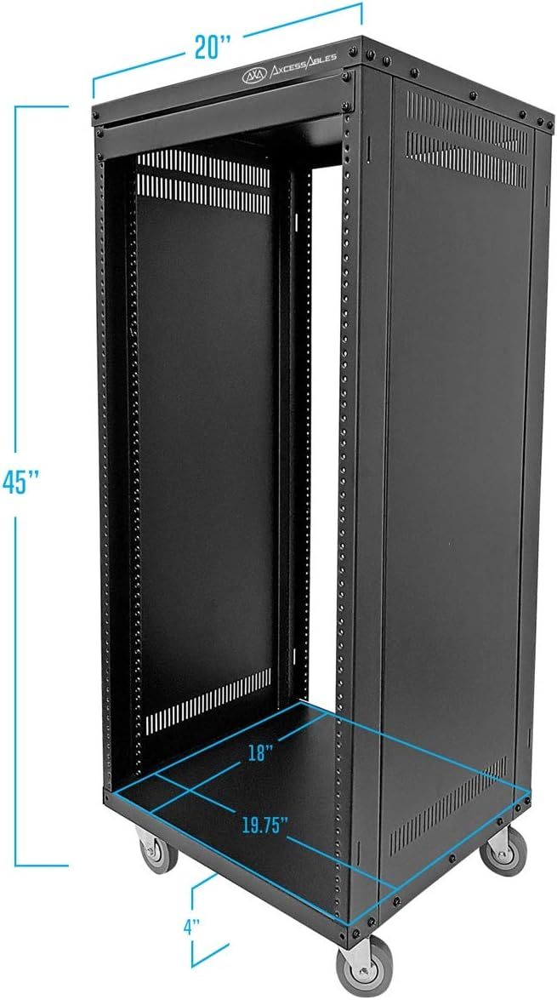

# 机柜

!!! warning "本文仍在编辑中"

顾名思义，机柜是用于容纳服务器的柜子，也往往是小型机房中占据最多空间的物品。机柜不仅仅是用来安装服务器，许多其他机房中的设备也有专门设计成可以安装在机柜中的版本，这我们将在后续内容中进行详细介绍。

## 机柜的规格  {#rack-specifications}

图 1. 典型机柜尺寸图
{: .caption }

如图所示，机柜的主要尺寸包括长、宽和高，图中是以英寸为单位。以下是对这些尺寸标准的简要说明：

### 固定的宽度 {#fixed-width-rack}

机柜的宽度通常固定为19英寸（约48.26厘米），这一标准源于 EIA-310-D 标准（Electronic Industries Alliance），该标准在数据中心和 IT 设备安装中得到了广泛应用。

!!! comment "@teapot1de: 值得一提"

    值得一提的是，虽然电子工业联盟（Electronic Industries Alliance）早已解散，但其制定的标准至今仍在业界广泛应用

### 标准化的高度 {#standardized-height-rack}

高度以U为单位进行测量（1U = 1.75英寸），这使得不同制造商生产的设备可以轻松兼容和安装到同一机架中。

### 多选择的深度 {#depth-options-rack}

机柜的深度根据安装需求可变，常见的深度范围从600mm到1200mm。

这些标准的建立源于需要简化设备安装、提高兼容性、确保安全性和便于维护，广泛应用于各种数据中心和 IT 基础设施中。

## 机柜的其他小细节 {#additional-rack-details}

### 螺丝螺母的标准 {#screw-nut-standards-rack}

机柜安装时通常使用标准化的螺母和螺钉。最常见的螺母类型是方形螺母和M6螺母，这些螺母与标准机架配合使用，确保设备的稳固安装。

### 通风设计{#ventilation-design-rack}

大多数机柜设计时考虑了设备的散热问题，因此配有前后门网孔或通风板，确保良好的空气流通。部分机柜还可以安装额外的风扇单元，以进一步增强散热效果，避免设备过热。

### 电源管理 {#power-management-rack}

机柜内通常安装有电源分配单元（PDU），这些PDU提供多种电源插座配置，支持不同类型的设备电源需求。部分PDU还配备有电流监控和断路器功能，可以更好地管理电力分配，防止过载情况的发生。

### 线缆管理 {#cable-management-rack}

有效的线缆管理是机柜设计中的重要部分。机柜内通常配备专用的线缆管理臂、绑带和走线槽，这些工具有助于组织和固定电缆，保持机柜内部整洁，避免电缆缠绕和损坏。

### 移动性和稳定性 {#mobility-stability-rack}

许多机柜底部装有脚轮，方便在数据中心内移动和重新布置位置。当机柜定位完毕后，可以使用固定脚来稳定机柜，防止其在操作或维护过程中移动。部分机柜还支持固定地脚螺栓，以提供额外的安全和稳定性，特别是在地震多发地区。
