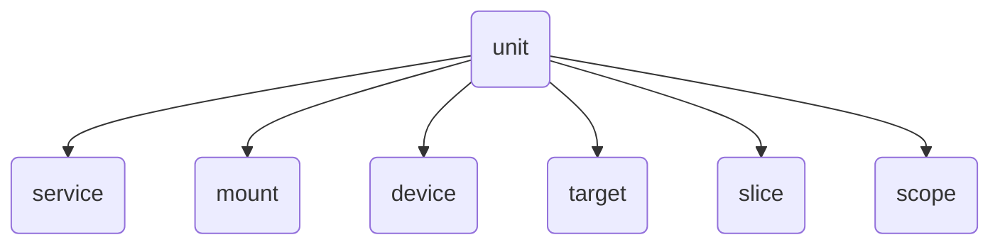

# 服务与日志管理 {#top}

!!! note "主要作者"

    [@iBug][iBug]

!!! warning "本文编写中"

现代的 Linux 发行版都使用 systemd 来管理系统服务，因此本文主要介绍 systemd 环境下的服务与日志管理，<s>Gentoo 用户请绕道</s>。

早期（2014 年以前）还有 SysVinit 和 Upstart 等，但现在已经很少见了。SysVinit 还有一个现代化的替代品，叫做 OpenRC。

## Init

Init 进程是 Linux 启动时运行的第一个进程，负责启动系统的各种服务并最终启动 shell。传统的 init 程序位于 `/sbin/init`，而现代发行版中它一般是指向 `/lib/systemd/systemd` 的软链接，即由 systemd 作为 PID 1 运行。

PID 1 在 Linux 中有一些特殊的地位：

- 不受 `SIGKILL` 或 `SIGSTOP` 信号影响，不能被杀死或暂停。类似地，即使收到了其他未注册的信号，默认行为也是忽略，而不是结束进程或挂起。
- 当其他进程退出时，这些进程的子进程会由 PID 1 接管，因此 PID 1 需要负责回收（`wait(2)`）这些僵尸进程。

## Systemd 与服务 {#systemd-and-service}

Systemd 是一大坨软件，包括服务管理（PID 1）、日志管理（systemd-journald）、网络管理（systemd-networkd）、本地 DNS 缓存（systemd-resolved）、时间同步（systemd-timesyncd）等，本文主要关心服务管理和日志管理。

### Unit

在 systemd 中，运行一个完整系统所需的每个部件都作为“单元”（unit）管理。一个 unit 可以是服务（`.service`）、挂载点（`.mount`）、设备（`.device`）、定时器（`.timer`）以至于目标（`.target`）等，完整的列表可以在 [`systemd.unit(5)`][systemd.unit.5] 中找到。



Systemd unit 的配置文件**主要**从以下目录按顺序载入，其中同名的文件只取找到的第一个：

- `/etc/systemd/system`：本地配置文件，优先级最高，这也是唯一一个管理员可以手动修改文件的地方。
- `/run/systemd/system`：运行时目录，存放由 systemd 或其他程序动态创建的 unit。注意 `/run` 目录重启后会被清空。
- `/usr/lib/systemd/system`：系统配置文件，优先级最低，一般由发行版（软件包管理器）提供。

实际会搜索的目录比这多得多（又到了看 [man][systemd.unit.5] 的时候了），但是一般只需要关心上面这三个。

很多通过 `systemctl` 命令改变的配置都会被保存到 `/etc/systemd/system` 目录下，例如：

- `systemctl enable [some-unit]` 可以“启用”一个 unit，即激活该 unit 在 `[Install]` 部分声明的自动启动条件，如 `WantedBy=` 和 `RequiredBy=` 等。该命令的本质是在 `/etc/systemd/system` 目录下创建软链接。

    !!! tip

        `systemctl enable --now [some-unit]` 可以在 enable 一个 unit 的同时立即启动它。

- `systemctl disable [some-unit]` 可以“禁用”一个 unit，即取消它的自动启动条件。类似地，该命令的本质是删除了上面创建的软链接。

    !!! tip

        - 同理，`systemctl disable --now [some-unit]` 可以在 disable 一个 unit 的同时立即停止它。

- `systemctl edit [some-unit]` 会提供一个临时文件，并在编辑完之后将其保存到 `/etc/systemd/system/[some-unit].d/override.conf` 文件中，实现对 unit 的修改。

    相比于手工修改文件，使用 `systemctl edit` 更加安全，它会检查配置文件的语法，而且不需要再额外运行 `systemctl daemon-reload`。

Unit 的配置文件是一个 INI 格式的文件，通常包括一个 `[Unit]` section，然后根据 unit 的类型不同有不同的 section。例如一个服务的配置文件会有 `[Service]` section，并通常会包含一个 `[Install]` section。以 cron 服务的配置文件为例：

``` { .ini title="/lib/systemd/system/cron.service" #cron.service }
[Unit]
Description=Regular background program processing daemon
Documentation=man:cron(8)
After=remote-fs.target nss-user-lookup.target

[Service]
EnvironmentFile=-/etc/default/cron
ExecStart=/usr/sbin/cron -f -P $EXTRA_OPTS
IgnoreSIGPIPE=false
KillMode=process
Restart=on-failure

[Install]
WantedBy=multi-user.target
```

!!! tip "查询手册"

    Unit 配置中不同的字段分布在 systemd 不同的手册页中。其中 `[Unit]` 和 `[Install]` 部分的字段可以在 [`systemd.unit(5)`][systemd.unit.5] 中找到。
    
    对于服务，`[Service]` 中的字段大部分在 [`systemd.service(5)`][systemd.service.5] 中，但其中与运行环境有关的会在 [`systemd.exec(5)`][systemd.exec.5] 中，与程序资源限制相关的会在 [`systemd.resource-control(5)`][systemd.resource-control.5] 中，与退出/杀死服务相关的会在 [`systemd.kill(5)`][systemd.kill.5] 中。

    对于定时器，`[Timer]` 部分的字段可以在 [`systemd.timer(5)`][systemd.timer.5] 中找到。

#### 顺序与依赖 {#unit-dependency}

相比于 SysVinit（完全顺序启动）和 upstart（基于 event 触发的方式有限的并行），systemd 的每个 unit 都明确指定了依赖关系，分析依赖关系后 systemd 就可以最大化并行启动服务，这样可以大大缩短启动时间。

Systemd 中的 unit 有很多状态，大致可以归为以下几类：

- inactive：未启动
- activating：正在启动
- active：已启动（成功）
- deactivating：正在停止
- failed：启动失败

大部分系统 unit 都会使用以下几个字段：

`Wants=` 和 `Requires=`

:   指定 unit 之间的依赖关系，例如网络服务通常会依赖 `network.target`，即当网络开始配置时才会运行。
    两者都在 `[Unit]` section 中指定，区别在于 `Requires=` 是强依赖，即如果被依赖的 unit 没有启动或启动失败，那么当前 unit 也会被标记为失败，同时如果被依赖的 unit 停止，则当前 unit 也会停止；
    而 `Wants=` 是弱依赖，即尝试启动被依赖的 unit，但如果失败了也不会影响当前 unit 的启动。

`WantedBy=` 和 `RequiredBy=`

:   与上面两个相反，指定了其他 unit 依赖当前 unit。
    这两个字段在 `[Install]` section 中指定，并且仅当对应的 unit 被启用（`systemctl enable`）时才会生效。

`Before=` 和 `After=`

:   指定启动顺序，即相关的 unit 需要在前者启动完成，进入 active 状态后才会尝试启动。这两个字段在 `[Unit]` section 中指定。
    与 Wants/Requires 不同，Before/After 只是指定启动顺序，不影响依赖关系。

需要注意的是，依赖关系和启动顺序是互相独立的。如果只写 `Requires=` 或 `Wants=`，没有写 `Before=` 或 `After=`，那么 systemd 会启动依赖与被依赖的单元，但是不保证它们的启动顺序；反过来，如果只写 `Before=` 或 `After=`，那么 systemd 不保证这些服务会被启动。

!!! tip "获取某个 unit 的顺序与依赖关系"

    使用 `systemctl show [unit]` 可以查看某个 unit 的所有属性，包括上面提到的依赖关系和启动顺序。例如：

    ```console
    $ systemctl show gdm.service
    Id=gdm.service
    Names=gdm.service display-manager.service
    Requires=system.slice sysinit.target dbus.socket
    WantedBy=graphical.target
    Conflicts=getty@tty1.service shutdown.target plymouth-quit.service
    Before=graphical.target shutdown.target
    After=fwupd.service rc-local.service systemd-journald.socket sysinit.target basic.target system.slice plymouth-quit.service systemd-user-sessions.service plymouth-start.service dbus.socket getty@tty1.service
    （以下省略）
    ```

    此外使用 `systemctl list-dependencies [unit]` 可以以树状结构显示某个 unit 的依赖关系：

    ```console
    $ systemctl list-dependencies gdm.service
    gdm.service
    ● ├─dbus.socket
    ● ├─system.slice
    ● └─sysinit.target
    ●   ├─dev-hugepages.mount
    ●   ├─dev-mqueue.mount
    ●   ├─kmod-static-nodes.service
    ●   ├─ldconfig.service
    ●   ├─proc-sys-fs-binfmt_misc.automount
    ●   ├─sys-fs-fuse-connections.mount
    ●   ├─sys-kernel-config.mount
    ●   ├─sys-kernel-debug.mount
    ●   ├─sys-kernel-tracing.mount
    ●   ├─systemd-ask-password-console.path
    ●   ├─systemd-binfmt.service
    （以下省略）
    ```

!!! tip "分析系统启动时间"

    相比传统的 init，systemd 的一大卖点就是通过分析顺序与依赖，并行启动服务，从而缩短系统启动时间。可以使用 `systemd-analyze` 来绘制启动时间线：

    ```console
    systemd-analyze plot > boot.svg
    ```

    每个服务的启动时间可以使用 `blame` 子命令查看：

    ```console
    systemd-analyze blame
    ```

    不过，`systemd-analyze blame` 显示的最耗时的服务可能并不会实际影响启动。如果需要快速查看对启动时间影响最大的服务，可以查看关键路径：

    ```console
    systemd-analyze critical-chain
    ```

#### 模板 {#unit-template}

Systemd 的 unit 支持模板特性：一个 unit 文件可以实例化为多个 unit。模板 unit 的文件名（不含扩展名）结尾是 `@`，例如 `foo@.service`。用户使用时需要提供一个参数，例如 `systemctl enable --now foo@arg.service`。

在 unit 文件内部，可以使用 `%i` 和 `%I` 来引用这个参数（其中 `%I` 是没有经过转义的），例如：

```ini
[Unit]
Description=Hello for %I

[Service]
# ...
ExecStart=/usr/bin/echo Hello, %i
```

### Target

Target 是一组服务（其他 unit）的集合，通过 target 这样一层抽象可以更方便地管理服务的启动顺序，类似 SysVinit 中的 runlevel，可以理解为“系统启动目标”。
例如网络服务应该 `Requires=network-online.target` 并且 `After=network-online.target`，这样就可以保证网络服务在网络连通后再启动。

Systemd 在开机时会尝试启动 default.target，这个 target 一般是指向 graphical.target 的软链接，即启动图形界面相关的服务，另一个常见的 multi-user.target 则是命令行模式。

|  systemd target   | SysVinit runlevel | 说明                                                 |
| :---------------: | :---------------: | ---------------------------------------------------- |
|  poweroff.target  |         0         | 关机                                                 |
|   rescue.target   |         1         | 单用户模式                                           |
|      （无）       |         2         | （systemd 不使用这个 runlevel）                      |
| multi-user.target |         3         | 多用户模式，但只有命令行                             |
|      （无）       |         4         | （systemd 不使用这个 runlevel）                      |
| graphical.target  |         5         | 图形界面                                             |
|   reboot.target   |         6         | 重启                                                 |
| emergency.target  |         S         | 紧急模式                                             |
|    halt.target    |      （无）       | 系统已经停止，但是既不断电也不重启，可以看到关机日志 |

默认的 target 可以通过 `systemctl set-default` 命令修改，或者在 GRUB 中为 kernel cmdline 指定 `systemd.unit=`。
与其他 `systemctl` 命令一样，前者的本质是创建一个软链接 `/etc/systemd/system/default.target`。

### Service

Service 也就是我们最常见的服务，它的配置文件中有一个 `[Service]` section，包括了服务的启动命令和一系列其他配置。以[上面的 cron 服务](#cron.service)为例：

- `[Unit]` 部分指定的 `After=remote-fs.target nss-user-lookup.target` 表示 cron 会在系统达到这两个 target 之后才启动，即远程文件系统挂载完成和用户信息服务（`getent passwd` 等命令可用）都已经启动。
- `EnvironmentFile=-/etc/default/cron` 表示会读取 `/etc/default/cron` 文件中的环境变量。开头的 `-` 表示如果这个文件不存在，则直接忽略。
- `ExecStart=/usr/sbin/cron -f -P $EXTRA_OPTS` 指定了服务的启动命令，其中 `$EXTRA_OPTS` 是从上面的文件中读取的环境变量。
  
    !!! tip

        通常情况下我们建议对命令使用绝对路径，因为 systemd 启动服务时并不会使用系统配置的 `$PATH` 环境变量，而是使用一个硬编码的列表。

- `Restart=on-failure` 表示服务在失败时会自动重启。`Restart=` 的取值和含义可以在 [systemd.service][systemd.service.5#Restart=] 文档中找到。
- 最后的 `[Install]` 部分指定了服务的启动级别，即 `WantedBy=multi-user.target` 表示在多用户模式下启动。

其他常用的配置还有：

`ExecStartPre=`、`ExecStartPost=`、`ExecStopPost=`

:   在服务启动前、启动后、停止后执行的命令。可用于检查服务的配置文件是否正确、创建临时文件、清理临时文件等。例如 ssh.service 就会使用 `ExecStartPre=/usr/sbin/sshd -t` 来检查配置文件是否正确。

`ExecReload=`

:   指定重载服务的命令，一个常见的做法是 `ExecReload=/bin/kill -HUP $MAINPID`。
    配置了 `ExecReload=` 之后即可使用 `systemctl reload [service]` 命令来向服务的主进程发送 SIGHUP 信号。一些服务还有自己的 reload 命令，例如 nginx 的 `ExecReload=/usr/sbin/nginx -s reload`。

`Type=`

:   指定服务的类型。大部分服务都由一个在后台运行的进程组成，此时可以省略 Type 使用默认值 `simple`，或者更推荐的做法是 `Type=exec`。其他的服务类型参见下面的 [Service Type](#service-type) 一节。

`User=`、`Group=` 和 `SupplementaryGroups=`

:   指定运行服务的用户和组，以及额外的附加组。默认情况下服务会以 `root` 用户运行，如果有安全和权限管理的需求，那么你应该配置这几项设置。

    !!! tip

        如果你有额外的安全需求，可以参考 [Sandboxing][systemd.exec.5#Sandboxing] 一节使用 systemd 提供的高级隔离功能。可以使用 `systemd-analyze security` 命令检查整个系统的服务安全性配置情况，与单个服务的具体配置是否安全。该命令会根据服务配置计算 "exposure level" 分数，并且提供相关配置以及解释，类似如下：

        ```console
        $ systemd-analyze security --no-pager caddy.service
          NAME                                         DESCRIPTION                                  EXPOSURE
        ✗ RemoveIPC=                                   Service user may leave SysV IPC objects aro…      0.1
        ✗ RootDirectory=/RootImage=                    Service runs within the host's root directo…      0.1
        ✓ User=/DynamicUser=                           Service runs under a static non-root user i…
        ✗ CapabilityBoundingSet=~CAP_SYS_TIME          Service processes may change the system clo…      0.2
        （以下省略）
        ```

#### Service Type {#service-type}

simple 和 exec

:   是最常见的服务类型，服务主体是一个长期运行的进程。
    两者的区别在于 `simple` 类型“启动即成功”，即 `systemctl start` 会立刻成功退出；
    而 `exec` 类型会确保 `ExecStart=` 命令可以正常运行，包括 `User=` 和 `Group=` 存在、所指定的命令存在且可执行等。
    因此现代的服务应该尽量使用 `Type=exec`。

forking

:   一些传统的服务会使用这种方式，启动命令会 fork 出一个子进程然后退出，实际服务由这个子进程提供。
    这种服务需要配置 `PIDFile=`，以便 systemd 能够正确追踪服务的主进程。当 `PIDFile=` 指定的文件存在且包含一个有效的 PID 时，systemd 认为服务已经启动成功。

oneshot

:   一次性服务，即启动后运行一次 `ExecStart=` 命令，然后退出。
    这个 Type 有两种使用场景：

    1. 一次性的初始化或者清理工作、或者改变系统状态的命令等（如一些 `ip` 命令）。

        在这个场景下，你很可能也想同时设置 `RemainAfterExit=yes`，这样配置的命令执行完成后会一直保持 active 状态。

    2. 和 timer 配合使用，即定时任务。

notify 和 dbus

:   类似 `simple` 和 `exec`，但是服务会在启动完成后主动通知 systemd。
    与前面的类型不同的是，这类服务需要程序主动支持 `sd_notify` 或者 D-Bus 接口。

    ??? tip "sd_notify"

        [sd_notify(3)][sd_notify.3] 是一个非常简单的协议。Systemd 对于标注自己支持 `notify` 的服务，会通过环境变量 `NOTIFY_SOCKET` 给应用提供一个 UNIX socket 地址。应用向这个 socket 发送指定的字符串来通知 systemd 自身的状态。例如，服务完整启动之后，应用可以发送 `READY=1` 来通知 systemd 服务已经成功启动。

        通知的逻辑很简单，即使不使用 systemd 的 C 库，也可以自己手写实现，帮助文档也提供了 C 和 Python 的样例代码。值得一提的是，2024 年轰动一时的 [xz 后门事件][xz-backdoor]之所以能够影响 sshd 的逻辑，就是因为部分发行版在编译 OpenSSH 时链接了 libsystemd 来使用 `sd_notify()`，而 libsystemd 又依赖于（被植入后门的）liblzma。

  [xz-backdoor]: https://zh.wikipedia.org/wiki/XZ%E5%AE%9E%E7%94%A8%E7%A8%8B%E5%BA%8F%E5%90%8E%E9%97%A8 "维基百科：XZ 实用程序后门"

### 定时任务 {#timers}

Systemd 提供了 timer 类型的 unit，用于定时执行任务。一个 timer unit 通常会对应一个 service unit，即在指定的时间点或者时间间隔触发 service 的启动。

相比于更常见的定时任务方案 CRON，systemd timers 具有以下优点：

- 更丰富的时间表达式，除了等价于 crontab 的 `OnCalendar=` 时间之外，也可以使用 `OnUnitActiveSec=`（服务启动后）、`OnBootSec=`（系统启动后）等指定其他时间计算方式。

    - 例如，`systemd-tmpfiles-clean.timer` 就是在系统启动后 15 分钟触发一次 `systemd-tmpfiles-clean.service`，然后每天触发一次，用于清理临时文件。

        ```ini title="/lib/systemd/system/systemd-tmpfiles-clean.timer"
        [Timer]
        OnBootSec=15min
        OnUnitActiveSec=1d
        ```

    - 如果不使用 `OnCalendar=` 的话，一般常用的模式是：使用 `OnActiveSec=`（timer 被激活后）、`OnBootSec=` 或 `OnStartupSec=`（systemd 启动后）来**首次触发**，然后使用 `OnUnitActiveSec=` 来保证**后续定时触发**。因为 `OnActiveSec=`、`OnBootSec=` 和 `OnStartupSec=` 只会触发一次服务启动，为了实现定时启动，那么就需要额外设置以服务启动后为基准的定时器，即 `OnUnitActiveSec=`。而如果没有前者的话，那么就必须要手动启动对应的服务之后，timer 才会有效。因此这一类 timer 会同时包含两个定时规则。

- 更加精确的时间控制，通过 `AccuracySec=` 可以支持秒级甚至更细的时间精度。
    一般不推荐小于 1 分钟的时间精度，否则系统计时器需要频繁唤醒，可能会影响系统性能。这一点考虑与 cron 是相同的。
- `RandomizedDelaySec=` 可以配置每次触发时随机延迟的时间，避免大量服务在同一时间点启动。
    这在使用同一份系统镜像部署大量虚拟机或类似场景下非常有用，可以避免大量计划任务同时触发，导致系统负载过高。
- `Persistent=` 可以确保如果因关机、重启等原因错过了设定时间，定时任务会在下次系统启动后会立即执行。
- 可以通过 `systemctl enable` 和 `systemctl disable` 启用和禁用定时任务，而无需修改配置文件。
    也可以使用 `systemctl status` 查看 timer 和 service 的状态，以及 `journalctl` 查看日志。
- 基于 service 而不是简单运行命令的优点：
    - 享受 service 的全部好处，如依赖管理、环境变量、自动重启等，也包括安全与隔离等高级功能。
    - 利用 service 单实例的特性，避免一个任务同时运行多份实例，即当任务已经在运行而没有结束时，不会继续启动新的进程。在 cron 中，这通常需要借助额外的工具实现，如 `flock(1)`。

Timers 的主要缺点是：

- 配置文件繁琐，一个定时任务至少需要创建两个文件，一个是 timer unit，一个是对应的 service unit。相比于在 crontab 中添加一行配置，动辄数十行的配置文件实在不够方便。
- 没有 cron 的邮件通知功能。但是 service 的输出可以记录到日志中，可以通过 `journalctl` 查看；也可以为 service 指定 `StandardOutput=` 和 `StandardError=` 手动重定向输出。

另外，第三方开发的 [systemd-cron][systemd-cron] 项目提供了一个 cron 的替代方案，它使用 systemd 的 generator 接口将 crontab 翻译成 systemd timer 和 service，然后由 systemd 负责这些 timer 和 service 的触发和运行。

  [systemd-cron]: https://github.com/systemd-cron/systemd-cron

#### 创建一个定时任务 {#create-timer}

如上所述，一个定时任务包含两个文件，一个是 timer unit，一个是对应的 service unit。下面以 certbot 的配置文件为例，说明如何创建一个定时任务。

首先创建一个 service，需要注意的是 `Type=oneshot`，并且**不能**使用 `RemainAfterExit=yes`（一般将其忽略即可，它的默认值是 no）。

```ini title="/lib/systemd/system/certbot.service"
[Unit]
Description=Certbot
Documentation=file:///usr/share/doc/python-certbot-doc/html/index.html
Documentation=https://certbot.eff.org/docs

[Service]
Type=oneshot
ExecStart=/usr/bin/certbot -q renew
PrivateTmp=true
```

接下来创建一个 timer，指定触发时间，并按需启用 `Persistent=`。

```ini title="/lib/systemd/system/certbot.timer"
[Unit]
Description=Run certbot twice daily

[Timer]
OnCalendar=*-*-* 00,12:00:00
RandomizedDelaySec=43200
Persistent=true

[Install]
WantedBy=timers.target
```

此时 `certbot.timer` 会自动触发同名的 service，也就是 `certbot.service`。

在编辑完两个文件之后，需要运行 `systemctl daemon-reload` 使 systemd 重新加载配置文件，然后可以使用 `systemctl start certbot.timer` 启动定时器，或者使用 `systemctl enable certbot.timer` 让其开机启动。

### 临时服务 {#transient-service}

systemd 提供了临时服务的支持，可以在需要时动态创建和启动服务，而不需要事先编写 `.service` 文件，这对于一些临时任务或一次性操作非常有用。

`systemd-run` 命令可以创建临时服务。例如，以下命令会创建一个临时服务并立即启动：

```shell
systemd-run --unit=my-sleep sleep 600
```

此后，你就可以通过 `systemctl status my-sleep` 查看临时服务的状态，或者使用诸如 `systemctl stop` / `systemctl restart` 等命令管理其状态了。同时，你也可以使用 `journalctl` 命令查看进程的输出（[见下](#log)）。

默认情况下，如果临时服务的命令正常退出了，那么对应的服务会被回收，即 `systemctl status my-sleep` 将会显示 service not found。此时你仍然可以使用 `journalctl` 命令查看日志，回收服务并不会清除其运行日志。`systemd-run` 有两个参数可以改变此默认行为：

- `-r` 可以使 systemd 在进程正常退出后仍然保留服务；
- `-G` 可以使 systemd 在进程退出后立刻回收服务，即使不是正常退出（如非零的 exit code 或被信号杀死）。

同时，`systemd-run` 还有更多的参数可以用于指定服务进程的运行环境，例如工作目录和输入输出文件描述符等，具体可参考 [`systemd-run(1)`][systemd-run.1]。

基于这些讨论，本文认为 `systemd-run` 是 `nohup` 命令的全面替代品，也鼓励读者尽量使用 `systemd-run` 来运行各种一次性的后台命令，而不是使用 `nohup` 和 `&`。

作为一个常见的使用场景，普通用户需要使用 `systemd-run --user` 以运行临时的用户服务，而非系统服务。

## 日志管理 {#log}

### Systemd-journald

Journald 是 systemd 套件中负责管理日志的部分。与传统的 `/var/log/*.log` 文件不同，journald 能够处理结构化数据（例如 KV），并且将日志以二进制形式保存。因此 systemd-journald 的日志不能简单通过文本查看器（`less`、`vim` 等）查看，需要通过 `journalctl` 管理。

一些常用的选项和参数：

|    选项     | 说明                                         |
| :---------: | -------------------------------------------- |
| `-u [unit]` | 只显示指定 unit 的日志                       |
|    `-e`     | 显示最新的日志（自动将 less 跳转到末尾）     |
|    `-f`     | 实时查看日志（类似 `tail -f`）               |
|    `-x`     | 为事件显示额外的解释内容，如服务启动、停止等 |

默认情况下，journald 会将日志存储在 `/var/log/journal` 目录下，如果这个目录不存在的话，则会使用 `/run/log/journal`。由于 `/run` 目录使用 tmpfs，若配置不当可能会导致内存占用过高，且重启后日志丢失。

Journald 的配置文件位于 `/etc/systemd/journald.conf`，可以通过 [`journald.conf(5)`][journald.conf.5] 查看所有的配置项，Debian 也会在这个文件内以注释的形式提供所有配置的默认值。一些常见的配置项有：

|               配置项               | 说明                                                                   |
| :--------------------------------: | ---------------------------------------------------------------------- |
|              Storage=              | 指定日志存储方式，可以是 `auto`、`volatile`、`persistent` 和 `none`    |
|  SystemMaxUse=<br>SystemKeepFree=  | 指定系统日志（`/var/log/journal`）的最大占用空间或保证磁盘的空余空间   |
| RuntimeMaxUse=<br>RuntimeKeepFree= | 指定运行时日志（`/run/log/journal`）的最大占用空间或保证磁盘的空余空间 |
|  MaxRetentionSec=<br>MaxFileSec=   | 指定日志内容和日志文件的最大保存时间                                   |

!!! tip "避免覆盖由包管理器管理的文件"

    自 systemd v249 起（Ubuntu 22.04，Debian 12 Bookworm），所有 `/etc/systemd/*.conf` 文件均支持 `*.conf.d` 目录，即可以创建 `/etc/systemd/journald.conf.d/` 目录，并在其中创建文件来覆盖默认配置，而无需修改 `*.conf` 文件本身，使用这个方法可以避免在软件包更新或系统升级时处理配置文件的修改冲突。

    例如，要限制磁盘占用（`/var/log/journal`）为 1G，可以创建如下文件，然后重启 `systemd-journald` 服务：

    ```ini title="/etc/systemd/journald.conf.d/override.conf"
    [Journal]
    SystemMaxUse=1G
    ```

如果你需要手动清理日志，释放磁盘空间的话，可以使用 `journalctl --vacuum-size=100M` 来清理日志，journald 会删除日志，直到磁盘占用小于 100M。另外有两个类似的参数 `--vacuum-time=` 和 `--vacuum-files=10` 也可参考。

### logrotate

按照 Unix 的“一个程序只做一件事”的设计思想，一般的程序只管将日志输出到指定地方，因此有了 logrotate 这个工具来负责日志的“滚动”（rotate），即重命名、压缩、删除等操作。

logrotate 的全局配置文件位于 `/etc/logrotate.conf`，而每个服务的配置文件则位于 `/etc/logrotate.d/` 目录下。以 Telegraf 为例，其配置文件如下：

```shell title="/etc/logrotate.d/telegraf"
/var/log/telegraf/telegraf.log
{
    rotate 6
    daily
    missingok
    dateext
    copytruncate
    notifempty
    compress
}
```

配置文件的开头可以指定一个或多个文件（每行一个，可以使用 shell 的通配符），然后是一系列的配置项。常见的配置项有：

rotate &lt;n&gt;

:   保留的**额外**日志文件数量。例如 `rotate 6` 会保留 `example.log`、`example.log.1` 直到 `example.log.6`，而 `example.log.7` 则会直接删除。

daily / weekly / monthly / yearly

:   rotate 的频率，也许你并不需要使用后两者。

missingok / notifempty

:   特殊情况的处理方式（见这两个选项的字面含义）。

dateext / dateformat

:   使用日期作为后缀，而不是使用 `.1`、`.2` 等。另有 `dateyesterday` 选项，即使用昨天的日期来命名，保证文件名中的日期和文件内容尽可能一致。

copytruncate

:   将文件内容复制到新文件，然后清空原文件。程序需要以 `O_APPEND` 的方式打开日志文件，否则可能会造成错乱。

    适用于不支持通过 `SIGHUP` 等方式重新打开日志文件的程序。对于支持“重载日志文件”的程序，**不推荐**使用这个选项。

create &lt;mode&gt; &lt;owner&gt; &lt;group&gt;

:   创建新的日志文件时的权限和所有者。如果程序可以自己创建日志文件，那么可以忽略。

compress<br>compresscmd<br>uncompresscmd<br>compressext<br>compressoptions

:   压缩旧的日志文件，以及压缩参数（默认使用 `gzip` / `gunzip` / `.gz` / `-9`）。其中 `compress` 是开关，默认行为是 `nocompress`。

    例如，如果使用 Zstd 压缩，可以使用以下配置：

    ```shell
    compresscmd /usr/bin/zstd
    uncompresscmd /usr/bin/unzstd
    compressext .zst
    compressoptions -13 -T0
    ```

delaycompress

:   不压缩刚 rotate 出来的日志文件，即保留 `example.log` 和 `example.log.1`，压缩 `.2` 开始的日志文件<br>如果没有这个选项，那么 `example.log.1` 会被压缩

prerotate / postrotate

:   在 rotate 之前/之后执行的命令，命令块需要以 `endscript` 结束。与 Makefile / Dockerfile 等语法类似，每行为单独的一个命令，因此如果要将 `if` 等 shell 语法写成多行，需要在除了最后一行以外的每一行末尾使用反斜杠，避免被解释成多条命令。

    例如，Nginx 软件包提供的配置就会在 rotate 之后重载 Nginx：

    ```shell title="/etc/logrotate.d/nginx"
    postrotate
        invoke-rc.d nginx rotate >/dev/null 2>&1
    endscript
    ```

修改了 logrotate 的配置文件之后，可以使用 `logrotate -d /etc/logrotate.conf` 来测试配置文件的正确性，而不会真正执行任何操作。

同时由于 logrotate 不存在守护进程，而是通过 systemd timer 来定期执行的，因此修改配置文件之后不需要重启任何服务。

## 登录管理器 {#logind}

systemd-logind 是 systemd 的登录管理器，其负责的功能包括用户 session、电源管理（例如按下电源键、笔记本电脑盒盖时的行为）等，具体可参考 [systemd-logind(8)][systemd-logind.8]。本部分主要关注在日常运维中可能会用到的一部分特性。

在登录系统时，PAM 的 `pam_systemd.so` 模块会在用户登录时创建一个 session。因此在使用 systemd 的发行版中，不管是 SSH 登录、通过 TTY 控制台登录，还是在图形界面登录，在配置正确的情况下都会创建一个 session。

`loginctl list-sessions` 可以显示当前的所有用户 session：

```console
$ loginctl list-sessions
SESSION  UID USER  SEAT  TTY
      2 1000 user  seat0

1 sessions listed.
```

`loginctl` 支持锁定（`lock-session`）、解锁（`unlock-session`）、注销（`terminate-session`）等操作。一种使用场景是：在线下的计算机类比赛中，需要限制选手只能在比赛开始后才能登录系统，在比赛结束后不能够再使用系统，此时就可以使用 `loginctl` 的功能来实现。

systemd 中每个 session 都会启动一个用户级别的 systemd 进程，用于管理用户的服务、timer 等，在 `systemctl`、`journalctl` 操作时添加 `--user` 参数即可查看当前用户的服务和日志等。

!!! note "DBus"

    `systemctl`、`journalctl` 等命令依赖于 DBus 总线与 systemd 通信。对于用户 session 来说，则依赖于 session 的 DBus 服务正常工作（一般路径为 `/run/user/<用户 PID>/bus`）。

    在命令行下需要切换用户的场合中，如果需要使用用户级别的 systemd，推荐的做法是使用以下命令：
    
    - `machinectl shell username@`
    - `run0`（需要很新的发行版，如 Debian 13）

    相关设计原因可阅读 <https://github.com/systemd/systemd/issues/7451#issuecomment-346787237>。注意，以上方法对非 root 使用 polkit 鉴权，与 sudo 配置无关。

    如果需要使用 `sudo` 或 `su` 切换用户，或者在某些非常特殊的环境下，可能需要自行配置 `XDG_RUNTIME_DIR=/run/user/<用户 PID>` 与 `DBUS_SESSION_BUS_ADDRESS=/run/user/<用户 PID>/bus` 环境变量，以便 `systemctl` 等命令能够正常工作。

有些场景下，我们希望在机器启动时，用户 session 也能够创建，并且即使用户注销也不销毁。此时需要使用 lingering 的功能。使用 `loginctl enable-linger <user>` 命令即可启用。

!!! lab "限制用户的资源使用"

    用户 session 启动时，systemd 会创建 `user-<uid>.slice`。Slice 是 systemd 中用于限制资源的 unit，将多个 service 等 unit 组织在一起进行统一的资源限制。为用户限制资源使用是一个常见的需求，特别是在实验室服务器上。在用的人够多的情况下，每过几天就会有人把服务器的 CPU、内存或者 IO 全部吃满，无法操作，只能重启。

    （最常见的情况是，有人在编译软件时，跑了不限制并发的 `make -j`）

    请尝试限制让**每个**用户 CPU 最多只使用 30%，内存最多只使用 8G（可阅读 [user@.service(5)][user@.service.5]）。
