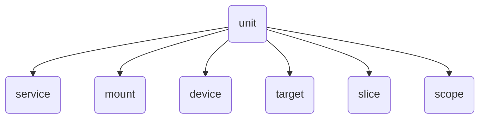

# 服务管理

!!! warning "本文仍在编辑中"

现代的 Linux 发行版都使用 systemd 来管理系统服务，因此本文主要介绍 systemd 环境下的服务与日志管理，<s>Gentoo 用户请绕道</s>。

早期（2014 年以前）还有 SysVinit 和 Upstart 等，但现在已经很少见了。SysVinit 还有一个现代化的替代品，叫做 OpenRC。

## Init

Init 进程是 Linux 启动时运行的第一个进程，负责启动系统的各种服务并最终启动 shell。传统的 init 程序位于 `/sbin/init`，而现代发行版中它一般是指向 `/lib/systemd/systemd` 的软链接，即由 systemd 作为 PID 1 运行。

PID 1 在 Linux 中有一些特殊的地位：

- 不受 `SIGKILL` 或 `SIGSTOP` 信号影响，不能被杀死或暂停。类似地，即使收到了其他未注册的信号，默认行为也是忽略，而不是结束进程或挂起。
- 当其他进程退出时，这些进程的子进程会由 PID 1 接管，因此 PID 1 需要负责回收（`wait(2)`）这些僵尸进程。

## Systemd

Systemd 是一大坨软件，包括服务管理（PID 1）、日志管理（systemd-journald）、网络管理（systemd-networkd）、本地 DNS 缓存（systemd-resolved）、时间同步（systemd-timesyncd）等，本文主要关心服务管理和日志管理。

### Unit

在 systemd 中，运行一个完整系统所需的每个部件都作为“单元”（unit）管理。一个 unit 可以是服务（`.service`）、挂载点（`.mount`）、设备（`.device`）、定时器（`.timer`）以至于目标（`.target`）等，完整的列表可以在 [`systemd.unit(5)`][systemd.unit.5] 中找到。



Systemd unit 的配置文件**主要**从以下目录按顺序载入，其中同名的文件只取找到的第一个：

- `/etc/systemd/system`：本地配置文件，优先级最高，这也是唯一一个管理员可以手动修改文件的地方。
- `/run/systemd/system`：运行时目录，存放由 systemd 或其他程序动态创建的 unit。注意 `/run` 目录重启后会被清空。
- `/usr/lib/systemd/system`：系统配置文件，优先级最低，一般由发行版（软件包管理器）提供。

实际会搜索的目录比这多得多（又到了看 [man][systemd.unit.5] 的时候了），但是一般只需要关心上面这三个。

很多通过 `systemctl` 命令改变的配置都会被保存到 `/etc/systemd/system` 目录下，例如：

- `systemctl enable [some-unit]` 本质上是在 `/etc/systemd/system` 目录下创建软链接。
- `systemctl disable [some-unit]` 则是删除上面创建的软链接。
- `systemctl edit [some-unit]` 会提供一个临时文件，并在编辑完之后将其保存到 `/etc/systemd/system/[some-unit].d/override.conf` 文件中，实现对 unit 的修改。

相比于手工修改文件，使用 `systemctl` 更加安全，它会检查配置文件的语法，而且不需要再额外运行 `systemctl daemon-reload`。

Unit 的配置文件是一个 INI 格式的文件，通常包括一个 `[Unit]` section，然后根据 unit 的类型不同有不同的 section。例如一个服务的配置文件可能是这样的：

```ini title="/lib/systemd/system/cron.service"
[Unit]
Description=Regular background program processing daemon
Documentation=man:cron(8)
After=remote-fs.target nss-user-lookup.target

[Service]
EnvironmentFile=-/etc/default/cron
ExecStart=/usr/sbin/cron -f -P $EXTRA_OPTS
IgnoreSIGPIPE=false
KillMode=process
Restart=on-failure

[Install]
WantedBy=multi-user.target
```

#### 顺序与依赖 {#unit-dependency}

!!! warning "未完待续"

### Target

Target 是一组服务（其他 unit）的集合，通过 target 这样一层抽象可以更方便地管理服务的启动顺序，类似 SysVinit 中的 runlevel，可以理解为“系统启动目标”。例如网络服务应该 `Requires=network-online.target` 并且 `After=network-online.target`，这样就可以保证网络服务在网络连通后再启动。

Systemd 在开机时会尝试启动 default.target，这个 target 一般是指向 graphical.target 的软链接，即启动图形界面相关的服务，另一个常见的 multi-user.target 则是命令行模式。

|  systemd target   | SysVinit runlevel | 说明                                                 |
| :---------------: | :---------------: | ---------------------------------------------------- |
|  poweroff.target  |         0         | 关机                                                 |
|   rescue.target   |         1         | 单用户模式                                           |
|      （无）       |         2         | （systemd 不使用这个 runlevel）                      |
| multi-user.target |         3         | 多用户模式，但只有命令行                             |
|      （无）       |         4         | （systemd 不使用这个 runlevel）                      |
| graphical.target  |         5         | 图形界面                                             |
|   reboot.target   |         6         | 重启                                                 |
| emergency.target  |         S         | 紧急模式                                             |
|    halt.target    |        无         | 系统已经停止，但是既不断电也不重启，可以看到关机日志 |

默认的 target 可以通过 `systemctl set-default` 命令修改，或者在 GRUB 中为 kernel cmdline 指定 `systemd.unit=`。与其他 `systemctl` 命令一样，前者的本质是创建一个软链接 `/etc/systemd/system/default.target`。
