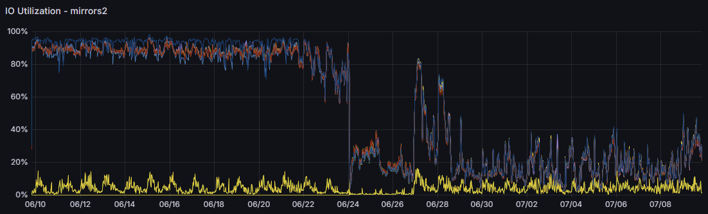

# ZFS

!!! note "主要作者"

    [@iBug][iBug]

!!! warning "本文编写中"

ZFS（Zettabyte File System）虽然名叫“FS”，但是集成了一系列存储管理功能，包括文件系统、卷管理、快照、数据完整性检查和修复等，常被称作“单机最强存储方案”。

虽然 ZFS 没有特殊的系统要求，但是我们推荐在具有较好配置的服务器上使用 ZFS，以获得更好的性能和稳定性。

- 固态硬盘，或者多块规格相同的大容量机械硬盘（推荐 4 块或更多），尽量避免用单块机械硬盘。
- 如果预期需要承载较重的读写负载，推荐使用大容量内存用于缓存（ZFS 官方推荐每 1 TB 存储容量配置 1 GB 内存）。
    - 如果打算启用 ZFS 的去重（deduplication）功能，推荐为每 TB 存储容量配备至少 5 GB 内存（但是官方推荐的比例是 30 GB）。
- 一般来说，我们**不推荐**使用 L2ARC，具体原因较为复杂，请阅读本文的 ARC 章节与 [L2ARC 章节](#l2arc)。
- 多核心 CPU，以便处理 ZFS 的数据完整性检查和透明压缩等任务。

如果只是为了将 ZFS 的高级功能用于个人存储，如 NAS 等，那么你大可忽略以上所有推荐，在 Intel J3455 和 4 GB 内存的小主机上就可以轻松运行 ZFS，例如 QNAP 的个人 NAS 设备就已经默认采用 ZFS 了。

## 安装 {#installation}

尽管 OpenZFS 也是一个开源项目，但是由于开源协议不兼容（OpenZFS 采用 CDDL，Linux 内核采用 GPL），因此 OpenZFS 无法直接集成到 Linux 内核中。

- Debian 将 ZFS 的代码以 DKMS 模块的形式打包（包名 `zfs-dkms`），以便在更新内核之后自动编译和安装。

    !!! note "Debian backports"

        受限于 Debian 的稳定性政策，stable 的软件源中的 ZFS 版本可能较老。如果需要使用较新的 ZFS 版本，可以考虑使用 Debian 的 backports 仓库（例如在 Debian Bookworm 中，对应使用 backports 的命令是 `apt install -t bookworm-backports zfs-dkms`）。

- Ubuntu 自 20.04 LTS 起提供预编译好的 `zfs.ko`（软件包 `linux-modules-$(uname -r)`），因此无需再安装 `zfs-dkms`[^uuu1804]。

不论是 Debian 还是 Ubuntu，都需要安装 `zfsutils-linux` 软件包，以便使用 ZFS 的命令行工具。

??? tip "root on ZFS"

    如果你计划将 rootfs 也安装在/迁移至 ZFS 上的话，还需要安装 `zfs-initramfs` 软件包，以便在启动时加载 ZFS 模块。

    在这种配置下，我们**强烈建议**为 `/boot` 目录单独创建一个分区并使用 ext4 文件系统，以避免 GRUB 在特定条件下无法识别 ZFS 文件系统的问题。
    另一种办法是使用 systemd-boot，还可以搭配 UKI 启动。

## 基础概念 {#concepts}

与 LVM 和其他卷管理工具类似，ZFS 也将存储设备组织成多级结构：

- vdev（Virtual Device）是 ZFS 对“硬盘组”的抽象。一个 vdev 可以是单块硬盘、mirror（类似 RAID 1 硬盘组）或 RAID-Z、RAID-Z2、RAID-Z3（类似 RAID 5、6、7 硬盘组）等。
- pool 是 ZFS 的存储池，由一个或多个 vdev 组成，类似 LVM 的 VG（Volume Group）概念。
- ZFS 的文件系统和 Zvol（ZFS Volume）都是在 pool 上创建的，类似 LVM 的 LV（Logical Volume）概念。

    与 LVM 略有区别的地方是，ZFS 的文件系统是直接创建在 pool 上的，而无需像 LVM 一样先创建 LV，再将其格式化为某种文件系统。ZFS 的文件系统就是 ZFS。

## ZFS pool {#zpool}

### 创建 pool {#create-pool}

同样与 LVM 不同的是，ZFS 推荐使用整块硬盘或尽可能整块的硬盘来创建 pool，以保证稳定的性能。作为一项适配操作，如果将整块硬盘用于创建 zpool，ZFS 会自动对其进行分区，以便在硬盘故障时能够更好地识别和处理。

以下假设 disk\[1-3\].img 是三块大小相同的硬盘。

```console
$ truncate -s 1G disk1.img disk2.img disk3.img
$ sudo losetup -f --show disk1.img
/dev/loop0
$ sudo losetup -f --show disk2.img
/dev/loop1
$ sudo losetup -f --show disk3.img
/dev/loop2
$ sudo zpool create tank /dev/loop0 /dev/loop1 /dev/loop2
$
```

!!! warning "关于 zpool"

    `ashift` 参数是 ZFS 对“磁盘扇区大小”的理解，且在创建 pool 后**无法更改**。
    为了确保最佳的性能，`ashift` 参数应当与硬盘的真实扇区大小相匹配，既不宜过大也不宜过小。
    默认情况下，在创建 zpool 的时候，ZFS 会自动检测硬盘的扇区大小（`ioctl(BLKPBSZGET)`）并设置合适的 `ashift` 参数。
    对于固态硬盘，建议查阅硬盘的规格，然后手动指定 `zpool create -o ashift=...`。
    如果你不确定硬盘的物理扇区大小（尤其是对于消费级固态硬盘），使用 4K（`ashift=12`）是一个保守但合理的选择。

    在生产环境中，请**不要**将 ZFS 用于任何虚拟硬盘或软件/硬件 RAID 阵列上。
    只有当 ZFS 直接管理每块硬盘时，才能获得最佳的性能和 ZFS 提供的数据完整性保证。
    如果你的阵列卡不支持直通，可以考虑为每块盘建立一个单盘阵列以最小化阵列卡的影响。

在实际应用中，如果你使用 `sda`、`nvme0n1` 等设备名来创建 pool，ZFS 会自动对其进行分区，然后使用 `sda1`、`nvme0n1p1` 等分区名来创建 pool，并在每个盘的末尾创建一个 8 MB 的分区（`sda9`、`nvme0n1p9`）。分区的目的可能出于某些历史原因，目前无从考证，且这个编号为 9 的分区是没有任何用途的。

!!! warning "不建议使用块设备名创建 zpool"

    [块设备名](./filesystem.md#blk-dev-naming)在 Linux 上不是稳定的，对于存在多块硬盘的情况，在每次重启之后，块设备名无法保证不变。这会导致 ZFS 无法正确识别 zpool 中的设备，并且认为所有对应的设备都已经掉线，导致 pool 进入降级或不可用状态。

    建议使用 [`/dev/disk`](./filesystem.md#partition-exp) 来创建 zpool。如果已经创建，可以先 export（取消挂载）之后再 import：

    ```sh
    zpool export tank
    zpool import tank -d /dev/disk/by-id
    ```

在创建好 pool 之后，可以使用 `zpool status` 和 `zpool list` 查看 pool 的状态和使用情况。

```console
$ zpool status
  pool: tank
 state: ONLINE
config:

        NAME        STATE     READ WRITE CKSUM
        tank        ONLINE       0     0     0
          loop0     ONLINE       0     0     0
          loop1     ONLINE       0     0     0
          loop2     ONLINE       0     0     0

errors: No known data errors
$ zpool list
NAME    SIZE  ALLOC   FREE  CKPOINT  EXPANDSZ   FRAG    CAP  DEDUP    HEALTH  ALTROOT
tank   2.81G   112K  2.81G        -         -     0%     0%  1.00x    ONLINE  -
```

!!! tip

    在 ZFS 中，绝大多数诸如查询状态等只读的命令都不需要 `sudo`。

在创建好 zpool `tank` 后，ZFS 也自动创建了一个文件系统 `tank` 并挂载在了 `/tank` 目录，可以直接使用。

对于新建的 ZFS pool，我们推荐调整一些参数以获得最佳的性能。具体参见下一节。

### 参数调节 {#tuning-zpool}

zpool 层面的参数可以通过 `zpool set` 命令进行调整，以下是一些推荐修改的参数：

- `ashift`：详见上面的介绍。注意 `ashift` 参数在创建 pool 后**无法更改**，因此请在创建 pool 时指定。例如：

    ```shell
    zpool create -o ashift=12 tank /dev/loop0 /dev/loop1 /dev/loop2
    ```

- `autotrim=on`：如果你使用硬盘是 SSD，启用此选项后 ZFS 会自动为已删除的数据块向硬盘发送 TRIM 指令。例如：

    ```shell
    zpool set autotrim=on tank
    ```

以下是一些在特定情况下有用的参数：

- `bootfs=pool0/ROOT/debian`：如果你使用 root on ZFS，该参数是常见的 grub 配置及 initramfs 生成脚本所需的参数。

## ZFS 数据集（dataset） {#dataset}

在 ZFS 中，存储数据的、与“卷”类似的单位是数据集（dataset）。ZFS dataset 主要有两种形式：文件系统（filesystem）或 zvol[^datasets]。

ZFS dataset 层面的参数可以通过 `zfs set` 命令进行调整，语法与 `zpool set` 类似。

### ZFS 文件系统 {#zfs-filesystem}

以下是一些推荐/经常修改的参数：

- `xattr=sa`：将文件的扩展属性（如 POSIX ACL 和 SELinux 标签等）存储在 dnode 中（类似其他文件系统的 inode），而不是独立的“文件”中。对于经常使用扩展属性的应用场景（如 Samba），使用 `xattr=sa` 可以减少磁盘 I/O，提高性能。

    如果你的使用场景不需要扩展属性（如镜像站），可以使用 `xattr=off` 关闭扩展属性功能，进一步减少磁盘 I/O。

    该选项的默认值为 `xattr=on`，即扩展属性存储在额外的数据块中。这是为了保持与 FreeBSD / Solaris 等系统中的 ZFS 实现的兼容性。除非你预计需要将 ZFS pool 搬到这些系统上使用，否则我们推荐使用 `xattr=sa` 或 `xattr=off`。

- `relatime=on`：启用相对时间戳。默认情况下，Linux 会在**每次**访问文件时更新其访问时间戳（atime），对于经常访问但较少修改的文件来说，这会带来额外的磁盘 I/O。启用 `relatime` 后，Linux 会降低对 atime 的更新频率，从而减少磁盘 I/O。

    此 ZFS 参数与 Linux 的挂载选项 `relatime` 完全相同。

- `compression=on` 或 `compression=zstd`：启用 ZFS 的透明压缩功能。对于大多数数据，压缩后的数据量会显著减小，从而减少磁盘 I/O。

    一般建议启用透明压缩功能，除非你的 CPU 性能较差（例如 10 年前的服务器）或者预期的数据量不会因压缩而减小（例如归档存储已经压缩过的数据）。

    !!! note "压缩算法"

        截至 2024 年，ZFS 的默认（`compression=on`）压缩算法为 LZ4，这是一种速度较快的单线程算法。如果你的 CPU 不是上古级别的，可以考虑使用 Zstd，这是一种更加现代化的压缩算法，支持多线程和更高的压缩比。

        OpenZFS 在 2.2 版本中为 3 级以上的 Zstd 启用了 early abort（默认等级刚好是 3 级），即 ZFS 会先使用 LZ4 和 Zstd-1 尝试压缩，如果压缩比不理想，则放弃压缩。Early abort 机制可以避免在难以压缩的数据上浪费 CPU，因此一般情况下无需担心压缩会带来性能问题。

#### 关于 `recordsize` {#recordsize}

文件在 ZFS 中是以“块”（block）为单位存储的，一个文件块占用一个或多个“扇区”（sector，即上文提到的 `ashift`）的大小。`recordsize` 参数用于指定文件块的最大大小，以便在读写文件时能够更好地利用磁盘 I/O。

由于 ZFS 中所有的文件块和元信息都是有校验（checksum）的，因此所有读写都是以文件块为单位的，从而块大小应该与预期的文件访问模式相匹配。例如，对于影音娱乐资源，可以将 `recordsize` 设置为 1 MiB，以便更好地利用硬盘的顺序读写性能；对于 MySQL 的数据文件，可以将 `recordsize` 设置为 16 KiB，以匹配 MySQL InnoDB 引擎的默认页（page）大小。ZFS 提供的默认值为 128 KiB，对于日常使用等不固定的场景是一个较为均衡的选择。

与其他文件系统的不同之处在于，`recordsize` 指定了文件块的**最大**大小，而不是固定的大小。具体来说[^cks-1]：

- 若文件大小不超过 `recordsize`，则文件块大小为文件大小（向上取整到 ashift 对应大小的整数倍）。
    - 例如，一个 37 KiB 的文件将会存储为一个 40 KiB 的块（假设 `ashift=12`）。
- 若文件大小超过 `recordsize`，则文件会被拆成多个大小为 `recordsize` 的块，其中最后一个块会以零字节补齐至 `recordsize`。
    - 例如，一个 129 KiB 的文件将会存储为两个 128 KiB 的块，在默认情况下会占用 256 KiB 磁盘空间。
    - 因此在大多数情况下推荐开启压缩，可以减少这种 padding 带来的浪费。

### Zvol {#zvol}

ZFS volume（zvol）是 ZFS 提供的块设备接口，可以用于虚拟机等需要块设备的场景。
每个 zvol 都是一个独立的块设备，可以像硬盘一样分区、格式化并挂载。

创建 zvol 的方法与创建 ZFS 文件系统相同，区别在于需要使用 `-V` 参数并指定大小：

```shell
zfs create -V 10G tank/vol
```

此时 ZFS 就会在 `/dev/zvol/tank/vol` 处将新建的 zvol 暴露出来，可以使用了。

#### `volblocksize` {#volblocksize}

作为块设备，zvol 自然也有“块大小”（block size）的概念，即 `volblocksize` 参数。
与 `recordsize` 不同，`volblocksize` 是固定的，且只能在创建 zvol 时指定。
自 ZFS 2.1 起，`volblocksize` 的默认值为 16K。

一般来说，`volblocksize` 应该与你的应用程序的 I/O 模式相匹配，以获得最佳的性能。
但我们并不推荐太小的 `volblocksize`，因为这会增加 ZFS 的元数据负担、碎片率以及 RAIDZ 的额外开销，反而导致性能降低。
我们推荐 `volblocksize` 不要小于 16K，除非你经过详细的测试证明更小的 `voblocksize` 能够带来性能提升。

#### Zvol 的容量 {#zvol-size}

如果你需要调节 zvol 的大小，可以直接设置该 zvol 的 `volsize` 属性：

```shell
zfs set volsize=20G tank/vol
```

此时 zvol 的大小就会立刻变为 20 GiB。

!!! danger "该操作没有确认"

    与其他 `zfs` 管理命令一样，这些操作没有任何确认提示，**请看清楚命令行后再执行**。

    如果你用此方法缩小了 zvol 的大小，zvol 中超过新大小的数据将会立刻消失，因此请务必提前备份数据，并确保该“虚拟硬盘”的内容已经被缩小到新的大小以内。

与 ZFS 文件系统的一个区别是，为了避免存储池满了而导致 zvol 无法写入，ZFS（在默认情况下）会为 zvol 全额预留空间。
因此如果你创建了一个 10 GiB 的 zvol，那么存储池中就会少 10 GiB 的空间。
注意 ZFS 并没有立刻向存储池写入 10 GiB 的数据，而是在 ZFS 的空间统计中预留了 10 GiB，因此新建的 zvol 会立刻显示 `used` 为 10 GiB。
如果你需要查看此 zvol 实际占用的空间，可以查看它的 `referenced` 属性：

```shell
zfs get referenced tank/vol
```

或者直接列出该 zvol 的所有属性：

```shell
zfs get all tank/vol
```

此时你就会看到，`usedbydataset` 仅有 56K（或一个接近的小数字），而 `usedbyrefreservation` 占据了全部 10 GiB 的 `used`，这意味着 zvol 实际上并没有分配存储池空间。

如果（因为各种原因）你不希望 zvol 预留全部空间，可以使用 `refreservation=none` 参数来关闭预留空间：

```shell
zfs set refreservation=none tank/vol
```

如果需要恢复预留空间，可以将 `refreservation` 设为 `auto`。
注意 `auto` 这个值仅对 zvol 有意义，而 ZFS 文件系统并不支持 `auto` 值，毕竟 ZFS 文件系统并没有一个确定的大小。

## ARC {#arc}

ZFS ARC 的全称是 Adaptive Replacement Cache，是 ZFS 用于缓存磁盘数据的一级缓存。
所有的读取操作都会经过 ARC，不论是已经在 ARC 中被缓存的数据，还是需要从磁盘读出来的数据，都会经由 ARC 返回给上层应用程序。
结合 ZFS 的多级 metadata 等复杂的设计，ZFS 需要使用一定的内存作为 ARC 才能保证磁盘的正常读写操作，而不像其他文件系统（如 ext4，XFS 等）仅需在内存中维护少量的 metadata 即可正常运转。
ZFS ARC 允许使用的最大内存量可以通过 `zfs_arc_max` 参数调节。默认情况下，ZFS 会使用系统内存的一半作为 ARC，但是如果你的服务器是专用于存储和文件服务的，可以考虑将这个值调大一些。例如：

```shell
# Set ARC memory limit to 4 GiB
echo 4294967296 > /sys/module/zfs/parameters/zfs_arc_max
```

或者使用 `/etc/modprobe.d/zfs.conf`（见上）。

如果你的系统中有其他大量占用内存的程序，我们推荐你同时设置一个合适的 `zfs_arc_min` 参数（其默认值为零），以保证 ZFS 能够维持一定的性能。

在 Linux 下，受限于 kernel 的设计 (1)，ARC 占用的内存会在 htop / free 等程序中显示为 used 而不是 cached，但是其行为和 cached 是一致的，即在系统内存压力升高时会自动释放，以供其他程序使用。
{: .annotate }

1. 在 FreeBSD 和 htop &ge; 3.3.0 中，ZFS ARC 占用的内存会正确地显示为 cached。

!!! tip "强制释放 ARC"

    与 cached 内存一样，在 `echo 3 > /proc/sys/vm/drop_caches` 时，ZFS ARC 会一同释放。注意：

    - 较新的 ZFS 版本会限制每次 reclaim 操作的页数，这项限制由 `zfs_arc_shrinker_limit` 参数控制，默认为 10000。如果需要强制释放 ARC，需要将该参数设置为 0，否则[可能不能起到预期的效果](https://github.com/openzfs/zfs/issues/12810)。
    - 这会短暂地增加磁盘的读取压力。

ZFS 的缓存算法非常智能，会将可用的缓存容量分为 MFU（Most Frequently Used）和 MRU（Most Recently Used）两部分，并根据负载情况自动调整两部分的大小。

ARC 的统计信息（如内存使用量、MRU / MFU 配比、命中率等）可以通过 `/proc/spl/kstat/zfs/arcstats` 查看，并且 ZFS 也提供了 `arc_summary` 命令将该接口的数据以更易读的方式输出。由于 `arc_summary` 输出量较大，建议使用 less 等分页工具查看。例如：

```shell
arc_summary | less
```

??? question "I/O hit 是什么"

    OpenZFS 2.2 新增了一类更加具体的统计数据，即 ARC I/O hit。
    这表示尽管数据并不在 ARC 中，但已经存在对应的磁盘 I/O 请求（例如数据正在被 prefetch），因此不需要再次从磁盘读取数据[^cks-ZFSUnderstandingARCHits]。

    一个粗略（但不一定准确）的理解是：如果瞬间产生了多个请求要读取同一个数据块，那么其中一个请求会产生一次 ARC miss，而其他请求都会产生 ARC I/O hit。

如果你需要一个类似 `iostat` 这样能够持续输出 ARC 统计信息的工具，可以考察一下 `arcstat`（`zfsutils-linux`）。

!!! lab "追踪每个进程的 ARC 命中率"

    阅读[问题调试的 eBPF 部分](../debug.md#ebpf)，可以注意到，基于 eBPF 的 `cachetop` 工具可以显示每个进程对 Linux 内核的页缓存（page cache）的命中率情况（如果还没有跑过的话，可以试一试，并阅读其源代码）。

    ZFS ARC 也可以用相似的方式进行追踪（可以手动使用 `bpftrace`，或者修改 `cachetop` 的源码）。尝试编写工具，以进程为单位显示 ZFS ARC 的命中率情况。

    提示：你可能会想先 `sudo bpftrace -l | grep zfs | grep arc` 来查看 ZFS ARC 的相关内核函数。

    目前，ZFS 的文件读写不会经过 Linux 自己的 page cache，除了 `mmap` 的情况需要同时在 ARC 和 page cache 保存两份缓存以外。尝试验证这一点。

### L2ARC {#l2arc}

L2ARC 是 ZFS 的二级缓存，用于缓存磁盘上的数据块，通常由一个或多个 SSD 组成，作为 ZFS 缓存系统中的**次级、非易失（non-volatile）的读缓存**。
L2ARC 通过接纳从 ARC 中被踢出（evicted）的数据块，结合预取（prefetch）的数据，来从机械硬盘阵列中分担读取压力。
与 ARC 类似，L2ARC 不具备写缓存的功能，不会缓存或缓冲写入的数据。

一般来说，在搭建存储系统的时候，如果预期的热数据量超出了内存容量（或计划分配给 ARC 的内存容量），可以考虑使用 SSD 作为 L2ARC 缓存，但用于缓存的 SSD 容量不宜超过内存的 10 倍。

但根据我们的经验，L2ARC 的实用性较小，这是因为通常情况下 ZFS 存储系统会分配足够的内存作为 ARC，且 ARC 本身已经有极高的命中率，此时 L2ARC 能够带来的边际收益非常小。
对于大部分用户来说，节约 SSD 的寿命可能是一个更好的选择。

!!! abstract "USTC 镜像站上的 ARC 配置"

    USTC 镜像站服务器配备了 256 GB 内存，其中分配了 200 GB 用于 ARC，此时长期的 ARC 命中率超过 99%，而 L2ARC 的命中率仅有约 35%。
    这意味着 L2ARC 仅仅将综合命中率从 99.2% 提升到 99.5%，对于降低机械硬盘的负载效果并不明显。

因此，我们推荐优先添加更多的内存用于 ARC，而不是添加 L2ARC 设备。
如果你仍然认为 L2ARC 有用，我们则建议你在使用 ZFS 一段时间后，根据 `arc_summary` 的输出来决定是否真的需要 L2ARC。

作为总结，以下是一个简单的 ZFS 读取流程：

1. （收到应用程序的读取请求）
2. 检查数据是否已在 ARC 中，如果是，则返回数据，记录为一次 ARC 命中；否则记录为一次 ARC miss。
3. 检查数据是否在 L2ARC 中，如果是，则载入 ARC，并返回给应用程序，记录为一次 L2ARC 命中；否则记录为一次 L2ARC miss。
4. 从磁盘读取数据，载入 ARC，同时返回给应用程序。

在第 3 步或第 4 步中，如果 ARC 已满，ZFS 会根据一系列算法将适量的数据块从 ARC 中踢出并放入 L2ARC 中，这是 L2ARC 中数据的唯一来源。
注意到当读取请求发生 L2ARC hit 的时候，它也会被载入 ARC，因此反复读取的数据（很可能）只会产生一次 L2ARC hit，这也是 L2ARC 命中率通常较低的原因之一。

## 快照 {#snapshot}

### 发送与接收 {#send-receive}

### 增量发送与书签 {#incremental-send}

## ZFS 内核模块参数 {#zfs-ko}

ZFS 的内核模块具有**非常**多的可调节参数，其中大部分参数可以通过读写 `/sys/module/zfs/parameters` 目录下的文件进行调节。ZFS 的内核模块参数从生效时间上可以分为三类：

- **仅加载时生效**：这类参数在加载模块时就已经确定，无法在运行时修改。如果需要使用非默认值的话，需要在加载模块的时候就指定。一般在 `/etc/modprobe.d/zfs.conf` 文件来指定。

    ??? example "使用 modprobe.d 配置 ZFS 模块参数的自动加载"

        在 `/etc/modprobe.d/zfs.conf` 中添加以下内容：

        ```shell
        options zfs zfs_arc_max=4294967296
        ```

        这样在下次加载 ZFS 模块时，`zfs_arc_max` 参数就会被设置为 4 GiB。

- **import 时生效**：这类参数可以在运行时通过读写 sysfs 进行调节，但新的值只有在下次导入 pool 时才会生效。如果需要对使用中的 pool 修改这些参数，需要先 `zpool export` 再 `zpool import`。
- **立即生效**：这类参数可以在运行时通过读写 sysfs 进行调节，且立即生效。

完整的内核模块参数列表请参阅 `zfs(4)`。

最常调节的 ZFS 模块参数其实只有一个，那就是 `zfs_arc_max`，即 ZFS 使用系统内存作为 ARC 的最大值，详情请见[前面的章节](#arc)。

### 案例 {#tuning-example}

??? example "案例：通过调节参数降低镜像站的磁盘负载"

    USTC 镜像站的 Rsync 服务器采用 11 块盘的 RAID-Z3（另有一块热备盘，共 12 块机械硬盘），绝大多数参数使用默认配置，所有机械硬盘长期处于 90% 以上的负载，读写性能较差。

    2024 年 6 月底，USTCLUG 的同学们经过调研，决定拆除 RAID-Z3，改为每 6 块盘一组 RAID-Z2，总可用容量仍然相当于 8 块盘。在建立用于存储各镜像仓库的 dataset 时，我们设置了以下参数：

    | 参数 | 旧值 | 新值 | 考虑 |
    | :--: | :--: | :--: | --- |
    | recordsize | 128K<br>（默认） | 1M | 镜像站的主要负载（不论是 HTTP 还是 Rsync）为整个文件的顺序读写，因此将 recordsize 设为允许的最大值可以减少随机读写。 |
    | compression | off<br>（默认） | zstd | 尽管镜像站的大部分数据都是已经压缩过的（如软件压缩包），但是 `compression=zstd` 仍然为我们带来了 1.0625 的整体压缩率，节省了约 2.4 TiB 的磁盘空间。对于一个长期使用超过 90% 容量的 ZFS pool 而言，更多的空闲空间意味着更好的读写性能。 |
    | xattr<br>atime | off | off<br>（未修改） | 镜像仓库数据不需要扩展属性，也无需记录 atime。 |
    | setuid<br>exec<br>devices | on<br>（默认） | off | 镜像仓库不需要可执行 / SUID / 设备文件等功能。 |
    | sync | standard<br>（默认） | disabled | 镜像仓库的数据不需要保证写入完整性，因此可以牺牲 sync 语义换取更好的写入性能和更少的碎片。 |
    | secondarycache | all<br>（默认） | metadata | 作为 Rsync 服务器，不同文件的热度不会差太多，因此将 L2ARC 只用于缓存 ZFS 元数据可以降低固态硬盘的磨损。 |
    | redundant_metadata | all<br>（默认） | some | 镜像站的数据可以接受一定程度的损坏（很容易恢复），因此可以牺牲一部分冗余度换取更高的性能。 |

    我们也调节了 ZFS 的运行参数：

    | 参数 | 旧值 | 新值 | 考虑 |
    | :--: | :--: | :--: | --- |
    | zfs_arc_max<br>zfs_arc_min | 150 GiB | 150 GiB<br>（未修改） | 镜像站服务器具有 256 GB 内存，因此我们将 ARC 的设为固定的 150 GiB，以保证 ZFS 能够充分利用内存。 |
    | zfs_dmu_offset_next_sync | 1 | 1<br>（默认） | :fontawesome-solid-question: |
    | zfs_arc_dnode_limit_percent | 10%<br>（默认） | 80% | Rsync 服务需要反复访问文件的元信息（inode），因此允许 ZFS ARC 缓存更大比例的这些内容。 |
    | zfs_immediate_write_sz | 32 KiB<br>（默认） | 16 MiB | 镜像站的数据写入是批量的，因此将此参数调大可以减少写入碎片。 |
    | zfs_vdev_async_read_max_active<br>zfs_vdev_async_read_min_active<br>zfs_vdev_scrub_max_active<br>zfs_vdev_max_active | （未知） | 8<br>2<br>5<br>20000 | 允许 ZFS 使用更深的 I/O 队列。 |
    | zfs_arc_lotsfree_percent | 10%<br>（默认） | 0 | 镜像服务器内存充足，ARC 无需理会内存压力。 |
    | l2arc_headroom<br>l2arc_write_max<br>l2arc_noprefetch | （未知） | 8<br>67108864<br>0 | :fontawesome-solid-question: |

    使用新的 RAID 组合和 ZFS 参数调节后，镜像站磁盘的稳定负载从 90% 降低到了 20% 以下：

    

    USTC 镜像站 Rsync 服务器一段 30 天内的磁盘活动时间。<br>左边为旧的 RAID-Z3 阵列，正中间为重建期间（3 天），右边为新的 RAID-Z2 阵列。
    {: .caption }

    值得一提的是，由于重建阵列后重新同步了所有仓库数据，新的阵列中碎片化程度显著下降。由于我们没有记录具体的数据，我们无法确定碎片化程度对阵列读性能的影响。

## 调试 {#debugging}

ZFS 提供了调试工具 `zdb`，可以用于查看 pool 和文件系统的内部结构。
在遇到无法解释的问题时，使用 `zdb` 可能可以帮助调试问题。

需要注意的是：

- `zdb` 不关心 pool 或者文件系统是否挂载，它都会直接访问块设备。因此在正在使用的 pool 或者文件系统上使用 `zdb` 可能会得到不一致的结果；
- `zdb` 的输出格式没有文档说明，因为其假设使用者了解 ZFS 的内部结构；
- `zdb` 支持写入内容，但是在不了解 ZFS 内部结构的情况下，建议以只读方式使用 `zdb`。

以下提供了一个使用 `zdb` 调试出生产环境「未解之谜」的例子：

??? example "案例：使用 `zdb` 帮助找出文件系统使用空间异常的原因"

    一台使用 ZFS 的服务器将 `/var/log` 挂载在了 ZFS 文件系统中：

    ```text
    NAME        USED  AVAIL  REFER  MOUNTPOINT
    pool1/log  2.88G   181G  2.88G  /var/log
    ```

    但是系统管理员发现 `/var/log` 的使用空间会异常增大，直到大部分空间都被占用：

    ```text
    NAME       USED  AVAIL     REFER  MOUNTPOINT
    pool1/log  173G  3.43G      173G  /var/log
    ```

    但是实际的 log 大小只有不到 3G：

    ```console
    $ sudo du -sh .
    2.9G  .
    ```

    同时没有快照，通过 `lsof` 检查也没有进程占用在 `/var/log` 下已经被删除的文件。
    重启后文件系统的使用空间又恢复到了正常的大小。没有人能够解释原因。

    在时隔半年又一次因此重启后，系统管理员决定使用 `zdb` 来查看文件系统的内部结构：

    ```console
    $ sudo zdb -dddd pool1/log > zdb-log.txt
    ```

    检查输出，发现一个特别大的文件：

    ```text
    Object  lvl   iblk   dblk  dsize  dnsize  lsize   %full  type
      6426    4   128K   128K   170G     512  1.02T  100.00  ZFS plain file
                                               168   bonus  System attributes
    dnode flags: USED_BYTES USERUSED_ACCOUNTED USEROBJUSED_ACCOUNTED 
    dnode maxblkid: 8554489
    uid     0
    gid     4
    atime	Thu Aug 17 19:22:48 2023
    mtime	Sun Feb 18 16:05:29 2024
    ctime	Sun Feb 18 16:05:29 2024
    crtime	Thu Aug 17 06:25:01 2023
    gen	30893491
    mode	100640
    size	1121254014464
    parent	7279
    links	0
    pflags	40800000004
    ```

    "6426" 这个对象也出现在了 ZFS delete queue 中：

    ```text
    Object  lvl   iblk   dblk  dsize  dnsize  lsize   %full  type
         3    1   128K     6K      0     512     6K  100.00  ZFS delete queue
    dnode flags: USED_BYTES USERUSED_ACCOUNTED USEROBJUSED_ACCOUNTED 
    dnode maxblkid: 0
    microzap: 6144 bytes, 1 entries

        191a = 6426 
    ```

    看起来是这个文件不停增大，但是 ZFS 没有删除。检查 6426 的 parent 7279：

    ```text
    Object  lvl   iblk   dblk  dsize  dnsize  lsize   %full  type
      7279    1   128K  2.50K     8K     512  2.50K  100.00  ZFS directory
                                               168   bonus  System attributes
    dnode flags: USED_BYTES USERUSED_ACCOUNTED USEROBJUSED_ACCOUNTED 
    dnode maxblkid: 0
    uid     0
    gid     0
    atime	Mon Jun 24 01:32:06 2019
    mtime	Fri Mar  8 06:25:02 2024
    ctime	Fri Mar  8 06:25:02 2024
    crtime	Tue Feb 27 21:11:06 2018
    gen	4369970
    mode	40755
    size	33
    parent	4
    links	2
    pflags	40800000144
    microzap: 2560 bytes, 31 entries

        pacct.6.gz = 3908 (type: Regular File)
        pacct.17.gz = 1994 (type: Regular File)
        pacct.16.gz = 275 (type: Regular File)
        pacct.7.gz = 3518 (type: Regular File)
        pacct.5.gz = 473 (type: Regular File)
        pacct.14.gz = 1554 (type: Regular File)
        pacct.15.gz = 651 (type: Regular File)
        pacct.4.gz = 109 (type: Regular File)
        pacct.29.gz = 468 (type: Regular File)
        pacct.11.gz = 1863 (type: Regular File)
        pacct.10.gz = 2129 (type: Regular File)
        pacct.1.gz = 1294 (type: Regular File)
        pacct.28.gz = 3648 (type: Regular File)
        pacct.3.gz = 1864 (type: Regular File)
        pacct.12.gz = 3516 (type: Regular File)
        pacct.13.gz = 2128 (type: Regular File)
        pacct.2.gz = 2955 (type: Regular File)
        pacct.22.gz = 649 (type: Regular File)
        pacct.23.gz = 3649 (type: Regular File)
        pacct.8.gz = 3400 (type: Regular File)
        pacct.19.gz = 535 (type: Regular File)
        pacct = 796 (type: Regular File)
        pacct.21.gz = 534 (type: Regular File)
        pacct.0 = 904 (type: Regular File)
        pacct.20.gz = 3725 (type: Regular File)
        pacct.18.gz = 3515 (type: Regular File)
        pacct.9.gz = 1293 (type: Regular File)
        pacct.24.gz = 3905 (type: Regular File)
        pacct.25.gz = 903 (type: Regular File)
        pacct.27.gz = 1552 (type: Regular File)
        pacct.26.gz = 1176 (type: Regular File)
    ```

    发现该目录为 `/var/log/account`，调查后发现其中的文件在启用 process accounting 后会由内核写入。
    因此解释了为什么 `lsof` 没有显示任何进程占用对应文件。在关闭 process accounting 后，delete queue 清空了。

    <del>该问题已经尝试向 ZFS 反馈：<https://github.com/openzfs/zfs/issues/15998></del>。
    在收到 issue 回复之后检查了 Debian 的 acct 的 cron daily 脚本，发现其使用了 `invoke-rc.d` 重启服务。
    但是 `/usr/sbin/policy-rc.d` 在多年前被设置为 `exit 101`，因此 `invoke-rc.d` 无法启动服务，
    导致了 process accounting 服务一直未被重启，内核仍然在写入文件。

## 参考资料 {#references}

<!-- markdownlint-disable MD053 -->

  [^uuu1804]: Ubuntu 18.04 LTS 及之前的版本仍然需要安装 `zfs-dkms`，但更重要的是，我们**不推荐使用已经 EOL 的发行版**。
  [^datasets]: 实际上 dataset 具有四种形式：filesystem，volume，snapshot 和 bookmark，但是后两者仅与快照功能相关。
  [^cks-ZFSUnderstandingARCHits]: Chris's Wiki: [Understanding ZFS ARC hit (and miss) kstat statistics][cks-ZFSUnderstandingARCHits]

  [cks]: https://utcc.utoronto.ca/~cks/space/blog/
  [cks-ZFSUnderstandingARCHits]: https://utcc.utoronto.ca/~cks/space/blog/solaris/ZFSUnderstandingARCHits#:~:text=An%20%27iohit%27%20happens%20when%20ZFS%20wants%20a%20disk%20block%20that%20already%20has%20active%20IO%20issued%20to%20read%20it%20into%20the%20ARC%2C%20perhaps%20because%20there%20is%20active%20prefetching%20on%20it.
  [delphix]: https://www.delphix.com/blog/zfs-raidz-stripe-width-or-how-i-learned-stop-worrying-and-love-raidz
  [delphix-spreadsheet]: https://docs.google.com/a/delphix.com/spreadsheets/d/1tf4qx1aMJp8Lo_R6gpT689wTjHv6CGVElrPqTA0w_ZY/
  [dilger]: https://wiki.lustre.org/images/4/49/Beijing-2010.2-ZFS_overview_3.1_Dilger.pdf
  [lfs]: https://pages.cs.wisc.edu/~remzi/OSTEP/file-lfs.pdf
  [zfs-4599]: https://github.com/openzfs/zfs/issues/4599
  [zfsprops.7]: https://openzfs.github.io/openzfs-docs/man/master/7/zfsprops.7.html
  [tuning]: https://openzfs.github.io/openzfs-docs/Performance%20and%20Tuning/Workload%20Tuning.html

  [^acct-128k]: Mike Gerdts (2019) [(Code comment in `libzfs_dataset.c`)](https://github.com/illumos/illumos-gate/blob/b73ccab03ec36581b1ae5945ef1fee1d06c79ccf/usr/src/lib/libzfs/common/libzfs_dataset.c#L5118)
  [^cks-1]: Chris Siebenmann (2017) [ZFS's recordsize, holes in files, and partial blocks](https://utcc.utoronto.ca/~cks/space/blog/solaris/ZFSFilePartialAndHoleStorage)
  [^delphix]: Matthew Ahrens (2014) [How I Learned to Stop Worrying and Love RAIDZ][delphix]
  [^delphix-spreadsheet]: [RAID-Z parity cost][delphix-spreadsheet] (Google Sheets)
  [^dilger]: Andreas Dilger (2010) [ZFS Features & Concepts TOI][dilger]
  [^lfs]: University of Wisconsin-Madison [Log-structured File Systems][lfs]
  [^tuning]: OpenZFS [Workload Tuning][tuning]
  [^zfs101]: Jim Salter (2020) [ZFS 101 &ndash; Understanding ZFS storage and performance](https://arstechnica.com/information-technology/2020/05/zfs-101-understanding-zfs-storage-and-performance/)
  [^zfs-4599]: openzfs/zfs#4599 (2016) [disk usage wrong when using larger recordsize, raidz and ashift=12][zfs-4599]
